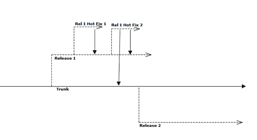

# 简单分支策略第 2 部分:实现

> 原文：<https://simpleprogrammer.com/simple-branching-strategy-part-2-implementation/>

在我的[上一篇文章](https://simpleprogrammer.com/2010/06/04/simple-branching-strategy-part-1-back-to-basics/)中，我谈到了拥有简单分支策略的想法，以及为什么我更喜欢每个人都在同一个分支工作的想法。

在这篇文章中，我将向你展示如何创建我认为最简单有效的分支策略。

看看这个示例项目代码行的图表:

## 穿过它

这里的想法很简单。让我们一起经历一个开发周期:

1.  发展开始。每个人都在树干上工作。代码经常被检入主干，许多开发人员每天检入代码 3-4 次，因为他们完成了开发的小质量部分。
2.  每次代码签入时，持续构建服务器都会持续构建并检查代码的质量。任何集成问题都会立即得到解决。
3.  已经完成了足够的特性来创建一个版本。主干被标记为发布，并创建一个表示当前发布产品代码的发布 1 分支。
4.  开发人员继续在主干上工作，不会被发布中断。
5.  客户在版本 1 中发现了一个高优先级问题。
6.  创建了 Rel 1 热修复分支，从 Rel 1 分支出来修复高优先级问题。事实证明，一个好的解决方案需要一些时间。团队决定目前最好的行动方案是应用临时修复。
7.  Rel 1 热修复已经完成，并合并回 Release 1 分支。版本 1 被重新部署到生产中。
8.  与此同时，另一个紧急问题出现了，必须在下一个版本发布之前解决。Rel 1 Hot Fix 2 分支已创建。
9.  Rel 1 Hot Fix 2 的错误修复是一个很好的修复，我们希望在所有未来的版本中都能得到。Rel 1 Hot Fix 2 分支合并回 Release 1 分支，并合并回主干。重新部署了第 1 版。
10.  与此同时，trunk 的工作一直在进行，团队已经准备好发布 2。
11.  版本 2 分支已创建…

## 打破它

对于一组非常简单的实际步骤，我给出了一个非常详细的演示。但是，我希望你能看到这个过程是多么简单。

这里的基本思想是我们试图尽可能地将发布从开发中分离出来。团队总是会继续前进，构建新的特性并增强代码库。当我们决定我们有足够的特性来发布时，我们简单地从主干中分支出来并创建发布分支。

如果需要的话，我们甚至可以在进入生产之前对发布分支进行一些测试，而不会影响未来的开发。

发布的分支代码行永远不会回到主干。它们不需要，它们的存在只是为了让我们可以拥有准确的产品代码，并在需要时对其进行修改。

我们从发布分支中分支出热修复程序，这样我们就可以独立地处理它们，因为不是所有的热修复程序都会返回到主代码行。我们可以只为当前版本做一个热修复，或者我们可以将它合并回主干，使它成为一个永久的修复。

这就是事情的全部。这种分支策略几乎完全消除了合并。你唯一做过的合并是小规模的热修复合并。

你的分支策略不必复杂。像这样的简单策略几乎适用于任何软件开发商店。

## 经常有争议的问题

当我介绍这个简单的系统时，几乎立刻就有人说:

**半成品特征怎么办？我不想发布未完成的功能。使用这种策略，每个人都不使用主干，你将总是拥有未完成的特性。**

那又怎样？一个未完成的特性会导致多少次系统中的潜在问题？如果代码是高质量的和增量开发的，它不应该影响系统的其余部分。如果你正在添加一个新的特性，通常你要做的最后一件事就是把 UI 连接到它上面。在没有任何途径获得后端代码的情况下发布它不会有什么坏处。

持续集成(尤其是运行自动化功能测试)，训练你在每次提交新代码的时候都保持系统的可发布性。这真的不难做到，你只需要稍微思考一下。

如果最坏的情况发生了，并且你有一个半成品的特性使得代码可发布，你总是可以在发布分支上取出代码。(尽管我强烈建议您尝试并找到一种增量构建特性的方法。)

如果你知道你要做的事情会破坏一切，比如重新设计用户界面，或者彻底改变架构，那么就为这项工作创建一个单独的分支。不过，这种情况应该很少发生。

我需要能够独立开发这些功能。如果每个人都在 trunk 上工作，我就不知道我所做的是否破坏了某些东西，或者是否是其他人的代码。我受到了别人破坏东西的影响。

很好，这是你应该感受到的痛苦。当你持续集成某个东西一周，合并你的特性，然后发现所有东西都坏了时，伤害会小得多。

这就像吃一顿饭。不管怎样，所有的食物最终都会在同一个地方。不要担心你的土豆泥和苹果酱混在一起。

如果其他人正在做的某件事会破坏你的东西，最好尽快失败，然后再失败。让我们尽快整合并解决问题，而不是等到我们都认为我们已经完成了。

除此之外，学会总是签入干净的代码是有好处的。当你破坏了其他人，他们用 Nerf 枪打你，让你戴上一个鸡头，你被教导在签入你的代码之前在本地测试你的代码。

## 如何获得成功

你如何在这个简单的策略上取得成功？

*   确保您有一个持续集成服务器启动并运行，并且[做它应该做的一切事情](https://simpleprogrammer.com/2009/12/30/continuous-integration-best-practices/)。
*   当你处理代码时，找到方法把它分解成小的增量开发步骤，这些步骤永远不会破坏系统。最后挂上 UI。
*   始终认为每次签入代码，都应该是你放心发布的代码。
*   每天至少签入代码一次，最好是在取得任何增量进展时。
*   测试测试测试。本地测试、单元测试、测试驱动开发、自动化功能测试。有办法确信系统在功能上不会倒退。
*   如此重要，我要说两遍。自动化功能测试。如果你不知道如何做到这一点，[阅读这个](https://simpleprogrammer.com/2010/01/05/automated-ui-testing-framework-a-real-example/)。
*   经常释放而不是热固定。如果你从不修补，你就永远不会合并。如果你永远不必合并，你会活得更长，压力更小。
*   不要回头清理代码。第一次就写对。第一时间登记。

希望这能帮助你简化你的分支过程。如果你有任何问题，或者怀疑这是否可行，欢迎给我发邮件或者在这里发帖。