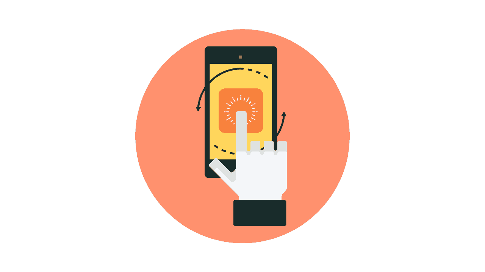

# 六个可能毁掉你的应用的移动应用开发错误

> 原文：<https://simpleprogrammer.com/six-mobile-app-development-mistakes/>

你认为你的想法会成为移动应用商店的下一个大事件吗？也许你有一款产品或服务非常适合手机应用程序，或者你只是想开发下一款热门游戏，在[应用商店](https://itunes.apple.com/)和[谷歌 Play 商店](https://play.google.com/store?hl=en)掀起一阵风暴。无论你的想法是什么，你都需要谨慎行事，以正确的方式开发你的移动应用。

从功能到设计到营销，再到漏洞修复和更新，设计一款手机应用绝非易事。许多开发人员认为创建一个应用程序比看起来简单，但是他们经常会发现自己忘记或放弃了开发应用程序中除编码本身之外的非常重要的步骤。

这里有六个常见的移动应用程序开发错误，除非你意识到这些错误并积极预防它们的发生，否则它们可能会毁掉你的应用程序。当你着手一个[移动应用](https://simpleprogrammer.com/2016/12/05/what-is-mobile-development/)项目时，避免这些错误，你将会以正确的方式发布你的应用。

## 1.为太多平台开发

同时为多个平台开发通常是许多开发人员面临的第一个挑战，我必须承认这对我来说仍然是一个难题。

Android 和 iOS 占据了大部分市场份额。据统计数据显示，今天，Google Play 拥有超过 280 万个应用程序，而苹果以 220 万个应用程序位居第二。那么你选择哪个呢？

开发者经常试图同时为这两个主要平台开发软件——其他人甚至试图把微软商店也包括进来。这是一个可以理解的困境；理想情况下，你希望你的应用能同时出现在每个平台上。然而，从开发的角度来看，一次做所有的事情通常是错误的。

除非你有几乎无限的资源可用，否则为多个平台设计只会从你的应用程序开发中耗费宝贵的时间和金钱。当然，如果你有一个庞大的开发人员和大量的预算，这可能会工作。但是如果你是一个独立开发者，你很可能既缺时间又缺钱。

相反，考虑首先根据目标受众的移动设备使用情况选择一个主要平台，然后在最初发布几个月后将您的应用程序推广到其他平台。这样做，你不仅可以节省时间和金钱，还可以避免应用程序在开发和发布时出现重大问题。

## 2.设计糟糕的界面和功能

没有什么能比糟糕的界面设计更快杀死一个应用。请记住，一个成功的应用程序的理念是让事情尽可能简单，同时仍然包含所有你能做到的功能。你必须花时间设计完美的界面。

如果界面设计不是你的强项，在你的预算允许的情况下，考虑雇佣专门从事界面设计的人。如果没有，你可能想做一点界面设计的研究。像《UI 就是沟通:如何通过关注有效的沟通来设计直观的、以用户为中心的界面》这样的书 是一个很好的起点。

你添加到应用程序中的每个功能都必须有用。增加额外的功能并不能真正提供任何价值，只会让界面变得混乱，让用户感到烦恼。当设计你的应用程序时，确定你的用户需要的核心功能，并把你的时间集中在获得这些功能上。额外的功能(例如额外的共享功能)虽然重要，但对于应用的核心功能来说并不是必需的。请考虑在以后的更新中添加这些内容。

相反，只专注于添加那些你的观众会发现有价值的功能，然后将它们打包到一个简单易用的界面中——同时仍然使它足够强大，可以完成你的应用程序设计要做的任何任务。由简单设计支持的有用和强大的功能是应用程序成功的真正关键。

## 3.执行不良测试阶段

因此，您已经准备好了您的应用程序。是时候在应用商店发布了，对吧？不对。

一旦你创建了应用程序，你需要花相当多的时间来测试它。在这个阶段，你可以发现应用程序的任何问题，捕捉突然出现的随机错误，甚至收紧整体设计。

不幸的是，许多开发人员没有正确地执行开发过程的这个阶段。在许多情况下，开发人员匆忙进入这个阶段是因为他们想让应用程序发布出去。有些根本不花太多时间测试。匆忙完成这一阶段的最终结果是一个在发布时有多个问题和 bug 的应用程序。

错误可能是软件的一部分，但这并不意味着你不应该尽你所能减少它们。随着市场上各式各样的智能手机，在尽可能多的流行设备上对你的应用程序进行全面测试至关重要。

在测试过程中，使用一切可用的工具。例如，我肯定你认识其他开发人员，我打赌你有朋友愿意尝试一下；允许他们安装和使用应用程序。给他们足够的时间像普通用户一样使用应用程序，然后听取他们的反馈——好的和坏的。

你在发布时遇到的问题越多，愿意下载你的应用的人就越少。很多评论家可能会下载你的应用程序；如果它因为你加速了测试阶段而充满了错误，评论会显示出来。

在测试过程中慢慢来。不要着急。记住，质量很重要，即使这意味着你的应用比你期望的晚发布一个月。

## 4.忘记货币化

虽然我肯定你关注的是你的应用程序的功能，但你必须在最初的设计中把赚钱提到桌面上来。除非你是所有人的自由软件的坚定信仰者，否则我敢打赌，你希望某个时候一个移动应用的发布会在你的口袋里转化成几美元。那么，为什么如此多的开发者忘记了移动应用程序设计的这个非常重要的部分呢？

通过将你的盈利策略整合到你的界面和设计中，你可以从一开始就提供更加流畅的用户体验——而不是附加一个执行糟糕的盈利策略，这会对用户体验产生负面影响。

如果没有一个合理的盈利策略，无论你的移动应用有多受欢迎，它都可能达不到你在金钱方面的期望。

在开发阶段的早期，你应该确定你的盈利策略。你打算对你的应用程序收费吗？你会有广告吗？你计划销售产品和服务吗？你是否在考虑一种免费增值模式？

在你的应用准备好之前，你必须问自己所有这些问题。一旦你的应用发布，确定你如何计划应用的盈利将是它成功的关键，也是获得投资回报的解决方案。

## 5.推广你的应用太晚了

不营销往往是应用开发者最常犯的错误之一。毕竟，你不是广告专家；你是开发商。许多开发者认为，一旦应用程序准备好发布，营销可以等到开发阶段之后。

这与事实相去甚远。虽然你不必在开始开发的第一天就开始营销，但你需要在你的应用程序发布之前很久就开始营销。这个想法是为了激起一些兴奋，为你的应用创造一群潜在用户。这样，当你在商店上发布你的应用程序时，你将有希望有一大群人准备下载它。

知道何时开始营销活动可能很困难，因为有很多因素需要考虑。显然，要正确推广你的新应用，你需要向所有人展示一些东西。这可能是你的应用程序的几个屏幕，甚至可能是一个视频。

就我个人而言，我认为一旦你的应用程序的设计确定下来，一些功能启动并运行，你就应该开始你的活动了。当你添加新的特性和功能时，你可以发布更多的截图和视频来展示你的新应用是如何发展的。

## 6.未能快速解决缺陷

无论你对你的应用做了多少测试，用户都有可能在你的应用中发现一个错误。软件中的 bug 只是生活的一部分，大部分用户都习惯于处理这些 bug。然而，他们所期望的是，无论一个应用程序中出现什么样的错误，都能得到快速处理。你的反应速度取决于错误的性质。用户对应用程序中的小错误非常宽容，但是影响应用程序可用性的大错误必须尽快修复。

在你发布新创建的应用程序后，你的工作还远没有结束。一旦它在野外，你需要关注评论并检查你的消息来识别已经发现的任何错误。一开始，明智的做法是关注你新发布的应用程序，监控它的一切。一个月后，你可能需要转移到一个新项目，但你仍然不能忘记你已经发布的应用程序。

错误修复应该贯穿应用程序的整个生命周期，但是你必须安排好你的时间；主要的 bug 应该给予更多的关注，而较小的 bug 可以等待。你在这个应用上投入的时间会影响它的成功。试着平衡你的时间，这样新项目就不会落后，你现有的应用程序也不会被忽略。

如果发现了一个 bug，最重要的是你要深入研究并尽快找出问题所在。一旦你这样做了，你就需要发布一个更新来摆脱它们。

在你的应用程序的整个生命周期中，你将不得不处理错误，为新软件更新它，甚至添加更多的功能。未能及时做到这一点的开发者通常会发现他们的应用程序没有受众。

## 离别的思绪

随着越来越多的用户将智能手机和平板电脑作为他们的主要设备，拥有一个移动应用程序可能意味着你的服务被经常看到或根本看不到的区别。但是，如果你要创建一个移动应用程序，你需要确保你用正确的方式来做，因为一个糟糕的应用程序对你的移动存在来说甚至比没有应用程序更糟糕。毕竟，作为一名开发人员，你最不希望的就是因为创建和发布糟糕的应用程序而声名狼藉。

虽然避免这些错误并不能保证成功，但犯这些错误可能意味着你的手机应用会在应用商店中丢失，永远不会被大众下载。

避免以上这些错误是确保你的应用有一个好的开始的好方法。通过仔细管理这个过程，你可以确保你的应用程序顺利发布。