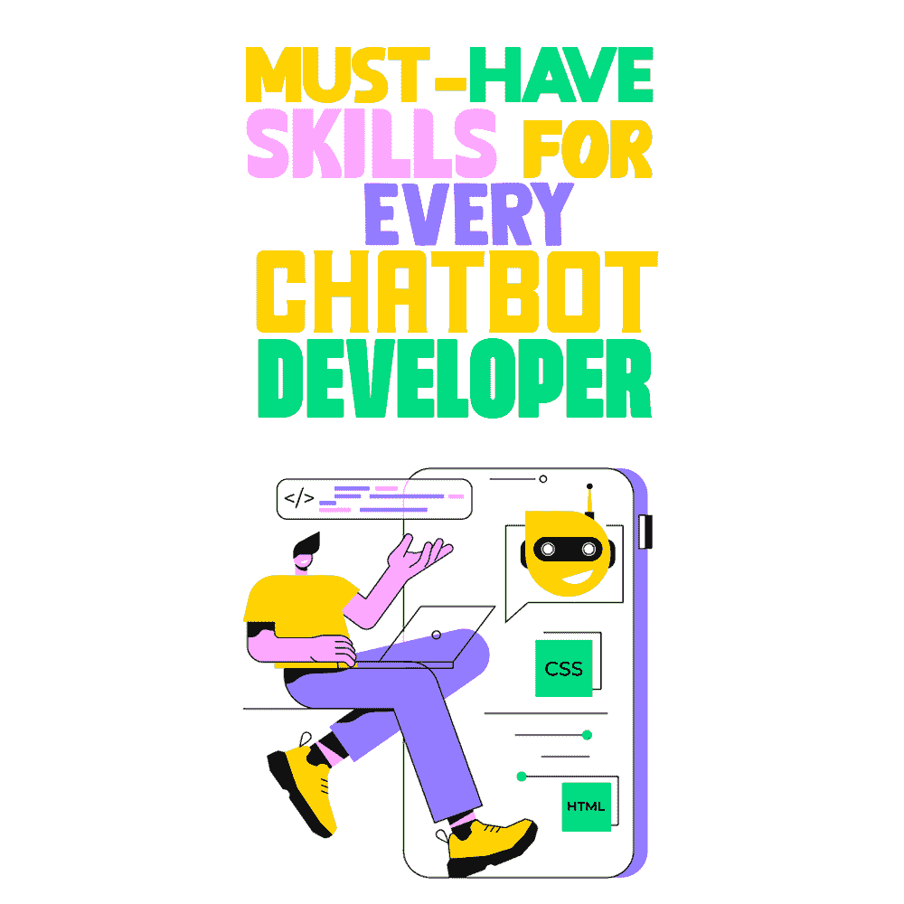

# 每个聊天机器人开发者必备的技能

> 原文：<https://simpleprogrammer.com/skills-chatbot-developer/>

A chatbot’s role has evolved from a simple tool that facilitates conversation between the customer and the business. Nowadays, they solve customer queries, identify their sentiments, and even offer valuable insights into their behavior and needs. In other words, chatbots are a company's first line of customer service, which is a time consuming responsibility.

随着对聊天机器人需求的增加，如果你是一名聊天机器人开发者，你也一样。因此，在你的技能组合中利用聊天机器人，你几乎不会失去什么，反而会收获很多。

对于缺乏技术诀窍，并且在聊天机器人定价方面预算紧张的公司来说，容易获得的无代码机器人构建器可能是最好的选择。其他想要定制解决方案的人会倾向于从头开始开发聊天机器人。

让我们更深入地了解一下创建聊天机器人的过程。

## 创建聊天机器人需要什么？

创造一个聊天机器人来为一个企业——任何企业——带来积极的结果都不是一件容易的事。

即使是最基本的聊天机器人的创建也需要对人类对话的工作方式有深刻的理解(当然！)和一些近乎疯狂的[编程技巧](https://simpleprogrammer.com/cg59-art)。我们将深入探讨成为聊天机器人开发者所需的技能。

现在，要明白从零开始开发聊天机器人的过程并不容易。制定策略、设计和创建一个符合要求的聊天机器人至少需要几周时间。并且要在预定的预算和时间范围内完成！

但是不要担心，如果你有适合这份工作的技能，整个过程不仅是有益的，甚至可能是有趣的。也就是说，让我们了解每个聊天机器人开发者应该具备的最*基本技能*。

## 聊天机器人开发者的顶级技能

聊天机器人多年来一直在发展，并极大地创新了客户和公司之间的对话。聊天机器人开发者所需的技能与程序员所需的技能并没有太大的不同。

AIMultiple 的一项研究表明，65%的聊天机器人公司和客户认为人才短缺是聊天机器人行业的主要挑战。也就是说，目前聊天机器人开发者有很多未开发的机会。

现在，事不宜迟，让我们更深入地了解你需要具备的技能。

### 聊天机器人框架方面的专业知识

每个聊天机器人开发者应该具备的首要素质是聊天机器人框架方面的专业知识。当你开始开发聊天机器人时，你不可避免地会从头开始构建聊天机器人。要做到这一点，你需要精通 IBM Watson、APi.ai、微软 Azure Bot Service 等框架。

虽然今天许多企业转向聊天机器人平台来创建聊天机器人，但是当你开发定制聊天机器人时，你将需要这些框架的工作知识。您还应该有能力为特定的聊天机器人比较和选择正确的框架。

此外，强烈建议你在诸如 Wit.ai 和 Rasa 等开源聊天机器人框架上进行足够多的*练习*，因为练习是提高技能的唯一途径。**记住**，如果你申请的是小公司，你需要选择付费的聊天机器人框架，而不是开源的。后者还要求您具备自然语言处理(NLP)领域的专业知识。

### 精通编程语言

这对于有经验的开发人员来说是显而易见的。

除了聊天机器人框架，开发人员还应该精通几种编程语言。如果您在很大程度上使用过聊天机器人框架，那么您可能已经了解了这一部分。

毕竟，这些框架是基于特定的编程语言的。你应该添加(或更新)到你的清单中的常见的是 [Java](http://www.amazon.com/gp/product/0131872486/ref=as_li_tl?ie=UTF8&camp=1789&creative=390957&creativeASIN=0131872486&linkCode=as2&tag=makithecompsi-20&linkId=NOS5PVISMT2O2FFU) ，Python，PHP 和 Ruby。掌握这些技能将帮助你*以最适合你业务的方式定制你的聊天机器人*。

所以如果你缺乏这些编程语言的知识，或者生疏了，是时候开始温习了。不要犹豫，在在线课程和教程的帮助下开始[学习一些编程语言](https://www.youtube.com/watch?v=pNgTKDF0vqs)。

### 新兴技术知识

花点时间回忆一下 10 年前的聊天机器人和现在相比是什么样的。你今天遇到的聊天机器人肯定不像几年前我们用来互动的基本聊天框，不是吗？

今天的聊天机器人已经发展到包含一些非常棒的功能。

考虑到聊天机器人的变革性质，开发人员需要跟上最新的技术和发展。为了制作一个能够预测可能的对话流并无缝回答查询的有效聊天机器人，你需要深入了解人工智能(AI)和自然语言处理(NLP)。

如果没有人工智能和自然语言处理技术，你的聊天机器人将无法区分问候和客户询问。

除了这些技术，机器学习在定义聊天机器人的对话流程和设计方面也发挥着关键作用。如果您不了解这些技术，并且您正在寻找一个聊天机器人开发角色，那么在继续下一步之前，参加相关的课程(上方的[)可能是一个好主意。](https://simpleprogrammer.com/products/careerguide/links/?utm_source=careerguide&utm_medium=book&utm_campaign=chapter-59&utm_content=art#chapter-59)

### 通讯技能

如果你问任何一家大公司，他们希望他们的聊天机器人开发人员具备什么技能，沟通可能是最重要的。

为什么？

如果聊天机器人不是公司和客户之间的另一个沟通渠道，那它是什么呢？

如果开发聊天机器人的人不具备编写人类对话的基本技能，他们将如何设计一个可以复制的聊天机器人？

不要误会我的意思——我并不是说你应该像对话设计者那样深入研究对话，但是当你从事聊天机器人开发时，你仍然需要对自然语言应该如何流动有一个基本的了解。

### 在不同平台上集成聊天机器人的经验

如果你想以构建聊天机器人为生，你将不可避免地需要有一些使用全渠道聊天机器人的经验。仅仅知道如何在网站上添加聊天机器人是不够的。

在当今时代，企业希望跨平台保持一致的客户服务质量。无论是 WhatsApp、脸书还是 Skype，聊天机器人开发者都应该知道如何整合聊天机器人。

毕竟，[超过 55%](https://www.hubspot.com/stories/chatbot-marketing-future) 的消费者更喜欢通过消息应用与商家联系。

### 能够与多个团队协作

Based on what you already know about chatbots, do you think all the elements are created simply by a chatbot developer?

答案是响亮的*不*。

在构建聊天机器人的过程中会用到很多资源。例如，聊天机器人的有效性很大程度上取决于它对客户查询的响应，所以你需要由一个老练的对话设计者来编写好的对话。

作为一个聊天机器人构建者，你需要理解基本的对话流程，而对话设计者将帮助你创建更复杂和更高级的流程。

更重要的是，你需要额外的资源来关注聊天机器人的分析和部署。

考虑到所有这些方面，很明显，聊天机器人开发人员需要有能力与多种类型的资源进行协作。所有参与的团队必须保持一致，并进行有效的沟通，以开发出出色的聊天机器人。

## 你能成为聊天机器人开发者吗？

作为一名优秀的聊天机器人开发者，你需要提升你的框架知识、编程语言和沟通技巧。除了这些技能，拥有创建和实现跨平台聊天机器人的经验只会增强你的形象。

就是这样！如果你确信自己拥有这些技能和品质，那么你就已经走在成为一名优秀聊天机器人开发者的路上了。即使你觉得你缺乏我们在这里提到的一些品质，磨练这些技能并提高你的机会永远都不晚。毕竟，在可预见的未来，对聊天机器人开发者的需求只会越来越大。