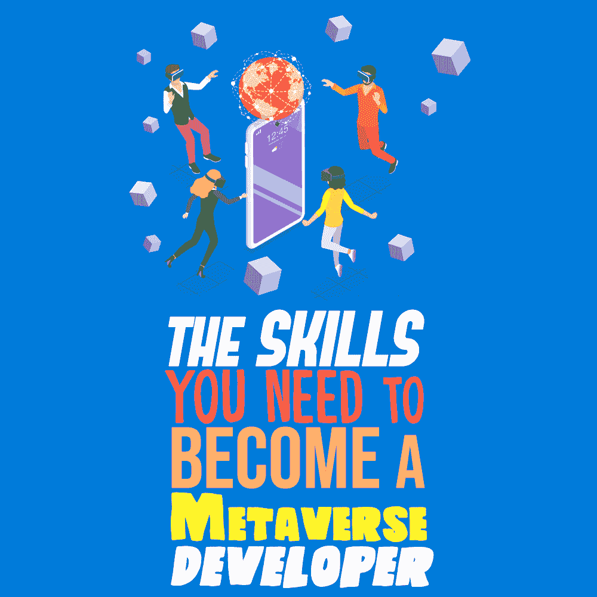

# 成为元宇宙开发者所需的技能

> 原文：<https://simpleprogrammer.com/skills-metaverse-developer/>

The [metaverse](https://venturebeat.com/2022/01/14/the-metaverse-will-be-buzzing-in-2022/) is almost here, and it will be much more than a video game or an entertainment platform. Not only will the metaverse provide immersive augmented reality (AR) and virtual reality (VR) experiences, but users will also have opportunities to earn, build networks, own virtual real estate, and much more.

虽然很难预测这个领域将如何发展和扩大，但可以肯定地说，开发人员必须学习新技能，重新学习旧技能，并专注于批判性思维和解决问题。随着新技术的出现，你需要学习新技能，重温旧技能也很重要；其中一些是元宇宙所需要的。

无论元宇宙今天承诺什么，将来都可能只是它的一部分。就像互联网早期一样，我们甚至还没有开始想象网络带来的广泛可能性。

## 什么是元宇宙？

“元宇宙”一词是三十年前由作家尼尔·斯蒂文森在他的科幻小说《冰雪奇缘》中创造的。这个故事是关于一个未来，当人们逃离他们无望的现实，进入计算机生成的宇宙中丰富多彩的虚拟现实。他称这个想象的世界为元宇宙。

虽然虚拟现实的概念并不新鲜，但元宇宙更进了一步:你不仅仅是在看互联网上的东西，你是在其中。现在有技术可以进入元宇宙，但没有主导平台。

根据 [rinf.tech](https://www.rinf.tech/) 的联合创始人兼首席创新官 Victor Dornescu 的说法，“要让元宇宙充满活力，我们必须利用一系列技术。”然而，仅有技术是不够的。多内斯库还表示，“工程文化和思维模式的转变是必要的。”

随着我们奔向新的数字世界，像谷歌、Meta 和无数其他公司将创造大量就业机会。例如，虚拟现实领域已经有大量的工作机会。这些工作需要特定的技能，包括知道如何使用新的硬件。

对构建元宇宙感兴趣的开发人员需要掌握不同类型相关软件的广泛知识，拥有编写和调试代码、设计虚拟环境等方面的经验。但以上只是元宇宙的冰山一角。

## 在元宇宙工作需要学习的技术

要在元宇宙开发应用程序，您必须知道如何使用不同的技术。正如你可以构建各种各样的数字产品一样，你不必了解所有东西是如何工作的，但像人工智能和虚拟现实这样的一些技术将成为一个标准。

### 虚拟现实

正如本文开头提到的，VR 开发技能是必须的。这包括熟练使用可用资源开发 VR 内容。由于元宇宙是建立在虚拟现实的基础上的，虚拟现实开发、3D 建模、视频编辑和可穿戴体验(包括 HoloLens、 [HTC VIVE](https://www.amazon.com/stores/HTCVIVE/page/A2D37C3D-EC24-49C4-B205-0192B79BD902?ref_=ast_bln) 和 [Oculus](https://www.amazon.com/stores/OculusfromFacebook/page/6D837F22-9610-47A7-9357-3889B1A59004?ref_=ast_bln) )等技能对于你进入这个领域至关重要。

### 人工智能

要为元宇宙构建一个健壮的应用程序，你需要掌握一些人工智能应用程序开发技能。这很重要，因为用户将与人工智能驱动的化身互动，你也需要它来帮助保护他们和他们的敏感数据。

元宇宙开发者必须知道如何用 C++、Java、 [Python](https://simpleprogrammer.com/python-generative-art-math/) 和 R 编写代码来构建和部署 AI 模型。他们还必须精通大数据技术，如 Apache Spark、Cassandra、Hadoop 和 MongoDB。

这也将有助于理解[机器学习(ML)](https://simpleprogrammer.com/machine-learning-customer-experience/) 算法，如 KNN、线性回归、朴素贝叶斯、支持向量机等等。元宇宙的建设者也必须有一些人工智能框架的经验，如 Caffe，PyTorch，TensorFlow 和 Theano。

他们还应该知道如何使用深度学习(DL)算法，如卷积神经网络、生成对抗网络和递归神经网络。

此外，量子计算已经在基础学科的商业应用方面取得了重大突破。研究表明，解决复杂问题的 ML/DL 经典计算算法(CCA)的硬件限制产生了用量子计算算法(QCA)补充 CCA 的需求。

### 扩展或混合现实(XR 或 MX)

用户将与虚拟空间进行交互，而不会陷入其中，因此无论您构建什么，都必须支持 AR、MX 和 XR 现实。就像吃了类固醇的口袋妖怪 GO 一样！尤其是有了 MX 和 XR，你将有机会开发新的商业模式，尤其是在电子商务方面。例如，它可能采取虚拟试衣或试驾的形式。

### 不可替代令牌(NFT)技术

要在 web3 中构建头像、物体和结构，NFT 开发技能是至关重要的。这是因为 NFTs 支持从一台服务器到另一台服务器的自由移动。事实上，元宇宙中的一切，包括化身、物体、技能和结构，都将以 NFTs 的形式实现。

NFTS 将负责跨元经文身份的连续性。毕竟，这也是识别、确认和转让数字资产所有权的最佳方式。所以开发者需要熟悉区块链、web3、智能合约等等。软件工程师还应该知道如何用 JavaScript、JSON 和 Solidity 等编程语言编码。

### 分布式计算和存储

As the metaverse will demand an enormous amount of computing power and storage, it’ll help to have some relevant knowledge to avoid potential crashes or interruptions. So you should know how to spread out computations and storage between multiple nodes.

其他一些可能有助于你成为元宇宙应用开发者的技能包括动画、游戏开发、HTML、CSS、Node.js、MySQL、SQL 和 Unity。由于元宇宙很大，有不同的变量，几乎每个人都有适合自己的东西。

## 准备建造元宇宙

这个领域还处于起步阶段，在未来的几年里，你可以期待元宇宙会随着各种新技术的发展而发展。因此，你必须时刻准备随着元宇宙内每个垂直行业的加速和扩展而不断学习。

正如你所看到的，无论你在软件开发领域做什么，都有与元宇宙的潜在联系。如果你正在寻找一份建设元宇宙的工作，拥有技能和技术知识的正确组合将有助于你的发展。