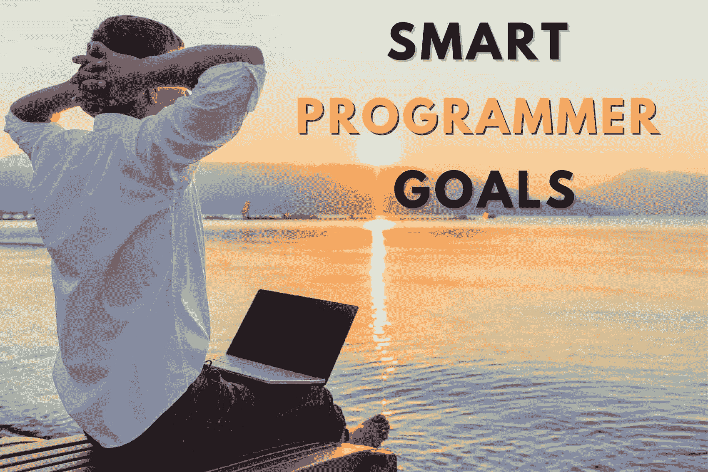
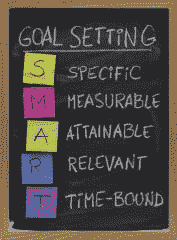
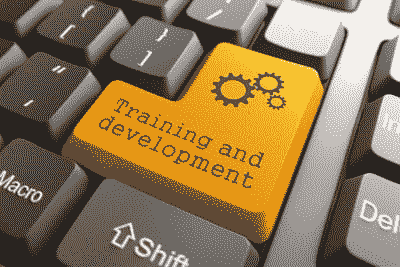
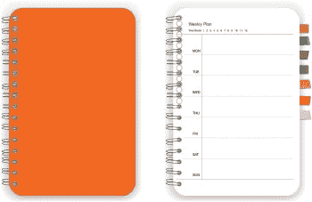
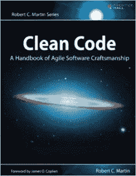

# 26 个实际可行的开发人员目标——包含智能示例

> 原文：<https://simpleprogrammer.com/smart-goals-better-programmer/>

如果你是一名软件开发人员？你选择了一个很棒的职业。

作为一名程序员，有太多的成长空间。你可以通过编程或成为软件工程师来赚大钱。你的选择是无限的。

但是……丰富的选择也可能让人不知所措。

你从哪里开始？

## 问题#1:作为开发人员，你不知道首先应该设定哪些目标

你可以朝着不同的方向去实现你的目标。

有不同类型的目标。

1.  语言目标
2.  [职业目标](https://bootcamp.pe.gatech.edu/blog/software-developer-career-path/)
3.  个性目标
4.  金钱目标…

设定哪些目标对你来说最有意义？

你能现实地实现哪一个？

你现在应该攻击哪一个——哪一个应该留待以后处理？

当你实现哪个目标时，你会获得最多的金钱和成功？

## 问题#2:“程序员目标超载”让你困惑和不专注

[https://www.youtube.com/embed/6Gpe5Q3rP-c](https://www.youtube.com/embed/6Gpe5Q3rP-c)

你是不是一次有太多的目标——也就是目标超载？

我的目标是给你一些结构。所以*你*可以选择正确的目标。

所以你会真的实现它们。

想想所有可能的目标，幻想实现它们会有多棒，这很有趣。

但是如果你永远不能对这些目标中的任何一个给予足够的关注——因为目标超载让你停滞不前——它如何帮助你继续思考每一个潜在的目标呢？

然而，目标*是*伟大的。我已经成功地利用[目标设定](https://success.oregonstate.edu/learning/goals)完成了一系列事情:

*   代码应用
*   写[本书](https://www.amazon.com/s?k=John+Sonmez&linkCode=ll2&tag=makithecompsi-20&linkId=9025e72add75709284960cfdd6fd40eb&language=en_US&ref_=as_li_ss_tl)
*   创建[课程](https://simpleprogrammer.com/products/how-to-market-yourself/)
*   建立网站
*   变得健康、富有

你作为一名程序员的成功—[无论是首先成为一名软件工程师](https://simpleprogrammer.com/step-step-path-becoming-great-software-developer/),在职业阶梯上向上爬，写最好的代码，赚很多钱——我想帮助你使这一切变得简单。

你首先要掌握以正确的方式设定目标。

让我们开始吧。

## 强大的程序员目标的 4 个支柱:实现未来的练习，无限的改进，不间断的价值公式，强大的习惯

你如何最有效地推进你的事业？你首先要设定对你现在所处的位置和你想去的地方有意义的目标。

作为一名程序员，为了获得最大的影响力、金钱和快乐，你需要有以下四种目标:

### 1.实现未来的练习

人生成功的关键是满足于你每天所做的工作。

你是否对在周一写 8-10 个小时的游戏代码，然后在接下来的四天里重复它感到兴奋？或者你对在亚马逊从事机器学习系统的工作充满热情？

什么类型的工作(你已经尝试过，或者知道它非常适合你)最让你兴奋？

想象你作为程序员的理想生活。

你工作日的大部分时间都在做你喜欢的事情。当然，即使是这些也不是 100%令人愉快的。实际上他们可能很难对付。但是他们允许你表达你的天赋，产生最大的影响，给你长期的满足感。

在你已经创建了你的最佳开发人员生活方式的想法之后，每天努力接近它。在途中设定中期目标。选择能让你朝着梦想前进的任务。拒绝那些让你远离它的人。

### 提示:

Use the 80-20 rule.

"我做的那 20%的任务让我离目标更近了吗？"

专注于这些，你会得到 80%的结果——只做重要的事情。你也要确保你 100%在正确的轨道上。所以你不是在爬梯子，却发现它一直靠在错误的墙上。

相反，你的行动将与实现和成功完美结合。

最后，尽可能地过好每一天，就像你的目标已经实现一样。

作为一名软件开发人员，这就是你如何实现自己最有成就感的生活的方式。

### 2.无限改进

当你设定目标时，不要只关注结果:比如，“我想创造一个神奇的工具，帮助成千上万的人，让我赚上百万美元。”

也为提升你的技能设定目标。*因为那是一个通向另一个的时候*。

如果作为一名程序员，你非常有能力和全面，你可以:

*   毫不畏惧地解决棘手的编码问题
*   巧妙策划
*   像专业人士一样展示自己、沟通和谈判

那时你将能够真正实现那些令人敬畏的高水平目标。

因为你已经把自己变成了那种。

努力提高你的技能，每过一天，你就会离你的目标更近一步。

顺便说一句:我有一整套成为精英级程序员的课程。它叫做“程序员犯的 5 个学习错误”。可以在这里免费抢:

### 3.不间断价值公式

作为一名程序员，在设定目标时，愿景、技能…这些都是非常重要的。

还有什么？对他人产生积极的影响。

设定影响他人的目标不是利他的。这是自私的——因为这将加速你作为开发人员的成功。你会更快地获得更好的技能、更多的曝光率和更高的地位。钱很快就会到来。

那么，你如何设定影响他人的目标呢？

你可以通过与现实世界保持联系来实现这一点，同时让自己变得更强大。

*   在公共场所建造东西。
*   让人们真正使用它。
*   用你正在学习的任何新技能帮助他人。
*   运用你新的软技能做有价值的演讲。
*   通过与他人合作完成他们的项目来测试你的编码技能。

有影响力的目标是那些让你联系起来并做出贡献的目标——而不是孤立地让你变得更好的目标。

后者也更容易戒掉。

### 4.强大的习惯

[https://www.youtube.com/embed/OTzmWUKGXNY](https://www.youtube.com/embed/OTzmWUKGXNY)

将你的编程目标分解成周目标和日目标——因为习惯比目标更有效。

一旦你养成了这些富有成效的习惯，实现你的长期目标就像日复一日地执行这些习惯一样简单。

幸运的是，虽然首先建立一个新习惯很难，但随着时间的推移，保持这个习惯会变得更容易。这就是习惯的力量——用它把实现目标变成一个简单的、可重复的过程。

你最终会觉得你的目标触手可及。

## 5 个 SMART 程序员目标示例–具体、可衡量、可实现、相关且有时限

对于任何新的目标，最好是遵循[智能目标设定公式](https://www.amazon.com/dp/B00IJZLX72/makithecompsi-20)。

并把它们写下来。通过写下你的目标，你有 42%更好的机会实现它们。

SMART 代表具体的、可衡量的、可实现的、相关的和有时限的。

聪明的目标是写下你的目标的一种非常具体的方式，是提高你实现任何目标的机会的一个关键组成部分。

哪一个是智能目标？

1.  我想多锻炼。
2.  在接下来的六个月里，我会每周去健身房三次。

是第二个。

这个目标对你要做什么、如何做以及在什么时间段内做有一个清晰的划分。

仅仅说你想多锻炼并不能给你任何关于你打算如何去做的想法。最重要的是，它不会追究你的责任。

你可以在一周的某一天锻炼五分钟，如果这比你现在正在做的要多，那么从技术上来说，你已经实现了你的目标。

然而，这可能不会让你得到你想要的结果，为什么你想要更多的锻炼。

现在我们知道了什么是 SMART 目标，让我们看看今年你可以为成为更好的程序员而设定的 5 个 SMART 目标:

### 明智目标 1:如果你想改变职业，每周花三个晚上创建自己的网站

如果你目前有工作，但希望拓展自己的领域，建立自己的编程业务，[拥有自己的编程博客](https://simpleprogrammer.com/never-run-out-of-topics-programming-blog/)来展示你的技能是很棒的。

你需要在下班后花些时间专门做这个网站的工作，并承诺一个你能完成它的时间框架。

目标是建立一个网站

M——每周三晚

一个挑战，但很容易做到

**R**——如果你想开始自己的事业

三个月

### 智能目标 2:每年参加两次特定编程语言的在线课程

如果你是一名合格的 Java 程序员，你可以通过学习一门新的编程语言来拓宽你的技能。做到这一点的一个很好的方法是致力于做一些在线课程来提高你的知识。

在线课程是我们想做但从未真正投入的事情。

设定一个目标，每年做两次。一个很好的建议是找到一个你需要付钱的，因为你更有可能去买。

你可以选择任何你认为需要提高技能的编程语言。

目标是学习一门新的编程语言

M——我付费的两门课程

**A**——富有挑战性但可以实现

如果你想提高你的编程技能，这一点很重要

一年

### 智能目标 3:在接下来的六个月里，每周花五个小时学习如何开发一个新的应用程序

开发一个新的应用程序需要时间，如果这不是你的全职工作，你可能很难找到开发它所需的时间。

然而，花时间学习如何[开发一个新的应用程序](https://www.amazon.com/dp/1449370195/makithecompsi-20)会拓宽你的编程技能，让你对雇主和客户更有价值。

给自己设定一个目标，在接下来的六个月里，每周花五个小时开发你的新应用。

这是一个明智的目标，您可以调整各个部分，使它们与您更加相关。

例如，如果你知道你可以轻松地一周工作 5 小时，那就增加到 10 小时。或者，如果你认为你只需要三个月的时间来发展，缩短时间框架。

目标是开发一个应用程序

**M**——每周五小时

A——艰难但可行

**R**—如果你想建立一个新的应用程序

六个月

### 聪明目标 4:连续三个月，每天拿出两个一小时的时间段来提高生产率

编程需要高度的专注。如果有很多令人分心的事情，正确地专注于你需要做的工作会非常困难，并且[生产力](https://simpleprogrammer.com/productivity-for-busy-developers/)会下降。

在加州纽波特的畅销书《深度工作》中，他建议专注于工作的最佳方式之一是划出时间来做特定的高强度工作。在这段时间里，你只需要完成自己设定的特定任务。例如，如果你需要为你正在开发的网站的某个特定部分编写代码，你只需要在一个小时的时间段内这样做。

关掉你的电话，关闭你的电子邮件，尽可能避免上网。每天早上和下午各安排一个小时来集中注意力。选择一个小时的原因是，它足够长，可以让你真正集中注意力，完成很多事情，但也足够短，不会让你一开始就感到害怕。

同样，SMART 目标的这一部分可以重新设计以更好地适应你。如果你知道在较短的时间内你能更好地集中注意力，那就缩短时间。25 分钟可以是一个很好的开始；这是[番茄工作法](https://en.wikipedia.org/wiki/Pomodoro_Technique#:~:text=The%20Pomodoro%20Technique%20is%20a,length%2C%20separated%20by%20short%20breaks.)中使用的时间范围。

你会对自己完成的工作量感到惊讶。

目标是做紧张的工作

**M**——每天两个一小时的时间段

挑战但可行

**R**—如果你想提高你的工作效率

三个月

### 聪明目标 5:在月底花一个小时来计划下个月的时间

俗话说:“失败要准备，准备失败。”计划好你的一个月，每个月你都会完成更多的事情。

世界上大多数成功的人会提前计划好他们的几个月，这样他们就知道他们需要做什么来实现他们的目标。

每个月底给自己一个小时来计划下个月你打算做什么。

这可能包括看看你需要完成哪些关键任务，划出完成它们的时间，并列出不太紧急的任务清单。

同时，利用这段时间回顾你的目标，确保你每个月都朝着目标前进。

目标是为未来的一个月做计划

一个月一次

**A**——容易获得

**R**—如果想变得更有条理，这一点很重要

**T**—一个月

**现在让我们来看看你要追求的 21 个开发者目标——这样你就能成为你想成为的高薪、有成就感的程序员:**

## 程序员和软件工程师的 21 个可怕而有效的职业目标

### 短期程序员目标

#### 1.你将制定自己的学习课程

这是你确保自己朝着目标前进的地方。如果你做不到这一点，就很容易迷失方向，放弃一个、多个甚至所有的目标。

你不能只设定目标本身。你需要准确地概述你将如何到达那里。

所以，每周留出几个小时用于学习。选择几个你知道你能达到的小时数。不要走极端！

现在，决定你将在这些时间里使用哪些资源，以及你将如何研究它们——例如，通过思考一个问题，画出草图，编写和调试代码，在书面报告中记录你的结果，等等。

#### 2.您将创建一个每周和每天的时间表

对于每一项对你的编程生涯重要的活动，用类似的方式列出来。

弄清楚每周需要做什么才能让你一点点实现目标。

然后，把它分解得更细:分成小块的工作，你可以把它们放入每天的任务清单中。现在你只需要专注于完成每天的日程安排。

作为一名开发人员，你会自然而然地更接近你的目标。

#### 3.你将开始你的作品集网站

永远不要低估你的投资组合的力量。

建造你可以引以为豪的东西。什么都不重要。一个博客网站，照片滑块，网络剪贴。待办 app、简历作品集等。

一旦客户看到你的投资组合和你创造的东西的数量，他就知道你的能力了。你的作品说明了一切。

在免费的“如何开始一个博客”课程中，你将获得如何开始建立你的作品集网站的指导，这样你就可以通过向世界展示你的作品质量来吸引更多的客户。

#### 4.你将接受一个自由编码项目来发展自己并获得额外收入

现在你可以拿钱来学习了！

完成后，你可以将完成的项目添加到你的文件夹中。

你甚至可以从你的客户那里得到一份推荐信，与你的观众建立信任，这样你就更容易得到下一个报酬更高的自由职业项目。

#### 5.你将做一个关于你感兴趣的技术话题的演讲

你可以在任何聚会、会议或活动中这样做。您将获得沟通技巧，在潜在的合作者或雇主中扬名立万，并获得将您的编程生涯推向下一个层次的动力。

#### 6.你会写一篇人们喜欢分享的有价值的文章或报告

对一些人来说，这可以让他们进入一个全新的职业领域:以写作为生。

如果你的文章很成功，为什么不加以扩展，写成一本书呢？如今，自助出版一本书变得如此容易，世界都是你的了。

#### 7.你将学习一本新的编码书

你不需要读*所有*的书。但是仅仅深入研究一本书就可以将你的编程技能提升到一个全新的水平。

同样，你会留出一定的时间来钻研知识，解决书中出现的问题。如果你这样做了，你会比仅仅通读几十本书获得百倍的价值。

在[关于顶级编程书籍的文章](https://simpleprogrammer.com/best-programming-books-2019/)中，你会找到一些不错的书籍。选择一个听起来对你来说是一个令人兴奋的挑战。

致力于此，看看你的编码技能如何受益。

#### 8.您将提升您的调试技能

设定一个目标，让[今年在调试](https://www.forbes.com/sites/quora/2018/06/13/how-do-i-get-better-at-debugging-code/)方面做得更好。

发誓用一个公式来处理每一个 bug:

1.  假设:你认为问题可能出在哪里？
2.  实验证明或否定你的假设
3.  重复直到你找到错误

作为一名程序员，优化你的调试过程可能是一个有价值的目标——它将使你更有效地以可重复的方式更快地生产出功能代码。

#### 9.你会在基于项目的面试中做得更好

如果你想找一份软件开发的工作，准备好粉碎那些基于项目的面试吧。

制定一个目标，彻底研究面试过程和话题，每天[处理一些新的编程面试问题](https://simpleprogrammer.com/programming-interview-questions/)，经常和你的朋友举行模拟面试。

你想要到达一个点，在那里你可以很容易地解决那些抛给你的 Leetcode 风格的问题。

那时，你得到一份高薪的编程工作只是时间问题。

#### 10.你将开始进行软技能挑战

[拥有良好软技能的程序员](https://simpleprogrammer.com/soft-skills-for-programmers/)被邀请参与更多的项目，在他们的公司升得更高，得到更多的认可，总体上变得更加成功、富有和快乐。

因此，树立提高这些技能的有价值的目标。

把它变成一个挑战:

*   这周我能接触多少新朋友？
*   什么时候可以在人前练习并发表有冲击力的演讲？
*   在下一次会议中，我如何像专家一样开始谈判以得到我想要的东西？

#### 11.你每周至少会收集到一条新的反馈

大多数程序员无法实现他们的目标，因为他们甚至不知道他们做错了什么。

说到我们的工作，我们都有盲点。只是人之常情。

那些能够超越自我，向同事或上级寻求诚实反馈，并接受和执行反馈的人将会成功。

#### 12.你会提高解决问题的能力

“我看到新程序员犯的最大错误是专注于学习语法，而不是学习如何解决问题。”-v .安东·斯普劳尔

设定一个目标，每周解决一个新问题。如果你选择不同的平台来解决问题，会有所帮助。

创建并改进你的问题解决框架:你用来评估、构建并最终克服每一个问题的系统。

很快你就可以用这个系统来应对你面临的每一个挑战，不管它是否与编程有关。

### 程序员的长期目标

#### 13.你会创造一个个人品牌

想成为一名程序员——建立更好的关系，找到更好的工作，增加收入？

尽快开始打造你的个人程序员品牌。

*   让人们知道你作为开发人员专攻哪个领域
*   写下你的传记式电梯推销:你是谁，你如何帮助我？
*   创建您的作品集网站
*   建立你的 LinkedIn 档案
*   开始分享你专业领域的内容
*   加入一个社区，或者创建自己的社区！

一旦人们知道你是他们领域的专家，他们就会主动向你提出建议。

作为一名程序员，建立个人品牌是超越大众并抓住最佳机会的一种行之有效的方法。

#### 14.你将学习一门新的语言(一次一门！)

任何开发人员的典型目标是[学习一门新的编程语言](https://simpleprogrammer.com/switching-programming-languages/)。最好的方法是战略性的。

一次选择一种语言。保守估计你要学多久。创建一个周计划。如有必要，购买任何资源。

坚持每天的学习习惯，很快你就会实现你的目标。

### 软件工程师和开发人员的职业目标

#### 15.你将完成新的认证

课程、训练营和认证可以快速提升你的编程技能，同时提高你的职业地位。

你可以设定一个目标，每年完成一到两篇新文章。

随着时间的推移，这将使你在编码知识、技能和荣誉方面处于开发人员的上层。

如果你在工作，好好利用职业发展预算，让他们为你参加的任何证书或课程买单。

#### 16.你将准备申请你梦想的工作

有两件事让你与你梦想的程序员工作有所不同:你需要设定一个明智的目标，去真正地争取那份工作，然后努力让那个目标实现。

如果你有一个实现目标的战略计划，并且你正在执行这个计划，那么你得到这份工作只是时间问题。

#### 17.你将负责工作中的一个新项目

如果你想增加你在工作中的影响力并往上爬——设定一个“领导目标”,明确你将如何开始一个新项目，并与其他人合作使其成功，在你的公司创造积极的影响。

#### 18.你将开始每周指导某人一到两次

不清楚当你致力于导师目标时，谁学得更多——是被辅导者，还是作为导师的你。

要想教得成功，你需要把题目背下来。

除了回馈和帮助他人的编程生涯，你还会加深自己的理解。

简而言之，这个目标帮助你成为更好的程序员和更好的人。

### 程序员的财务目标

*想当程序员赚更多钱？获取免费课程“作为软件开发人员，你工资低的 7 个原因”。你会得到我提升职位和赚更多钱的最佳策略。*

#### 19.你将开始把你的钱投资到资产上

一旦你作为一名程序员赚了很多钱，一个有价值的目标是开始把任何额外的钱为你工作。

一个很好的方法就是投资资产。

我投资房地产赚了很多钱，但你也可以选择其他资产进行投资，比如企业或网站。

制定一个目标，每个月留出 X 的金额来投资新的资产。一旦这些资产开始回报你，而不需要太多的维护，你会很高兴你做到了！

#### 20.你可以每年申请加薪，列举你的成就

如果你是一个每年都设定并实现新目标的人？然后，你继续为你工作的公司增加价值:

*   你完成的那些困难的工作。
*   你如何通过管理项目和指导新员工来改善团队协作。
*   你更高的生产力是因为你提升了你的技能。

所以你有充分的理由抓住每个机会要求加薪。

#### 21.你将开始获得精英级的时薪

无论你是在职的还是自由开发人员:把提高你的时薪作为你的主要目标之一。

当你是自由职业者时，这是最简单的:在每一轮成功的项目后，简单地把你的比率设得更高。

不要少收。因为你的结果在为你说话，即使你变得更贵，你也会被雇佣。

## 围绕你的目标开始计划你的一周

[https://www.youtube.com/embed/W9k0OhJkjQ0](https://www.youtube.com/embed/W9k0OhJkjQ0)

想知道我是如何计划我的一周来完成尽可能多的事情吗？在这里。

我用一个叫 Kanbanflow 的工具根据番茄工作法来计划我的一周。

使用这种方法，我能够变得非常有效率，避免分心，并且确切地知道我每周能完成什么。

## 现在去粉碎你的目标——成为一个终结者！

如果你想完成你的目标，你需要学会完成你开始的事情。

真的就这么简单。成为那种总是有始有终的人。

完成 50%是没有价值的，完成 90%是没有价值的，而且是浪费时间。只有当你达到 100%的时候，你才能从做某事中得到好处。达到 100%才是最重要的。

*   不是所有你投入的工作都导致了这一点。
*   不是你最初的热情。
*   你花的时间也没有。一旦你花掉它，时间就消失了。

任何这些事情有机会显示你投资回报的唯一方法是达到 100%——拿一个写着“完成”的大橡皮图章，用深红色墨水盖在你的作品上。

归根结底是这样的:

你必须决定，你已经厌倦了满满一柜子未完成的项目。你必须决定，完成对你来说很重要，不管你感觉如何，不管结果看起来有多黯淡，一旦你开始做某件事，你就会完成它——除非出现一些极端的情况。

这不是一个容易的旅程，但是一旦你决定开始它，你会开始看到你从未想象过的回报。

当我成为终结者后，我的生活完全改变了。你的也会。

*要更快更智能地升级，请获取免费指南:软件开发人员犯的 5 个学习错误*