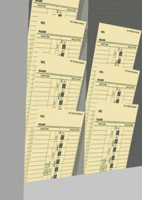

# 那么，你想辞职吗？(幻想对现实)

> 原文：<https://simpleprogrammer.com/so-you-want-to-quit-your-job-fantasy-versus-reality/>

这是关于辞职系列的第二部分。点击此处查看第一篇帖子。T3】

想象你要去你的邻居家跑步；只是随便慢跑。你跑得很舒服，没有真的很累或者呼吸很重，但是进步很大。现在想象一下，突然一只老虎从灌木丛中跳出来，开始追赶你。

你是做什么的？

你可能会带着更多的目的跑得更快，因为你害怕生命危险。这是一种当你辞职为自己工作时的感觉。T2

T4

T6】

长久以来，我一直幻想辞去工作，为自己工作。嗯，实际上我真正的幻想是整天玩电子游戏，完全不用工作，但即使是幻想也需要有一些现实基础，所以我修改得更合理一点。

反正我一直想自己当老板；为自己工作。我以为如果我能更好地掌控自己的生活，生活会好得多；如果我可以随心所欲地来去自由地安排自己的工作时间。

现在我真的做到了，我发现为自己工作并不完全是我想象的那样…我来解释一下。

## 八小时幻想

当我梦想为自己工作时，我想的主要事情之一就是，如果我每天有 8 个小时来完成我为自己设定的目标和项目，我能完成多少。

几年来，我的生活相当悲惨。我会在白天为我的雇主工作 8 个小时，然后当我完成我的第一份工作后，我会休息一会儿去吃晚饭，花一些时间陪陪我的女儿，然后在晚上继续工作 4 个小时，学习多种视觉课程。周末通常至少要花 4 个小时左右去上[的多视课程](https://simpleprogrammer.com/pluralsight)，每周可能还要花 3-4 个小时去写一篇博客。

我一直在想，如果我能在[多视课程](https://simpleprogrammer.com/pluralsight)上全职工作，我将每天多工作 4 个小时，甚至不用上夜班。我应该可以完成两倍的工作，而且一周的工作时间要少得多。

我做了一些计算，看看如果我制作两倍的内容，制作 [Pluralsight 课程](https://simpleprogrammer.com/pluralsight)的报酬是否能覆盖我从常规工作中获得的收入。这些数字似乎表明我会遥遥领先，所以就我而言,“辞掉我的日常工作”是一个不用动脑筋的问题。

## 8 小时现实

我为自己工作的第一周并不是我开始时那种轻松愉快的冒险。

当第一周结束时，**我没有像我预期的那样完成 4 到 5 个模块的[多见](https://simpleprogrammer.com/pluralsight)课程，实际上我只勉强完成了 3 个模块，这是我在辞职前投入的同样的 12 个小时**。

出事了；事情很不对劲。做全职工作时，我一周完成 2 个模块，所以如果我一周有 40 个小时的额外时间，我不应该能够轻松地完成另外 2 个模块，甚至 3 个模块吗？

我只是侥幸摆脱了它。我正在学习的这门课程需要大量的研究和准备工作，还需要为每张幻灯片编写文字段落——这一定是个糟糕的时机。

接下来的一周，我的情况有所好转，但仍然没有达到我的预期。我完成了 4 个模块，但仍然需要在一周内每天工作 12 个小时，周末还要工作一些时间；数学就是不合理。

在这里，我拼命工作，只得到比以前稍微好一点的结果。

## 有工作就有工作

我打赌你可能想知道此时到底发生了什么。什么能解释我看到的结果？

嗯，事实证明工作和“工作”是有区别的[T2T4](https://simpleprogrammer.com/wp-content/uploads/2013/08/time-card.jpg)T6】

你知道，在一份工作中，你仅仅因为出现就能得到报酬。我并不是说你可以整天坐在办公桌前，什么也不做，但事实上，在大多数工作中，你几乎每天都可以坐在办公桌前，什么也不做。

再说一次，我不想让人觉得我没有为雇主努力工作。作为一名员工，我一直努力工作，做得很好，通常表现远远超出我的预期水平。但是不管我曾经多么努力地工作，我从来没有像开始为自己工作时那样努力过。

现实情况是，即使是我所知道的为别人工作的最努力的上班族，在每天 8 小时的工作时间里，实际上也只工作不到 4 小时。实际上，我冒昧地猜测，实际上每天埋头苦干的时间可能平均约为 2 小时。

现在，在你对我所说的感到不安之前，让我们花点时间想想为什么会这样。

员工的工作时间远少于他们的上班时间有很多原因。第一个，也是最明显的原因是因为他们是按小时而不是按工作获得报酬的。当你按小时计酬时，你没有真正的动力去变得更快或更有效率，或者确保你每时每刻都在工作。

这意味着，如果你尽可能勤奋努力地工作，可能需要一个小时才能完成的任务，如果你在工作，但没有努力完成，可能需要 2 到 3 个小时。

想想在街上慢跑和因为一只吃人的狮子在追你而逃命的区别。当你在街上慢跑时，这并不像是你在偷懒，只是你并不真的很匆忙。

分散注意力的另一个主要来源是办公室谈话。在大多数工作环境中，人们都会进行社交。**假设每天平均有 2 个小时被与工作无关的话题或远程工作相关的话题的社交所消耗，这并不是不合理的。** 

让我们从 8 小时的馅饼中再取一块，并考虑一般的工作开销。这些事情包括检查你的工作邮件、阅读公告和备忘录、参加无意义的会议等等。**我会非常荒谬地假设这种事情平均每天只占用一个小时的时间**(尽管我们真的知道它占用的时间可能要多得多。)

最后，我们发现纯粹的懒惰和在工作时间做私人事情。生活就是生活，事情就是发生。你的孩子被叫到校长办公室，你在工作中接到一个电话，你必须处理这个问题。你要买房子，需要把贷款文件传真给你的抵押贷款经纪人。有时候你开始工作，你只是觉得精疲力尽，疲惫不堪，除了假装写代码，反复滚动代码行等待时钟滴答 5:00 之外，你真的做不了什么。

我会再次友好地把这归因于平均每天只占用一个小时，但根据我在脸书和推特上的记录，我很确定我们都知道这个数字比我们中最坦率的人愿意承认的还要大。

所以让我们继续做数学。利用你的 8 小时，减去 2 小时用于社交。你还有 6 个小时。拿走 1 个与工作相关的开销，再拿走 1 个与生活相关的开销和懒惰，你就已经有 4 个小时了。现在把原本可以以跑步速度完成的 4 个小时的工作减少到慢跑速度，你就有效地把它减少了一半，变成了大约 2 个小时的实际工作。如果你迟到或早退，或者你更爱社交或更懒，或者你的会议比平均水平多，这个数字甚至会进一步减少。你们中的一些人可能会得出负数。有人能完成工作真是奇迹！

## 那么，我的时间去哪里了？

仅仅因为你从为别人工作转到为自己工作，并不意味着你马上从每天工作 2 小时变成了 8 小时。为自己工作可以消除一些办公室干扰，但也有一些不能。

然而，最重要的是，从习惯于真正努力工作 2 个小时，到真正努力工作 6 到 8 个小时，有很大的不同和调整。

这有点像连续几年每天慢跑 3 英里，而不是突然有一天决定开始跑 12 英里。你或许可以做到，但在你调整之前，你会觉得自己是个废物。

对我来说，在我辞职之前，我的老习惯是白天做我的常规工作，这对我来说并不那么累，然后每晚工作 4 个小时，在这个时候我可能会完成 3 个小时的真正艰苦的工作。

每天，我可能要做 5 个小时的艰苦工作。

当我开始为自己工作时，我发现我实际上在白天做了大约 5 个小时的真正艰苦的工作，到了晚上，我可能会工作 4 个小时，但我太累了，所以我只做了大约 1 个小时的真正艰苦的工作。

所以总的来说，我每天只增加了一两个小时真正有价值的工作。这与我看到的结果完全吻合。我仍然不得不工作同样多的时间，而我的成绩只是略有提高。

## 跟踪我的时间

我会尽可能文明地把事情放在这里，但至少可以说，这真的让我很生气。

我是说，我一点也不喜欢我发现的这个新发现。

我反复思考了我做过的不同工作，以及我白天在工作中做了什么。我试着计算时间，确定我是否真的只花了几个小时真正努力工作，平均来说，在任何给定的工作中，一天都是如此。然后，我想到在大多数工作中，我是如何比大多数开发人员完成更多工作的，这让我更加难过。

我决定开始记录每天花在我的 [Pluralsight 课程](https://simpleprogrammer.com/pluralsight)和其他工作上的每一分钟，看看我的时间都去了哪里。

几个星期后我的结果证实了我已经知道的事情。在任何一天，我都幸运地在白天完成了 5 个小时的扎实工作，而一整天的平均时间是 6-7 个小时。

我也比以前更加努力了。

## 总结一下

那么，我想说什么呢？你能从我的经历中学到什么？

首先，为自己工作比你想象的要难得多。当你为自己工作时，你只有在工作中才能得到报酬。你不能就这么出现然后得到报酬。

你可能认为你现在在拼命工作，你很可能是这样，但我几乎可以向你保证，你现在的工作远没有你为自己工作时那么努力。每天做 2 个小时的艰苦工作和每天做 6 个小时甚至更多的真正的艰苦工作有着巨大的区别。如果你还没有为这种节奏的改变做好准备，你很容易被它击垮并气馁。

你可能会认为这不适合你；你可以在早上 9 点坐下来，戴上耳机，努力工作到下午 5 点，然后断开连接，开心地笑着看着你那天努力工作的 8 个小时。

但是，如果你是这种心态，我建议你在辞职前做两件事。首先，休息一周，试用一下。在那一周，记录下你的时间，看看你实际完成了多少工作。只计算那些能让你创造出有报酬的东西的工作。不要计算所有的开销和检查邮件等。

第二，在你看到自己的成绩有多惨淡之后，去拿一本[《艺术的战争》](http://www.amazon.com/gp/product/1936891026/ref=as_li_ss_tl?ie=UTF8&camp=1789&creative=390957&creativeASIN=1936891026&linkCode=as2&tag=makithecompsi-20)，了解到自己并不孤单。我们都面临着同样的问题:懒惰的生物想要做令人愉快的事情，而不是富有成效的事情，并且习惯性地合理化我们所有的行为，直到我们认为我们正在采取的行动是唯一可能和合理的选择。

我不是说不要辞职。事实上，我鼓励你想办法建立自己的事业，为自己工作。但是，要意识到，如果你不喜欢每天努力工作，你可能也不会喜欢为自己工作。