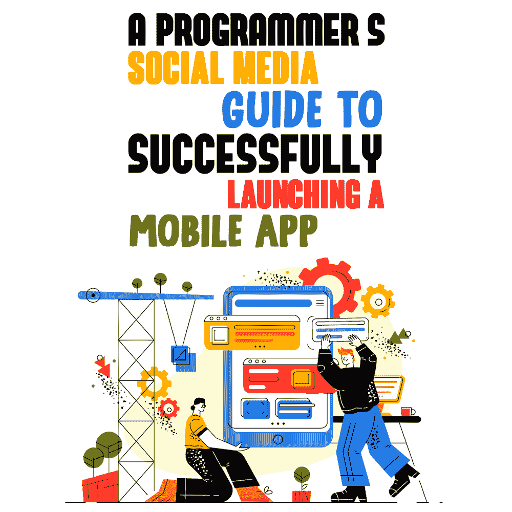

# 成功启动移动应用的程序员社交媒体指南

> 原文：<https://simpleprogrammer.com/social-media-guide-to-launching-mobile-app/>

Developing a great mobile app requires commitment and hard work. But building the mobile app is just half of the work. You could have a brilliant mobile app sitting in the app store with a few couple of downloads. Why? Because no one knows what the app is about and why they should download it. The solution? Social media marketing!

2021 年第一季度，Google Play 商店托管了[348 万个应用](https://www.statista.com/statistics/276623/number-of-apps-available-in-leading-app-stores/)。考虑到可用应用的多样性，你的应用只是百万分之一。如果你不付出额外的努力，你的应用就不会获得太多的关注，更不用说制造宣传和突破市场了。[社交媒体营销](https://simpleprogrammer.com/marketing-plan-programmers/)甚至在应用程序正式推出之前，就为你获得了你需要的流量，并创造了受众。

程序员应该投资社交媒体营销策略的理由数不胜数。首先，社交媒体是让你的应用产生知名度的最快渠道之一。有了众多可用的平台，您可以根据不同人群和目标受众的需求来迎合他们。

此外，客户参与是社交媒体平台的一大优势。个人互动使你能够回答人们对应用程序的任何疑问，并建立信任。

作为最具成本效益的营销渠道之一，[社交媒体提供了巨大的投资回报率](https://buffer.com/library/facebook-advertising-cost/)。社交媒体平台提供最便宜的广告发布价格，绝对值得一试。

毫无疑问，社交媒体是一个可靠的营销工具，让我们来帮你设置。在这篇文章中，我将为你提供一个详细的社交媒体指南，来启动你的移动应用程序，以获得更大的影响力和更大的下载量。

## 了解每个平台

在设计你的移动应用程序时，你必须概述一个基本的客户角色。为了推广你的应用，瞄准正确的受众是非常关键的。要找到你的潜在客户，首先要研究不同的社交媒体平台。让我们简要讨论一下主要社交媒体渠道的[主要功能，以帮助选择适合您应用需求的功能或组合。](https://www.amazon.com/dp/B07TN56JLG/makithecompsi-20)

### 脸谱网

脸书可能是最受欢迎的渠道，拥有 200 多万用户，被无数中小型企业(SMB)使用。脸书提供了生成新线索的能力，其巨大的广告机会专门迎合目标受众。

对于一个拥有新移动应用的程序员来说，脸书是一个合适的渠道，可以通过合适的内容来接触和创造忠诚的客户。视频内容对脸书来说非常管用，是吸引注意力的最新工具。

### 推特

如果你的营销计划是制造关于移动应用的宣传，那么 Twitter 就是你的平台。Twitter 上的帖子大多包含有价值信息的简短内容。

推动 Twitter 活动的最佳方式是开发相关的标签。通过使用这些标签，你可以开始一个趋势，并为你的追随者创造更多的能见度。请务必将您的推文放在 point 上，作为可分享的内容，以建立知名度。

### 照片墙

由于关注视觉内容，Instagram 通常被年轻受众使用。根据你的移动应用的性质，Instagram 可以通过发布迷人的视频和照片来对潜在客户产生社交影响。由于非常注重广告宣传，Instagram 也是一个很好的销售助推器。

除了这些主要平台，你甚至可以选择 YouTube、Snapchat 和抖音来合作。但是，在做出选择的同时，一定要明确目标。你是想[建立一个受众](https://simpleprogrammer.com/building-community-around-mobile-app/)，提高知名度，还是直接扩大下载量？结构化的议程将为如何从选定的社交媒体平台获得最大回报提供指导。

## 研究你的竞争对手

When you are headed into the world of marketing, it is absolutely essential to be aware of what you are up against. An effective social media guide equips you with the necessary tools to research your competitors and develop a strategy to stand out. As you must have carried out a market analysis while developing your mobile app, now you just have to take it one step further and evaluate your competitors’ social media strategies.

一旦你知道谁是你的主要竞争对手，看看他们的社交媒体页面。观察他们发布什么类型的内容，谁是他们的主要目标受众。浏览竞争对手的社交媒体页面会让你清楚地知道什么有用，什么没用。利用这些有价值的信息设定你自己的基准，并[提出让你与众不同的新想法](https://www.amazon.com/dp/179279603X/makithecompsi-20)。

为了更上一层楼，你还可以使用高度专业化的工具来分析你的竞争对手。技术数据可以帮助你进行 SWOT 分析(优势、劣势、机会和威胁)，并制定社交媒体战略，以填补展示你的移动应用程序的空白。SWOT 分析是一种商业技术，主要用于计算行业内组织的优势和劣势的数据驱动评估。除了运行技术分析，不要忘记发展和差异化。观众喜欢不时看到新颜色的流行音乐！

## 专注于发布前的宣传

社交媒体就是通过发布前的营销策略，在产品上市之前为其制造宣传。发布前策略主要是为了提高意识，在竞争激烈的情况下非常有效。作为社交媒体指南的一条规则，记住不要把所有的信息都泄露出去。为实际发布活动保留一些移动应用程序的明星功能。

一旦您最终确定了发布日期，回过头来估计您的预发布活动所需的时间。从为你所有的社交媒体渠道设计广告图片开始。宣传活动还可以包括介绍移动应用程序的[短视频。另一个好主意是为你的移动应用程序创建品牌标签，因为一个吸引人的标签可以迅速引起人们的兴趣，并有助于传播消息。](https://blog.advids.co/20-stunning-mobile-app-teaser-video-examples/)

在你的移动应用真正上市之前，你希望人们谈论它。最简单的方法是通过你的社交媒体渠道鼓励参与。创建推荐活动，分享应用注册链接的人可以获得移动应用的独家演示。

或者，获得大量追随者的一个好方法是吸引有影响力的人。让你的目标受众关注的人谈论你的移动应用。这样做可以通过人们已经信任的人将你的应用置于聚光灯下。

## 创建赞助广告

社交媒体广告一直在稳步增长，目前价值 479 亿美元。与有机营销不同，付费广告为你的销售目标提供了额外的推动力。就你的情况而言，与有机贴子相比，赞助广告有很高的几率提升你的移动应用下载量。

作为发布移动应用的社交媒体指南的一部分，赞助广告可用于实现各种目标:

*   **意识。**特别是对于一个新的移动应用程序，你需要在观众中引起轰动，让他们知道接下来会发生什么。付费定向广告将流量引向你的社交媒体页面，并扩大覆盖面。
*   **订婚。**作为市场上的新应用，你希望人们与帖子互动。赞助广告可以帮助你获得更多的流量、潜在客户、应用安装和帖子浏览量。
*   **转换。**对于一个手机 app 社交媒体页面来说，转化通常意味着下载量和销量。付费广告活动可以包括人们可以下载应用程序的直接应用程序链接。

创建一个赞助广告活动可以势不可挡。然而，请记住，你不需要一个巨大的预算来设计一个恒星广告活动。从[最佳移动应用赞助广告](https://uplandsoftware.com/localytics/resources/blog/app-install-ads/)中我们学到，关键是要用一个清晰的行动号召(CTA)按钮以最精确的方式传达信息。

即使是壮观的广告活动，你也需要监控和评估结果。发布内容时要有明确的目标，不要忘记测试广告以优化效果。最重要的是，在设计你的广告时要考虑到移动视图。这样做是极其重要的，尤其是当你自己在为一个移动应用做广告的时候！最后，设计你的广告活动，使其特别适合[每个社交媒体渠道](https://www.bigcommerce.com/blog/social-media-advertising/#1-facebook-advertising)，以获得最大的投资回报率。

## 进行现场演示

An exciting way for programmers to promote their mobile app on social media channels is to hold a live demo. Product demos are interactive, simple, and insightful—both for the audience and the creators. The very first live demo you hold is pivotal, as it determines how the audience is going to react to the app. In order to make the demo successful, plan, research, and invest smartly.

现场演示的主要目的是介绍 app 的明星功能和界面。由于这将是一个现场演示，请务必事先做好一切计划。由于这是一个应用程序发布视频，请保持简短但有趣！仔细考虑价值主张，并确定您想要提供的确切 CTA。为了获得反馈，尽可能让它具有互动性。了解观众的意见有助于你制定未来的营销策略。

养成在实际会议前测试直播的习惯，以避免任何最后一刻的技术错误。如果你正在考虑在不同的平台上上线，那就逐个体验一下。一旦确定了日期和日程，就开始在所有渠道推广应用程序演示。一个好主意是邀请一位科技名人来观看演示。一个简单的采访或者仅仅是一次现场聊天肯定会让观众兴奋起来！

最后，记住不要偏离路线图。不必要的长时间演示会令人厌烦，人们会离开。与观众互动，紧扣上下文。有一个支持团队袖手旁观是一个伟大的方式来迎合任何技术问题发生在演示过程中。即使第一次有一些小故障，保持乐观；你才刚刚开始建立你的社区。

## 不要忘记发布后阶段

你的手机应用程序的成功取决于你的努力。根据专业的社交媒体指南，发布前和发布后的阶段对于你的产品的成功都是至关重要的。那么，你在上市后阶段具体做些什么呢？简而言之，这是关于用户保持，这将是本节的重点。

首先，评估分析你现在的社交媒体数据，进行参与度统计。这样做可以让你了解目前的活动有多受欢迎。整合你的分析反馈，并实施你需要的任何改进。客户喜欢看到他们的意见得到认真对待和及时处理。

接下来，将你的注意力转移到应用程序用户上。销售一个移动应用程序就是销售一个优秀的用户体验。为此，在你的社交媒体渠道上运行[用户生成内容(UGC)](https://blog.hootsuite.com/user-generated-content-ugc/) 。ugc 可以作为一种竞赛引入，鼓励用户张贴条目以获得奖励。个性化的故事不仅能在观众中建立信任，还能增强你在社交媒体上的品牌忠诚度。

另一个好主意是主动要求评分和评论。然而，请确保只接触那些实际使用过该应用程序的人，以获得建设性的反馈。最后，作为一般规则:保持对话。社交媒体渠道很容易在发布后销声匿迹。开展杀手级社交媒体活动的关键是让观众参与进来。

## 整合分析

作为一名程序员或社交媒体世界的新手，你需要了解它是如何工作的。你可能会想，你有一个很棒的应用程序等待上市，你已经创建了社交媒体页面，但仍然没有重要的追随者。为什么？答案是你错过了一个重要的因素:分析。

[最好使用工具，](https://brand24.com/blog/best-social-media-analytics-tools/)社交媒体分析使您能够从所有活动中收集数据。它帮助你了解你的观众，创造更好的内容，并认可你的明星社交媒体网络。综合分析还可以让您监控您的竞争对手，了解您面临的挑战。获得如此有价值的数据无疑会增加你成功开展社交媒体活动的机会。

## 正确的计划和态度可以导致成功

现在，您已经了解了借助社交媒体发布移动应用的基本工具和技术。为发布会准备一个游戏计划，并决定你想在哪些社交媒体平台上做广告。

记住要始终如一——不要因为小小的失败就放弃。如果你觉得需要更多的指导，可以向导师或专家寻求帮助。移动应用是你努力开发的东西，只有你才能用正确的社交媒体发布计划让它脱颖而出！