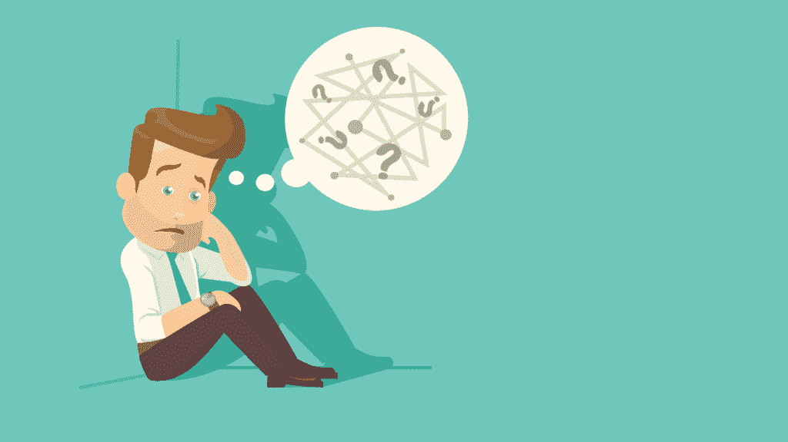
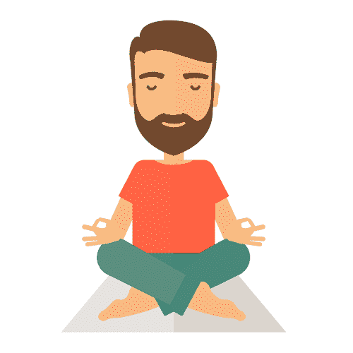
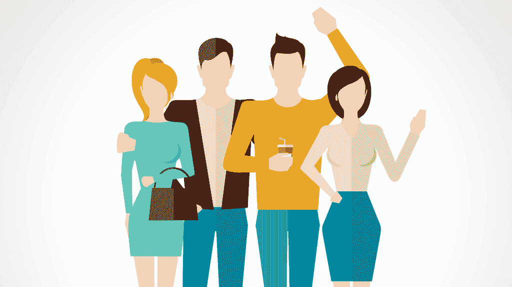

# 社会刺激…你缺少吗？

> 原文：<https://simpleprogrammer.com/social-stimulation/>

你曾经在一个非常悠闲平和的环境中工作过吗？你家也是这样吗？

放松的环境是很多人喜欢的，尤其是软件开发人员，因为我们更容易在安静祥和的环境中集中注意力，并伴有轻音乐，最好是柔和的爵士乐。

我们在职业上(和个人上)会变得如此习惯这种环境，以至于我们可能会忘记与他人交往是多么美好和重要。

而且我指的不是在社交媒体上和朋友社交。我说的是简单地和你生命中重要的人面对面交谈。

社交刺激是保持健康和快乐的好方法。作为一名软件开发人员，与他人交流可能有助于您找到某些问题的解决方案。

例如，你可能在用 C++编写某个函数时停滞不前(我亲身经历过这种情况)，并且不知道从哪里开始。与他人讨论问题可能会帮助你找到问题的答案。另一个人的思维方式并不意味着他们比你更好，只是因为他们帮助了你；这仅仅意味着他们把你的大脑推向了一个你可能没有意识到的方向。

根据 SharpBrains 上的一篇文章，社交活动对你的大脑有益，因为它能增强大脑功能。作为软件开发人员和工程师，我们的大脑对我们来说至关重要，因为我们 95%的工作都是使用大脑。社会参与包括我们每天使用的各种行为，这些行为需要记忆、注意力、对细节的关注和控制。社交活动还可以通过释放身体压力来改善身体健康。

缺乏社会刺激会导致我们忘记如何与人互动。

## 社会焦虑

当然，软件开发很有趣，而且需要大量的注意力。但是机器不能和我们进行语言交流。对我们中的许多人来说，我们已经变得如此孤立，以至于和别人在一起，尤其是和一大群只是在社交的人在一起，会很可怕。

这可能发生在你身上，也可能没有。但这已经发生在我身上了。我会尽量简短地分享我的故事。

我是一个安静的人，我不介意社交。然而，我经常玩手机，查看电子邮件、脸书、我的银行账户、Twitter 和 PlayStation Network。

我甚至变得如此糟糕，以至于当我在祖父母家与家人共度时光时，我会打电话。我甚至在约会时也这样做过，幸运的是，和我约会过的女人都很宽容。总而言之，这是一个非常不好的习惯，但不是不可能的。我能做到，你也能。

一开始我想，“可能是电话。它很酷，很时尚，而且有这么多功能。太神奇了！”但后来，当我更仔细地看自己时，我意识到这不是我的手机。

## 寻找平衡

我仍然很擅长与人进行一对一的交谈，但当涉及到中型或大型人群时，我倾向于冻结。在某种程度上这是好的，在某种程度上这是坏的。这是一件好事，因为有些人不应该知道太多关于你的事情——这是避免接触坏人的一个好策略。在某种程度上，这是不好的，因为你可能会错过你应该认识的人和你应该进行的对话。那么，你如何创造一个平衡，使你尽最大努力保持在中间呢？下面我将分享关于最小社会刺激的积极和消极的观点，以便你比较和对比你说谎的地方。你可能更倾向于积极的一面，或者消极的一面，或者都不是。但我相信这对你来说是一个很好的起点:

最小社会刺激的积极作用:

*   你真的知道如何独处。如果你不能学会独自生活(这和孤独是不一样的)，和别人一起生活你会很沮丧，很可能会不开心。不管我们是否单身，我们都需要独处的时间。
*   你有时间去了解自己。你是谁？你有什么样的性格，喜欢什么，不喜欢什么？什么让你开心，难过，感激？发现你是谁不仅会让你和自己有更好的关系，也会让你和其他进入你生活的人有更好的关系。了解你是谁将有助于你识别自己的优势和劣势，并从那里你可以发现如何将你的一些劣势转化为优势。
*   你可以变得非常有效率。如果你周围有大量的人，甚至是一小群人，你很难完成工作，比如写代码。任何你认为有用的东西，比如博客、书或画，你都可以独自完成——当然，除非是一个团队项目。

对于一个起点来说还不错，对吧？希望到目前为止，我已经向你指出了，如果你有太多的社交刺激，那么它在最好的情况下是无效的，在最坏的情况下是不健康的。

但是社交刺激肯定有它的好处，所以现在让我们看看没有足够的社交刺激会如何影响你。

最小社会刺激的负面影响:

*   你开始感到沮丧。当然，独处是件好事，但你不应该 24/7 都独处。这就是挑战所在。当你习惯了一个人的时候，社交就越来越难了。你只能和自己讨论这么久。和别人把事情说出来是一种减压方式，而且，大多数时候，你会发现别人的建议是一种巨大的财富。
*   它变成了你。我不会让自己孤独到成为你自己的地步。偶尔独处是可以的，但不要一直独处*，在这一点上，你个人生活中唯一让你感到舒服的人就是你自己。给朋友和家人打电话；结交*新的*朋友，这会给你的个性增添新的维度。他们不需要知道你的每一件小事，但是交一些你可以一起出去玩和聊天的新朋友可以让你充满活力。*
*   ***它可以杀死你**。字面上。社会孤立是过早死亡的高风险因素。甚至高于吸烟或高血压。当我发现的时候，这对我来说是新闻。记住，不是和你遇到的每个人都成为朋友，而是拥有你可以依靠的朋友。如果我们注定孤独，这里就不会有这么多人了，对吗？没错。*

## *做出改变*

*幸运的是，有一些方法可以增加社会刺激，比如:*

*   ***社交事件！舞会、会议和咖啡馆活动都是改善社交生活的好方法。***
*   *去游戏厅吧！如果你和我一样是老派，和朋友在街机上度过一段美好时光可能不是一个坏主意。我仍然不时和朋友去街机，玩 90 年代的街机游戏(像*真人快打*)。一些游戏厅甚至有非正式的比赛，比赛是友好的。*
*   *休假。认真。可能的话拍几张！不一定要在海外或其他地方，但即使是在下一个州，也要去度假。*
*   ***多出去走走。我们美国人花太多时间看电视——平均每天五个小时。你会惊讶于你生命中的五个小时能做些什么。为什么不利用这五个小时中的一部分(如果不是全部)出去看看这个世界呢？开车在镇上转转，发现一个你可能喜欢的新去处、餐馆或剧院。***
*   *计划一次聚会。邀请几个亲密的朋友和家人过来玩玩。我不时邀请朋友过来，只是为了谈论我们的生活或玩视频游戏——我们可以一起玩的东西。当增加社会刺激和与你所爱和关心的人的联系时，这是非常有效的。点个披萨，找点乐子。*
*   *加入一个俱乐部。这不仅对你的事业有帮助，对你的个人生活也有帮助。你会遇到和你有共同兴趣的新朋友，你可能会建立持续几年甚至一生的关系。*

## *培养平衡的社交生活*

**

*现在郑重声明，生活中有些事情我们都必须自己处理，尤其是在做决定和评估生活的时候。我相信在你生活的某些方面。决定获得[适量的社会刺激](http://www.amazon.com/exec/obidos/ASIN/1572245530/makithecompsi-20)就是其中之一；没有人能替你做这件事。*

*一个很好的视频值得一看，特别是如果你想改变你的生活的话，它是约翰·桑梅兹的《[对自己撒谎将如何毁掉你的事业和生活](https://www.youtube.com/watch?v=pw7SvbShLdI)》。这段视频讲述了我们如何说服自己，当我们不诚实时，我们是完全诚实的。比如我们个人生活中的坏习惯，如果不处理，它可能会摧毁我们的生活和事业。从长远来看，不注意你的社交生活可能会对你造成伤害，否认这一点也没有帮助。*

*我推荐的另一个视频是由 John Sonmez 制作的，名为“[为什么你在生活中总是孤独一人](https://www.youtube.com/watch?v=Nw_D6Rt1jlI)”这个视频讲的不是孤独，更多的是我们在生活中独自面对的某些障碍或考验，是必要的，有价值的。你的生命是宝贵的，它不应该是理所当然的，即使是你！你拥有的力量超过了你每天允许自己拥有的。如果你学会了如何使用你被赋予的力量，你就可以并且将会在你生活的每一个领域变得伟大。然而…*

*我们不必在生活的每个方面都孤独。*

*照顾好你自己。*