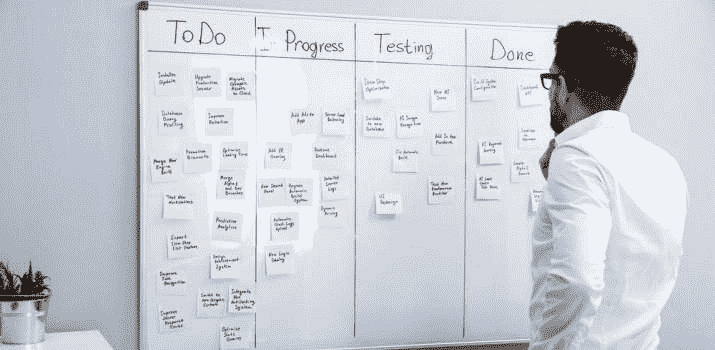

# 软件开发人员必备的 14 项软技能(升级！)

> 原文：<https://simpleprogrammer.com/soft-skills-for-programmers/>

作为一名程序员，技术技能只能让你走得更远。

在我的软件工程生涯中，我学到了所有的东西和技术，其中最让我赚钱的是*软技能*。

它们很难衡量——但是当你看到它们的时候你就知道了。

*   与人为善。
*   成为一名强有力的公众演说家。
*   当事情变得艰难时，无论是身体上还是情感上，都能坚持下去。

简而言之，所有那些大多数人*没有*关注的事情！

作为一名软件开发人员，出色的软技能让你与众不同。他们为你敞开大门。因此，他们倍增你的收入潜力。

它们是编程中我能教给你的最有价值的东西。

让我们开始吧。

## 1.目标设定——实现你作为开发人员的梦想

作为一名开发人员，设定目标似乎是显而易见的。

然而很少有程序员为他们的职业生涯定义目标。

为什么？

我猜有两个原因:

1.  许多软件开发人员害怕承诺长期愿景。他们想保留选择权。*如果我走上了错误的道路呢？如果我不喜欢它带我去的地方呢？*确实很吓人的问题。
2.  **他们根本没有考虑太多**——只是沿着为他们设计的道路前进。开创自己的路更难。所以我们不做。

但是你没有明确方向的每一步都是虚度的一步。不要漫无目的地度过一生！

采取以下两个主要行动来提高目标设定的软技能:

*   **首先**，给自己定一个远大的、令人兴奋的远大目标。你希望你的职业生涯在 5-10 年内处于什么位置？
*   其次，制定小目标，一步一步地朝着更大的目标前进。

## 2.沟通和演讲技巧——提升你的职业水平

如果你认为[你作为软件开发人员的主要工作是写代码](https://simpleprogrammer.com/technical-skills-software-developer/)？

你最好再想想。

作为一名程序员，你的工作——就像每个行业一样——就是与人打交道。

还有你是怎么掌握你和人的关系的？通过掌握沟通。

开始每天在工作中练习你的沟通技巧:

*   与同事交流。也许是你过去没怎么说过话的人。
*   向某人解释一个概念或项目。试着在你的解释中引人入胜，有教育意义并且容易理解。
*   向你的老板推销一个新想法。尽可能让它听起来对他有吸引力。

### 与更多人交谈(除了你的电脑)

我不喜欢内向者 vs 内向者的标签。

不要说‘我很害羞，因为我内向’。这两者没有联系。别说了。这是借口。

去做吧。感受恐惧，无论如何都要去做。

如果你养成了这个习惯，你会成为一个更好的沟通者。你会建立大量的联系..你将会看到它的影响。

### 成为一名有说服力的公共演说家

公开演讲可以给你权威，为你的项目带来支持，为你作为开发者打开各种各样的大门。

在大多数公司，作为一名员工，你有机会给团队做报告或演示。

抓住这些机会！工作之外也要练习你的公开演讲:你可以在代码营和当地的用户组中练习。掌握这项软技能，改变你的编程生涯。

## 3.吸引力和魅力——将你的生活切换到简单模式

### 吸引他人并传播积极的态度

如果你是:

*   能够让你的同事微笑
*   当有挑战时，激励他们坚持下去
*   让他们自我感觉良好

他们会喜欢你的。

因此，人们会喜欢和你在一起。他们会对别人高度赞扬你。每当他们听到新的机会，他们会首先想到你。

### 穿着得体

这是一个简单的自然事实:穿得好，每个人都会对你更好。

所以抓住这个机会，[成为外面少有的穿着得体的软件开发人员](https://simpleprogrammer.com/programmers-dress-at-work/)！一个干净、凉爽、相配的衣柜能让你走得更远。

不管喜欢与否，人们喜欢以貌取人。不要害羞——把它变成你的优势！

## 4.社会动态意识和人际技能——获得支持和避免陷阱

即使编写代码是你最喜欢的工作:

如果你想成为一名优秀的软件开发人员，你必须学会有效地应对人们的心理。

掌握社会动态这里有三个在工作中变得受欢迎的秘密:

### 1.每个人都想觉得自己很重要

当在工作中与他人打交道时，首先要设身处地为他们着想。感同身受，试着看看他们从何而来。

人们希望被看到，被听到，被欣赏。

但他们很少这样做。

如果你是那个愿意花时间为你的同事做这件事的人，猜猜他们会最喜欢和信任谁？

*这不是被人操纵*吗？

不，这叫有同理心，真正看到并欣赏和你说话的人。

### 2.从不批评&避免争论

现实一点:作为一名软件开发人员或工程师，你通常是房间里最聪明的人。

这并不意味着你应该告诉每个人他们可以做得更好。*就算是真的*。

无论如何，避免成为无所不知的人。从出色的工作中获得认可！大多数人没有准备好接受诚实的反馈，这是人类的自然法则。

如果你真的需要提出建设性的批评，想想你该怎么做，这样就不会让他们因此而怨恨你。如果可以，让它听起来像是他们自己的主意。

还有:待人接物的时候，表扬比批评管用十倍。

这同样适用于任何类型的争论。在 99%的情况下，这没有任何帮助，只会让事情变得更糟。避开那些无意义的争论。

相反，花时间创造一些有价值的东西。

### 3.想想对方想要什么

你的老板想要什么？

你同事的目标是什么？

在每一次互动中，将你所说的与你将如何使他们受益联系起来。

如果他们看到你如何提高他们的底线或地位，他们会更喜欢你，并认真听你说些什么。

## 5.专业人士的谈判技巧——得到你应得的

掌握开发人员谈判的软技能，你会在有生之年赚到更多的钱。

### 了解你的价值

作为软件工程师和开发人员，我们为与我们合作的任何公司创造了如此多的价值。

如果你知道你的工作是有质量的:不要羞于追求最高的薪酬。他们从你提供给他们的东西中赚取了你工资的很大一部分。

### 面对被拒绝的恐惧

如果你要求更多，你必须准备好有时会听到“不”。作为人类，我们感受到被拒绝的痛苦，就像我们感受到身体上的痛苦一样。所以大多数人都尽量避免。

但是如果你直面恐惧，并且不顾一切地去做，你将获得其他人错过的巨大潜在利益。

### 学习有效的谈判策略

需求最大的人总是处于劣势。

因此，如果你有几个获得新工作或新客户的选择，你可以在谈判中占据更有利的位置，而不是像你向所有人投简历那样，依赖他们的同意。

### 聪明点

在价格谈判中，第一个提出价格的人会输。

例如，如果你在谈判程序员的薪水，不要告诉他们你心目中这个职位的范围。现在你处于优势，你可以相应地给自己定价。

### 声誉是强大的

还要考虑到这一点:你在推销自己和建立声誉方面做得越好，你就越容易谈判。

我曾经和一些软件开发人员一起工作过，他们仅仅依靠建立一点个人品牌和网上声誉就能使他们的薪水翻一番。

最后，考虑读一两本关于[如何更好地谈判](https://www.amazon.com/gp/product/B000PDZFDO/ref=as_li_tl?ie=UTF8&camp=1789&creative=390957&creativeASIN=B000PDZFDO&linkCode=as2&tag=makithecompsi-20)的书。

## 6.情绪控制——始终保持冷静和控制

作为一名程序员，你不断地与截止日期、困惑的同事和苛刻的老板作斗争。人们期望你在压力最大的时候也能做到最好。

这就是程序员掌握情绪的地方。这种软技能是一种超能力。

如果你能学会在新任务、修改和演示的风暴中保持冷静，你将成为同事们不可或缺的一员。这意味着你将能够更快地在职业阶梯上攀升。

但最重要的是，你学会了不让任何事情扰乱你的冷静。

那是无价的。

## 7.责任——推动你的职业发展

总是努力在工作中承担更高的责任。责任越大，权力越大。不要逃避责任。取而代之的是寻找更多的机会。

*   自愿参加下一个项目。
*   领导这个团队。
*   做那个报告。
*   打那个电话。

作为一名开发人员，作为一名领导，作为一个人，你会成长[，](https://simpleprogrammer.com/7-leadership-skills-senior-developer/)。同时为你自己打开了充足的职业和赚钱的机会。

## 8.创造力——释放它，创造机会

发挥你的创造力，写出更好的代码，拥有更好的职业生涯。

编程既是一门艺术，也是一门科学。想出创造性的解决方案意味着你更擅长你的手艺。

当涉及到项目、策略和问题时——如果你已经开发了创造性的软技能，你将能够为所有这些找到新的、令人兴奋的和可行的解决方案。

想象一下，这会让你在雇主或客户眼中变得更有价值。

## 9.生产力和时间管理–轻松获得成功

编码是一项有趣但又辛苦的工作。你的同事需要帮助，老板或客户在你耳边，最后期限迫在眉睫。推动一个编程项目完成并不容易。

这就是优秀的程序员生产力软技能将拯救你的一天。

### 做智能笔记

无论是你下一个项目的笔记，你以后需要的代码片段，会议或者想法。一定要有条理地把这些都写下来

### 了解你最有效率的时间

安排好你的一天，这样你就可以在你最敏锐、最有活力的时候工作。对一些人来说这是在上午，对另一些人来说是在下午。

警告:这可能只对你有用，如果你是一个自由开发人员或不受公司日程安排约束的远程工作者。

### 计划你的一周

确切地知道你每时每刻需要做什么。你将会节省很多脑力，因为你不必总是为下一个任务而争分夺秒。在每个新的一周之前，花些时间做所有的思考和策略。然后在这一周里，你只需要*执行*。

### 由(番茄钟)决定生死

为你的下一个任务设定一个(短的)时间。之后让自己休息一下。重复该序列多次。[番茄工作法让你快速完成大量的编码工作](https://simpleprogrammer.com/some-questions-about-the-pomodoro-technique/)而不会累垮自己。

### 拨入您的健身和营养

作为一名程序员，要做更多的事情，首先要改善你的健康状况并遵循良好的饮食习惯。

你会想得更清楚，你能更长时间地集中注意力，并且在结束时你不会感到疲劳。

## 10.谦逊的自信——将你的自信和乐于学习结合起来

有时候温柔一点没关系——

当允许自己从反馈中学习时。

你确信你的方法有效吗？对此有信心和信心是件好事。

但永远不要让这种信心成为错觉。

即使聪明的人有时也会犯错。或者他们至少可以做得更好。

一个可信的来源(一个你尊敬的同事，一个在游戏中成功几十年的老板)给你反馈了吗？至少考虑一下对你有好处。

如果你能够在不影响自尊的情况下向他人学习，这是一个很好的品质。

## 11.团队合作——和其他人一起赢

[不是一个“孤独的程序员”，而是一个团队成员](https://simpleprogrammer.com/working-on-a-team/)的软技能意味着你积极地为完成任务、管理项目或实现目标做出贡献。

团队合作减少了开发一个项目所花的时间，而且它也有助于产生更多的想法，因为更多的大脑都沉浸在同一项工作中。

## 12.写作——在文字和思想上变得清晰

开始写(不仅仅是代码)。

[开编程博客](https://simpleprogrammer.com/never-run-out-of-topics-programming-blog/)。

这是提高你沟通技巧的最好方法之一。

写作迫使你组织你的想法。

*   总的来说，你会成为一个更好的沟通者。
*   你将能够更好地组织你的思想。
*   你将能够更有效地与人交谈。

## 13.营销技巧——毫无羞耻地推销自己

营销和销售还不错。

作为一名开发人员，学习如何销售以及如何营销(尤其是你自己)。

你不能把这看成一件肮脏的事情。不要等着别人发现你的价值。事情不是这样的。

勇敢、行动、自信的人会赢。他们赢是因为他们被倾听。

世界会给你你想要的。但前提是你提出要求，并据此采取行动。这意味着如果你想要什么，你必须站起来。

这不是自大，也不是混蛋。而是要认识到自己的价值。并且明确自己的价值！

当你在面试时，他们问你:你的 C 技能怎么样？如果你很自信，你不会说，嗯，我很好，我觉得很好，……你会说，我不想自吹自擂，但是我真的很好！

## 14.学习——永远不要停止提升你的生活

作为一名成功的程序员，你需要的最后一项软技能(但绝不是最不重要的——事实上是至关重要的):

*愿意并能够不断学习*。

当你想变得更好以改善你的职业生涯时，你会犯很多错误。如果你想避免这些陷阱——并了解你可以用来尽快变好的卓越策略——我邀请你查看我的免费电子邮件课程: