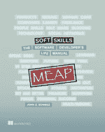

# 软技能是曼宁交易的一天！

> 原文：<https://simpleprogrammer.com/soft-skills-manning-deal-day/>

好消息！

提前获得我的新书《软技能:软件开发人员的生活手册》,今天(2014 年 9 月 11 日)仅作为曼宁的今日交易发售！

如果你一直在考虑买这本书，现在可能是以折扣价买到它的最后机会了。

只需使用代码:dotd091114au 即可在结账时享受折扣。

我收到了很多关于这本书的问题，所以我想在这里回答一下:

问)这只是这个博客上的博文集合吗？

A.)不，这本书几乎是全新的材料。它大约有 325 页的文本，尽管它有一些和这个博客上的一些博文相同的主题，但几乎所有的内容都是全新的。

真正的最终版本会在什么时候发布？

A.)最后一本书其实已经完成了。或者说，所有的写作都完成了，但还需要定稿和最后一轮校对。但是，预计日期是 2014 年 12 月。如果你现在购买《MEAP 》,你就能提前看到这本书，还能得到最终发行的版本。

**问。)我为什么要购买 MEAP？**

A.)它向我的出版商曼宁(Manning)表明，人们对这本书的兴趣很高，这增加了印刷和发行的规模。您还可以立即访问大部分内容，并有机会对这本书做出有价值的反馈。你也有机会以折扣价买到这本书(至少今天是这样。)

**问。)我可以免费获得书籍内容的样本吗？**

A.)可以，[直接去这里免费看第一章。](http://www.manning.com/sonmez/SoftSkills_MEAP_CH01.pdf)第一章也会告诉你你需要知道的关于书中内容的一切。

如果您有任何其他问题，请点击“联系我”表单进行提问。

只是想让你知道，我无法控制曼宁何时销售书籍，所以我的书可能不会再出售，或者至少暂时不会，所以现在是以折扣价购买的好时机。