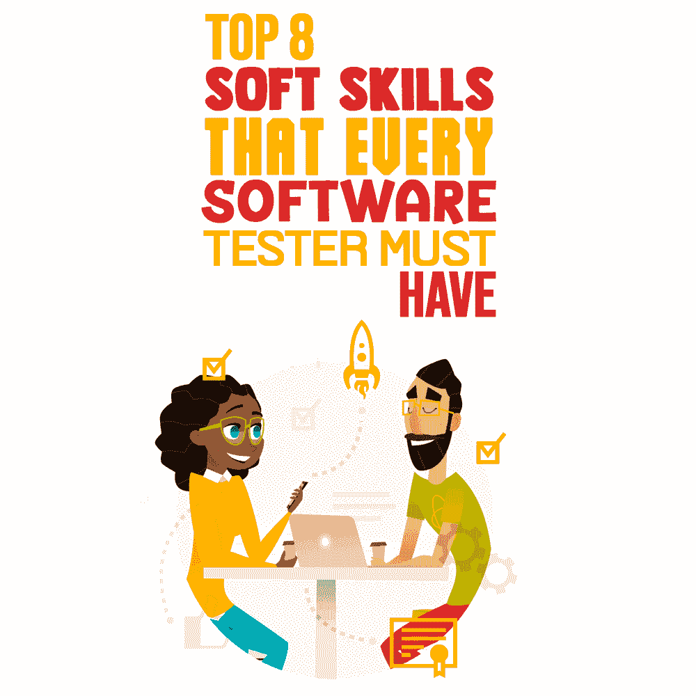

# 每个软件测试人员必须具备的八大软技能

> 原文：<https://simpleprogrammer.com/soft-skills-software-tester/>

In today’s competitive digital landscape, an individual or business needs to be a pro in multiple aspects to stay ahead of rivals. Software testers are no exception—a software tester has to go the extra mile to be considered a great tester. Apart from having a strong hold on the technical side of testing, they must have great soft skills.

软技能基本上是使个人能够在工作场所有效工作的特质和能力。软技能不仅帮助你在软件测试领域建立一个伟大的[职业生涯，而且给你领导和团队合作的技能。学习软技能不需要投入大量时间；相反，这些技能可以在测试工作中学习。](https://simpleprogrammer.com/software-testing-career/)

## 软件测试人员软技能的重要性

对于软件测试人员来说，拥有正确的技能和知识来执行测试过程是必要的，但是为了灵活、冷静地处理问题，并得到充分的支持和团队合作，软技能同样重要。

技术技能帮助测试人员提高他们的技术专长，而软技能控制测试人员的其他方面——从他们的工作生活、问题，以及所有其他生活方面。一个软件测试人员只需要知道测试策略之外的更多东西，这就是软技能证明他们真正潜力的地方。

我注意到，每当我在测试中遇到困难时，并不总是知识和测试工具能够解决问题。相反，软技能在解决问题的过程中占有同等的份额。软技能让我能够明智地处理问题，做出正确的决定，而不是将问题升级到其他人。

技术过硬肯定会帮助你获得梦寐以求的工作，但如果你希望从长远来看在测试领域出类拔萃，你需要提高你的技能，并拥有出色的软技能。强调软技能绝对可以帮助你成为测试行业的专家。由于许多软件测试人员只关注提高他们的测试技能，几乎没有人关注软技能(这可能是你最大的错误)。

知道什么样的软技能对软件测试人员有用，将帮助您远离麻烦，并交付准确、无错误和出色的输出。它将直接帮助你不仅成为测试行业的专家，而且成为一个伟大的领导者。定义一个领导者的不是测试行业的资历或多年经验，而是你如何明智地管理你的团队，以及队友有多开心。

如果你只关心你的专业技能，而不花时间去磨练其他技能来提升生活的其他方面，你会损失惨重。除了发现和修复应用程序中的错误之外，你还需要定期与同事互动，了解正在发生的事情，并参与客户会议和经理会议。这些小事情最终会帮助你成为一个伟大的领导者，一个能够聪明地处理各种情况的人。

进一步提高你的软件测试技能不会教会你团队合作或者如何成为一个伟大的领导者，但是发展你的软技能会给你管理或者与你的团队一起工作的技能。

## 软件测试人员的顶级软技能

一旦你意识到软技能对成为一名优秀的测试员、领导者或团队成员的重要性，你肯定会喜欢发展你的软技能。好吧，我会让你的工作变得简单，因为我已经列出了八个已经证明的软技能。

一旦你接触了测试工具，成为一名软件测试人员可能是一件容易实现的任务；然而，要成为最受欢迎的软件工程师，你需要更进一步，跳出框框思考。拥有一套很好的软技能将帮助你成为一名优秀的测试工程师，测试行业内外的每个人都钦佩你。

在本指南中，我们将讨论软件测试人员应该了解的顶级软技能。你必须定期尝试运用每一项技能来体验预期的结果。我们开始吧！

### 1.做一个健康的沟通者

最重要的软技能之一是[健康的沟通](https://www.amazon.com/exec/obidos/ASIN/1546581731/makithecompsi-20)。作为一名软件测试人员或领导者，您需要以一种技术人员和非技术人员都能容易理解的方式进行交流。每当你召开会议时，人们会从不同的部门聚集到一起，并不是每个人都清楚测试的部分。所以你需要用简单明了的方式传达事情，这是健康沟通的一部分。

Being a healthy communicator is always a two-way process—listening is as important as speaking. You must not only advise others, but learn to listen to others’ perspectives, as well. For instance, a software tester is an important contributor to a requirements discussion meeting. During this discussion, you can improve yourself by understanding the system while focusing on a few aspects such as asking questions frequently throughout the meeting, seeking confirmation while confused, always making eye contact with the person who is speaking or giving the presentation, maintaining a positive posture, and giving positive feedback quite often.

在这种情况下，当你在组织一个会议并且你是发言人的时候，你需要记住的第一件事就是相信你自己。在你发言之前思考一下，试着和会议中的每个人进行眼神交流。记下你的速度，必要时放慢速度。你必须练习小对话，并尝试解决冲突。在整个会议中保持积极的肢体语言，因为它会让困难的对话变得轻松自如。

此外，你可能会发现自己在和不同人口统计、不同语言的同事和客户交谈。在这种情况下，你需要自信和理解，同时简单明了地传达信息。这将有助于那些客户或团队成员在克服沟通障碍的同时轻松理解这个想法。

### 2.保持积极主动和有条理

为了获得好的结果，软件测试人员需要在测试生命周期中保持积极主动，并全神贯注地观察每个阶段。其次，他们需要知道如何根据截止日期管理和优先处理任务，并保持有组织性。

在我的软件测试生涯中，我听到大多数测试人员抱怨说，即使他们在会议期间投入了这么多精力进行有效的交互，也没有收到预期的响应。他们甚至说，他们无法清楚地表达自己的想法，经常被要求在整个会话或会议中重复事情。

嗯，根据我的经验，我会说，如果你事先清楚地准备好了你要在会议中进行的所有事情，你肯定能聪明地克服所有这些障碍。在你自己组织会议之前，你必须参加许多会议，这样你就可以主动分析发言者在会议中注意的每一件事——他们的语气、肢体语言、自信、他们如何应对提问、他们进行眼神交流的频率以及他们如何结束会议。所有这些都可以帮助你成功地管理会议，同时说服会议中的每一个参与者。

在规划项目时，请确保确定优先级，以便按时完成目标，不会错过项目截止日期。软件测试人员需要知道如何有效地管理他们的工作，甚至他们的团队。你需要和你的团队坐在一起，讨论分配给每个人的任务，并根据项目截止日期设定优先级。一旦你学会如何组织你的任务并保持积极主动，你会开始热爱你的工作，并最终成为一名伟大的领导者。

### 3.理解用户视角

一个成功的软件测试人员不仅应该执行他们的测试策略，还应该从用户的角度了解情况。您必须站在客户的角度，理解他们的业务目标、需求和痛点，这样您才能交付预期的结果。

不管你在做什么项目，客户满意是任何项目的最终结果。客户期望高质量的输出，并不关心创建的测试用例的数量或者您报告的 bug 的数量；他们只是想看到高质量的输出。为此，您必须更深入地了解客户对您的确切期望，以及项目中当前的瓶颈是什么，以便您可以立即解决它们。

要学习这种技能，你必须参加客户会议，与客户面对面交流，倾听他们的问题，了解他们的目标受众和期望。这让你对他们的需求有了更深入的了解，而不仅仅是从你的同事那里了解项目的细节。你必须经常参加客户电话会议，让他们了解项目的每个阶段，并征求他们的建议，以便你可以在这些领域开展工作。

### 4.适应性强

由于客户需求每时每刻都在发展，行业标准也在不断更新，作为一名软件测试人员，您必须能够适应。在一个项目中，新的需求可能会突然出现，取代早期的需求或者需要重新测试。

适应性基本上是根据变化的条件改变你的行动计划的能力。所以你必须改变系统，同时确保一切顺利运行，没有任何障碍或延误。由于软件行业是动态的，并且时不时地保持发展，你必须精通整合新信息以得出结论，并且你必须在精神上准备好灵活和耐心地应对挑战，而不是过度紧张。你必须学会尝试新的想法，以便轻松适应独特的和新的客户需求。

在这种情况下，你必须考虑周全，花时间和你的团队一起计划适应变化的策略。和你的团队一起组织会议，听取每个人的建议，做出一个满足不同客户需求的决定。

### 5.组织会议

Some software testers try to carry out their testing job without getting involved in meetings. But at some point, you’ll have to engage in meetings so as to understand testing requirements more clearly.

通常，大多数会议是在没有任何明确的目的和计划的情况下进行的，这就是为什么大多数需求要么没有得到解释，要么被跳过的原因。所以，在你计划一次会议之前，你需要有一个清晰的会议议程，制作包括所讨论问题的简要文件，做出决定，并确定要简要讨论的主题。它将为你提供一张指导地图，让你在不遗漏任何重要方面的情况下成功地完成会议。

尽可能多地参加会议，甚至召开会议讨论客户需求、项目可交付成果以及您的团队可以做些什么来克服客户的痛点。

当你计划一个会议时，试着让最少的人参加，这样会议就足够有效。大多数伟大的会议不会超过八个人，因为这有助于集中发言人，避免不必要的讨论，限制信息流。

当您计划组织一次会议时，请确保您提前准备好了会议将讨论的内容，并确保每个团队成员都参加了会议并分享了他们的观点。试着记下这些有帮助的见解，这样你以后就能做出富有成效的商业决策。这不仅有助于你获得知识，而且每个沉迷于会议的人都会在参与会议的同时学到很多东西。

### 6.彻底了解产品

在进入测试阶段之前，你需要做的最重要的事情是对产品的每个方面进行分析。更好地理解产品可以让你理解[产品开发](https://simpleprogrammer.com/product-roadmap-software-development-project/)生命周期的每个阶段，并有效地执行测试过程。

这不仅有助于您对正确的测试进行优先排序，而且有助于您在未来的探索性测试中做出更好的决策。这样做将使您能够以更少的努力满足客户的期望，并按时交付预期的结果。

### 7.保持积极的态度

尽管您在测试过程中付出了无尽的努力和专注的工作，但有时您还是没有得到想要的结果，或者客户不喜欢该产品。当这种情况发生时，你需要记住一件事:在整个[软件测试生命周期](https://www.bugraptors.com/software-testing-life-cycle/)中保持积极的态度，让你的团队保持积极的态度。

当你与你的团队互动时，避免使用粗鲁的语言和伤人的评论；相反，使用礼貌和建设性的措辞。这将自动在你的团队中传播积极性，甚至你也会感觉良好。在进行桌面测试时，你也必须尝试让开发人员参与进来并得到他们的建议。考虑他们的观点不仅会在技术上帮助你，甚至会提高他们的工作效率。

此外，投入大量时间和你的团队在一起，进行并参加定期的信息会议，甚至沉迷于一些有趣的活动，因为从长远来看，这肯定会帮助你保持积极的态度。无论何时你被困在某个地方，都没有必要悲观。相反，与你的同事交流，彻底讨论这个问题，了解他们的想法。这一定会帮助你更聪明地解决问题，远离消极情绪。

### 8.获取和分享知识

只有不断学习关于测试行业最新工具和趋势的新事物，并与他人分享你所知道的关于[最新软件测试趋势](https://www.bugraptors.com/latest-software-testing-trends-for-2020-and-beyond/)的知识，你才能成长。这会让你清楚地知道你的竞争对手在做什么，他们在使用什么策略。

大多数软件测试人员甚至觉得分享像应用程序的功能这样的知识不是他们的工作；开发人员就是来做这件事的。事实上，可悲的是，许多经理也相信这一点。但是相信我，分享知识不是分享而是获取知识的一部分。当你与他人分享知识时，他们会问你一些问题，并给出他们对这些问题的看法。通过这种方式，你将获得更多关于流程和改进的想法。因此，除了组织的成长之外，它最终也会带来你个人的成长。

你不仅应该为他人组织会议，同样重要的是，你自己也要参加其他同事举办的会议和会议。您应该不时地主持和参与会议，在会上您可以从测试专家那里学到新的东西，甚至与新的测试人员分享您的知识。

## 用软技能提升你的职业生涯

Regardless of the number of years you have spent in the testing industry, soft skills are essential for you to turn into an ideal software tester and meet customer expectations easily and quickly.

软技能不是你一天就能学会的，也不能指望它能伴随你一生。相反，这些技能需要不断更新，以满足客户需求并达到不断变化的行业标准。拥有优秀软技能的测试人员需要让自己了解测试行业最近的更新；参加所有可能的网上研讨会、会议和客户会议；并与团队成员合作，以便他们能够实现自己的目标并促进职业发展。