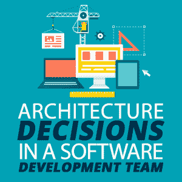

# 软件开发团队中的架构决策

> 原文：<https://simpleprogrammer.com/software-architecture-decisions/>

Every type of work needs some structure for things to go smoothly. In software development projects, an important part of this structure is the architecture of the software we’re building.

架构描述了我们软件的构建模块以及它们如何相互协作。如果每个团队成员都按照他或她认为最好的方式来构建模块，这可能行得通，但是这将导致在整个代码库中使用不同的风格和概念。这很可能会很快导致不可维护的代码。

相反，如果我们有一套达成一致的架构规则，那么构建模块将会被组合在一起，并且更容易扩展、测试和维护。

在我作为一个开发团队的高级成员/架构师的经历中，我发现有必要从一开始就定义一套架构规则(是的，即使是在做 Scrum 的时候)，然后进入一种与团队一起持续决策的模式。

这样，就不会有成为象牙塔建筑师的危险，他为团队决定一切(T2)，但不被团队尊重(T4)。你希望团队参与到重要的决策中，而不是感觉被抛在后面。

下面是我如何通过[承担责任](https://simpleprogrammer.com/working-on-a-team/)同时与团队一起工作*来推动我的项目中的架构决策。*

## 收集问题和想法

首先，我们需要一个收集架构问题和想法的地方。这通常是表格形式的结构化列表，包含以下几列:

*   提出问题的**日期**
*   提出问题的人的**姓名**
*   一个**关键字**，用一个词描述问题的背景，以便于索引
*   问题的**简短文本描述**，可能带有其他材料的链接
*   负责该问题的人员的**姓名(最初为空)**
*   一个**状态标志**，例如“打开”、“进行中”或“完成”

这个列表是架构问题的存储库，项目中的每个人都应该知道它。所有人都可以访问和编辑它。每个人都被邀请将他们关于架构的问题和想法添加到这个列表中。

通常，不是团队中的每个人都会对这个列表有所贡献。有些人满足于让别人讨论和做决定，这完全没问题。通常，这些是对自己的技能缺乏信心的初级开发人员，但是他们会成功的。

然而，总有一些开发人员会乐意抓住这个机会，提出如何把事情做得更好的想法，并指出他们在当前架构状态下的问题。这些想法和问题将会推动我们软件架构的发展。

作为一名高级开发人员或架构师，不要忘记为这个列表贡献自己的一份力量。毕竟，你想带来你的经验。

实际上，如果你是唯一参与其中的人，或者如果你自己在做一个项目，你甚至应该维护一个架构问题列表。如果清单只是在你的脑海中，很可能它会让你感觉像一个负担，因为你害怕你会忘记一些事情。或者你真的会忘记一些事情。你未来的自己会感谢你写下的一切。

## 建立实践社区

然而，仅仅收集问题和想法是不够的。我们需要讨论它们，并以结构化的方式根据它们做出决策。

作为高级开发人员/架构师，我们可以拿着清单，退回到象牙塔的顶层，并决定每个项目的行动方针。然而，像这样的自上而下的决策并不适合每个人(老实说，可能并不总是最好的决策)，所以我们应该尝试让团队参与进来。

我过去成功地建立了一个关于架构主题的实践社区(CoP)。术语“实践社区”经常在敏捷项目中被用来描述子团队，每个子团队在项目中驱动一个特定的主题，但是它[甚至可以追溯到敏捷成为流行词汇](https://www.amazon.com/Communities-Practice-Cognitive-Computational-Perspectives/dp/0521663636/ref=sr_1_1?ie=UTF8&qid=1534440713&sr=8-1&keywords=communities+of+practice)之前。

本文意义上的实践社区是一组对软件架构感兴趣并积极实践软件开发的团队成员。“积极实践”部分很重要，因为如果他们不开发软件，他们不会知道任何架构决策的后果。

Once every two weeks or so, I schedule a meeting for this community of practice. I have a look at the issues and ideas on the list. Usually, a day before the meeting, I talk to everyone who’s contributed issues, so I can gain a better understanding of the issues. Then I decide which topics should be part of the meeting agenda.

在会议前选择要讨论的问题*很重要。否则，会议很可能会降级为一个无效的 mob 优先级会议。*

会议是有时间限制的，通常不超过一个小时或一个半小时。此外，要讨论的每个项目都有时间限制，因此我们有一个明确的议程。

然后每个项目都在小组中讨论，如果一切顺利，就会做出对所有人都有利的决定。有些项目当场就解决了；其他人可能需要有人通过评估某事或与其他人交谈来跟进。在这种情况下，项目被分配给负责跟进的管理员。问题列表中的“管理员”和“状态”列会相应更新。

议程上的一个要点应该是审查所有目前“正在进行中”的项目，以便对其采取后续行动。

决定某事通常感觉很好。不管每个人是否支持这个决定，我们都在进步。

## 记录你的决定

这一进展必须记录在案。我们必须能够在一年后回来说，“啊，是的，这就是为什么我们要这样做。”

很少有事情像讨论某事时不得不说“我记得我们几个月前讨论过这个问题，但我不记得我们当时决定了什么”这样令人沮丧。

让我告诉你，这在我身上发生了很多。我的记忆长期不好(或者可能是长期选择性的)。

让我们把我们决策的文档称为“架构决策记录”(ADR)。自 2016 年被纳入 ThoughtWorks 的[技术雷达](https://www.thoughtworks.com/de/radar/techniques/lightweight-architecture-decision-records)以来，这个术语已经获得了一些关注。

实质上，ADR 是一个结构化的文档，它描述了我们做出决定的原因以及我们希望通过它实现的目标。例如，ADR 可能由以下属性组成(根据需要调整此列表):

*   便于参考的唯一编号
*   一个标题
*   决定
*   决定的理由
*   我们希望用它来实现的目标

ADR 应该尽可能地靠近代码库，这样它们就可以与代码保持同步，并且成为我们代码审查仪式的一部分。

有了保存完好的 ADR 列表，当我们知道我们已经讨论了某个话题时，我们可以很容易地回到过去，重新评估我们当时的决定。

也许过去决定的理由仍然成立。然而，有时这些理由不再有效，因为环境已经改变，或者我们想要通过决策实现的目标还没有达到。在这种情况下，我们可以决定用不同的方式做事。

能够参考 ADR 还使我们能够在缔约方大会上迅速阻止无效的讨论。只要指着一份 ADR 说“我们已经讨论过了”就能创造奇迹。

## 而没有共识的时候呢？

有时，我们在 CoP 会议上不断讨论架构问题，但我们无法就处理该问题的行动方案达成一致。

在这种情况下，我们仍然有几个选择。

我们可以把这个问题推迟到下次会议。这给了我们和车队的其他人一些时间去思考。通常，这足以给我们或我们的辩论伙伴一些启发，让他们知道如何处理这个问题。也许我们同时学到了一些新的东西，对我们有所帮助。

If the matter is urgent and needs to be decided quickly, **we can give in to our debating partner’s opinion and do it his or her way**. Even if we think this is not the best way to do things, it might be better to do *something* than to do nothing. Just be sure to document the decision in the ADRs so we can get back to it should it become necessary.

如果我们真的觉得我们的方式是正确的，如果我们不这样做，灾难就会降临，**我们可以用我们的经验**否决团队。显然，只有当我们在团队中受到足够的尊重时(或者我们的角色赋予了我们必要的权力)，这种方法才会奏效。即使这样，这可能会冒犯一些人，但有时[决定必须由架构师做出](https://simpleprogrammer.com/when-scrum-hurts-mob-achitecture/)。

如果我们作为一个团队在架构决策上达成共识是很好的，但是共识并不是作为一个团队成功合作的必要条件。如果我们互相尊重，同时在一些决策上立场坚定，在另一些决策上让步，我们仍然可以交付一个架构良好的软件。

## 交付优秀的架构

当您让团队成员参与制定架构决策的过程时，作为软件开发团队中的架构师或高级开发人员的生活会容易得多。团队成员会觉得他们的意见受到了尊重，并且您在团队中传播了架构知识，避免了您稍后必须清理的架构混乱。

收集问题，在实践社区中讨论它们，然后记录决策，这些步骤只需要很少的努力，所以实际上没有什么可以阻止你。

一旦这个工作流被整合到项目的日常生活中，它将会减轻你必须自己决定一切的负担，同时帮助团队成长并交付架构上合理的软件。

从今天开始。