# 2015 年软件开发者礼品(以及其他技术极客礼品)

> 原文:[https://simple programmer . com/software-developer-gifts-and-other-tech-geek-gifts-2015/](https://simpleprogrammer.com/software-developer-gifts-and-other-tech-geek-gifts-2015/)

## **更新:[点击这里查看最新的 2020 年软件开发者礼物清单](https://simpleprogrammer.com/gifts-for-programmers/)**

又到了一年中的这个时候，我为那些需要帮助来决定他们想向圣诞老人要什么的程序员和软件开发人员创建了一个新的圣诞清单。

众所周知，给软件开发人员或程序员买礼物很难，因为大多数女朋友、配偶、重要的人和家庭成员一般都不知道什么是好的程序员礼物。

这就是为什么我每年都会整理这个清单。

你可以为自己买一些礼物，或者与那个不断给你购买过时技术的特别的人分享——尽管他们是好意。

因此，没有进一步的延迟，这里是我的软件开发人员礼物，程序员礼物，软件工程师礼物…程序员礼物…无论你怎么称呼它们，都是 2015 年的礼物。

我试图今年只加入新的东西，或者至少是去年加入的任何东西的更新版本，但是去年的许多礼物仍然是相关的。

你可以在这里查看去年的礼物清单。

## [三星 950 PRO SSD](http://www.amazon.com/exec/obidos/ASIN/B01639694M/makithecompsi-20)

我要开始了。

我现在已经完全是笔记本电脑了，不再有台式电脑，但这个 SSD 驱动器正诱惑我建造一台 PC，这样我就可以把这些坏男孩中的一个放进去。

去年我推荐了三星 850 Pro，因为它的速度快得离谱，约为 500 MB/s，但这款产品的读取速度高达 2500 MB/s，写入速度高达 1500 MB/s。

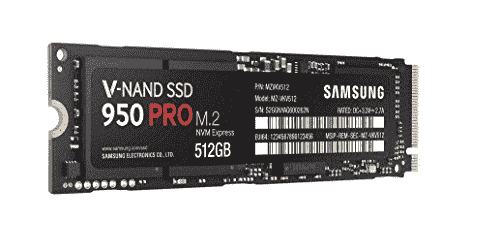

我甚至不敢相信那有多快。

另外，价格完全合理。

有一个:

*   [512 GB 版本](http://www.amazon.com/exec/obidos/ASIN/B01639694M/makithecompsi-20)(我推荐这个)
*   [256 GB 版本](http://www.amazon.com/exec/obidos/ASIN/B01639694M/makithecompsi-20)(还是真的不错)

没有比这更好的升级方式了。

哦，如果你的主板没有 M.2 功能，这里有一个适配器。

我很难过我不能买这个。

## [微软 Surface Book](http://www.amazon.com/exec/obidos/ASIN/B016C8779U/makithecompsi-20)

如果你了解我的历史，你就会知道我购买并退回了微软制造的几乎所有 Surface 产品。

我一直在寻找完美的 2 合 1 设备，既能充当平板电脑又能充当笔记本电脑，并且功能强大到足以做我想做的任何事情。

我很高兴地说，微软终于做到了。

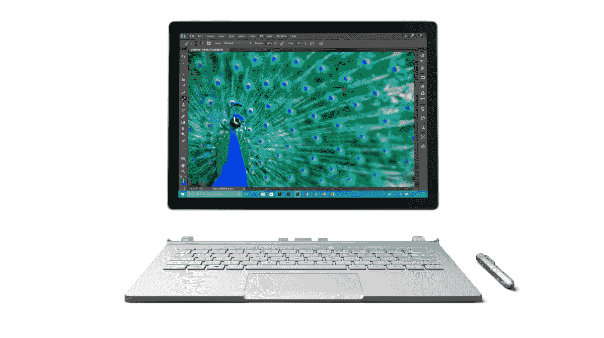

我非常喜欢 Surface Book。我认为这是一份非常棒的程序员礼物——尽管它可能相当昂贵。

我不打算在这里做一个完整的评论，但我自己在一个上面打这篇文章。

我推荐选择 i7-6600 u 16G 512g NVIDIA GeForce GPU 版本。我现在用的就是这个。

有点贵，但是我觉得为了升级还是值得的。

我认为不值得花大价钱去买 1TB 的硬盘，因为价格有很大的提升。

总之，这东西很棒。它有一个非常好的键盘，可笑的分辨率屏幕(3000×2000)，可拆卸的屏幕(充当平板电脑)，令人难以置信的电池寿命，触摸屏，附带笔，除此之外，它还是一个非常小而轻的设备。

哦，你还可以在升级版上玩游戏。

我玩[辐射 4](http://www.amazon.com/exec/obidos/ASIN/B016E70408/makithecompsi-20) 没有任何问题。

## [水面码头](http://www.amazon.com/exec/obidos/ASIN/B0163HP38W/makithecompsi-20)

如果你有一台 Surface 或一台 Surface Book，或者你正在购买一台 Surface Book，这种升级对我来说似乎是显而易见的。

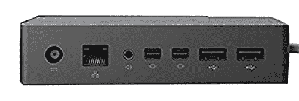

能够轻松连接外部键盘、鼠标、显示器和千兆以太网，真的让事情变得简单。

我真的很喜欢只有一根电缆连接电源和坞站的其他功能。

为了让 Surface 或 Surface Book 完全取代台式机，我认为这是必要的。

## [宏碁 Chromebook](http://www.amazon.com/exec/obidos/ASIN/B00MMLV7VQ/makithecompsi-20)

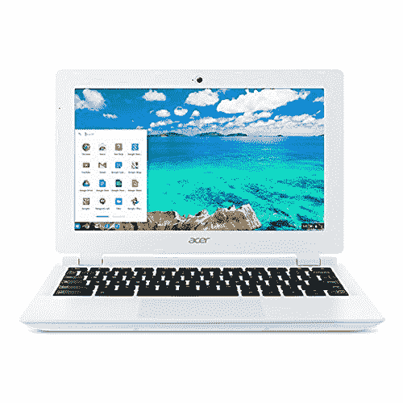

这似乎是一个奇怪的选择，但请听我说完。

据我所知，这种型号的价格不到 100 美元，还有许多类似的型号也在这个价格左右，所以拥有一台可以用来上网的小型便携式笔记本电脑是很有意义的。

许多程序员在云端拥有远程工作空间，可以通过网络浏览器完成大部分开发工作。因此，在我看来，Chromebook 可以成为一份优秀且廉价的程序员礼物。

## [树莓派](http://www.amazon.com/exec/obidos/ASIN/B00G1PNG54/makithecompsi-20)

树莓派已经存在了一段时间，但它似乎越来越棒了。

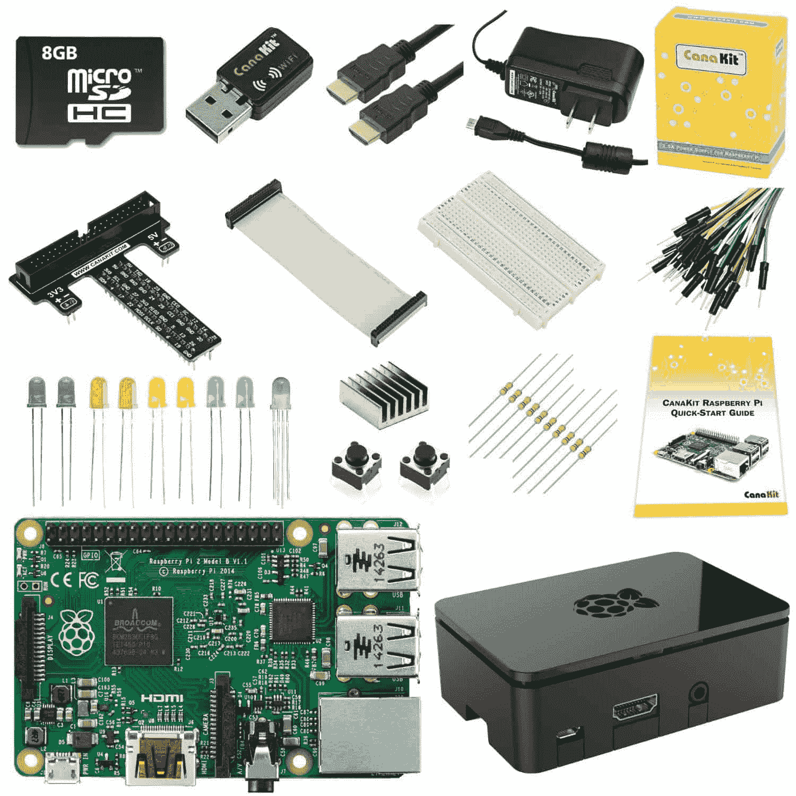

这是一个完整的迷你电脑，价格便宜得离谱，你可以得到一个很棒的套装[，就像这个](http://www.amazon.com/exec/obidos/ASIN/B00G1PNG54/makithecompsi-20)，它添加了各种很酷的东西来玩。

非常适合对儿童进行编程教学或制作自己的小型编程或物联网设备。

## [Arduino 入门套件(Arduino 官方套件，内含 170 页的 Arduino 项目手册)](http://www.amazon.com/exec/obidos/ASIN/B009UKZV0A/makithecompsi-20)

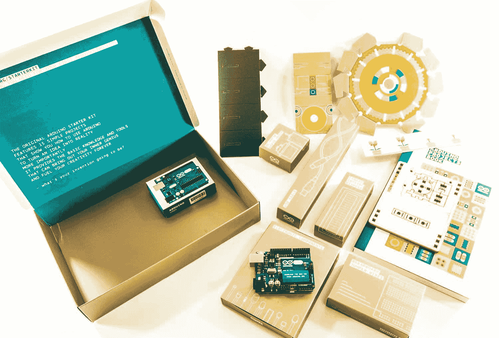

我一直是 Arduino 的忠实粉丝，但当我拿到我的时候，我不知道该怎么处理它。

所以，在我看到这个初学者工具包之前，我不打算把它放在这个列表中。

拥有一个捆绑了一本装满项目的书的漂亮工具包将这个设备从我觉得我应该做的事情变成我正在做的事情。

## [罗技 G710+机械游戏键盘](http://www.amazon.com/exec/obidos/ASIN/B009C98NPY/makithecompsi-20)

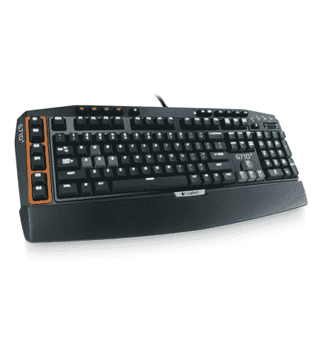

每个程序员都需要一个好的键盘。

我喜欢机械键盘，因为当你在上面打字时，感觉很好。

罗技是外围设备最好的公司之一，所以对我来说，这款键盘非常值得购买。

除了是一个神奇的机械键盘，它还有一堆非常酷的游戏功能，所以我完全被它迷住了。

## [预装 Windows 10 的英特尔盒装计算棒](http://www.amazon.com/exec/obidos/ASIN/B014N4CZE2/makithecompsi-20)

这有多牛逼？

一整台装有 Windows 10 的电脑。你只要把这个东西插到电视或显示器上，你就有了一台电脑。

哦，只要 100 多美元。哇哦。

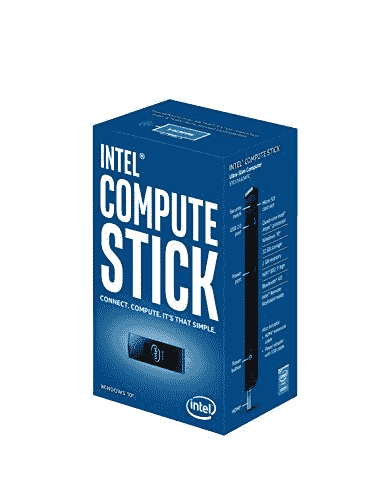

你可以用这个做很多很酷的事情。

在我看来，这是送给软件开发人员的最佳礼物。

## [HICTOP Prusa I3 3D 桌面打印机](http://www.amazon.com/exec/obidos/ASIN/B00N7I1ZVU/makithecompsi-20)

3D 打印机在前两年没有出现在我的清单上，因为技术不是很好，而且太贵了。

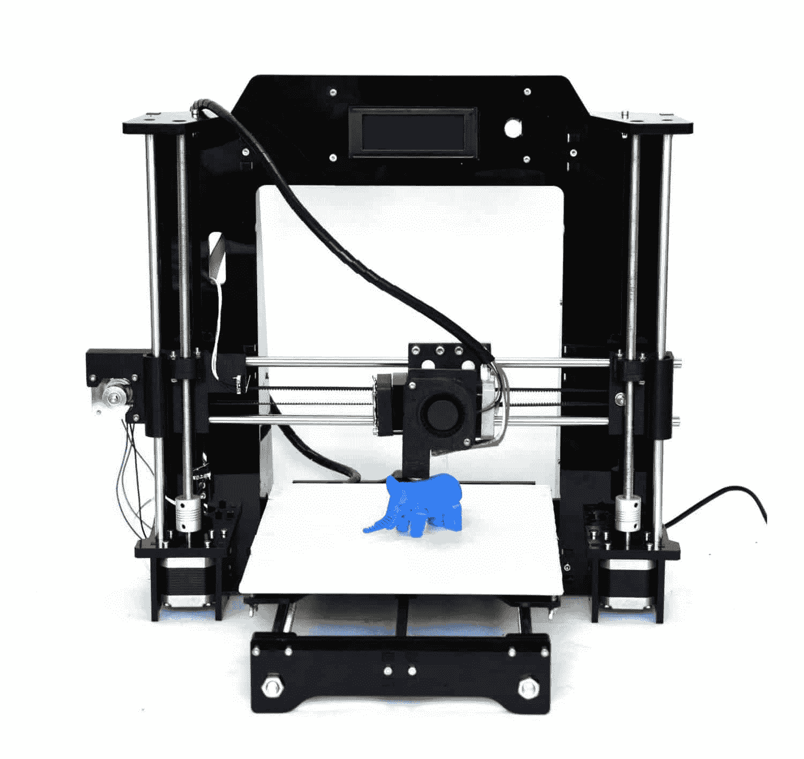

但是，终于有了许多 500 美元以下的打印机，我认为它们可以成为不错的程序员礼物。

## [宏碁曲面 34 英寸超宽 QHD (3440 x 1440)](http://www.amazon.com/exec/obidos/ASIN/B0111MRT90/makithecompsi-20)

我使用 Seiki 39" 4k 显示器已经有一段时间了。事实上，有一次我把其中两个连接到我的电脑上，但我开始认为曲面超宽显示器可能是程序员的最终选择。

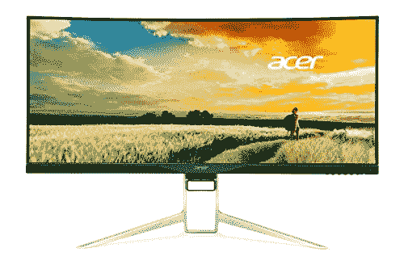

4k 显示器很棒，但我似乎从未充分利用空间，有时我会把椅子翻过来看显示器的一边。

我还没有为自己挑选一台超宽电脑，因为我要去旅行，但一旦我回来，我会订购一台[宏碁曲面 34 英寸超宽 QHD (3440 x 1440)](http://www.amazon.com/exec/obidos/ASIN/B0111MRT90/makithecompsi-20) 。

## [带可调恒温器的 Lasko 754200 陶瓷加热器](http://www.amazon.com/exec/obidos/ASIN/B000TKDQ5C/makithecompsi-20)

这有点不寻常，但我喜欢这个小巧的个人加热器。

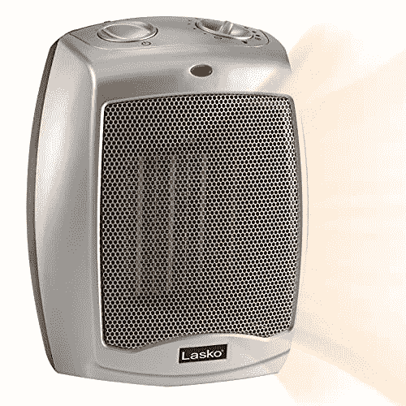

如果我在办公室里很冷，我可以插上这个，自己取暖，而不用弄乱整个房子或办公室的恒温器。

这是你办公室里最方便的东西之一，尤其是在冬天。

## [NETGEAR Nighthawk X8–AC 5300 三频四流 Wi-Fi 路由器](http://www.amazon.com/exec/obidos/ASIN/B015PD3HOC/makithecompsi-20)

耐心等待我现有的路由器坏了，这样我就可以买这个了。

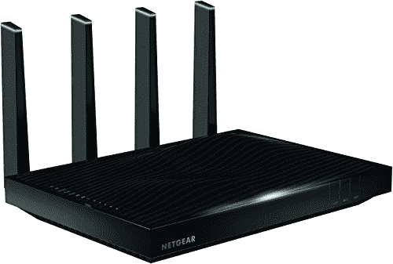

路由器一般吸。无线技术从来没有像广告宣传的那样有效。范围从来都不好。最后，有人创造了一个实际上很好的路由器。

只需查看亚马逊上的[评论。这是真正的交易。](http://www.amazon.com/exec/obidos/ASIN/B015PD3HOC/makithecompsi-20)

## [苹果手表](http://www.amazon.com/exec/obidos/ASIN/B00WUKULAC/makithecompsi-20)(或[安卓手表](http://www.amazon.com/exec/obidos/ASIN/B00NC8PMUK/makithecompsi-20))

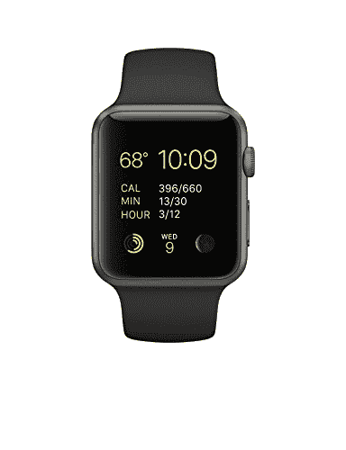

自从我的 Apple Watch 问世以来，我就一直拥有它，虽然我对它有些抱怨和问题，但我总的来说觉得它非常有用。
 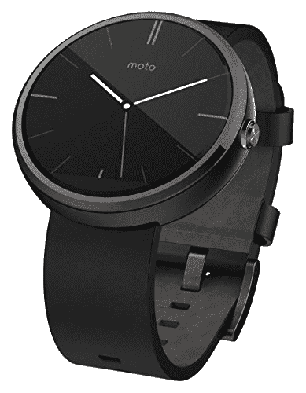 
我可以非常轻松地获取信息，在健身房设定时间，查看我的日历，检查我的步数和健身目标，并获得所有其他类型的有用通知。

我认为智能手表，无论是苹果还是安卓，都是不错的程序员礼物。

你可以在这里找到我对苹果手表的完整评论。

## [Fitbit 充电 HR](http://www.amazon.com/exec/obidos/ASIN/B00N2BW2PK/makithecompsi-20)

谈到健身追踪器，我有很多意见，我仍然没有找到最完美的一个，但 [Fitbit Charge HR](http://www.amazon.com/exec/obidos/ASIN/B00N2BW2PK/makithecompsi-20) 已经非常接近了。

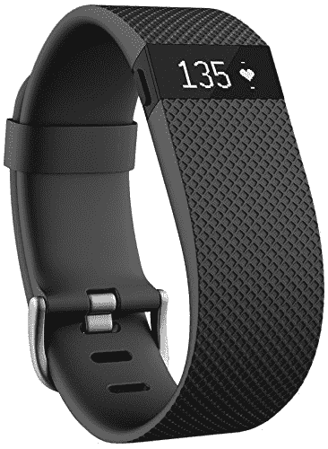

我喜欢这个追踪器，因为它的电池续航时间足够长，每天晚上或早上洗澡的时候都可以给它充电，如果你忘记了，几乎可以持续一整周。

我还喜欢它自动跟踪睡眠和心率。Fitbit 似乎也有最好的网络用户界面，而且 Fitbit 移动应用程序也非常棒。

## [2 合 1 免缠绕 Lightning 和 Micro USB 尼龙编织充电/同步线缆](http://www.amazon.com/exec/obidos/ASIN/B016B0SW84/makithecompsi-20)

我绝对喜欢这些电缆。

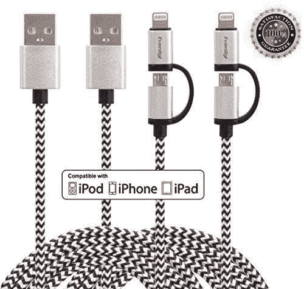

再加上这些东西长度刚好，超级耐用。

我没有打包一堆不同的电缆，而是随身携带这些电缆。

适用于我的 iOS 设备和其他设备，这种设计比有两个或更多独立连接器的分离式电缆好得多。

## [神奇工场 Dash & Dot 机器人神奇包](http://www.amazon.com/exec/obidos/ASIN/B00QKFFN3I/makithecompsi-20)

我四岁的孩子正在学习用机器人编程。

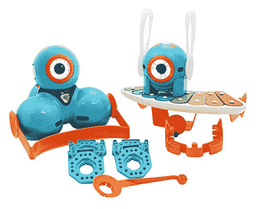

真是太牛逼了。

这些机器人和它们附带的软件给我留下了深刻的印象。

你用来给机器人编程的 iPad 应用程序在引入更复杂的编程主题时，难度和挑战不断增加，而且它以一种非常有趣的方式做到了这一点。

对于有兴趣教他们的孩子编程并从中获得乐趣的软件开发人员爸爸或妈妈来说，这是一个很好的程序员礼物。

## [COO cheer Zero Explorer Xplorer FPV 5.8G 无人机遥控四轴飞行器无人机](http://www.amazon.com/exec/obidos/ASIN/B016QCKH12/makithecompsi-20)

今年我不得不增加一架四轴飞行器，因为它们太受欢迎了。

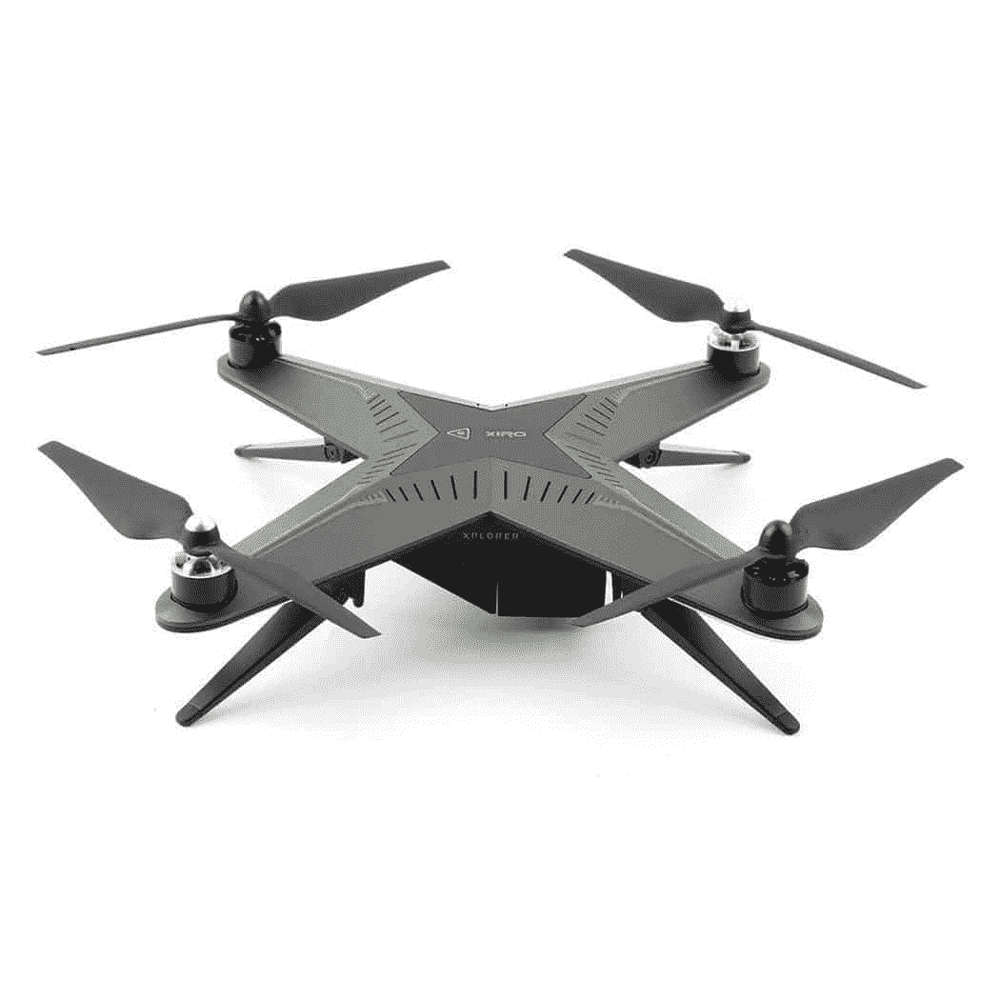

我决定买这款，因为价格不算离谱，而且评价极高。

但是，几乎任何高质量的四轴飞行器都会成为优秀的程序员礼物。

## [硬币 2.0](http://www.amazon.com/exec/obidos/ASIN/B010TFFRXU/makithecompsi-20)

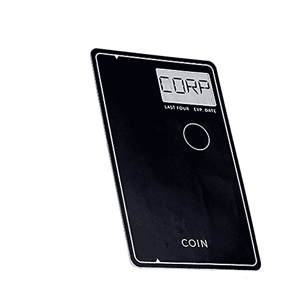

我有点极简主义，所以我讨厌带着一堆不同的信用卡和借记卡。

硬币 2.0 将你所有的卡整合成一张卡，你可以像普通的信用卡或借记卡一样使用。

它甚至可以使用 Tap 来支付，这太棒了。

## [亚马逊回声](http://www.amazon.com/exec/obidos/ASIN/B00X4WHP5E/makithecompsi-20)

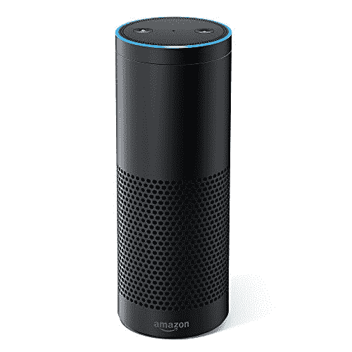

一开始我对这个设备持怀疑态度，但我家里的人都很喜欢。

能够设置定时器、播放音乐、列购物清单，非常方便。

它也有一个 API，可以扩展来构建定制的应用程序，所以这是一个伟大的程序员礼物。

## [Pluralsight 订阅](https://simpleprogrammer.com/pluralsight)

尽管我有点偏见，因为我是一个 Pluralsight 作者，我仍然认为 Pluralsight 订阅是最好的软件开发人员礼物之一，因为它太有价值了。

现在 Pluralsight 上有如此多的课程，每个开发者都应该订阅。真的。

##   [我的东西](https://simpleprogrammer.com/products)

让我们不要忘记一些来自简单程序员的礼物。

[查看我的产品页面](https://simpleprogrammer.com/products)找到我的课程、书籍和其他产品——所有这些都是给软件开发人员或其他技术专业人员的一份伟大而独特的礼物。

我的“[软技能:软件开发人员手册](https://simpleprogrammer.com/softskills)”这本书是今年非常受欢迎的软件开发人员礼物。

## 我漏掉了什么吗？

这是我今年的清单。我今年早些时候试着把它贴出来，所以你实际上有时间得到一些作为礼物的东西。

如果我错过了什么好的东西，我可能会更新这个列表，所以一两周后再来看看。

还有，你有什么东西是我一定要列入这个清单的吗？

而且，如果你想在我更新这个列表时得到通知，或者有任何其他给程序员的节日礼物建议，[加入简单的程序员社区](https://simpleprogrammer.com/email)，你将每周收到我的帖子和其他有用提示的电子邮件。