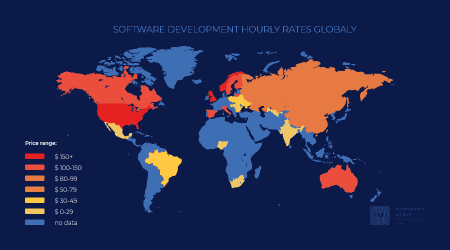
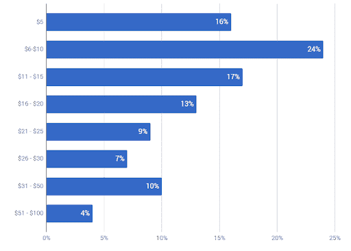

# 软件开发人员时薪:做自由职业者好还是做公司职员好？

> 原文：<https://simpleprogrammer.com/software-developer-hourly-rates/>

你知道软件开发人员的时薪是多少吗？

决定软件开发人员小时工资的因素有很多:经验、技能水平、可靠性等等。，甚至是开发者工作的企业类型。

无论你是想成为一名软件工程师自由职业者，找到一份更好的工作，还是需要雇佣一名开发人员，了解这些因素都很重要，因为它们是开发人员小时工资的基础。

## 开发者的时薪是由什么决定的？

软件开发人员的比率受许多不同因素的影响，从他们的地理位置到他们的经验和客户反馈。公司在决定雇佣谁的时候会考虑这些因素，自由职业者在确定工资的时候也会考虑这些因素。

### 地理位置

下图显示了不同国家之间的比率差异。

开发者小时费率世界地图

据 Eastern Peak 公司称，来自波兰、乌克兰或南非等离岸国家的开发人员的时薪最低。接下来是近岸的南美，最昂贵的开发商来自美国。

### 业务类型

开发人员是自由职业者还是雇员会影响他们的时薪。自由职业者必须支付所有自己的费用和开销，比如设备、办公费用和保险。公司支付诸如健康保险和带薪休假等费用。因此，公司的时薪比自由职业者高是很自然的。

说起公司，可以分为几种:

*   **企业级公司([微软](http://www.amazon.com/exec/obidos/ASIN/1559580712/makithecompsi-20)，戴尔，赛门铁克)**——这些都是拥有几百到几千名开发人员的大公司，更不用说其他员工了。工资通常是市场上最高的。这些是每个开发人员的“梦想工作”，尤其是在他们职业生涯的开始阶段。

*   企业级公司(Rightpoint，willow tree)——这些公司规模较小，通常只有 100 到 1000 名员工。根据来自[离合器](https://clutch.co/)的数据，他们的时薪也更低——从 150 美元到 300 美元。他们项目的起拍价通常在 12.5 万美元左右，但也可能高达 500 万美元。

*   中端市场公司(软件公司，thoughtbot)——这些公司通常不超过 100 名员工。像大多数中端市场企业一样，他们在价格和质量之间提供了极好的平衡，因此他们的员工通常平均每小时挣 50 美元。他们可以与中小型企业或项目合作，也可以与大型企业合作。

*   小市场公司(Urban Insight，Unleashed Technologies)–这类公司最多有 50 名员工，一年只有几个项目可以维持运营。通常，他们专注于一个功能性任务:移动应用程序或 [UI / UX 设计](http://www.amazon.com/exec/obidos/ASIN/1687284105/makithecompsi-20)，或一种特定的编程语言。通常，这类公司与小企业或当地公司合作。
*   **离岸和近岸公司**–离岸(中欧和东欧)公司的时薪最低:25 至 50 美元。近岸公司稍微贵一点，每小时 40 美元到 75 美元不等。与[这些公司](https://massmediagroup.pro/blog-mmg/top-5-countries-for-offshore-software-development)合作有其风险，但对于新的开发者来说，它们可能是建立投资组合的好方法。时区差异或语言障碍会使这些公司更难合作，但大多数离岸公司会努力组织工作流程，以便客户和员工更容易跟踪。

### 开发经验

自由软件开发者如何确定他们服务的费用？基本上，有两种类型的自由职业者:原始的和硬皮的。

玩笑归玩笑，两种主要的自由职业者是:

1.  **最近刚完成学业准备自测的新人**
2.  厌倦了朝九晚五工作的专业人士

对于新手来说，最好不要要求很高的时薪，因为这会吓跑你的客户。大多数情况下，对于新的自由职业者来说，允许客户为他们的项目定价是个好主意。新开发人员很兴奋，很受鼓舞，想尽快开始工作，但他们没有潜在雇主或客户可以用来判断他们过去工作的跟踪记录。

因为初学者仍在学习，客户不会愿意花大价钱以防开发人员出错或不能按时交付。这在任何领域都是一样的——你必须先投入时间，然后才能开始赚更多的钱。因此，[新手](https://periodix.net/blog/which-developers-earn-more-corporate-vs-freelance/)的时薪通常不会超过 15-25 美元。

一个专业的软件开发自由职业者已经在 IT 世界生活了足够长的时间，知道该依靠什么。他们不会对新项目太感兴趣，但可能会根据他们的经验和对不止一种编程语言的可能了解，要求更高的时薪。他们可以表现得像一个著名的侦探，只接那些看起来有趣的项目。他们在美国和西欧的时薪从 45 美元到 100 美元不等。

Payoneer 从所有开发项目领域收集了 2020 年自由职业者的时薪数据，不同 IT 解决方案的[费率](https://clockify.me/average-hourly-rates)起价为 20 美元。此外，它统计了每一个自由职业者，从初学者到专业人士。

软件开发平均时薪

## 客户更喜欢自由职业者还是开发公司？

我们看了不同类型的公司和自由职业者，所以也许是时候看看与其中一个合作给客户带来的好处了。

### 雇佣自由职业者的好处

当与自由职业者一起工作时，他们对客户的主要优势是，由于竞争，自由职业者想要项目多于客户想要他们的工作。让我们仔细看看其他参数:

*   **价格**——正如我之前提到的，雇佣一个自由职业者来做这项工作比将项目转移到大多数公司(除了离岸公司)要便宜。平均而言，自由职业者的时薪约为 60 美元。当很多客户没有足够的钱雇佣全职员工时，他们会转向自由职业者。
*   **速度和灵活性**——自由职业者不受周一至周五 Fri 时间表的束缚；他们一天可以工作多于(或少于)八小时。自由职业者比办公室职员拥有更多的 T2 自由——他们可以选择自己的项目，想干多久就干多久。由于自由职业者可以根据自己的速度设定工作时间并获得报酬，因此项目可以更快地完成。
*   自我教育——自由职业是一门生意。为了吸引顾客的注意，自由职业者必须[不断地自我教育，尽一切可能在竞争中脱颖而出。因此，大多数自由职业者都在不断进化，从而改进他们正在从事的项目。](https://simpleprogrammer.com/web-developers-more-money/)
*   许多选择–仅在美国，就有将近 5800 万开发人员喜欢自由职业。客户可以根据他们的经验和小时费率选择开发人员。

和自由职业者一起工作有缺点，而且永远都会有缺点。他们不会给你一个代码保证，而且总有风险，自由职业者在项目完成后无法对其进行修改。

### 雇佣公司的好处

现在你知道和自由职业者一起工作的好处了。但是在一家公司工作有什么好处呢？

*   **可靠性和支持**——很多公司都有 IT 咨询，有的甚至对代码提供担保，从而确认其质量。此外，开发公司管理项目，使客户较少担心。客户从中获得更多，因此账单也会更大。
*   **控制**–是的，客户受到每天八小时工作制的约束，但同时，他们能够通过在每个阶段进行检查以及亲自拜访或联系开发人员来控制项目的工作。此外，客户有一个保证，开发商不会在项目中途消失。开发公司试图与客户保持持续的沟通，一些离岸公司如[大众传媒集团](https://massmediagroup.pro/blog-mmg)在办公室发布信息流，以表明物理边界对他们来说不是障碍。
*   **透明定价**–公司提供他们服务的总价格，并有一个逐步的行动计划，包括每个开发阶段分配的时间。客户知道他们的资金将花在什么地方，他们将得到什么样的功能。因此，超出预期支出的风险微乎其微。自由职业者通常无法提供这样的保证；这就是为什么他们有更便宜的价格。
*   许多选择——尽管自由职业者也有同样的优势，但 IT 市场正在不断扩大。因此，客户可以选择他们喜欢的公司，并以他们想要的价格支付。如果当务之急是省钱，他们应该考虑离岸公司。

## 哪个是更好的选择？

Despite the fact that hourly rates are important, we all seek different things in our work.Therefore, there will never be a clear winner between companies and freelancers.

我们总是看到我们没有的东西的光明面；如果你是一名自由职业者，有时你会厌倦自己管理一切，如果你是一名全职员工，你可能会梦想更多的自由。

无论你是自由职业者还是雇员，你的结果都会受到你的经验和技能的影响，所以努力工作，让客户重视你的工作。

不管你优先考虑的是高时薪还是能够安静缓慢地工作，你的舒适才是最重要的。我希望您在这里学到的一切对您作为软件开发人员的旅程有用！