# 2021 程序员礼物指南

> 原文:[https://simple programmer . com/software-developer-tech-geek-Christmas-gifts/](https://simpleprogrammer.com/software-developer-tech-geek-christmas-gifts/)

欢迎来到我们的 2021 年程序员礼物指南！与我们的其他文章不同，这篇文章不仅仅是为我们简单的程序员准备的。

这是给他们的朋友、家人和爱人的，他们很难为生活中的科技爱好者选择完美的礼物。

有一个程序员，你必须为他找到完美的礼物？别担心，因为这是你的节日礼物指南！

我们已经搜索了科技列表，我们自己的年度最爱，以及 2021 年的必备节日礼物，并整理了一系列符合你的预算和礼物购买需求的选项，无论这些可能是什么。

这应该有助于将最后一分钟的假日购物热潮的压力降至最低！

在别人还没开始考虑之前，就把你的编程天赋打包好吧！

Quick Navigation[Books for Programmers](#tab-con-24)[Getting Into It (Under $25)](#t-1606144958284)[A Little More … ($25-$50)](#t-1606144958285)[Getting Spendy ($50-$100)](#t-1606144958286)[In the Zone ($100-$350)](#t-1606144958287)[Luxury Gifts ($350+)](#t-1606144958288)

## 程序员用书

* * *

[*《软技能:软件开发人员的生活手册》*](https://www.amazon.com/dp/B08N9KTYW6/makithecompsi-20) 是 John Sonmez 出版的第一本书，对于你生活中任何想学习如何与周围的世界更好地沟通、更体贴、更充实地生活的程序员来说，都是完美的选择。

[*完整的软件开发人员职业指南*](https://www.amazon.com/dp/B073X6GNJ1/makithecompsi-20) 是为那些希望在来年拓展职业生涯的程序员准备的。无论他们是在寻找一个大的改变，一份新的工作，还是只是试图改善他们目前的职位，这本书都有现实世界的建议来帮助他们做到这一点。

就在我们都开始远离社交，足不出户之前，我们出版了这本书， [*远程工作:在家工作*](https://www.amazon.com/dp/B08HJSLZZB/makithecompsi-20) *找份工作或开创一番事业。*我们希望我们没有预见到这一点，但该指南对任何想要远程工作的人都是相关的*，不管疫情是否规定他们应该这样做。*

*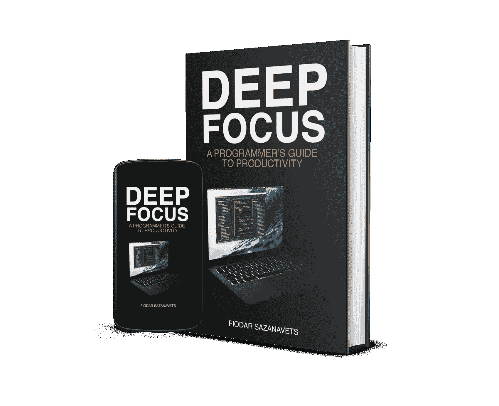*

*这是我们羽翼未丰的出版公司的“进展中”，但它肯定会成为任何在 2022 年寻求更深入关注的程序员的热门话题。*

*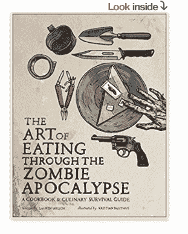*

*承认吧...你对此感到疑惑。尤其是在过去的 20 个月里。如果我们遭遇天启，你会吃什么，如何生存？僵尸或其他。*

**

*程序员身上发生的一件有趣的事情是——他们储存了大量的信息，以便随时使用。为什么不确保[一些知识是不寻常的](https://www.amazon.com/dp/1450845800/makithecompsi-20)。*

## *投入其中(不到 25 美元)*

* * *

*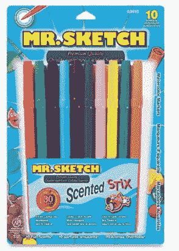*

*[**素描先生有香味的 Stix 马克笔**](https://www.amazon.com/dp/B0006HXGQ2/makithecompsi-20) **($8.22) -** 就当这是那些童年最爱的成人版吧。这里唯一的挑战是确保你工作时不要让墨水进入你的鼻子。*

*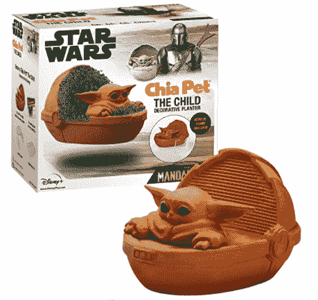*

*[**《星球大战》中的 Chia 宠物**](https://www.amazon.com/dp/B08DRBZB1K/makithecompsi-20)**【24.99 美元】**——对于你生活中也喜欢一点傻气的《星球大战》迷来说，这个曼达洛人的“Chia 宠物”将会给他们一些东西来培育和成长。搭配[丘巴卡](https://www.amazon.com/gp/product/B07YC6VV65/)(19.86 美元)，打造美丽的奇亚宠物对称。*

*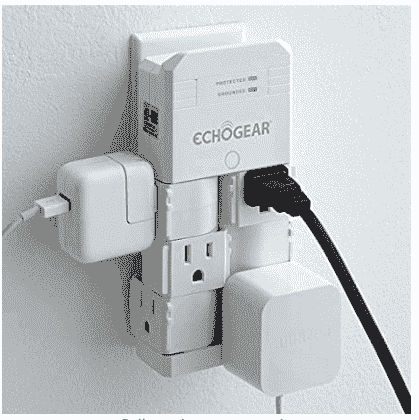*

*[**ECHOGEAR 墙上电涌保护器，带 6 个旋转交流插座**](https://www.amazon.com/dp/B08GLPRTYH/makithecompsi-20) **($19.99)** -这是一个墙上插座！这是电涌保护器！是变形金刚！该墙壁设备提供 6 个旋转交流插座，具有 1080j 电涌保护。不需要一个悬挂的浪涌带，不断被拔掉和踢来踢去。*

*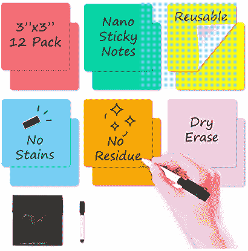*

*[**干擦便利贴**](https://www.amazon.com/gp/product/B08GLPRTYH/) **($16.99) -** Scrum 和看板工作流是从白板上的便利贴开始的，所以它们是开发领域的一个悠久传统。但是有了这些便利贴，你也可以尽自己的一份力量来帮助减少环境中的浪费。*

*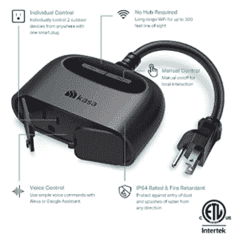*

*[**Kasa 户外智能插头**](https://www.amazon.com/dp/B091FXH2FR/makithecompsi-20)**($ 24.99)**——你听说过智能家居配件，但智能户外配件呢？对于那些想要完全语音和无线控制他们的城堡*和周围景观*的科技朋友来说。*

*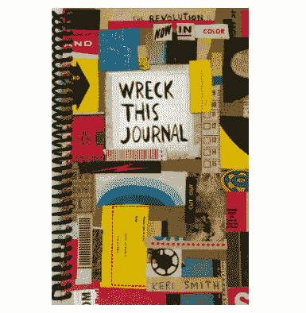*

*[**《沉船》杂志**](https://www.amazon.com/dp/1974804771/makithecompsi-20)**($ 16.99)**——我们有时都会对工作感到沮丧。现在想象一下，你的整个项目已经被破坏了好几天，仅仅是因为某个地方有一个错误的标签。你也会想要破坏一些东西！*

*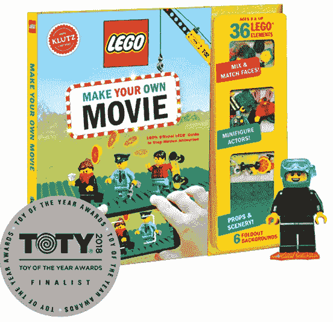*

*[**笨手笨脚的乐高制作自己的电影活动套件**](https://www.amazon.com/dp/1338137204/makithecompsi-20)**【24.99 美元】**——对于任何热爱乐高的人来说，这将这种热爱带到了一个全新的水平。停止行动，但几乎活着的水平。*

*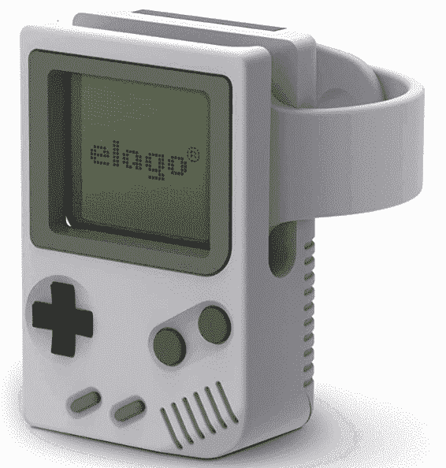*

*[**埃拉戈 W5 苹果手表架**](https://www.amazon.com/dp/B07KYK9THJ/makithecompsi-20)**【14.99 美元】**——任何超过 30 岁的人都可能会对这个看似玩笑，实则有用的小礼物开怀大笑。*

## *多一点… ($25-$50)*

* * *

*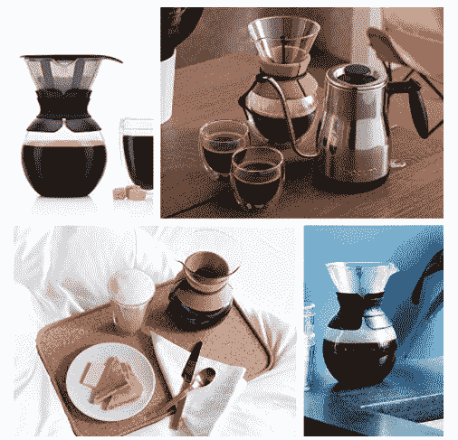*

*[**【Bodum 11571-109】倒咖啡器**](https://www.amazon.com/dp/B01JLY1HSE/makithecompsi-20)**【28 美元】**——适合渴望在咖啡馆喝点提神饮料，但已经习惯在家工作的咖啡鉴赏家。*

*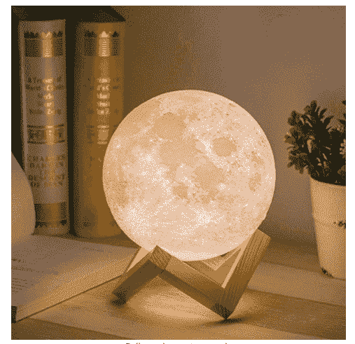*

*****($ 30)**——认识一个脑袋在星空里的程序员？这美丽的月光从太空直接给他们的工作空间带来一点惊奇。***

******

***[**BIRDROCK HOME 竹制笔记本电脑托盘**](https://www.amazon.com/dp/B08Y6354ZQ/makithecompsi-20)**($ 40.96)**——有时候我们需要站起来，从办公桌旁走开...但是我们仍然需要完成任务。这款下一级笔记本电脑托盘可以将您的工作放在沙发上，甚至床上。***

***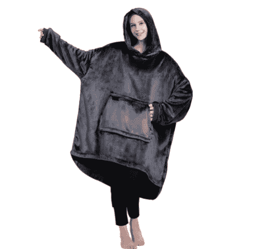***

***[**沃法拉毛毯帽衫**](https://www.amazon.com/gp/product/B0992619FD/)**【29.89 美元】**——好吧，不少于六个人告诉过我这个玩意儿有多神奇。像毯子一样又大又暖和，但不知何故变成了一件巨大的连帽衫，将你包裹在一个舒适的拥抱中。***

***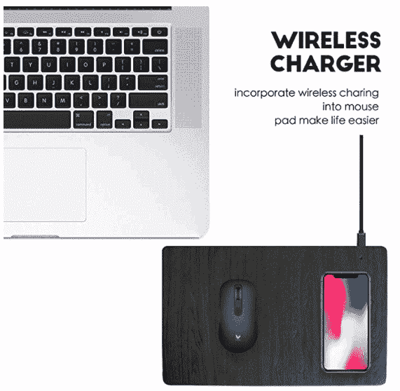***

***[**无线充电器鼠标垫**](https://www.amazon.com/dp/B07QF4KD6H/makithecompsi-20)**【23.99 美元】** -在桌面空间和我们设备中 USB 端口的宝贵争夺之间，这款鼠标垫还可以为你的手机和平板设备充电，具有双重功能！***

***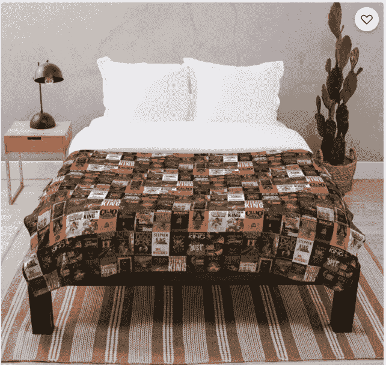***

***[**斯蒂芬·金图书封面拼贴画扔毯**](https://www.redbubble.com/i/throw-blanket/Stephen-King-Book-Cover-Collage-by-saminicosia/39594733.16D0B)**【43.88 美元】**——虽然我每晚睡在库乔和凯莉下面都会做噩梦，但一个真正的国王迷会发现他们的幸福之梦被最爱包围。***

***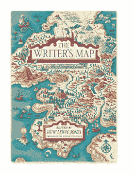***

***[**作家的地图:虚构之地地图集**](https://www.amazon.com/dp/022659663X/makithecompsi-20) **($30.50)** -有没有读过 ***权力的游戏*** 或者*指环王*并试图跟随旅程？这本地图集汇集了一些最伟大的虚构之地的地图。***

***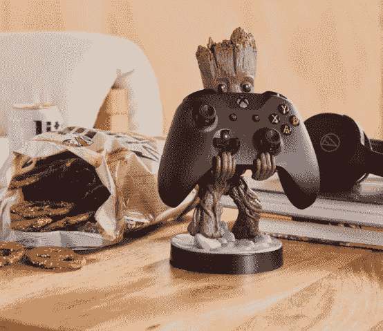***

***[**【索家伙学步】格鲁特器座**](https://www.urbanoutfitters.com/shop/cable-guys-toddler-groot-device-holder)**($ 25.95)**——这个。是。格鲁特。当你吃零食或需要离开几分钟时，他会帮你拿着游戏设备。那只是一种...树？植物？外星人？他是。***

***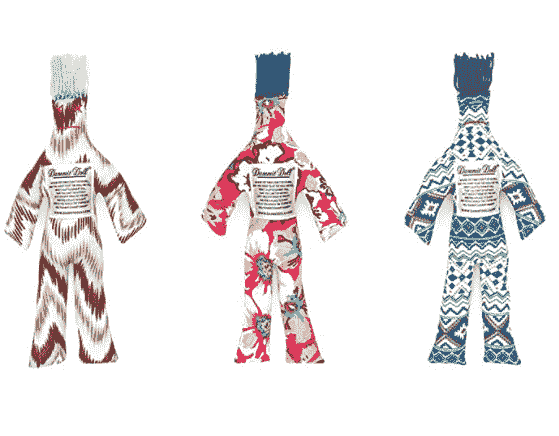***

***[**该死的娃娃**](https://www.amazon.com/dp/B00G05DYTI/makithecompsi-20)**【47.29 美元】**——我并不是说程序员有很多被压抑的挫败感和愤怒。我是说，连续几个小时盯着一行行的符号和字符会让任何人大喊“该死的”，然后把一个洋娃娃扔向墙壁。***

***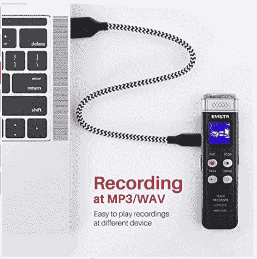***

***[...但是不知道在哪里记下来。为什么不保存你的想法？](https://www.amazon.com/dp/B07CPNR79C/makithecompsi-20)***

***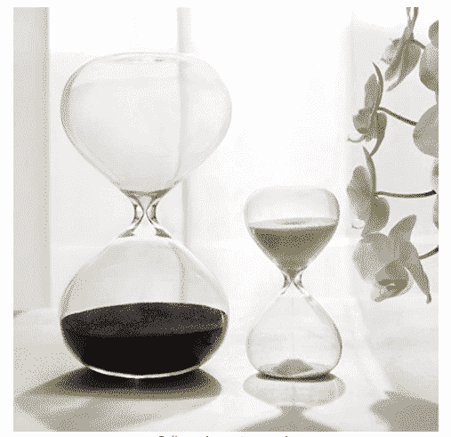***

***[**30 & 5 分钟重力沙漏**](https://www.amazon.com/dp/B00ULZSAFQ/makithecompsi-20)**【49.92 美元】**——这算不上什么番茄沙司，但想想这额外的 5 分钟你会做多少额外的工作吧。这无疑是一种更平静的跟踪工作流程的方式，而不是尖叫的警报蜂鸣器。***

***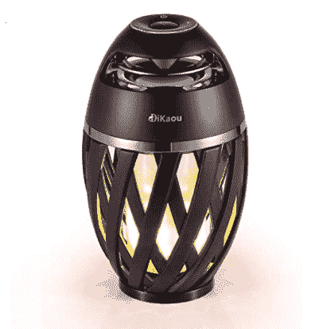***

***[**【迪卡欧】LED 火焰音箱**](https://www.amazon.com/dp/B07459G6P3/makithecompsi-20)**($ 39.99)**——就看这个东西！这是一个支持无线&蓝牙的设备，一个具有火焰般视觉效果的 led 灯，一个具有 5W 立体声的强大扬声器。非常适合红木和威士忌的工作空间。***

## ***挥霍无度(50-100 美元)***

* * *

******

***[**【le niver】LED 螺旋台灯**](https://www.amazon.com/dp/B087CPS3Y6/makithecompsi-20)**($ 56.99)**——这款灯看起来肯定很飘渺。光在一个空的空气柱周围卷曲，不知何故在空间内和灯的周围反弹。此外，它有 3 种色调，可调光，符合完美的人体工程学。***

***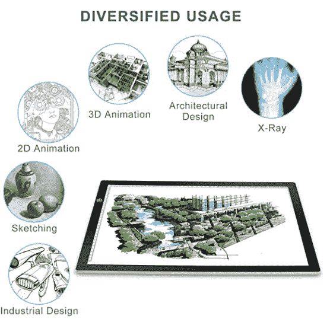***

***[**LITENERGY A2 描摹 LED 抄板灯箱**](https://www.amazon.com/dp/B099NM2WGD/makithecompsi-20?th=1)**【64.98 美元】-** 无论你生活中的程序员是想重现场景还是勾画工业设计，这个灯箱都会帮助他们从既定的作品中描摹出各种组件。***

***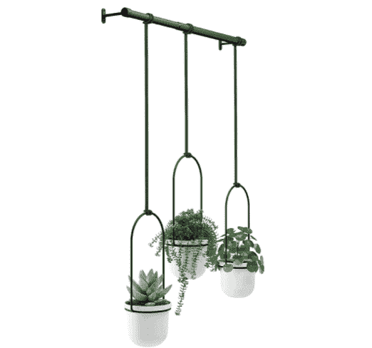***

*******【55 美元】**【本影三花】悬挂式窗户花盆——当我们进入北半球的冬季时，一些人可能不会像以前那样经常出去走走。那么，为什么不给他们带来一些自然的东西呢？*****

**********

*******【51.98 美元】** -难道你不想让你自己或你爱的人坐在办公椅上看起来如此快乐和放松吗？这个座垫不仅提供振动按摩，还提供加热区。*****

*****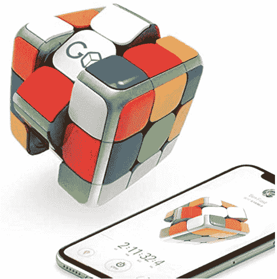*****

*****[**【go Cube】联网的电子蓝牙魔方**](https://www.amazon.com/dp/B07W7TGWDR/makithecompsi-20)**【99.95 美元】**——对于许多开发者来说，魔方是许多童年玩具中的第一个，让他们好奇图案是如何组合在一起的。这个立方体绝不是童年玩具！*****

*****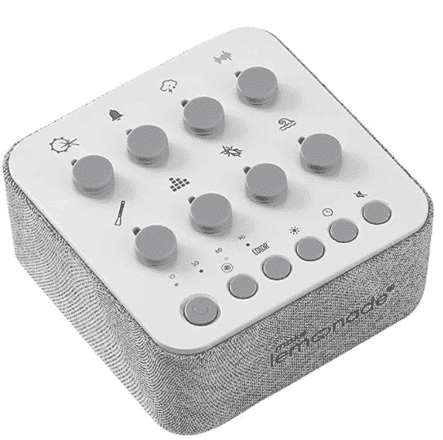*****

*****[**制作柠檬水模拟 Zen Mixer Sound Machine**](https://www.amazon.com/dp/B08XC7GP5D/makithecompsi-20)**($ 59.99)**——起初我以为这是一个通用的混音板，但在我看到它出现在几个“必备”列表上后，我爱上了它。想象一下，从各种经过验证的音调和声音中混合出自己的禅音机。极乐世界。*****

*****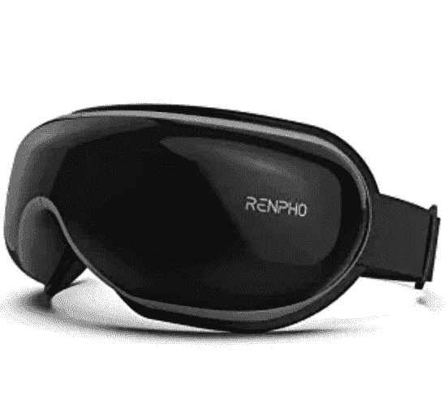*****

*****[**【RENPHO】带热量的眼部按摩器&蓝牙**](https://www.amazon.com/dp/B088BCRXHJ/makithecompsi-20)**【79.99 美元】**——一个程序员连续几个小时盯着屏幕？这些对你的眼睛和头部肌肉这一重要资源造成了损害。这款眼罩具有加热和按摩功能，让您高枕无忧。*****

*****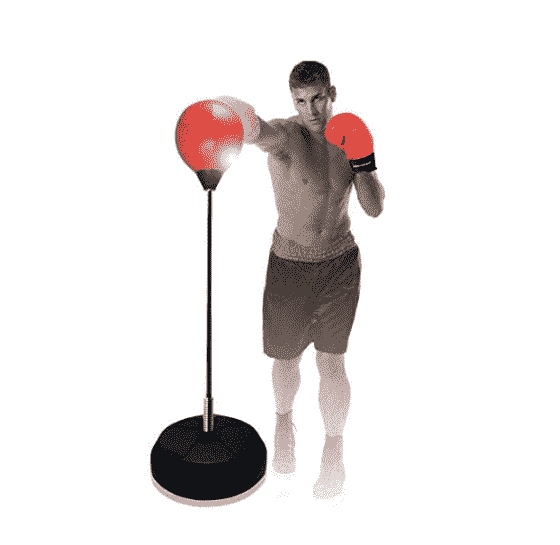*****

*********【61.24 美元】**——这里有很多选项可以从外部验证那些沮丧和焦虑的感觉。但是这些对于一个完全被放错地方的<扔出的飞行器来说是真实的。在这个出气筒上打几个回合就能把它取出来，回到它上面来。*******

*****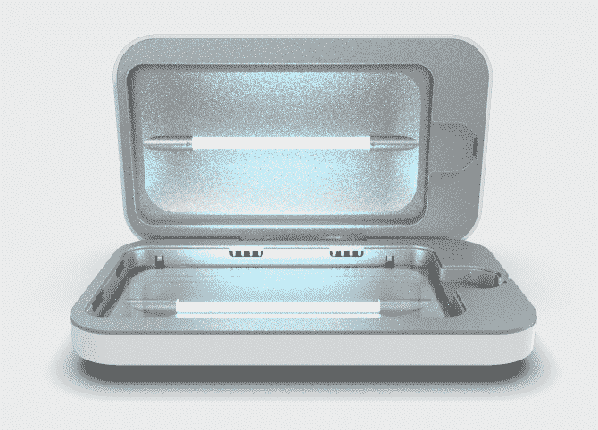*****

*****[**【phone soap 3**](https://www.phonesoap.com/products/phonesoap-3-phone-uv-sanitizer/)**【79.99 美元】**——你知道我们的手机是我们生活中最脏的表面吗？无论是留在其他表面上还是在我们抓门把手后使用，只需清洁您的手机！*****

*****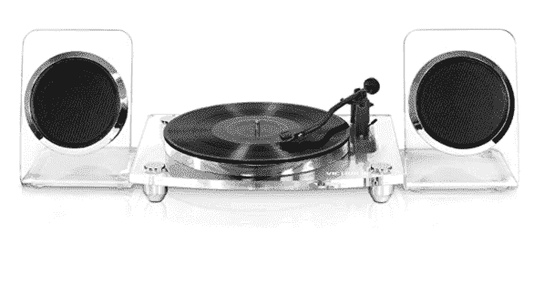*****

*****[**Victrola Modern Acrylic 2 速蓝牙转盘**](https://www.amazon.com/dp/B072ZFQHGL/makithecompsi-20)**【82.46 美元】**——如果你生活中的程序员像喜欢代码一样喜欢技术的某些工程和 how-to，那么就给他们一个超级酷的观点的音乐礼物吧。*****

*****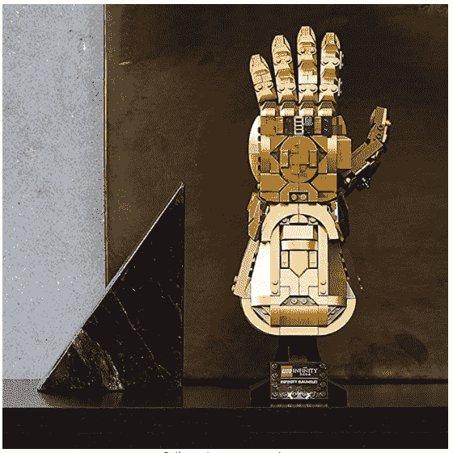*****

*****[**【乐高漫威无限挑战】**](https://www.amazon.com/dp/B08YP94QJN/makithecompsi-20)**($ 69.99)**——你能挺过这次抢购吗？你会努力扭转它吗？每当你在书桌或壁炉架上看到这件珍藏品时，你会发出一声小小的尖叫吗？是的。对所有的都是。*****

*****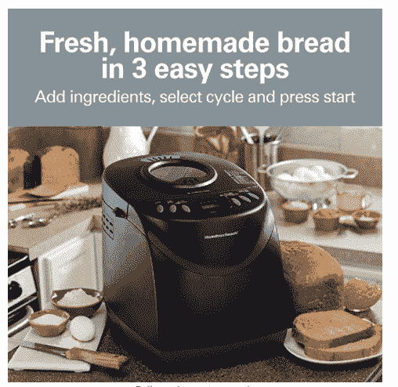*****

*********【汉密尔顿海滩面包机】(84.99 美元)**——我们可能还在研究我们完美的酸面团发酵剂，也可能还没有，但如今有更多的面粉可用——为什么不保持自制面包的习惯呢？*******

## *****在该区域(100 美元至 350 美元)*****

* * *

**********

*****[**强大的 Vibe Spotify 和亚马逊音乐播放器**](https://www.amazon.com/dp/B07KJY8QMK/makithecompsi-20?th=1)**【109.99 美元】**——Spotify 和亚马逊这样的流媒体音乐巨头的少数缺点之一是必须通过你的电脑或手机的声音系统来听。这款无线扬声器以水晶般清晰的音调播放歌曲和节目。*****

*****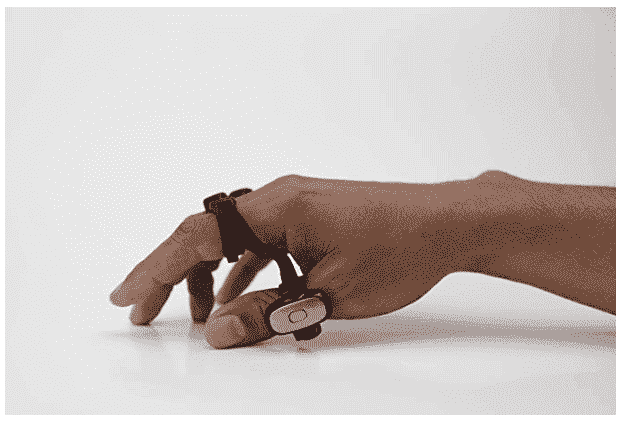*****

*****[**【Tap Strap 2】可穿戴键盘、鼠标&空中手势控制器**](https://www.amazon.com/dp/B07YCWNK3H/makithecompsi-20)**($ 199.99)**——我们还没有完全进入天网(Skynet)，但可穿戴技术正在不断接近它。就像这个 Tap Strap，它可以复制键盘、鼠标和手势，而不需要任何一个设备。*****

*****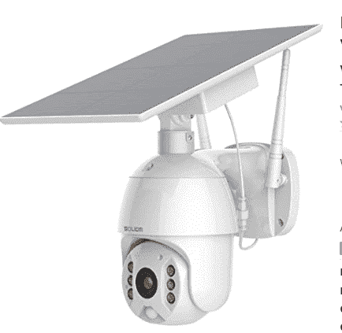*****

*********【199.99 美元】**——如果你有能力连接技术，为什么不利用这种能力连接技术呢？尤其是如果你能保护你的家和家人？*******

*****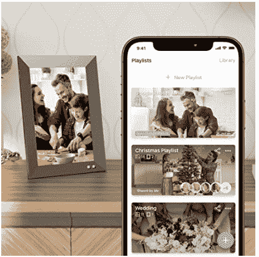*****

*****[**Nixplay 10.1 英寸智能数码相框**](https://www.amazon.com/dp/B07V42JLFH/makithecompsi-20)**【189.99 美元】**——不仅仅是一个简单的数码相框，它可以滚动相同的 10 张度假照片，这一个可以存储多个相册——并通过电子邮件导入。*****

*****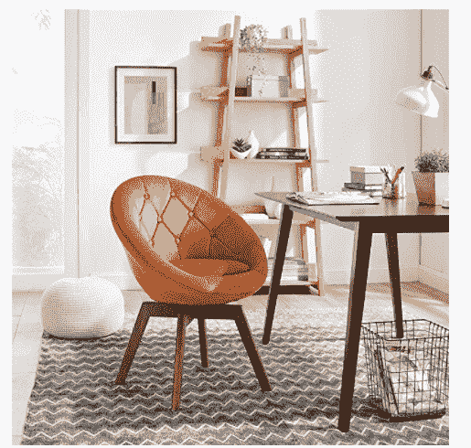*****

*****[**沃蓝斯中世纪现代转体口音椅**](https://www.amazon.com/dp/B082XXPF69/makithecompsi-20)**【169.99 美元】**——也许你知道有人在科技与编码和广告狂人与装饰之间摇摆不定。如果你有，那么这可能是他们的新办公椅。*****

*****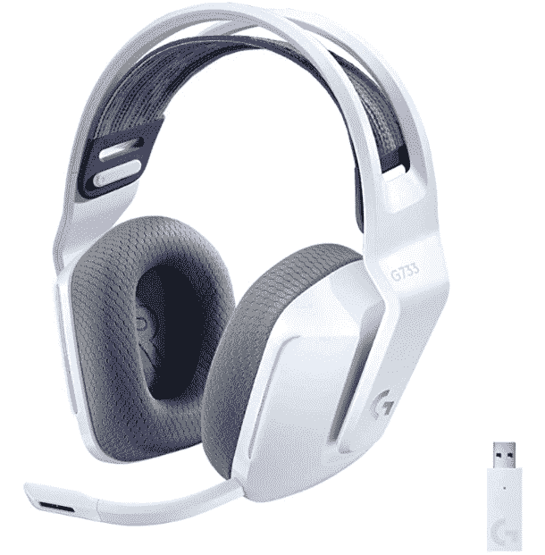*****

*****[**罗技 G733 光速无线游戏耳机**](https://www.amazon.com/dp/B08141GQQG/makithecompsi-20)**【159.99 美元】**——随着每一款新游戏的发布，游戏变得越来越沉浸式。这款耳机拥有梦幻般的环绕声，重量不到 300 克，集成了罗技的 G HUB 灯光软件。*****

*****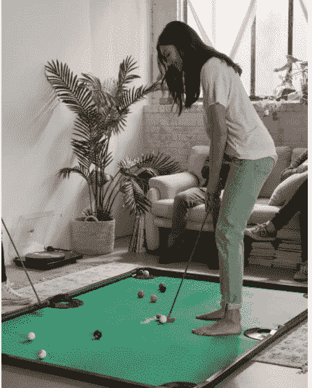*****

*********【104.00 美元】**——发泄情绪的每一个选项都不一定要包括扔东西或打拳。在你自己的背部轻轻一推也能减轻你的压力。*******

*****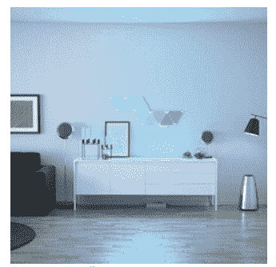*****

*****[**【nano leaf Rhythm Edition Smarter Kit】**](https://www.amazon.com/dp/B079FZGZS4/makithecompsi-20)**($ 230)**——这些瓷砖让你的墙壁随着音乐起舞。创建您想要的任何设计，并将瓷砖连接到音频源。他们会自动和你一起出去。*****

*****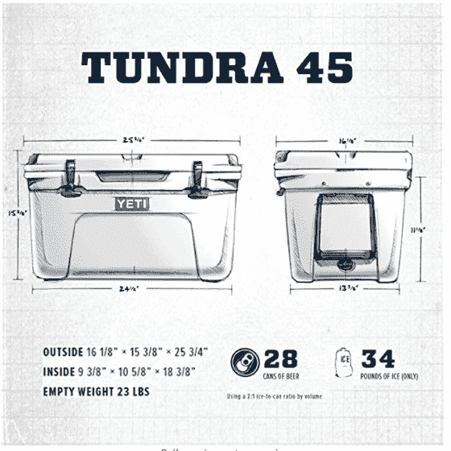*****

*****[**【YETI Tundra 45 Cooler】**](https://www.amazon.com/dp/B001COUOYK/makithecompsi-20?th=1)**($ 299.98)**——编程不全是科技和极客。一个坚固的户外冷却器-完美的露营，海滩聚会，尾随，和更多将服务于完美的人一个最好的工程冷却器。*****

*****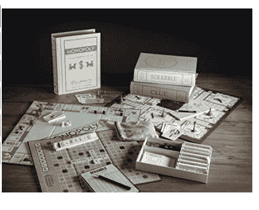*****

*****[**《拼字游戏》、《大富翁》、《线索复古》桌游书架合集**](https://www.amazon.com/dp/B07WTNZ1XF/makithecompsi-20)**($ 119.99)**——桌游和爱书人的维恩图往往有相当不错的重合。为什么不把这些世界和这三部经典作品放在一起，装在假书里，放在你的书架上。*****

## *****豪华礼品(350 美元以上)*****

* * *

*****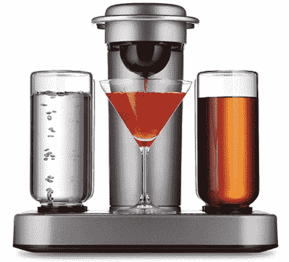*****

*****[**Bartesian 高级鸡尾酒和玛格丽塔机**](https://www.amazon.com/dp/B07PJ5Q943/makithecompsi-20)**($ 346)**——就像鸡尾酒的 Keurig 一样，你只需插入你选择的鸡尾酒胶囊，选择浓度，然后按下 mix。更好的是，它可以自我清洁，并配有可用洗碗机清洗的部件。*****

*******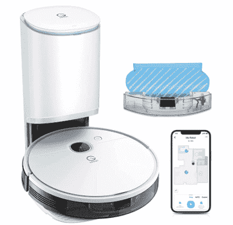*******

*******[**【yeedi Vac Station】机器人吸尘器和拖把**](https://www.amazon.com/dp/B092VCXDB1/makithecompsi-20)**【499.99 美元】**——自从机器人吸尘器在过去几十年里来到我们的家中，生活变得更加幸福。有了 yeedi 的这个升级，你就可以吸尘*和拖地*。另外，你可以告诉他们“抖音让我买的”*******

*****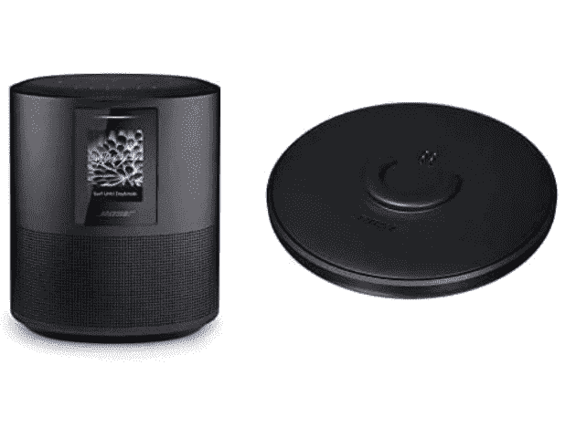*****

*****[**Bose 家用音箱 500:带 Alexa 语音控制的智能蓝牙音箱**](https://www.amazon.com/dp/B09K7B5K9C/makithecompsi-20)**($ 378)**——Alexa 给了我们很多生活方式上的进步，但她的音响系统绝对有所欠缺。直到现在，在这次与 Bose 的合作中。现在，音质与技术和人工智能的力量相匹配。*****

*****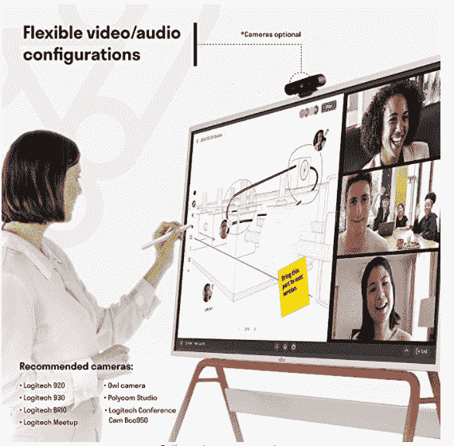*****

*****[**Vibe 一体式电脑实时互动白板**](https://www.amazon.com/dp/B081LPL772/makithecompsi-20)**【2997 美元】**——这个可能有点遥不可及，但如果你认识一个梦想开创下一个脸书的程序员，这可以帮助他们与海外员工和队友联系，他们会帮助他们实现这个梦想。*****

## *****现在你知道了！*****

*****我们 2021 年给程序员的最佳礼物。*****

*****(或者，如果你是一个想给出提示的程序员，你可以把这篇文章发给你生活中的人。嘘，我们不会告诉任何人你的诡计！)*****

*****如果这里没有你感兴趣的东西，请浏览一下我们近年来的一些旧礼物指南: [2020](https://simpleprogrammer.com/2020-gifts-for-programmers/) 、 [2019](https://simpleprogrammer.com/2019-programmer-holiday-gift-guide/) 、 [2018](https://simpleprogrammer.com/2018-gift-guide-for-programmers/) 、 [2016](https://simpleprogrammer.com/the-software-developer-and-other-tech-geeks-christmas-gift-list/) 、 [2015](https://simpleprogrammer.com/software-developer-gifts-and-other-tech-geek-gifts-2015/) 、 [2014](https://simpleprogrammer.com/top-developer-gifts-tech-geek-gifts/) 。*****

*****希望你能找到一份完美的礼物，向你生命中的程序员展示他们对你有多重要！*****