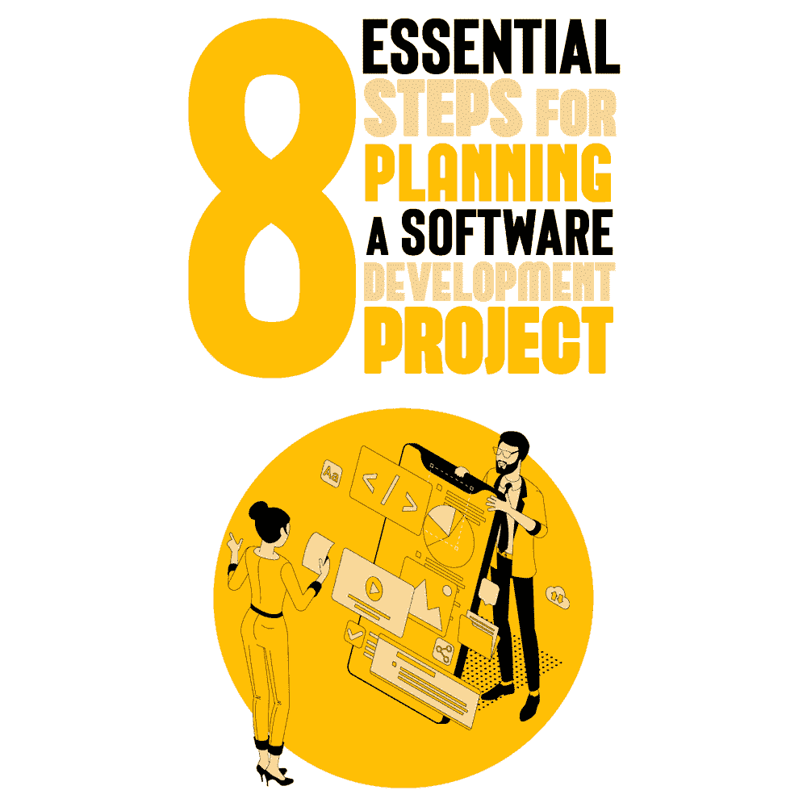
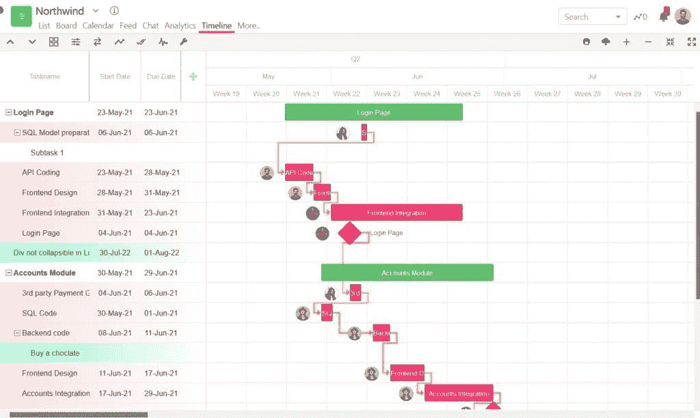

# 规划软件开发项目的 8 个基本步骤

> 原文：<https://simpleprogrammer.com/software-development-project-planning/>

Software development is a complicated process, which makes proper planning an essential element for success in any software development project.

无论您是为客户项目工作还是为自己的项目工作，如果没有适当的计划，项目很容易偏离轨道，您可能不得不面对范围扩大、预算超支、产品交付延迟、客户不满以及许多其他问题。

很多时候，客户是非技术性的，很难向他们解释为什么某些事情没有按计划进行，为什么项目被推迟，为什么你需要更多的资源。

这就是软件开发项目的有效规划的来源。在这篇博文中，我将回答什么是软件开发项目规划，以及规划一个软件开发项目涉及哪些步骤。

## 什么是软件开发项目计划？

软件开发项目计划描述了成功交付项目所需的活动和资源。该计划概述了项目的所有阶段，包括规划、构思、设计和开发、测试、文档、部署、启动和维护。

一个有效的软件开发项目计划涵盖了从概念、项目概要和需求到定义时间表、分配任务、监控项目进度、评估成本和资源、[管理风险](https://simpleprogrammer.com/risk-management-software-development/)的所有内容，以及两者之间的所有内容。

这就是为什么软件开发项目计划在成功交付高质量产品中起着至关重要的作用。如果没有一个合适的计划，在项目的[执行过程中，你将面临太多的问题，这将导致项目交付的延迟、预算超支、客户不满、团队生产力低下，并最终导致低质量的最终产品。](https://www.smarttask.io/blog/project-execution)

通常，项目经理与负责的团队成员和涉众一起规划项目。这个方案要明确回答以下几个问题:

*   选择哪个功能来解决这个问题？
*   开发所选功能需要执行哪些活动？
*   项目的时间表是什么？
*   谁参与了项目，他们的角色和职责是什么？
*   团队成员之间如何分配工作，谁负责什么？
*   什么样的度量标准和关键性能指标(KPI)将定义项目的效率和最终产品的质量？

如果在执行阶段出错，团队偏离了轨道，他们应该能够在开发计划的帮助下回到轨道上来。

软件开发项目规划的好处很多。它可以帮助你在更短的时间内开发出更具成本效益和更可靠的软件，而且毫无压力。它还消除了团队成员之间的沟通障碍，因为每个人都清楚目标。

现在计划和执行软件开发项目比 20 年前容易多了。今天，有许多项目管理软件工具可用，如吉拉，Asana，SmartTask 等。，它可以帮助您轻松管理最复杂的软件开发项目。

对这些工具的需求已经达到顶峰，尤其是在新冠肺炎疫情事件之后，突然之间，每个人都开始远程工作。这些工具帮助远程开发团队从一个平台管理项目和协作。

这些项目管理工具允许您创建不同的项目阶段，[创建产品路线图](https://simpleprogrammer.com/product-roadmap-software-development-project/)，创建里程碑，分配任务，设置依赖关系，设置截止日期，监控项目绩效，跟踪 KPI，管理团队工作量，协作等等。

现在让我们深入这篇文章最重要的部分——规划软件开发项目的一步一步的过程。

## 规划软件开发项目的 8 个步骤

软件开发是一个复杂的过程，需要经历不同的步骤，为了可视化和遵循开发的每一步，有一个适当的计划是很重要的。

作为项目经理、技术主管或软件工程经理，您要对团队的表现、软件质量、客户沟通以及与业务目标的一致性负责。

下面是规划软件开发项目的步骤。

### 步骤 1:定义项目目标

定义项目目标是软件开发计划的第一步。它决定了项目的可行性。在这一步中，您必须回答以下问题:

*   项目的目的是什么？
*   项目的需求是什么？
*   项目规格是什么？

正如我们将在下面看到的，这一步与技术需求和项目计划步骤相联系。

### 第二步:技术要求

下一步是定义项目的技术需求。最终确定成功交付最终软件产品所需的技术需求非常重要。

在这一步，您需要决定:

*   负责开发的团队。
*   技术方面，比如项目解决了什么问题，谁是最终用户，安全需求是什么，技术需求，测试方法，硬件需求，方法论的类型(Scrum，看板，或者瀑布)，等等。
*   项目的里程碑。

通过记录技术需求，您还能够理解和评估项目中涉及的风险。

### 步骤 3:项目日程安排

现在到了最关键的步骤——*项目进度*，这是软件开发项目计划中最重要的步骤之一。它给你一个清晰的项目概述，从构思到部署。

日程安排包括将工作分解成任务和子任务、分配资源、估计时间和预算。

如今，有许多项目管理工具可用，如 Asana、SmartTask、吉拉等。—这可以帮助您安排项目日程。您可以利用甘特图或时间线视图来可视化您的计划并顺利跟踪您的项目，如下图所示。

智能任务中的甘特图视图

这些软件工具还允许您管理分配的资源，将项目分成里程碑，并随时关注重要的关键绩效指标。

如今，项目经理努力实现 scrum 实践，这就是像吉拉这样的软件工具介入的地方，它是围绕 scrum 构建的。

尽管吉拉更注重开发阶段的协作，但像 SmartTask 或 Asana 这样的软件工具可以在规划和开发阶段帮助项目经理。这些工具还提供项目组合特性，允许项目经理在一个地方处理多个项目。

规划的质量也决定了项目的成功和最终可交付成果的质量。一份详细且经过深思熟虑的时间表可以让你更容易地遵循时间表，并在过程中预防问题。

规划时，您需要决定以下事项:

*   大致的时间表和发展的主要阶段。
*   给每个团队成员分配任务和子任务。
*   时间和成本估计。
*   与团队、客户和利益相关者沟通的方式。
*   记录一切。

据 [Waydev](https://waydev.co/software-projects-planning/) 的联合创始人、首席执行官&Alex Circei 说，“软件开发没有什么是一成不变的，因为它总是一个复杂的过程，所以适应性是关键。”

你的计划不应该是僵化的；它必须具有灵活性和适应性。

### 步骤 4:设计和原型制作

软件开发项目规划的下一步是设计和原型制作。软件架构师和工程师创建软件蓝图，展示产品的功能和交互。

从原型上的选定用户收集反馈，以查看是否需要对提议的功能进行任何更改。

### 第五步:发展

一旦设计最终确定，并且收集了关于原型的反馈，软件开发项目的下一步就是产品的开发，这是最困难和最耗时的步骤之一。

现在，软件开发团队可以根据项目范围和需求开始着手解决方案了。

### 第六步:质量测试

软件开发项目中的另一个关键步骤是质量测试。在开发阶段之后，检查软件是否满足项目需求、满足预算和时间估计、代码质量以及其他相关的度量标准是很重要的。

这一步允许您找到并修复软件的任何错误，并交付一个无错误且有用的软件产品。

很多时候，一个单独的测试团队被指派来执行质量测试操作，并且大多数时候，这个步骤也可以被外包。说到测试，我特别推荐阅读 Cem Kaner、Jack Falk 和 Hung Q. Nguyen 的《测试计算机软件 》。

### 步骤 7:部署

这是软件开发项目的最后阶段。最后，开发团队所做的艰苦工作随着最终产品的部署而付诸行动。软件对最终用户来说是活的。

在许多情况下，在最终部署之前，需要在开发和测试阶段进行多次部署。

如今，开发人员利用低代码或无代码平台来执行快速原型开发、测试和部署的快速周期。

### 步骤 8:维护和支持

Even though deployment is technically the final stage in a software development project, it’s important to plan for post-launch maintenance and support before the final software goes live.

每个软件产品都需要定期进行某种维护或高级更新，以满足最终用户不断发展的需求。这就是为什么这一步变得非常重要。

## 遵循这个规划指南走向成功

这就是有效规划软件开发项目的八步流程。当从零开始开发软件产品时，规划起着至关重要的作用。我强烈推荐使用像 SmartTask 或 Asana 这样的项目管理软件来有效地管理和跟踪你的软件开发项目。

这些工具允许您计划项目、创建时间表、将项目分解为里程碑、创建任务和子任务、设置截止日期、在团队成员之间分配工作、管理团队的工作量、设置依赖关系、与团队协作、跟踪项目的进度等等。

我希望您现在对如何有效地计划软件开发项目有了更好的理解。如果你还想更深入的探讨这个话题，我推荐阅读 [*Ship it！成功软件项目实用指南*](http://www.amazon.com/gp/product/0974514047/ref=as_li_tl?ie=UTF8&camp=1789&creative=390957&creativeASIN=0974514047&linkCode=as2&tag=makithecompsi-20&linkId=PJFVKLNVX667RDVH) ，作者 Jared Richardson 和 William A. Gwaltney。