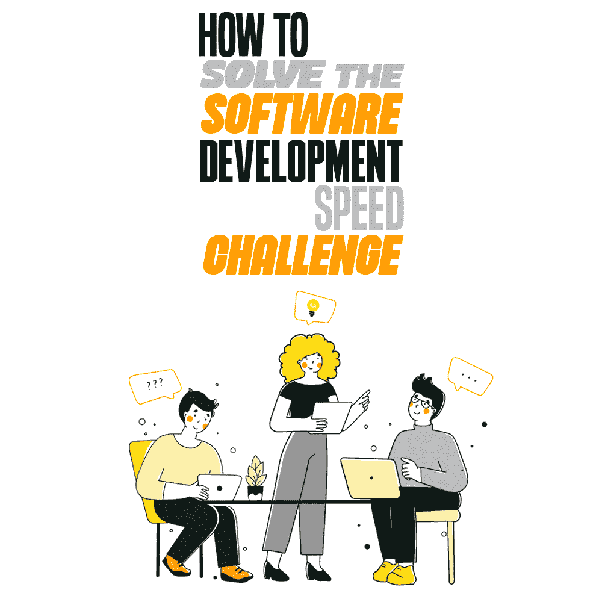

# 如何解决软件开发速度的挑战

> 原文：<https://simpleprogrammer.com/software-development-speed-challenge/>

As a developer, you have most likely faced a situation where you had to dramatically accelerate the work speed in order to complete the project on time, risking professional burnout. The truth is that nowadays the ever-growing development speed has become a topical issue not only for game dev and startups but also for enterprise solutions.

事实上，在《2020-21 年世界质量报告》中，凯捷指出[约 70%的开发团队](https://www.capgemini.com/us-en/research/world-quality-report-wqr-20-21/)在压力下工作，每天或每小时部署产品。但是，如何在不损害质量的情况下做到这一点呢？

这正是我将在这篇文章中向你展示的，这样你就可以在不牺牲质量的情况下比你的竞争对手更快，同时避免职业倦怠。

## 关于发展速度的一些话

在软件开发中，速度不是一个简单的概念；毕竟，速度本身的定义可能会因视角不同而有所不同。

例如，对于敏捷开发，一些专家用各种模式来描述速度的概念。在基本层面上，这些模式由短跑(极限和中等)、马拉松和间歇等单位来表示。让我们更详细地看一下这些速度模式，最终这将帮助您选择最符合您特定需求的模式。

### 极限冲刺

极限冲刺是一种最适合一些关键情况的速度模式——例如，当质量下降、客户不满意或类似的事情需要立即关注时。当在极限冲刺中工作时，团队将所有额外的任务放在一边，减少每个开发阶段的在制品(WIP)。这有助于减少一心多用，专注于特定的问题，从而找到解决或减轻问题的方法。

极限冲刺模式的主要缺点是*太难实现和持续维护*。这就像一场拆迁比赛，开发人员长时间轮班工作(超过 10 个小时)，这可能会影响他们的生产力和健康，导致他们经历[日复一日的精疲力竭](https://simpleprogrammer.com/daily-burnout-programmer/)，从而降低他们的工作质量。

这样的速度方法很难成为任何公司的长期战略，因为它使得开发过程太不可预测和不可靠。

### 适度冲刺

适度冲刺是冲刺模式的另一种改进。尽管名不副实，但就项目管理而言，它仍然是危险和不稳定的。在这里，我们不会看到过度劳累。开发人员定期八小时轮班工作，并试图在最小的中断下最大限度地利用他们的生产力。换句话说，编码是他们增加工作产量的唯一方法。

然而，随着时间的推移，这也可能成为一个问题。原因是，在这样的工作条件下，当开发人员的注意力只局限于编码时，生产率不可避免地下降，甚至没有人可能注意到有什么地方出错了。

这种缺乏反思是由于团队成员像轮子里的仓鼠一样工作，日复一日地做着同样的例行任务。到了某一点，团队成员开始心力交瘁，工作缺乏热情，不可避免地会影响到所执行任务的数量和质量。

不幸的是，团队可以在这种低效的模式下工作很长时间；从长远来看，它可能会大大降低整个软件开发项目的投资回报率。毕竟，仅仅识别和承认问题就可能需要几个月甚至几年的时间。

因此，尽管适度冲刺如果只是在紧要关头使用可能仍然有效，但它们不是可持续的长期战略。

### 马拉松赛跑

与短跑模式的极端不同，马拉松速度模式依赖于均衡和耐力，以实现长期可持续性。关键思想是在不损害开发人员创造力和士气的情况下，在高生产率和最高速度之间取得平衡。

在这种速度模式下，团队定期轮班工作，有时间解决复杂的任务，或者只是停下来思考。这是理想的速度模式吗？确实是。虽然在现实生活中几乎找不到。

尽管如此，在这种宽松的模式下，被竞争对手超越的风险很高。毕竟，当你的团队花时间计划、假设或开会时，你的竞争对手发布了新的特性或版本，吸引了新的用户，增加了利润。

为了减轻上述速度模式的共同缺点，我们可以做出更有效和更合理的选择——利用区间模式，它结合了上述所有模式。

## 最佳间隔

不要把团队限制在某个速度上，而是利用所有速度模式的最佳特征。区间速度模式根据团队在给定项目阶段的优先事项和挑战，利用短跑和马拉松跑。

考虑到上面所有关于模式的要点，不管软件开发过程的规模和复杂性如何，间隔可能是最佳的速度模式之一。

以下是一个区间内几种速度模式的潜在组合示例。这些短跑和马拉松应该一个接一个，理想的循环是一遍又一遍地重复:

*   快速冲刺。在这种模式下，团队执行 WIP 并暂停所有其他活动，如会议、学习会议或公司活动。他们完全专注于交付价值:编码、QA、创建文档和部署。这个冲刺持续时间大概是一个月。一些专家会建议[用一段时间的自我反省和放松来结束它](https://simpleprogrammer.com/programmers-prioritize-mental-health/)——例如，你可以花一周的时间来分享经验和计划未来的活动。

*   一场用心的马拉松。当一场马拉松紧接着一场短跑时，发展速度要高于常规马拉松。这是冷静编码、减少技术债务、学习新技能或完善现有技能的时候了。这个时期持续三个月左右。然后另一个冲刺来了。

*在短跑和马拉松*之间交替，团队可以加快开发过程，减轻两种方法的负面影响。此外，与冲刺和马拉松模式不同，间隔扩展到所有项目团队，而不仅仅是开发人员。潜在地，这可以帮助你改善员工之间的交流，从而建立一个更加紧密和同步的软件开发过程。

如果你想让你的开发更有成效，看看罗伯特·c·马丁的《敏捷软件开发、原则、模式和实践》 *[和迈克·科恩的《敏捷评估和规划》](https://www.amazon.com/dp/0135974445/makithecompsi-20) [*这两本书——它们将为你提供具体的建议和最有效的敏捷开发方法(并继续更深入的对话)。*](https://www.amazon.com/dp/0131479415/makithecompsi-20)*

## 满量程一致性

Regardless of the scale of your particular project, as well as the development model and speed modes you prefer, software development always remains a complex combination of interconnected tasks, ranging from requirement gathering to software testing and post-release support.

为了优化整个开发过程，团队使用 [DevOps](https://simpleprogrammer.com/devops-in-mobile-application-development/) 和持续测试，以快速开发为中心的具体实践，贯穿交付管道的产品评估，以及快速的跨团队反馈。

然而，在项目中重组工作是一件复杂的事情。这就是为什么求助于外部帮助是有意义的——devo PS 咨询和[持续测试服务](https://www.a1qa.com/services/continuous-testing/)将实施活动分成小部分，同时适当关注工程团队的协作。合格的供应商拥有成熟的方法、采用 DevOps 的经验和风险管理。

此外，在他们在行业、方法和实现对象方面的指导下，团队可以深入到过程中，并为持续测试构建成熟度模型，该模型从早期项目阶段就关注业务风险。最终，这可以帮助你让开发者进入一个可持续的区间模式，这在短期和长期都是有益的。

## 是时候选择你的速度了

加速开发过程是一件复杂的事情，已经成为软件开发中的一个永恒的挑战。毕竟，您不仅需要编写高质量的代码并实现项目的业务目标，还需要比您的竞争对手更快。虽然没有放之四海而皆准的建议，但软件开发专家可能会提供一系列提示来帮助您减轻困难。

因此，最好在短跑和马拉松速度计划之间交替，以利用这两种方法提供的好处，即最少的停机时间和长期可持续性。

这样，您可以利用这两种方法提供的优势—最小的工作中断和长期的可持续性。当一个接一个地使用时，这两种方法都允许团队在长期内达到最佳速度和耐力的平衡。