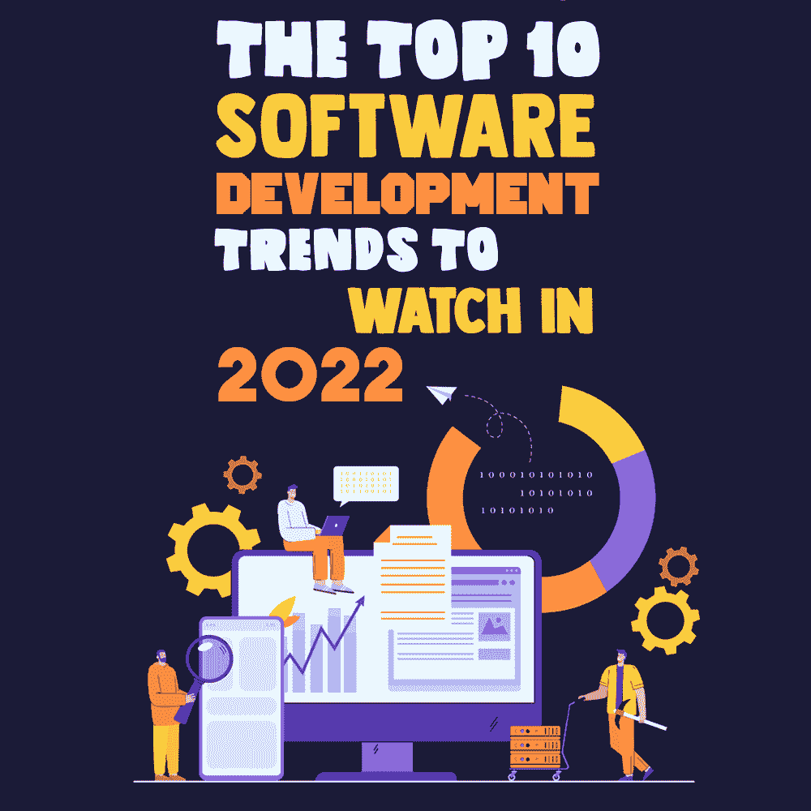
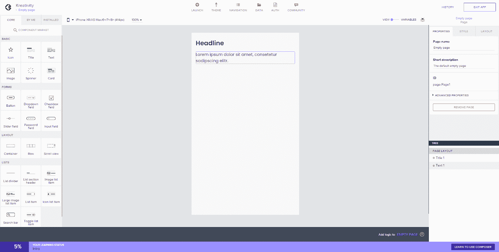
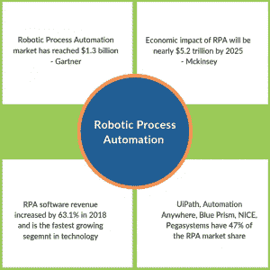
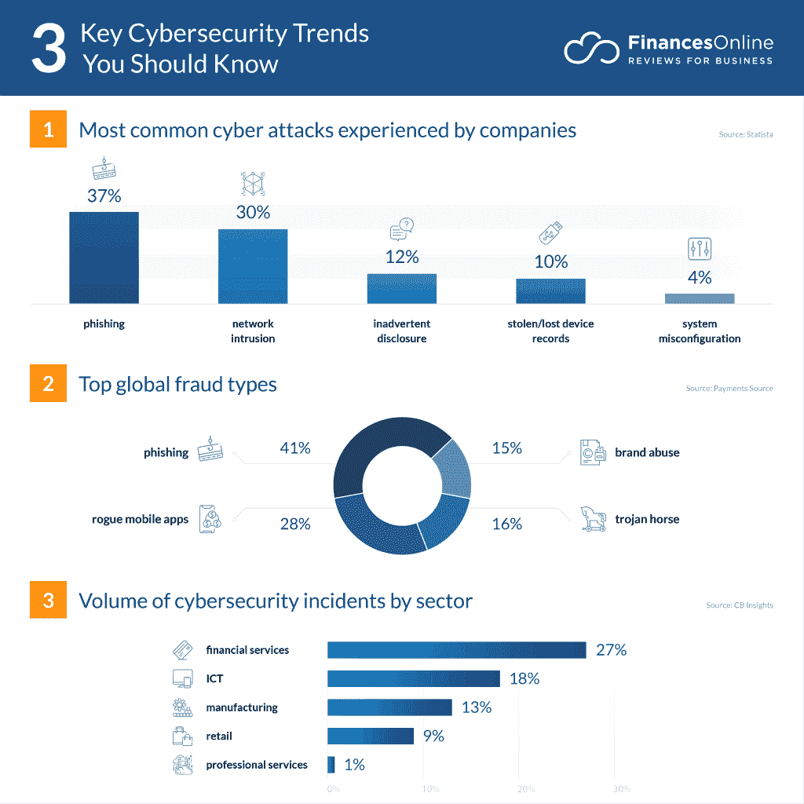
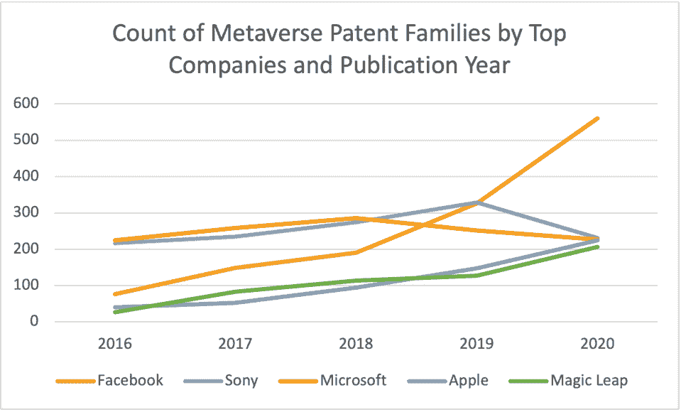
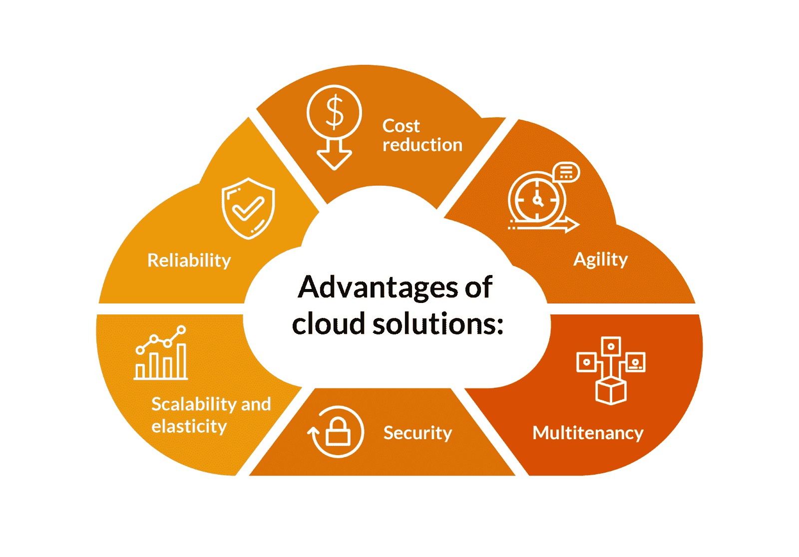
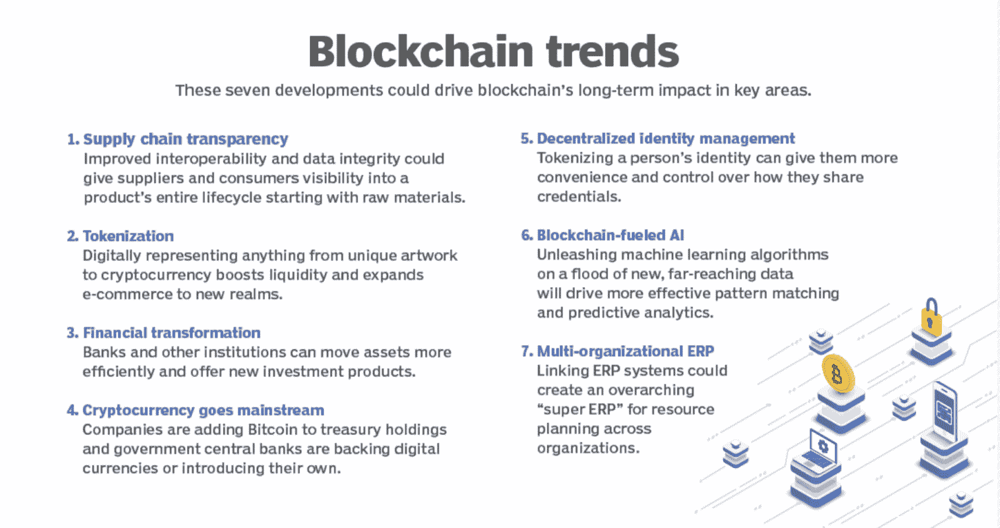
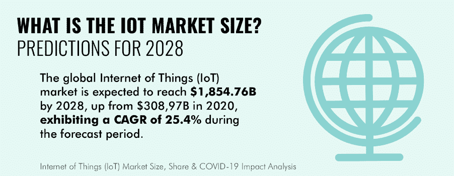
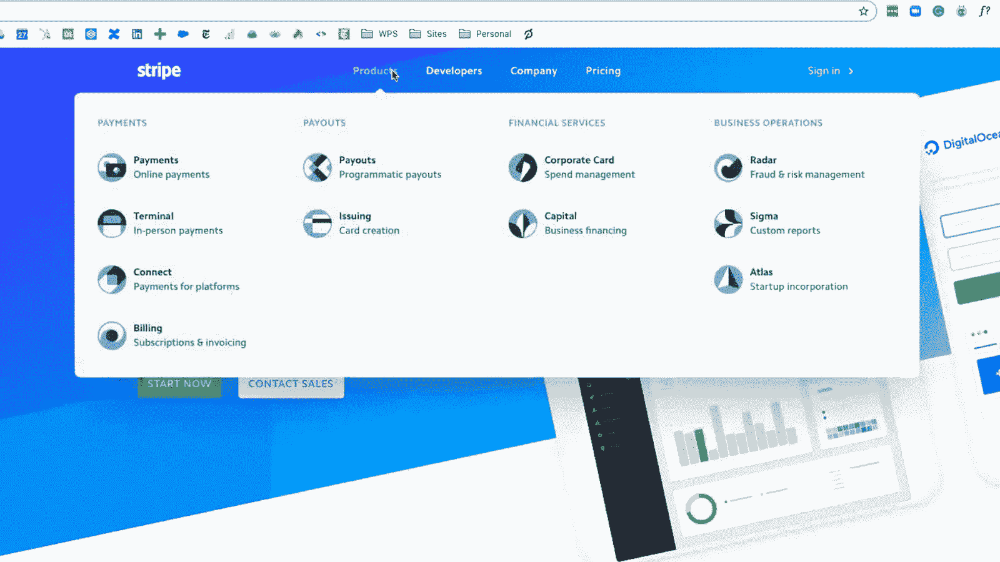

# 2022 年值得关注的十大软件发展趋势

> 原文：<https://simpleprogrammer.com/software-development-trends-2022/>

Software applications are constantly evolving, and technological innovation further bolsters this development. Standard software practices in use today might no longer be applicable in the next five years.

正在进行的疫情进一步推动企业超越传统的经营模式。

随着我们迈入新的一年，对不断变化的数据量和不断提高的计算机和网络速度的需求将继续成为数字化转型的最重要驱动力。

我已经整理了即将到来的软件发展趋势，并将其纳入你的 2022 年战略。

## 人工智能

软件开发企业不想错过利用人工智能提升客户体验的机会。人工智能增强了企业的决策能力，并为数字化转型提供了一个有意义的平台。

从微软到超级巨头谷歌，所有老牌公司甚至新公司都受益于这一趋势。近 [47%的数字化成熟企业](https://www.cmo.com/features/articles/2018/2/27/adobe-mobile-maturity-study-the-next-mobile-decade.html#gs.y7pw26)有明确的人工智能战略。

在现有技术中加入人工智能和机器学习对改善用户体验非常重要。

例如，亚马逊正在加入使用人工智能的趋势，它在西雅图、芝加哥和旧金山的[免结账实体店](https://www.amazon.com/b?ie=UTF8&node=16008589011)，由人工智能驱动的传感器和摄像头提供支持。该技术可以分辨出顾客挑选了哪些商品，并在他们使用 Amazon Go 应用程序走出商店时自动为其收费。

另一方面，网飞已经将人工智能和大数据置于其运营的核心。该公司使用人工智能算法向用户推荐新内容。当网飞的人工智能算法筛选你的观看历史并检测你的行为模式时，你每次打开应用程序都会看到的个性化订阅源就会出现。

## 无代码开发

低代码/无代码开发平台是一个可视化的软件开发环境，允许开发人员拖放应用程序组件，连接它们，无需编码即可创建移动或 web 应用程序。

对于需要快速推进新计划的企业来说，低代码/无代码(LCNC)编程是必须的。它让非开发人员或其他没有技术背景的人创建业务问题的解决方案。它还允许团队根据用户的反馈，以更低的成本快速地创建最少的可行产品。

像 AppGyver Composer 这样的下一代可视化应用平台使用 LCNC 编程来解决与数据相关的技术问题，如后端集成和安全数据传输。这些平台允许用户将图标、按钮和输入字段等元素拖放到模拟移动设备的屏幕上。

LCNC 平台可能看起来像小孩子的游戏，但是软件开发者已经用它们来创建复杂的应用程序。Moodico 就是这样一个解决方案。它允许用户根据他们的行为来跟踪他们的情绪。使用 AppGyver，Moodico 的创造者成功地将一个复杂的概念翻译成一个简单的应用程序。它有可能改变用户对其心理健康的看法。

无代码编程也可以与现有的遗留系统一起工作，允许您的工程师保留有用的东西，修改无用的东西。

## 自动化重复性任务

机器人流程自动化(RPA)使用软件来自动化大量重复的任务，这些任务以前需要人工干预。根据 Gartner 的预测，到 2021 年底，全球 RPA 软件市场预计将达到 18.9 亿美元。

RPA 允许配置“机器人”来捕获和解释任务，如处理事务、转换或处理数据，以及将其与其他数字系统集成。

通过将日常工作从人力资源转移到数字工作者，RPA 使企业能够专注于更高价值的工作。

  

*[来源](https://www.botreetechnologies.com/blog/wp-content/uploads/2020/12/robotic-process-automation-technology-768x768-1.png)*

使用 RPA 的一个很好的例子是员工入职或合同审查。它还被用来减少对人力的依赖，提高生产能力。

部署 RPA 的最大优势是，与手动执行重复性程序相比，员工可以专注于更具创造性的任务。例如， [KeyBank](https://www.botreetechnologies.com/blog/5-financial-services-companies-successfully-using-rpa/) 使用 Billtrust 的 RPA 平台 Quantum 支付周期管理，实现了应收账款和发票交付流程的自动化。

通过将 RPA 整合到其流程中，Keybank 成功优化了其发票交付，并减少了人为错误的范围。该银行现在正在考虑在其更多的流程中实施 RPA。

## 不断变化的网络安全需求

随着世界走向数字化时代，初创公司不能低估网络安全威胁。到 2021 年 **，随机的网络犯罪活动将让企业损失高达 6 万亿美元。**

*[来源](https://financesonline.com/uploads/2019/12/cybersecurity-trends-1024x1024.png)*

因此，软件公司不能再依赖传统的网络保护策略(如安装反恶意软件和外围防火墙)来满足不断变化的需求。

领先的云安全初创公司之一 Bitglass 利用网络安全为任何地方、任何设备上的任何交互提供数据和威胁保护。Bitglass 的独特之处在于它使用云安全平台来结合云访问安全代理和设备上的安全 web 网关，以保护各种设备上的端点。

根据普华永道的数据，55%的企业正在增加 2021 年的网络预算，50%的企业表示网络和隐私将是每一个决策或计划的关键。

考虑到统计数据，我不怀疑网络安全初创公司将获得更多资金，并处于创新的最前沿，因为每个大型或小型企业的首席执行官现在都将网络安全放在他们议程的首位。

## 更多地采用元宇宙

元宇宙是一个高度沉浸式的虚拟世界，结合了社交媒体、在线游戏、虚拟现实(VR)、增强现实(AR)和加密货币，允许用户进行数字互动。

目前，各行各业的大品牌都在涉足元宇宙。

随着人们习惯于增强现实(AR)，元宇宙的范围看起来很有希望。无论你是在虚拟参观一个新的房产，还是虚拟改造新的服装或珠宝，元宇宙都是真实的。

[*来源*](https://thumbor.forbes.com/thumbor/960x0/https%3A%2F%2Fspecials-images.forbesimg.com%2Fimageserve%2F61658aaeec70597635dc6493%2FLine-Graph-of-assorted-Metaverse-companies-patents-by-year%2F960x0.png%3Ffit%3Dscale)

脸书已经就他们的元宇宙意图做出了第一个重大声明，并且正在建立一个专利组合来支持乐观的愿望。

这家社交网络巨头正在对可能推动元宇宙诞生的技术进行重大投资。

元宇宙将成为下一个大事件，知情的程序员已经开始将 VR 和 AR 技术融入他们的工作流程和产品中。

## 改进的网络应用

开发和维护你的网站以跟上[网站发展趋势](https://www.lform.com/blog/post/7-web-development-trends-and-strategies-2020)是必不可少的，如果你打算在你的利基市场保持相关。例如，对用户来说，响应式网页设计已经是旧闻了。他们现在希望网站看起来更像应用程序。一种被称为渐进式网络应用(PWAs)的新标准可以帮助企业吸引新客户并留住现有客户。

[渐进式网络应用(PWAs)](https://blog.hubspot.com/marketing/progressive-web-apps) 是具有应用功能的移动网站。它们为用户提供了类似于使用移动应用程序的体验，同时对于无法访问更新的移动设备的用户仍然可用。

进步的 web 应用程序开发人员优化 web 应用程序，因为它们提供了类似应用程序的导航和出色的视觉内容。它是在 Javascript 元素的帮助下实现的，这些元素被称为“服务工作者”，允许离线执行应用程序和存储数据。

PWAs 使网站能够在谷歌地图等应用程序中立即加载并离线工作。星巴克、优步、Pinterest 和 Twitter 等公司已经创建了 PWAs 来提供更好的用户体验。

例如，[优步](https://www.simicart.com/blog/progressive-web-apps-examples/)开发了一款渐进式网络应用，甚至可以在 2G 网络上运行。因此，不管你的网速、设备，甚至位置如何，你都可以使用优步的 PWA 来预订一辆车。这项功能非常方便，尤其是如果你所在的地方手机信号时断时续，或者你使用的手机与该应用不兼容。

PWA 技术使用户只需轻轻一点就能访问他们最喜欢的网站的本地移动版本。通过提高性能、可访问性和用户交互，进步的 web 应用程序开发人员确保这些应用程序流畅、引人入胜且可靠。

## 更加关注云

所有垂直行业的公司都面临着云优先和云原生创业公司的威胁，他们利用云的速度、灵活性和成本效益来颠覆传统的业务经营方式。

无服务器计算是一个相对较新的概念，在市场上受到包括亚马逊(AWS Lambda)、微软(Azure Functions)和 IBM Cloud Functions 在内的提供商的欢迎。

被称为“功能即服务”的无服务器计算意味着组织不必被迫租赁昂贵的服务器，支付固定数量的存储或带宽，或因不可预见的灾难而负责数据保护。

*[来源](https://quintagroup.com/services/service-images/advantages-of.jpg)*

例如， [Nordstrom](https://www.techmagic.co/blog/7-top-companies-using-serverless/) 创造了新的 Hello，Retail！使用无服务器技术的框架。通过在 AWS 上构建销售平台，Nordstrom 增强了其用户体验和整体运营绩效。该公司现在有了一个无服务器的流，他们的销售团队曾经在一个地方做的一切，这意味着简化的任务、更好的性能和更高的客户满意度。

## 区块链

考虑区块链最简单的方式是作为一个分布式账本，交易记录存储在通过对等网络连接的几台计算机上。区块链即服务的分发模式对于软件技术趋势的快速采用至关重要，包括云计算、物联网和人工智能。

区块链长期以来一直被描绘为下一个大事件，包括亚马逊、IBM 和微软在内的公司都在开发工具，让企业能够利用这项技术，而无需在基础设施上投入巨额资本。在 2022 年，早期以区块链技术起家的公司有望获得投资回报。

在最新一波[区块链趋势](https://simpleprogrammer.com/blockchain-trends-2022/)中，银行可以提供单一的数字身份信息来源，实现无缝信息交换。这可能会导致开设新账户的自动化，减少资源和成本，并维护数据隐私。

然而，区块链也可能对任何涉及跟踪数据移动的过程有用，因此它可以应用于供应链、物流和来源。

*[来源](https://searchcio.techtarget.com/feature/7-must-know-blockchain-trends)*

区块链网络的突出例子已经出现在各种企业的供应链中。例如，IBM Food Trust 提供了一个可持续的需求和供应链，旨在减少食物浪费并为食品行业带来包容性。

区块链可以通过标记个人身份为数字世界带来更多隐私。它在医疗保健领域也有多种应用。该技术有助于患者病历的安全传输，管理医疗设备和用品的流动，并帮助医疗保健研究人员破译遗传密码，同时遵守严格的隐私法。

例如，Akiri 运营着一个区块链网络即服务，该服务针对医疗保健行业进行了优化，有助于在传输患者健康数据时保护这些数据。

与传统的电子医疗记录系统不同，Akiri 是一个安全的专用网络，通过一组代码验证和传输患者数据，而不是将其存储在中央服务器中。它使用内置的安全措施来验证任何试图访问或更改其传输数据的人的身份。

## 物联网的扩展

尽管过去几年经历了坎坷，但企业相信物联网(IoT)将在未来的贸易成功中发挥至关重要的作用。

那么，为什么每个人都对物联网扩张如此感兴趣呢？因为好处是广泛的——可靠性、简化、透明性、可追溯性、成本效率、零误差、更快的交易和改进的数据质量，等等。

[*来源*](https://www.saftbatteries.com/energizing-iot/how-iot-world-shaping-2021-and-what-trends-will-influence-future-iot-infographic/)

物联网与人工智能和人工智能技术合作，将有助于有效处理大量数据，综合这些数据以做出明智和明智的建议和决定。

云平台将有助于减少设计、安装、监控、维护和报告系统所需的时间。例如，物流垂直领域的物联网发展迅速。面向物流的物联网位置和路线管理解决方案相当受欢迎。它使物流经理能够实时监控他们卡车的位置。

GPS 跟踪系统和地理围栏技术允许从远程位置进行跟踪。从而使物流公司能够跟踪司机的活动并确保及时的货物交付。

除了提供车队管理服务，物流中的物联网还可以促进货物存储和库存水平管理。物流生态系统允许公司在各种运营中完全透明，进一步支持无缝库存管理。

## 更加关注 UX

在当今全渠道数字体验的时代，软件工程师和 UX 设计团队比以往任何时候都更加紧密地合作，以提供跨网络和移动的无缝用户体验。

UX 设计团队在整个软件开发生命周期中与工程师合作，设计一致的用户体验。

从生产到质量保证，对 UX 越来越多的关注确保了对设计的坚持，并为不可预见的技术限制创造了变通办法。

理解用户的旅程是交付一致的 web 或移动应用的关键。UX 设计师通过提供以用户为中心的设计、原型和线框来与开发者合作。

条纹就是一个经典的例子。他们的页面设计利用设计和编码将用户的目光导向特定的动作。整体设计易于使用和导航。

专注于 UX 的开发帮助软件工程师为产品设定正确的需求和期望。也让软件工程师更容易理解开发方向，分析能力，划分项目阶段。

## 为 2022 做好准备

预测技术的未来是一项棘手的冒险。现代软件开发趋势提供了大量可供利用的可能性。

从人工智能、无代码接口、网络安全、区块链，到物联网、云计算、元宇宙等等，[软件开发部门](https://www.topmobiletech.com/top-software-development-companies/)将在未来几年继续蓬勃发展。

因此，初创公司需要系好安全带，专注于采用更新的战略，同时远离传统或过时的业务，以有效地实现最大的生产潜力。