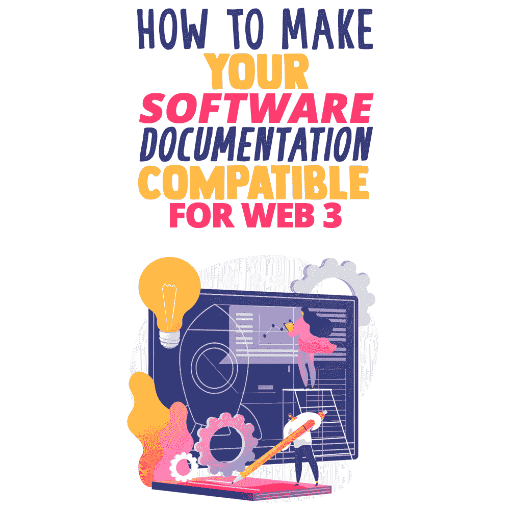
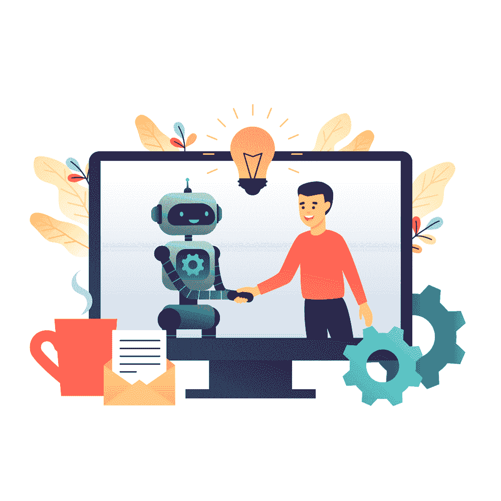

# 如何让你的软件文档兼容 Web 3

> 原文：<https://simpleprogrammer.com/software-documentation-compatible-web-3/>

A solid documentation strategy is the lifeblood of businesses. In fact, [75% of business leaders believe that knowledge management is crucial](https://www2.deloitte.com/us/en/insights/focus/technology-and-the-future-of-work/organizational-knowledge-management.html) to their business' success in the upcoming years. The majority of these prove to be helpful to a massive number of users every day, through a variety of document management software solutions at the same time.

如果企业每天都使用互联网，领导层需要投资文件共享软件，将他们的数据传送给远程员工。除了时间、正常运行时间可靠性和速度，还有必要衡量文件共享软件与新一代互联网的兼容性:即 [Web 3.0](https://www.amazon.com/dp/B07X1V8D58/makithecompsi-20) 。

那么，面对这些挑战，新旧文档管理系统和文件共享程序如何应对呢？

简单的解决办法是以客户需求为导向，不断创新。如果您的公司有类似的方法，您将需要获得新的软件，该软件提供更广泛的协作、分析、更紧密的安全性和复杂的自动化，以消除许多冗余操作。

分解[软件文档](https://document360.com/blog/software-documentation/)的不同方面并理解 Web 3.0 的特性是很重要的，这样你就可以冒险进入一个你的过程与新一代互联网一致的世界。这个博客探索了互联网时代的基础，划分了 Web 2.0 和 Web 3.0 之间的区别，并帮助您理解如何修改您的过程文档以适应新系统。

## 什么是软件文档？

每个软件项目都需要软件文档。然而，准备这可能是一项艰巨的任务，因为它需要时间，有时会很无聊。即便如此，还是有必要让你的产品起飞。

为帮助用户或开发者理解软件的特性和功能而准备的任何文档都被称为软件文档。书面教程、视频、用户指南和培训手册都是试图帮助用户理解软件特性、操作和功能的技术文档。

软件文档是为两种受众编写的:软件工程师和产品最终用户。

软件工程中的文档是指帮助工程师理解产品的设计、代码和实现的信息和出版物。这样的[过程文档指南](https://document360.com/blog/process-documentation/)使开发者能够完全理解、更新和定制一个软件。

另一方面，文档也可以是面向最终用户的，指的是描述如何安装和使用软件的一组简单的材料。

在创建公司的第一份或第一百份软件文档时，不要依赖猜测或重复别人已经做过的事情。糟糕的软件文档会吓跑潜在的客户，同时也会浪费公司资源。相反，使用最佳实践，如利用内部经验和尽量减少行话来创建技术文档，以提升而不是降低您的程序。

### 软件文档的好处

文档的可用性有助于跟踪应用程序的所有部分，并提高软件产品的质量。软件文档的其他好处包括:

*   开发、维护和向其他开发人员传递知识
*   在开发过程中协助开发团队
*   帮助最终用户使用产品
*   提高软件的整体质量
*   减少需要做两次的工作量
*   让代码更容易阅读
*   协助建立内部工作协调

## 什么是 Web 3.0？

Web 3.0，也被称为语义 Web 或读写执行，是暗示 Web 未来的时代。人工智能(AI)和机器学习(ML)允许计算机以与人类相同的方式分析数据，允许智能开发和传播针对个人用户需求定制的有价值的材料。

Web 3.0 是一个假设的未来互联网版本，建立在区块链之上，这是一种以促进加密货币交易而闻名的记录技术。尽管有很多关于 Web 3.0 是否会成为现实的争论，但是在去中心化领域已经有了很大的进步，为下一代互联网带来了一线希望。

Web 3.0 之所以吸引人，是因为它是去中心化的，这意味着用户不再通过谷歌、苹果或脸书等公司提供的服务来访问互联网，而是个人拥有并管理互联网的各个领域。

Web 3.0 不需要“许可”，这意味着中央机构无权选择谁有权访问什么服务，也不需要“信任”，这意味着两方或多方之间的虚拟交易不需要使用中介。Web 3.0 在技术上更好地保护了用户隐私，因为这些机构和中介正在进行大部分的数据收集。

## Web 2.0 和 Web 3.0 的区别

我们所知的互联网架构是 Web 2.0。社交媒体、云计算和移动技术都是 Web 2.0 的例子。API 提供了 Web 2.0 中不同软件应用程序之间的互操作性。

一切都令人满意地工作，然而，它都是集中的。某些业务必须被信任。由于多次数据泄露和数字隐私侵犯，这对普通人来说并不顺利。有了 Web 2.0，你不拥有你的数据。它在别人的服务器上。

你可以理解不同代的互联网和[空间网络](https://www2.deloitte.com/us/en/insights/topics/digital-transformation/web-3-0-technologies-in-business.html)之间的显著差异，这将更好地帮助修改软件文档过程。

| **Web 2.0** | **Web 3.0** |
| 它能读、写、分类和归类信息。 | 随着语义网理解单词的含义，机器人和人类都可以毫不费力地找到、分享和评估内容。 |
| 某些应用程序或软件的服务器可能会随时停机。 | 有了以太坊做后台，服务器就不能宕机了。 |
| 制作动态、响应性强的内容，并与他人分享。 | 能够充分发挥 3D 图形和图像的潜力。 |
| 从各种来源交换数据。 | 加密和 DLTs 等高级授权措施用于保护用户身份和数据。 |
| 数据泄露或被盗的高风险。 | 提供顶级的安全性和隐私性 |

## 使软件文档与 Web 3.0 兼容的方法

现在，您已经了解了软件文档的不同方面和不同代的互联网，让我们深入了解如何使您的软件文档与 Web 3.0 兼容。

### 人工智能

Incorporating progressive technologies like [Artificial Intelligence (AI)](https://simpleprogrammer.com/ai-for-web-development/) and Natural Language Processing (NLP) into your software documentation will aid in the transformation of the process in accordance with Web 3.0.

您将能够利用 Web 3.0 的能力，像人们一样辨别信息，从而获得更快、更相关的结果。一个例子是使用人工智能来帮助软件开发的源代码，加速代码摘要，甚至检查代码剽窃。

### 语义万维网

语义网需要继续发展。当你开始制作软件文档时，要记住读者的意图。这些过程应该一读就能执行。这个语义网通过基于理解单词而不是关键字和数字的能力来搜索和分析内容，推进了创建、连接和共享材料的网络技术。

这种想法很好地使您的软件文档流程与 Web 3.0 兼容，因为它从根本上允许通过网络连接信息，这些信息可以很容易地被机器读取，如笔记本电脑、手机、物联网和其他信息收集设备。

### 无所不在

多个应用程序将提供内容，每个设备都将连接到互联网，服务将被全面使用。确保您的知识库和标准协议能够跟上多种设备。

因为语义元数据，在 Web 3.0 中信息会被连接起来。因此，用户体验在一个新的连通性水平上发展，这种连通性利用了可访问的数据。

### 3D 图形

Web 3.0 允许在网站和应用程序中广泛使用三维设计。仅举几个例子，3D 图形用于博物馆指南、电子商务、计算机游戏和地理空间环境。

正如你可能意识到的，在你的流程[文档](https://docs.aws.amazon.com/index.html?nc2=h_ql_doc_do_v)中添加图片和图形已经是增强它们的一个很好的方法。规划一种在其中集成 3D 图形的方法，可能是朝着使它们与互联网新时代兼容的方向迈出的一步。

## 为 Web 3.0 做好准备

实践有效的文档和开发软件一样重要。作为软件开发过程的一部分，汇编文档需要对整个过程有透彻的理解。

互联网正处于革命性变化的边缘，就像元宇宙的出现和区块链技术的日益流行。这是开始在你的软件文档过程中实现微小改变的正确时机，以便与 Web 3.0 的出现携手并进。

上面的步骤应该可以帮助你把你的公司引向正确的方向。新一代互联网可以通过人工智能和更好的图形来帮助改善你的软件文档过程。