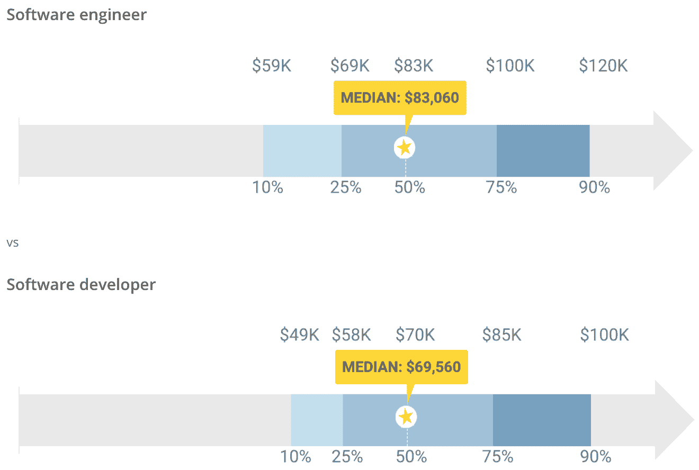

# 软件工程师与软件开发人员:有什么区别？

> 原文：<https://simpleprogrammer.com/software-engineer-vs-software-developer/>

Pinpointing the differences between a software engineer and a software developer is a complex issue. The IT-sphere has always been attractive to those interested in a career in software, but they may not know whether software engineering or development is the right path for them. .

本文将指出这些职业之间的主要区别。阅读我们的指南后，你不仅会知道这两者之间的主要区别，还能在它们之间做出正确的选择。

## 软件工程师的角色

软件工程是一个很难理解的领域，尤其是对于那些不涉及技术的人来说。它不仅需要计算机科学知识，还需要耐心和毅力。您需要不断跟踪计算机世界的最新创新，进行逻辑思考，并与您的客户和队友合作。

如果你从来没有讲过外语，独自想弄明白就像自学中文一样。所以我们将冒昧地扮演一个“[中文导师](https://preply.com/en/skype/chinese-tutors)的角色，为你澄清一下。

Good old Wiki [将软件工程师](https://en.wikipedia.org/wiki/Software_engineer)定义为“将软件工程原理应用于计算机软件的设计、开发、维护、测试和评估的人。”

因此，一名软件工程师应该具备全方位的技能和经验，以及以下方面的大量理论知识:

*   数学
*   硬件体验
*   程序设计经验
*   耐心
*   管理
*   解决问题
*   不断专业成长的能力

作为一名软件工程师，你的工作将涉及与其他团队成员的频繁协商——你将需要将某些特定的任务和命令翻译成编程代码。因此，软件工程师应该准备好与业务开发人员、营销人员和其他团队成员进行频繁的交流，以帮助项目实现其业务目标。

## 软件开发人员的角色

软件开发人员负责计算机程序(也称为软件)的编程、管理和定制。他们的主要职责是生产高效的代码和编写程序代码以供参考。软件开发人员的工作是基于逻辑的创造力。

拉斯姆森学院将一名成功的软件开发人员的基本技能定义如下:

*   爪哇
*   结构化查询语言
*   [软件工程](https://simpleprogrammer.com/interview-secrets-programmers-stand-out/)
*   Java Script 语言
*   计算机编程语言
*   微软 C#
*   Linux 操作系统
*   饭桶
*   神谕
*   DevOps

除了熟悉计算机语言，软件开发人员还必须具备很强的分析能力，能够将客户的需求与软件能力进行比较。

其次，多任务处理能力是一个巨大的优势。这将有助于他们在不同的开发阶段从事不同的项目。

沟通和反馈技巧、灵活性、符合客户需求以及关注细节也很重要。就像滚雪球效应一样，小错误会导致严重的问题。

最后，软件开发人员有高度的责任感。他们不仅要设计满足用户需求的软件，还要在发布前进行测试。

## 软件工程师和软件开发人员的区别

现在你已经熟悉了这两种职业的具体情况，我们将进入[对比](https://simpleprogrammer.com/differences-software-engineer-and-programmer/)。

在把你的注意力吸引到细节上之前，让我们澄清一下这两种工作之间最重要的区别。

Liberty IT 的运营总监费利姆·安东内尔(felim Schmidt)在区分软件开发人员和软件工程师时说:“工程师和开发人员的区别在于，开发人员接受功能规范，并在严格的参数范围内交付所需的代码，本质上是孤立地完成任务。”

软件工程师通常在更大的范围内工作，并将工程原理应用于软件开发，这意味着软件工程师不仅执行任务，还设计程序的整体架构。

还有另一种表达方式可以简单而准确地帮助你区分这两种专家:软件工程师可以是软件开发人员，但软件开发人员不能是软件工程师。

这是为什么呢？开发人员是与程序一起工作的人，而软件工程师是为程序精心设计基础的人。让我们更详细地讨论一下。

*   软件开发人员是沟通者–首先，软件开发人员是沟通者。他们从未在没有与客户交谈并弄清楚他们的软件需求的情况下开始开发过程。

*   **软件工程师的职责范围更广**——与软件工程师相比，软件开发人员的[职责](https://www.amazon/dp/B0812C82T9/makithecompsi-20)更加有限。软件工程师的工作需要更多的创造力和解决问题的能力。

*   **不同的设计理念**–软件工程师和软件开发人员的工作原理相同，但设计理念不同。

*   **关注点不同**–软件开发人员更加注重细节。软件工程师更专注于结构设计和消除技术债务。

*   **软件开发是关于创建功能性程序的**–最后，软件工程和软件开发的一个主要区别是前者监督工程，而后者专注于创建功能性程序。

也有一些标准需要讨论，以真正澄清这两种职业之间的所有差异。我们将评估薪水、工作量和工作机会。

### 工资差异

选择工作时，薪水往往是一个决定性因素。此外，IT 领域的工资一直很有吸引力。根据 Glassdoor.com 的说法，一名软件开发人员预计年收入约为 8 万美元，即每月 6700 美元。相比之下，一名软件工程师的年薪约为 10.3 万美元，或每月近 8600 美元。这是一个很大的区别，因为工程师的职责范围更广。

来源:devskiller.com

### 谁的工作压力更大？

我说的“有压力”是指耗费时间和精力的工作，包括与人合作和高度的责任感。

说实话，在分析这方面的时候，我发现两个职业压力一样大。正如我在上面提到的，软件工程师和软件开发人员都执行许多复杂的任务。

### 工作机会呢？

当获得学位时，你肯定希望有很多工作选择。这就是为什么我决定在我的比较中包括这个因素。如果你的专业提供了广泛的工作机会，那么你将更有可能找到你喜欢的东西。

谈到职业选择，软件工程师有更多的选择自由。他们可以使用 web 应用程序、系统、应用程序开发、UX 分析、数据分析等等。软件工程师有一个通用的知识包，所以他们可以随时改变他们的活动领域。

另一方面，软件开发人员的选择有限——这些技术人员可以担任前端或后端开发人员。

## 明智地选择

读完这个指南后，你可能会认为成为一名软件工程师更有声望，因此也更好。说实话，我不确定这种“更好-更坏”的比较在这里是否合适。这两种职业都有广泛的挑战和基本技能。

尽管在技能、学位、总体职责、工作动力、开发生命周期中的角色和开发方法方面存在显著差异，软件工程和软件开发对招聘人员都很有吸引力。

可以肯定的是，选择了这些职业中的一个，你会觉得不缺钱和工作机会。