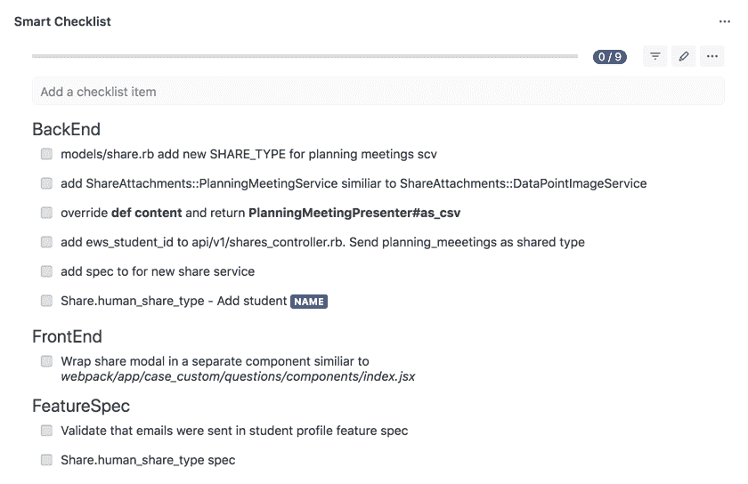
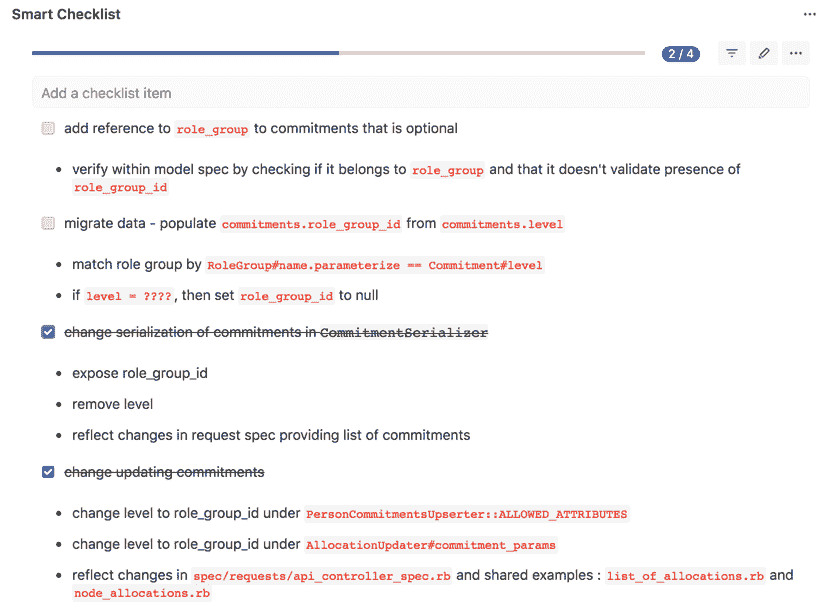
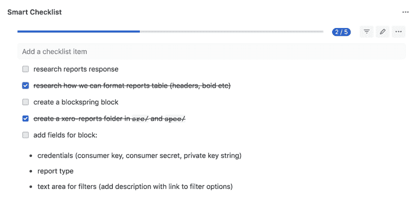

# 开发人员应该写软件实现计划吗？

> 原文：<https://simpleprogrammer.com/software-implementation-plan/>

<figure class="alignright is-resized">

</figure>

如何评价专业软件开发公司的工作成果？我们 Railsware 相信，人们可以通过最终产品的质量和商业成功来判断它。

“伟大产品”的结果不仅仅依赖于软件开发技能，还包括团队在整个过程中利用的整个过程和方法。

适当的规划站在高质量产品的最前沿，为团队提供了一个提出和执行最佳技术解决方案的机会。

因此，在本文中，我将描述软件实现计划，这个概念有助于新特性开发的计划阶段，并且发生在实际实现之前。

然而，让我们诚实地说:人们通常不愿意通过在日常工作流程中增加额外的步骤来进行实验，因为没有任何证据表明后者会对他们的工作有益。这就是为什么他们应该试一试。

## 什么是实施计划？

软件实现计划是一个详细的清单，在用户故事实现开始之前放在一起。换句话说，它是由工程师为他/她自己或任何其他工程师编制的用于执行任务的逐步说明。

首先，实践实施计划可以确保您的团队:

*   深入每个用户故事，学习如何进行精确的资源估计
*   获得结构清晰的文档，这使得执行更快更容易
*   在开始编写代码之前，有机会仔细考虑任务

但是这并不是一个完整的好处列表。请继续阅读，了解更多信息。

## 我们如何执行实施规划

所以，整个过程看起来如下。我们从选择下一个 sprint 的用户故事开始。之后，要求工程师创建一个逐步实施计划，以完成特定的用户故事。

实施计划通常包括:

*   完整的文件路径
*   文件中应该更改的方面(例如，“将 param **student_id**添加到* * API/v1/shares _ controller . Rb * *”的强参数中)。
*   在测试中——需要用新的测试更新的确切的文件或上下文，指出它们应该覆盖的其他区域

一般来说，我们尽量避免含糊的地方，比如(“添加规范”)，而是更具体地说明应该添加的测试。

为了使实施计划更容易阅读，我们倾向于构建一个带有按主题划分的副标题的清单，例如:

*   前端
*   后端
*   另一项服务
*   用户界面库
*   功能规格

在实施过程中，不一定要遵循最初计划的顺序，因为它可能会在实施过程中发生变化。

您应该考虑的其他重要方面包括:

*   计划是动态的，在实施过程中可能会修改
*   实施计划的创建和执行可能由两个不同的人来完成

要记录实施计划清单，您可以使用以下任何工具:Trello(内置功能)、Clubhouse 或[吉拉附加产品智能清单](https://marketplace.atlassian.com/apps/1216451/smart-checklist-for-jira-enterprise?hosting=cloud&tab=overview&utm_source=sprogram&utm_medium=referral&utm_campaign=implement-plan)。

<figure class="wp-block-image">

</figure>

<figure class="wp-block-image">

</figure>

<figure class="wp-block-image">

</figure>

### 计划应该有多详细，为什么？

实施计划的存在应该给任务一个明确的确定性，使执行者更容易理解、评估和完成。

除其他外，这一计划的核心要求是:

*   它必须包括必要数量的细节，以便那些没有参与制定计划的人能够容易地理解。换句话说，你团队中的任何人都应该能够根据你的指示开始执行任务，而不需要额外的咨询。
*   理想情况下，它应该包含完成一个故事所需的所有变化。

对于更复杂的故事，一旦任务没有任何不确定性，就可以认为实施计划“完成”了。

然而，我建议只用一天时间来准备计划。

我们通常分配这段时间来编写实施计划，以便:

*   确保它将在迭代开始之前准备好
*   消除由于创建计划所需的额外时间而无法达到迭代目标的风险

因此，这种时间限制促使工程师在短时间内更深入地研究用户故事的本质，并将发现记录为实施计划的行动步骤。

### 将实施计划应用于客户的项目

<figure class="alignright is-resized">

</figure>

在我的团队中，单个软件开发迭代通常持续两周。在下一个 sprint 开始之前，我们会召开一个计划会议，同步我们将要处理的用户故事列表。在我们评估即将到来的迭代的故事之前，准备好实现计划是一个好主意。

这种方法可以帮助团队:

*   对用户故事需求有更深的理解，即使是小细节也要考虑进去
*   事先提出问题并解决不确定性
*   深入了解用户情景的复杂性，这将有助于以后做出精确的评估
*   调查和头脑风暴一些解决方案的方向和变化，并选择最好的一个

## 为不同类型的任务创建计划

任务类型会影响工程师选择创建实施计划的方式。在开始起草之前，人们可以根据任务中存在的不确定性程度来区分任务。这些知识允许开发人员将正确的方法应用到实现计划中，让他们提出一个清晰的指南来支持软件开发活动。

### 小而明显的任务

当你在做一个小而明显的任务时，似乎不需要实施计划。

但是如果你仍然决定花时间制定一个计划，你将能够:

*   将这项任务交给另一位工程师，即使他们是项目的新手
*   向产品经理详细解释这项任务涉及的所有阶段

值得注意的是，如果你正在从事的项目本质上是复杂的，那么即使是最小的和最明显的用户故事，作为更大任务的一部分，也会比乍看起来困难 10 倍。而且，如果一个项目很简单，准备一个计划将会是一件超级简单的工作。
T1。leader-2-multi-119{border:无！重要；显示:屏蔽！重要；浮动:无！重要；行高:0；边距-底部:15px！重要；左边距:0！重要；右边距:0！重要；margin-top:15px！重要；最大宽度:100%！重要；最小高度:250px 最小宽度:250 像素；填充:0；文本对齐:居中！重要}

所以，要自信，看一看代码，写一个计划。

### 具有某种程度不确定性的任务

如果你发现一项任务的某些方面不清楚，在写计划之前进行试验总是一个好主意。

例如，您可以:

*   写一些代码
*   启动 web 服务器/SQL 控制台，并进行查询

这时你会明白是什么阻碍了你的活动，以及要继续完成任务需要做些什么。此外，这也是您在实现过程中无论如何都会做的活动。

### 完全不清楚的任务

<figure class="alignright is-resized">

</figure>

有时，完全不清楚实现过程会是什么样子，包括使用什么框架或更新应用程序的哪个部分。

现在正是时候:

*   打开代码，试着理解它是如何工作的
*   开始写代码和实验

在深入这个话题之后，你会对这个任务有更好的理解，并且能够记录那些变得清晰的小事的清单。

如果在为一个故事做了两到三个小时的计划后，你仍然经历着高度的不确定性，将这一事实传达给项目经理(和其他利益相关者)，并要求额外分配一到两天的时间用于技术高峰(这是一个完全不同的故事)。

一旦所有不清楚的故事都被写下来，你就会确定它们确实不清楚，并且会明白为什么。

## 没有实施计划的后果

我时常观察不同的人如何对待将实施计划作为他们工作流程的一部分的想法。他们中的一些人对详细的分步说明非常感兴趣，而另一些人则根本不愿意使用这种方法。

因此，忽略软件实施规划会带来以下后果:

*   用户情景估计通常是不准确的。
*   任务通常以低效的方式完成，或者比预期花费更长的时间。
*   根本不考虑替代方案。

将以上几点转化到现实世界中，我们会遇到这样一种情况:开发人员仅仅根据他们的第一印象来评估任务。最终，一个被给了两分的用户故事无法在两周内交付。

## 实施计划的利弊

每种方法都有自己的优点和缺点，实施规划也不例外。

### 赞成的意见

*   这种方法确保团队能够:
    *   对用户故事进行准确的评估
    *   理解所有的复杂性
    *   在规划阶段发现任何障碍，减少技术债务
    *   互相分享知识

*   记录为核对表的实施计划提供:
    *   任务的清晰结构
    *   跟踪进展的机会

*   提供详细的行动计划可以节省时间，并通过以下方式优化整个开发流程:
    *   允许您在编码之前考虑所有可能的选项和场景
    *   从一开始就展现了全貌
    *   让您可以轻松地与团队成员以及外部专家同步
    *   允许您轻松地将任何任务委派给其他团队成员

### 骗局

重要的是要记住，实施计划从来都不是完全完美的。它需要不断的改进。这需要时间去创造。

1.  这就是为什么，如果你在为一个客户工作，很难解释和说服他们让团队花一整天的时间在计划而不是编码上。

1.  你不会马上看到好处。记住“熟能生巧”，你应该准备好犯错误，直到你开始利用这种方法的优势。

1.  你必须与你的自我斗争，它肯定会说“我是一个忍者；我的头脑和任何计划一样清楚，所以我会在没有任何援助的情况下，立刻把它钉死！”并承认你不是忍者。

## 软件实施计划入门

<figure class="alignright is-resized">

</figure>

如果你相信，我会留下这个“入门”建议，这样你就可以马上开始起草实施计划:

*   首先从为简单的用户故事创建计划开始练习。
*   让其他工程师“阅读”你的计划，让你知道它是否足够详细。
*   尝试实施计划结构，并找到一个您的团队成员随时都能轻松理解的结构。
*   根据你的计划做出估计，然后与实际结果进行比较。
*   学会坚持计划，同时保持灵活性，这样你就可以在需要的时候改变它。
*   当执行者在研究计划后，对任务没有不确定性时，停止工作。
*   不断学习，记住熟能生巧！

我希望这篇文章对你有用，我很高兴知道你对实施计划的看法，你是否在工作中应用它们，以及你可以分享的任何其他伟大的经验！