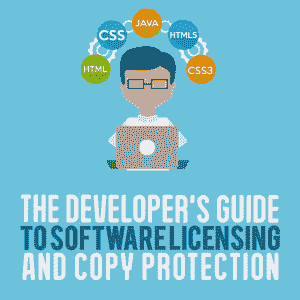
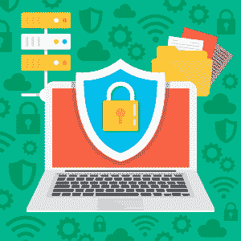

# 软件许可和版权保护开发者指南

> 原文:[https://simple programmer . com/software-licensing-copy-protection/](https://simpleprogrammer.com/software-licensing-copy-protection/)

Consider these statistics from the [2018 BSA Global Software Survey](https://gss.bsa.org):

*   未经许可的软件占全球个人电脑上安装的所有软件的 37%。
*   全球未授权软件的商业价值超过 460 亿美元。
*   来自未授权软件的恶意软件每年给全球企业造成近 3590 亿美元的损失。

美国知识产权盗窃委员会估计，每年软件盗版、商业秘密盗窃和假冒商品造成的损失高达 6000 亿美元。

根据[商业软件联盟](https://www.businessinsider.com/software-piracy-rates-and-value-by-country-2016-7)的数据，如果你认为这主要是开发商对[在美国以外分发软件](https://simpleprogrammer.com/best-practices-deployment/)的担忧，那么值得一提的是，软件盗版的成本在美国比任何其他国家都高——其次是中国、印度、法国和英国。

一位开发人员简洁地解释了为什么软件开发人员在软件复制保护方面进行了适当的投资:

“我花了 10 年的时间开发这个软件，并不是为了让它可以被免费赠送。我需要一种更好的方式来保护它。”

简而言之，作为软件开发人员，您应该首先考虑软件许可。

## 为什么软件安全性很重要

简而言之，人们很差劲。不是大多数人，但是少数坏苹果造成的伤害比大多数诚实善良的人造成的伤害加起来还要大。

虽然大多数人会诚实地为您的软件付费，并且不会滥用它，但仍有一些人会使用未经许可的软件副本，出于转售的目的而窃取软件，或者对软件进行反向工程，只是为了表明他们拥有软件。

作为开发人员，您已经花费了无数的时间来计划、设计和编写软件来解决某个问题。你最不希望的就是有人窃取你的辛苦成果并从中获利。

软件安全性差的另一个较少被考虑的副作用是对你声誉的潜在损害。

根据 BSA 的数据，来自未授权软件的恶意软件每年造成近 3590 亿美元的损失。如果一家公司认定你的软件，即使未经许可使用，也会带来恶意软件并造成损害，那么这家公司会在下次购买软件时再找你吗？大概不会。

即使他们知道软件是未经许可的，让公司直接承担责任，你仍然必须做损害控制，以确保没有其他人受到你的恶意软件版本的影响。

最好的做法是在软件发布之前保护它。

好消息是:根据 BSA 的调查，那些“采取务实的措施来加强软件管理”的企业利润增加了 11%。

事实上，保护你的商业秘密和品牌有明显的底线利益。这些包括避免不必要的成本，更不用说与回溯和用适当的保护重新发明你的软件相关的挫折。毫无疑问，致力于开发你的软件比试图把它赢回来要好。

## 如何保护您的软件

有许多供应商提供软件许可和安全性，但是首先你必须问自己一些重要的问题来决定如何进行。

当保护您的软件时，您必须问的第一个问题是，您实现软件安全性的主要目标是什么？是为了防止盗版吗？防止逆向工程或误用？还是完全是别的什么东西？

然后，您应该询问您的应用程序需要什么级别的安全性。自行车锁可以吗，或者你想要更像诺克斯堡的东西？大多数开发人员在谨慎方面犯了错误，实现了比必要的和通常推荐的更多的安全性。

最后问问自己想在软件安全上花多少钱。这个问题没有正确的答案，所以你需要货比三家，感受一下你决定实施的选项的价格。

一旦您确定了您的需求、预算和安全级别，您就可以开始考虑您的保护选项。

## 保护的关键要素

软件复制保护始于您的许可策略，在该策略中，您将决定如何获得软件补偿。一些常见的许可策略包括:

*   **永久的。**一次性付款允许无限制访问应用程序。
*   **基于特征。**购买软件，并通过额外购买解锁附加功能。
*   **时基。**软件的租期是特定的，到期后可以续订。
*   **分层的。**软件版本根据可用功能的数量提供，例如，银牌、金牌或白金。

一旦你有了一个许可策略，你就可以找到一个解决方案来执行这个策略，使它很难或者几乎不可能被绕过，这样你就可以为每个用户获得正确的货币价值。

您的软件拷贝保护策略应该考虑您的软件将在哪里发布。它会连接到互联网吗？它会在标准的 PC/MAC 或嵌入式设备上运行吗？在软件版权保护中，没有“一刀切”的方法。寻找符合您所有标准的解决方案。

您还需要一个反映您所需安全级别的解决方案。一个方便的类比:你不应该把你的自行车锁在诺克斯堡来保证它的安全，你也不应该用自行车锁来保护希望钻石。您的保护应该与软件的价值相匹配。

通过解决这些问题，您可以确定基于软件还是基于硬件(或混合)的解决方案是最佳选择。

### 保护类型

Let’s run through the major options for software copy protection, including the cost, level of security, and implementation in each case.

**荣誉制度。**
前期费用为零，希望每个购买你软件的人都拒绝分发它，所以你为每个用户付费。不需要任何设置或实现:只要点击 compile，就可以开始分发了。问题:随着用户数量的增长，从数学上来说，有些用户会有意或无意地分享它，这几乎是不可避免的。不用说，你在荣誉系统下的安全等级实际上是不存在的。

**基于软件，无互联网连接。**
这往往是一个低成本的选择。基于软件的解决方案的实现通常在软件编译后进行。通常，带有一些配置设置的软件包装用于保护应用程序。当软件由最终用户运行时，它不会连接到任何受保护的资源。因为所有许可参数都在运行该软件的计算机上，所以未经授权的使用相当容易。基于软件的解决方案的安全级别处于中低范围。

**基于软件，具有互联网连接和激活功能。**
与许可服务器的必要连接通常会导致高昂的设置成本，外加经常性费用。同样，使用软件包装器来实现保护，但是因为需要互联网连接，所以包装软件提供的选项更加健壮。附加选项允许更好地了解软件的使用位置、使用方式以及是否以未经授权的方式使用。因为总是需要互联网连接，所以某些位置可能会被排除在外。保护处于中等到强的范围，因为许可参数保持在安全许可服务器上的异地。

基于硬件的保护。
安全性非常强，因为许可包含在 USB 硬件安全加密狗中，不需要互联网连接。每个加密狗的每许可证成本很低，并且不涉及经常性许可费用。可以使用应用程序接口(API)或软件包装来实现。

## 安全加密狗的主要优势

USB 硬件安全加密狗是软件许可和安全的最佳选择。它们可以使用软件包装快速而容易地实现。为了获得更大的灵活性，可以将 API 集成到您的软件中，为了获得最大的安全性，可以使用软件包装和 API 集成。

安全加密狗具有多种优势，首先是外形。物理密钥的存在将许可证从计算机硬件中移除。由于外部密钥位于操作系统之外，安全性非常高。

将许可证从一台计算机移动到另一台计算机就像从一台计算机上移除 USB 并将其插入另一台计算机一样简单。不能读取或复制安全物理加密狗密钥。

使用 USB 加密狗，无需联系许可服务器，因此您可以在互联网连接受限或被阻止的地方部署软件。这包括高安全性位置，如政府设施和互联网流量受到严格监控、限制或禁止的区域。加密狗消除了为不同环境提供不同解决方案的需要。

USB 加密狗的其他优势包括:

*   **提高知识产权(IP)的安全性。**加密狗的固件和您的软件之间的紧密集成使之成为可能。
*   **灵活的许可选项。**您建立和执行*许可的选择*几乎是无限的。
*   **实施异常容易。**一流的加密狗解决方案可以在几分钟内实施，而不是几天、几周或几个月。
*   多平台支持。 USB 加密狗可以支持所有版本的 Windows 以及 Mac 和 Linux 系统。

## 从您的 USB 加密狗资源中可以获得什么

Should you choose this option for protection, in addition to first-rate protection, your chosen dongle supplier for software copy protection should deliver:

*   **易于实施**。
*   **生产加密狗交货速度**。你不希望等待你的供应商卖出更多的软件。
*   **灵活性**实施和定制解决方案以满足您的需求。
*   软件许可远非一刀切。
*   **安心**了解您的供应商拥有良好的业绩记录，并将在您应用的整个生命周期中提供支持。
*   **支持**帮助实施解决方案，并在软件升级时提供持续支持。

## 不要让别人从你的努力工作中获利

虽然软件盗版率在过去两年下降了 2 %,但仍占个人电脑安装软件的 37%。盗版的轻微减少并不意味着你可以忽视软件许可和安全。

你已经在工作中投入了数百甚至数千个小时；你最不希望的就是你的努力成果被人偷走。在发布任何软件之前，您应该考虑如何许可和保护它，如果您已经发布了没有保护的软件，您可以追溯性地添加安全性以防止将来的伤害。