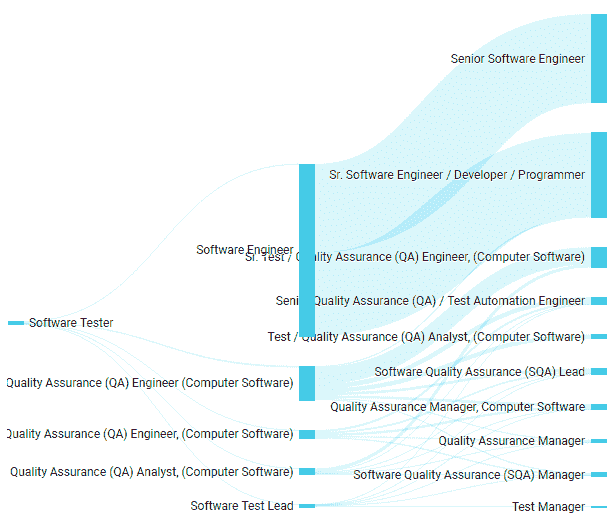

# 为什么选择软件测试作为职业道路？

> 原文：<https://simpleprogrammer.com/software-testing-career/>

If you’re here, that simply means you’re stuck making a vital decision: ***Should you choose software testing to bolster or even start your career, or not?***

软件测试适合你吗？你应该从哪里开始？你该怎么办？你为什么要跟着它走？还有一千多个问题…

有许多文章向你保证为什么或为什么不，你肯定也读过它们。但我们会帮助你，让你不再进退两难。

在这里，我们编制了一个全面的列表，将帮助您做出决定。那么，我们开始吧。

## 软件测试人员是为具有挑战性的工作环境而生的

如果你喜欢接受新的挑战，那么软件测试就适合你。

我们不仅仅声称。软件测试每天都会带来很多挑战。在某些日子里，挑战是连续工作很长时间，而在另一些日子里，挑战是一遍又一遍地重复相同的过程而不感到疲倦，以便找到一个正在动摇整个系统的错误。

软件测试人员喜欢挑战，他们有能力在大多数人之前发现错误。

## 你可以享受每天的工作

软件测试是一个完全动态的领域。它千变万化。在软件开发领域，没有一种技术能够统治世界很长时间。

作为一名软件测试人员，你了解到[惊人的新技术每天都在你的行业中出现](https://www.lambdatest.com/blog/top-trends-in-software-testing-infographic/)，并且也有机会与它们一起工作。不会因为单调的工作程序而感到无聊。

除此之外，那些不会编码的人会成为测试员的神话正日益被打破。例如，许多自动化测试人员编写代码来自动化测试脚本。因此，[成为一名软件测试员](https://simpleprogrammer.com/discover-my-passion/)并不意味着你将会有一个固定而单调的日程。有时你会参加测试狂欢，而在其他日子，你可能会写脚本或与客户交谈。

### 灵活有趣的工作环境

软件测试是一个灵活的领域。如果你是一名测试人员，你不一定需要致力于日常的案头工作。你可以在旅途中工作，在舒适的家中工作，或者在最近的星巴克工作。

不仅如此，你还可以和很多人互动，享受真正的乐趣！你可以和客户讨论项目，交流信息和经验。谁不喜欢呢？

## 很有创意

在回顾了软件测试员的工作概况之后，可以说这份工作与开发人员的工作相比更有创造性。

“再多的测试也不能证明一个软件是对的，一次测试就能证明一个软件是错的。”

因此，几乎每个月您都有机会熟悉从未见过的功能。你开始设计测试用例，创造性地思考，以确保你已经覆盖了用户可能要求的所有内容。不用说，所有这些都需要创造力。

## 这是一条可靠的职业道路

成为一名软件测试员是一种时尚，而且不会很快过时。这个领域永远是动态的，并不断见证新技术和新途径的兴起。方法已经从手动变成了自动，测试平台也从电脑变成了移动设备，*但是仍然有需求！*

事实上，对软件测试人员的需求如此之大，以至于超过了供给。对于雇主来说，找到好的软件测试人员无异于一个挑战。在这种情况下，成为一名合格的测试人员可以为你的技能获得可观的报酬。

### 有诱人的薪酬和发展空间

几乎每个人在某个时候都梦想着少工作多赚钱。(我也有同样的愿望。)

软件测试，作为一个职业，有**惊人的成长机会**。这是选择 it 作为职业道路的主要原因之一。根据[薪级表](https://www.payscale.com/research/US/Job=Software_Tester/Salary)，美国软件测试员的平均年薪是 55565 美元。

对新人来说，报酬可能相对较少，但这是意料之中的。当你往上爬的时候，报酬自然会开始增加。

一个鲜为人知的事实是，有经验的测试人员和开发人员挣的钱差不多。事实上，许多公司愿意向自动化测试人员支付可观的费用，因为他们认为测试是一项值得的长期投资。

毕竟，你不会永远是一个测试者！一个拥有几年经验和技能的测试人员通常可以被提升到测试主管、项目主管、自动化架构师，甚至测试经理的职位。

很有趣，不是吗？

## 有很多尝试的机会

软件测试是关于实验的。新技术和技巧正被迅速引入，这将使任何人对未来的可能性感到惊讶。

例如，几年前所有的测试都是手工的，甚至没有人关心跨浏览器测试。但是现在，我们已经看到了导致跨浏览器测试的设备数量的巨大增长，我们也有许多[跨浏览器测试工具](http://www.lambdatest.com)来帮助我们进行跨浏览器测试。

随着技术的进步，软件测试人员有机会做更多的实验，学到更多的东西。

## 学术背景不是必要条件

从事软件测试最大的好处是你不需要有一个严格的学位。你所需要的只是激情、热情、学习和实验的热情，以及解决问题的能力。但是如果你有软件工程、IT 或计算机方面的背景，那么这对你来说是一个优势！这种经历可以让你走在招聘曲线的前面。

## 它打开了通往许多其他职业道路的大门

软件测试为你打开了许多其他惊人职业机会的大门。一旦你掌握了手工测试，你就可以进一步发掘你的潜力，成为一名业务分析师、性能测试人员，或者仅仅是一名自动化测试人员。

在下图中，你可以看到一个软件测试人员有多少职业选择。

## 明智地选择你的道路

我们希望你已经对探索软件测试能带你去哪里感到足够兴奋了。

你的职业选择或工作不是你谋生的事情。它占据了你一生的大部分时间，并对你的为人产生了深刻的影响。因此，非常仔细地选择你的职业方向并且不要在以后感到后悔是非常重要的。

考虑所有的优点，权衡所有的缺点，直到你准备采取行动。如果你有更多的疑问，请在这里留言，我很乐意帮助你。

测试愉快！