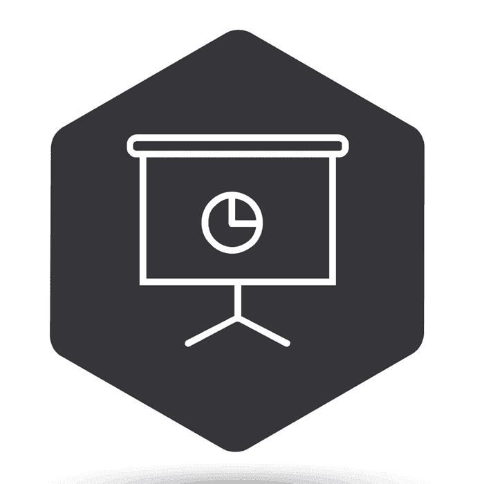

# 软件开发人员演讲和会议指南

> 原文：<https://simpleprogrammer.com/speaking-conferences/>

软件开发会议为你的职业发展提供了许多机会——并建立罕见的程序员公开演讲的软技能。

正如我们在网络一章中所讨论的，参加会议可能是一个很好的社交机会，但它们也是**向该领域一些最先进的程序员学习的好地方。**

但是如果你真的想从软件开发会议中获得最大的收益，你必须成为一名演讲者。

作为一名演讲者，你将建立自己的个人品牌，与其他演讲者和会议主持人建立联系，甚至可能招揽一些副业或咨询工作。

我知道这一切看起来有些难以承受。

但是不用担心。

本章的目的是**给你一些指导，告诉你如何在软件开发会议的世界里导航，如果你愿意的话，开始在较小的活动和最终的会议上演讲**。

## 参加会议

正如我之前提到的，仅仅参加会议——即使没有在会上发言——也是非常有益的。

我个人认为，所有寻求职业发展的软件开发人员都应该每年至少参加一次软件开发会议。

花几天时间专注于学习和社交是非常有价值的。

会议的一大好处是，它让你脱离正常的环境，强迫你集中注意力几天。

每次我去参加一个会议，不管我是否在发言，我都会带着大量的新联系和新想法离开，我通常都很兴奋。

## 但是会议是昂贵的

这是真的，很多都是。

但是也有很多价格合理的。

四处搜索，寻找你所在地区可能发生的事件。

通常你可以使用像 Lanyrd.com 或 T2 这样的网站来寻找你可能有兴趣参加的会议。

此外，根据你的工作地点，你也许可以让你的老板支付你去参加会议的费用。

通常，说服你老板让你每年参加一次会议并不困难，尤其是如果你强调培训方面的话。

试着吸引你从会议中学到的东西和带回来的信息。

一个好的策略是**根据你从会议中学到的东西，为你团队中的所有其他开发人员组织一次培训。**

这样，你的老板就可以计算出送你去参加会议的费用，然后除以你团队中软件开发人员的数量，得出一个小得多的总培训费用。

最后，**考虑发言。**

我们将在这一章的后面详细讨论这一点。

但是通常当你在会议上发言时，你可以免费入场，甚至可以报销旅费。T3】

所以，如果你真的想参加会议，但负担不起，演讲是一个很好的选择。

## 在会议上做什么

好的，你要去参加一个会议，但是当你到达那里的时候你会做什么呢？

你如何充分利用它？

它实际上在你到达会议之前就开始了。

你应该做的第一件事是看一下会议日程，计划一下你的议程。

你想参加什么会议？

你想听哪些演讲者？

花些时间提前计划好你的日程，这样你就知道到了那里该做什么。

你也可以考虑提前一天左右到场，参加一个会前活动，甚至自己主持一个活动。

通常在会议前后会有非正式的晚宴和活动，这为你提供了一个与较小人群交流的好机会，并可能有一些时间与会议上的发言者或组织者直接交谈。

弄清楚谁要去参加会议，以及你可能想见谁，这也是一个不错的主意。

通常，我会发现有一些我想见的特定的人，他们碰巧参加了我将要参加的会议或者在会上发言。

在很多情况下，我会提议请他们吃饭，边喝咖啡边安排一次快速会面，或者只是记下我需要在那里试着偶遇他们。

这差不多涵盖了你的“会前游戏”

在会议上呢？

我强烈建议你尽可能多地利用你在那里的时间，尽可能多地与人交谈。

嘿，约翰，我怎样才能走到一个我不认识的人面前开始和他们说话呢？

老实说，你就这么做吧。

是的，我知道这可能很吓人。

是的，我知道你可能不知道该说什么，或者你可能害怕自己会说些愚蠢的话。

但是，这是一种后天习得的技能，如果你齐心协力去练习，它只会随着时间的推移而发展，恐惧不会自行消失。

通过交谈，你只会成为一个更好的——更少恐惧的——健谈者。

*但是，你说什么，你问什么？*

真的，这没什么大不了的，因为在这样的会议上，你会和你遇到的每个人有很多共同点，会有很多话题可聊，但是如果你真的不知道如何开始一段对话，这里有一些快速提示:

*1。试着赞美他们穿的衣服或他们身上独特的东西。这总是一个很好的谈话开始，因为人们喜欢谈论自己，他们通常也喜欢赞美。*

*2。试着问开放式的问题——不仅仅是“是”或“不是”的问题——尤其是关于他们自己的问题。“你怎么会在这里？你有什么故事？你从上次的谈话中得到了什么？”(只是不要一次问全。)*

*3。只是简单的上去介绍一下自己。我知道这看起来很无聊，但是这非常容易做到，在会议这样的活动中，这就是你所需要做的。*

*4。评论一些共同的经历或者身边正在发生的事情。“嘿，哇，那个戴大礼帽的家伙。我本来打算穿我的，但它在洗。”*

但是，就像我说的。最重要的是练习，养成无论在哪里都可以与人交谈的习惯。

不要坐在那里用你的笔记本电脑工作。

你可以在飞过来的飞机上或者回来的路上做这件事。

尽可能多的与人交谈，尽可能多的参加活动，最大化你的社交机会。

分发一些名片，准备一个“电梯推销”，这样你就可以用最多两到三句话来说明你是谁，你是做什么的。

应用我们在“网络和团体”中讨论的网络技术

## 讲

就我个人而言，我认为每个软件开发人员都应该试着开口说话。

我知道这可能会让你紧张和不舒服，但如果你能学会克服最初的不舒服，克服对公开演讲的恐惧，会有很大的好处。

最大的好处之一是树立你的声誉。

作为一名会议发言人，你可以在你的软件开发生涯中获得大量的机会。

在“创造声誉”这一章中，我们谈到了让你的名字出现，这是一个很好的方法。

作为一名演讲者，或者仅仅在几个活动上发言，有点像成为一名作家。

它给了你一定的威望，让你与众不同，并能大大增加你的感知价值。

另外，这也是让人们了解你的好方法。

这可能不如成功的博客或播客有效，只是因为你接触不到那么多的人，但由于这种媒体的个人性质，你会对你接触到的人产生更大的影响。

除了建立你的声誉之外，演讲也是作为一名软件开发人员建立甚至创建自由职业或咨询业务的好方法。

我认识几个每小时收费数百美元的软件开发人员，他们的主要业务来源是每年在各种软件开发会议上的演讲。

在会议上发言为你提供了一个独特的机会，让你可以站在潜在客户面前，展示你作为他们可能想要雇佣的专家的知识。

嘿，约翰，宣传我可以提供咨询服务可以吗？还是最好等着它出现？

如果你在一个会议或活动上发言，你不应该直接宣传你的服务，但如果你真的想最有效地推销你的服务，你应该在陈述中提到一些成功的客户或案例研究。

确保你的听众知道你是一名顾问，并且确实在你谈论的领域提供咨询，你的客户已经成功地利用了你。

我完全赞成进行有力而直接的推销，但在这种情况下，不那么直接的方式可能会给你带来更好的结果。

你也可以这样结尾:“如果你有任何其他问题或者有什么我可以帮你的，请不要犹豫，联系我”，然后提供你的联系方式。

这是获得潜在商机的好方法。

你会惊讶地发现，仅仅通过每年在一些活动上演讲，你就能招揽到多少生意。

此外，如果你喜欢旅行，演讲是以折扣价体验旅行的好方法，也有利于你的职业生涯。

演讲给了我访问世界上许多国家的机会。

就在今年，我在中国呆了三周，大部分行程都是免费的，因为我被邀请在那里的一个会议上发言。

## 开始讲话

所以你们都很激动。

你想环游世界。

你想结识新朋友，并开始一项咨询业务。

你想出去在软件开发会议上发言。

太好了！

不幸的是，**你不能只是自愿在大多数软件开发会议上发言**——尤其是如果你没有经验并且相对不为人知的话。

那么，如何开始呢？

嗯，就像生活中的所有事情一样，你必须从小处着手。

如果你没有在小型会议上发言，你就不会在大型软件开发会议上做主题发言。

如果你没有任何演讲经验，你可能不会在小型软件开发会议上演讲。

你需要做的第一件事是获得经验。

最好的起点之一是你目前的工作场所。

主动向你的团队介绍你正在学习的新东西。

你甚至可以考虑提供一顿棕色的午餐，你可以在午餐时间发表演讲或进行培训。

甚至不要担心成为一名优秀的公众演说家——迟早会成为的。

只要准备好你的陈述，尽你最大的努力去实现它。

如果你想擅长某件事 ，你将不得不吮吸很多，所以你最好学会吮吸。

在工作中做一些演示之后，一个很好的提升就是**在代码营或用户组**上做一次演讲，就像你在 Meetup 上能找到的那些。

代码营允许任何人注册发表演讲，所以他们是一个在你不认识的人面前获得演讲经验的好地方。

另一个你可以同时追求的伟大选择是加入演讲会。

演讲会是一个国际性的组织，它的俱乐部遍布世界各地，可能在你所在的地区也有很多，致力于帮助人们成为更好的公共演说家，并给人们提供在公共场合练习演讲的机会。

我今年(2016 年)加入了演讲会，我可以告诉你**这是一个非常支持和鼓励的环境。**

我强烈推荐它。

一旦你准备好进入大游戏，你可能需要向软件开发会议提交摘要。

通常会议会召集发言人，他们会正式要求发言人提交一份他们想要谈论的内容的摘要，也许还有一些他们发言的视频或他们之前发言的事件列表。

不幸的是，尽管会议组织者否认这一点，并声称这是精英管理，但事实并非如此。

在很大程度上，它仍然是一个“老男孩”俱乐部。

这意味着如果你想在更大的活动中发言，甚至被邀请在会议上发言，你需要发展关系，建立声誉。

但是，如果你有一些经验，并且写了一份非常好的摘要，它肯定能帮助你进入这个圈子。

我建议找人拍摄你在一个小型活动上的演讲，这样你就可以把它和你的摘要一起提交了。

通常，活动组织者害怕接受第一次或陌生的演讲者，因为他们不知道你是否真的能做到，或者你是否会在舞台上僵住。

你能做的任何缓解这种恐惧的事情都会帮助你被选中。

此外，当你开始时，你希望提交尽可能多的摘要。

如果你能提前和会议组织者谈一谈，问问他们想要什么样的演讲，怎样才能写出好的摘要，那就去做吧。

## 克服怯场

你知道什么是可怕的吗？

站在一群你不认识的人面前，让他们都盯着你，而你试图和他们说些什么。

是真的。承认就可以了。

这很可怕——嗯，至少一开始是这样。

我第一次站上讲台发表演讲时，我试图保持冷静和自信，但我的声音一直在颤抖——完全不受我的控制。

我的腋窝在流汗，在我的衬衫上留下了巨大的汗渍。

太可怕了。

我只是很高兴能结束这一切。

然后我又做了一次，得到了几乎相同的结果。

还是颤抖的声音，还是汗流浃背。

一次又一次。

但是你猜怎么着？

大约是第四次或第五次，我在众人面前发表演讲时，我感觉不那么紧张了。

不知何故，神奇地，我的声音保持住了。

不知何故，我没有用汗水湿透舞台。

不知何故，我实际上感到有点自信，也许有点精力充沛。

曾经可怕的只是有点可怕。

现在，当我站在舞台上时，我绝对喜欢它。

当我向一大群听众演讲时，我感到最有活力。

老实说，我想不出比这更好的感觉了。

但是什么改变了呢？

我是如何从害怕上台到自信并且乐在其中的？

老实说，最重要的是时间和经验。

恐惧往往是由未知引起的。

第一次上台，我们不知道会发生什么。

我们不知道会是什么样子。

我们不确定人们是否会喜欢我们，或者嘘我们，或者会发生什么。

但是如果你继续上台演讲，最终大部分神秘感都会消失。

你意识到，即使你可能没有拿出最好的表现，没有人嘘你，没有人向你扔臭鸡蛋……你活了下来。

所以，如果你想克服怯场，你必须走出去，去做。

不要等待勇气的到来，也不要等待你不再害怕。

那不会发生；勇气是不顾恐惧而行动，而不是在没有恐惧时行动。T3】

鼓起勇气，走出去，并愿意去搞砸。

不要害怕看起来像个白痴——我们都会时不时地这样做。

这就是你变得更好的方法。

## 一些实用技巧

我和其他人一样喜欢鼓舞士气的话，但实用的建议通常更有用，所以这里有一些。

首先，至少做五次。

在你决定它不适合你之前，上台演讲至少五次。

哦，这五次真的不算。

就上去做吧；不要担心结果。

如果在五次之后，你决定它不适合你，那么好吧，至少你尝试过。但是不要放弃，直到你至少在舞台上做了五次演讲。

第二，当你进入一个房间做报告时，提前 10 分钟到场。

不要摆弄你的麦克风或在舞台上踱步，而是走向前排的观众，介绍你自己并握手。

现在，当你登上舞台时，你的观众中至少会有一些你认识或者至少见过的人，他们会支持你。

演讲者走上前来和你交谈是一种荣幸。

它让你觉得自己很特别。

那些你刚认识的人会回报以额外的关注你所说的话，并积极鼓励你。

如果你在舞台上开始紧张，或者感觉到你的心跳开始加快，只要低头看看前排，那里会有微笑、鼓励的面孔。

我其实已经不需要这一招了，但我还是每次都这么做。

最后，**准备练习。**

你对一个主题了解得越多，准备得越充分，你就越不紧张。

当有人问你最喜欢的电视节目或电影或电子游戏时，你会紧张吗？

号码

你有很多话要说，甚至可能滔滔不绝。

但是如果有人问你关于核物理的问题，而你不是核物理学家或者没有奇怪的阅读习惯，你可能会更紧张。

所以，确保你很好地了解你的材料，并且你已经练习过很多次了。

站在镜子前发表你的演讲，为自己计时。

用摄像机录下你自己，然后观看。

## 准备演讲和幻灯片

我倾向于在演讲时不放幻灯片，或者尽可能少放幻灯片。

如果你的主题是高度技术性的，并且涉及到相当多的代码，这是不可能的，但是你仍然可以让事情变得简单和容易理解。

在一次谈话中，你应该努力只传达几个要点，而且都应该围绕一个大的想法。

如果你使用幻灯片，试着让它们尽可能简单。

不要制作包含大量文字的幻灯片，然后在演讲中朗读要点。

你的幻灯片应该提供额外的信息或视觉效果来增强你的演讲，而不是重复其中的内容。

简单是关键，娱乐也是关键。

如果你不娱乐别人，你就不能教他们。

作为主持人，你的工作永远是娱乐第一，教育第二。

当你没有引起别人的注意时，你不可能去教他们，如果你不让他们开心，你也不会引起他们的注意。

所以要确保你的演讲不无聊，简单易懂，并且在某种程度上很有趣。

可能是一些有趣的猫图片，可能是一些笑话或故事。

娱乐的方式有很多。

我不会给你一整本关于如何准备演讲和制作演讲幻灯片的论文，我会给你两本书作为参考。

第一种叫做[呈现禅。](https://simpleprogrammer.com/cg52-zen)

我强烈推荐这本书来学习怎样做一个好的、简单的演示。

你的幻灯片和你的观众会感谢你阅读这本书。

第二，我推荐戴尔·卡内基的优秀著作《公开演讲的艺术》

这是一本关于公众演讲的经典书籍，在那里我第一次听到这样的想法:

告诉他们你要告诉他们什么，告诉他们，然后告诉他们你告诉他们什么。

## 付费演讲

如果你说得足够多，或者你足够出名，或者你足够积极地为你的“演讲服务”做广告，你可能会有机会通过演讲获得报酬。想象一下。

当我第一次开始演讲时，我很荣幸能有机会在一个活动中发言。

但是过了一段时间——特别是在我的第一本书出版后——我开始收到很多演讲请求，并意识到如果我要花费所有的时间和精力去某个地方演讲，我需要开始收费。

不要误会，这需要相当多的时间和精力。

你必须预订机票，在某个地方出现，通常花两三天时间参加活动或旅行，准备你的演讲，排练你的演讲，发表你的演讲，然后再和别人谈论你的演讲

需要大量的后勤和时间。

在我意识到这一点并意识到我一年中能抽出的时间是多么少之后，我开始索要演讲费。

起初，我会要求报销差旅费和 2500 美元。

然后我开始要 5000 美元。

现在，至少在写这本书的时候，我的标准费用是 1 万美元。

我认识许多公开演讲人，他们的收费比这高得多。

著名作家和《呆伯特》的创作者，在他的优秀著作《[如何在几乎所有事情上失败，但仍然赢得大的](https://simpleprogrammer.com/cg52-fail)》中说，他的最高演讲费是 10 万美元。

所以，是的，你可以通过演讲赚很多钱。

现在，通常如果你在一个软件开发会议上发言是有报酬的，那将是一个主题演讲。

你一般不申请那些，有人邀请你演讲。

所以，你需要建立一个声誉，或者成为一个著名的演讲者，以便能够进入这个游戏。

在私人公司的活动中也经常有演讲的机会。

有人请我在公司活动上给软件开发人员做演讲，他们专门拨出一笔预算，请一位著名或半著名的演讲者来做演讲。

注意:**如果你真的想从事付费演讲，你可能不想做免费演讲，或者过于频繁地参加会议。**

我知道这看起来有点落后，但让我解释一下。

很久以前，当我还是一名“演员”在加州圣莫尼卡上表演课时，我的表演教练告诉了我一件让我记忆犹新的事情，因为它适用于许多不同的情况。

他告诉我永远不要报名当临时演员。

他说，“我知道你认为这是一个赚外快的好方法，你会进入真实作品的拍摄现场，面对选角导演，但如果你想成为一线演员或主角，就不要这样做。”

他接着说，一旦他们把你视为临时演员，你将永远是临时演员。

如果你愿意或曾经愿意无偿工作，甚至是为微不足道的收入工作，要说服某人付给你一大笔钱并认真对待你是非常困难的..

你不想和每一个参加会议的演讲者竞争，并希望他们被选中免费或免费演讲。

相反，如果你真的想成为一名专业的演讲者，拒绝大多数自由演讲的请求，建立一个稳固的声誉，从一开始就收费。

嘿，约翰，但是我怎样才能从代码营演讲变成收费的大型会议演讲呢？

实话实说，这并不容易，大多数人在这方面都不成功。

这当然是一个长期的策略。

*关键是名声和耐心。*

你必须利用本节中的其他技巧，建立足够的声誉，成为一个足够受欢迎的演讲者，让人们愿意付钱给你去演讲。

可能需要很长时间，或者根本不会发生。

你可以像大多数开发者一样，随时走免费路线，提交会议发言机会，但如果你想最终成为付费发言人，我的意见——我的表演教练的意见——是你最好从一开始就收费。

这样你就与众不同了，不用和大众竞争了。

## 出去做吧

如果你从未参加过软件开发会议，找一个好的，订几张票，然后去参加。

如果你对演讲有兴趣，选一个主题，做一些幻灯片，然后去做。

如果你不采取措施改变或改善生活，你的生活是不会改变的。

是的，我知道这很可怕。

如果你从未参加过会议，光是去参加会议就很可怕，但当你经常做那些让你害怕的事情时，它们最终会变成例行公事。

我从未想过我会去参加会议或在舞台上演讲，但我已经这样做了很多次，现在已经变得很自然——甚至令人兴奋。

然而最重要的是，克服那些恐惧，做那些起初让我感觉最不舒服的事情，正是这些事情最大程度地改善了我的职业生涯和我的生活。

所以，抓住机会。

你真的会失去什么？

* * *

