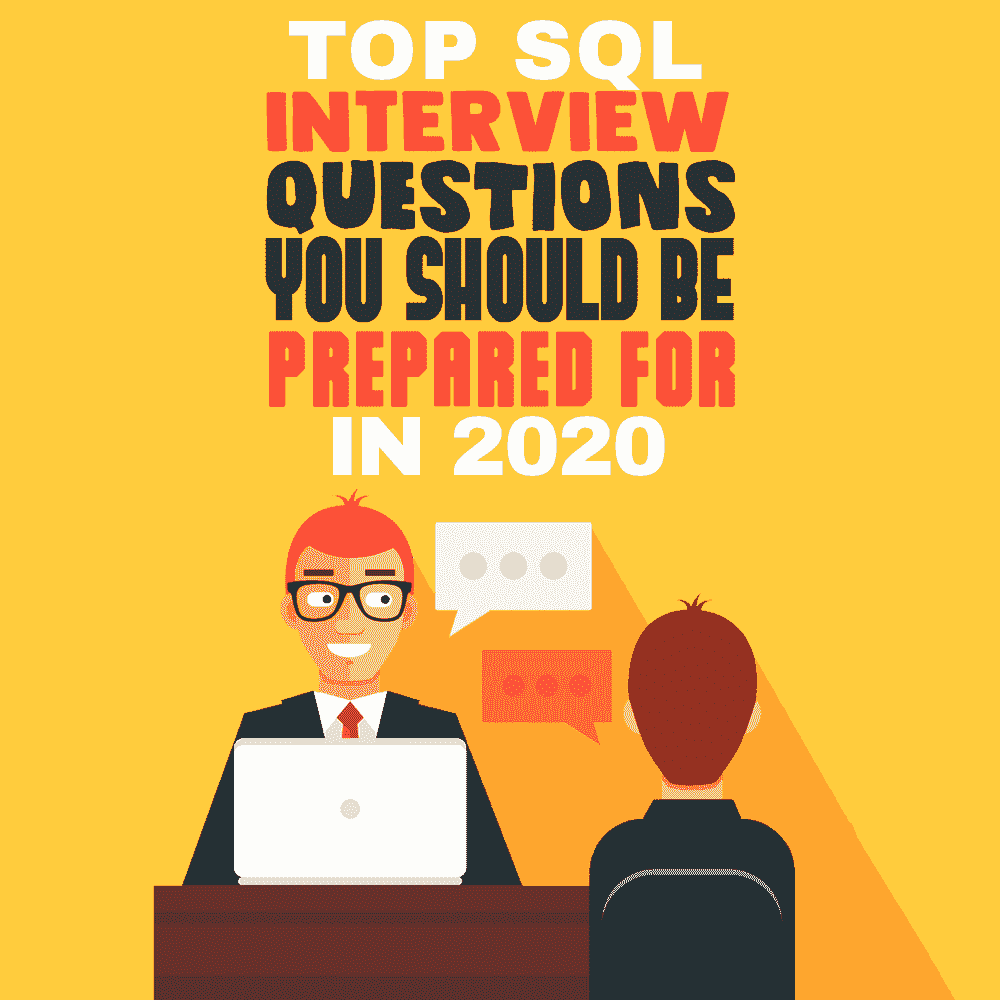

# 2020 年你应该准备的 SQL 面试问题

> 原文：<https://simpleprogrammer.com/sql-interview-questions/>

As a programmer on the path to [becoming an SQL developer](https://simpleprogrammer.com/become-a-sql-developer/), you’ve been working hard to learn data management. But even if you’re confident you can create and configure databases, there’s one crucial thing that stands between you and the job of your dreams: the interview.

面试让许多程序员新手感到焦虑，这是理所当然的。当你花这么多时间练习技术技能时，[建立自信](https://simpleprogrammer.com/build-confidence-start-writing-code/)似乎不是首要任务。然而，在面试的时候，一个自信的程序员会看起来更有能力，不管他们的实际经验如何。

你很幸运，有一个在面试前建立自信的可靠方法:学习在面试中你必须回答什么类型的问题。这样做，你不仅会有所准备，而且更有可能找到你梦想中的工作。

让我们来看看你可能面临的问题，确保你比竞争对手准备得更充分。

## 基本 SQL 问题

你会被问到的前几个问题将会是关于你的教育和以前的工作经验，这些都是非常基本的问题。这些问题将涵盖您对基本 SQL 特性和功能的理解。

其中最常问的一个问题是:**SQL 的子语言有哪些？**

面试官可能会要求你列出它们或者解释一下，比如说，DDL 和 TCL 之间的区别。

您可能还会遇到关于数据类型的问题。例如:**二进制和可变二进制数据之间有什么区别，你会在哪里使用它们？** 

提供 blobs 和 clobs 的例子也可能出现在列表中。

准备好解释 SQL 的一些基本功能。你可能需要指定一个函数属于哪个子语言。列出连接的类型并解释正确的用法应该是你在面试的第一部分应该看到的。

你可能还会听到一个关于数据操作的问题。这将列出数据的标准形式，解释什么是索引，或者触发器如何工作。

这些问题大多数都很容易回答，即使对新手来说也是如此。如果您非常了解您的 SQL，您就不会被这些问题所困扰。如果你仍然对基础知识感到不安，那就在面试前好好阅读一下 SQL。

乔纳森·根尼克的 *[SQL 袖珍指南](http://www.amazon.com/exec/obidos/ASIN/1449394094/makithecompsi-20)* 是最好的选择。如果你想要更深入的书，可以去看看罗宾·尼克森的 [*学习 PHP* 、*MySQL&JavaScript*](http://www.amazon.com/exec/obidos/ASIN/1491978910/makithecompsi-20)*。*

## 数据库管理系统(DBMSs)问题

接下来通常是关于数据库管理系统的问题。在大多数情况下，这将是 MySQL，因为它是最流行的系统之一。但是，为了确保万无一失，您还需要准备好回答关于 PostgreSQL 和 Oracle 的基本问题。

如果你知道你面试的公司只用一种数据库管理系统，至少要知道这个系统和其他流行系统的区别。如果公司主要使用 MySQL，那么知道为什么你宁愿使用 MySQL 而不是 PostgreSQL 来处理大量读取的应用程序可能是不必要的，但这表明了你的理解水平。

另外，准备好谈论 DBMSs 的基本特性，比如表的类型和限制。

由于 2020 年的疫情，现在办公室正在大规模迁移到远程工作，你可能会想到一个简单的问题，如如何在 iOS 或任何其他操作系统上使用 VPN 时访问 MySQL 数据库[。毕竟，终端安全很重要。](https://www.bestvpnrating.com/vpn-for-ios)

## 代码执行测试

你可以随心所欲地阅读书籍和手册，但最终，如果你不能读写代码，你就无法掌握 SQL。这是面试官在你掌握了基本知识后将要测试的内容。

第一类问题是阅读一段代码。你会得到一行或几行代码，你需要说明代码执行了什么。

此外，面试官可能会给你一个表格，或创建表格的代码，以及一行代码。基于这两点，您需要说明代码将返回什么。

在你表明你理解代码之后，是时候写你自己的代码了。您可以从解释性问题开始，如如何避免重复条目，或者如何合并两个没有重叠行的表。解释一下你会怎么做，然后你就可以开始下一步了。

下一步是*实际上是*写代码。你可能需要写一段代码来执行你一直在谈论的东西，或者写一些完全不同的东西。

通常，您必须首先创建一个表，并操作其中的数据，以显示您知道不止一种 SQL 子语言。有时候，面试官会让你不用最简单的命令来写代码，以此来看看你有多有创造力。

不太明白需要写什么？**问面试官！**

对于一个初学编程的人来说，这听起来可能很奇怪，但是对于一个程序员来说，提出问题并阐明你的任务实际上是一项非常重要的技能。

如果你什么都没问，最后写了一些没用的或不能满足面试问题的东西，你就表明你没有任何软技能，你很可能得不到这份工作。

## 数据库设计问题

Even if you’re applying for a junior SQL developer position and will be writing pretty simple code as a part of your job, you need to understand the bigger picture. The interviewer will probably ask you a couple of questions about database design.

与 SQL 问题一样，这些问题开始时非常简单，比如必须解释什么是无事实根据的事实，或者说明 OLTP 和 OLAP 之间的区别。

然后，您可能需要查看一些数据库模式，并对它们的交互方式进行评论。学习如何做到这一点的最好方法是查看大量的模式。你可以在 Databaseanswers.com 的在线完成，或者拿一本克莱尔·丘奇的 *[初级数据库设计](https://www.apress.com/gp/book/9781590597699)* 。

## 灵活一点，得到工作

底线是，你可以预料到某些类型的问题，但你无法知道你将在面试中回答的确切问题。任何一家像样的公司都会有自己的面试系统，由资深员工提出自己的问题。

你能做的就是为面试做好准备，明确面试最难的部分需要做什么。这样不会显得不专业；你只会展示你的软技能。

不过，要确保你不要问得太多，因为大多数面试都限制在 45 分钟之内。然而，如果你被困住了，你总可以在面试中为自己争取一些时间。你可以通过澄清问题来争取几秒钟的时间，并在思考通过大声思考来解决问题时，避免自己陷入沉默的尴尬。