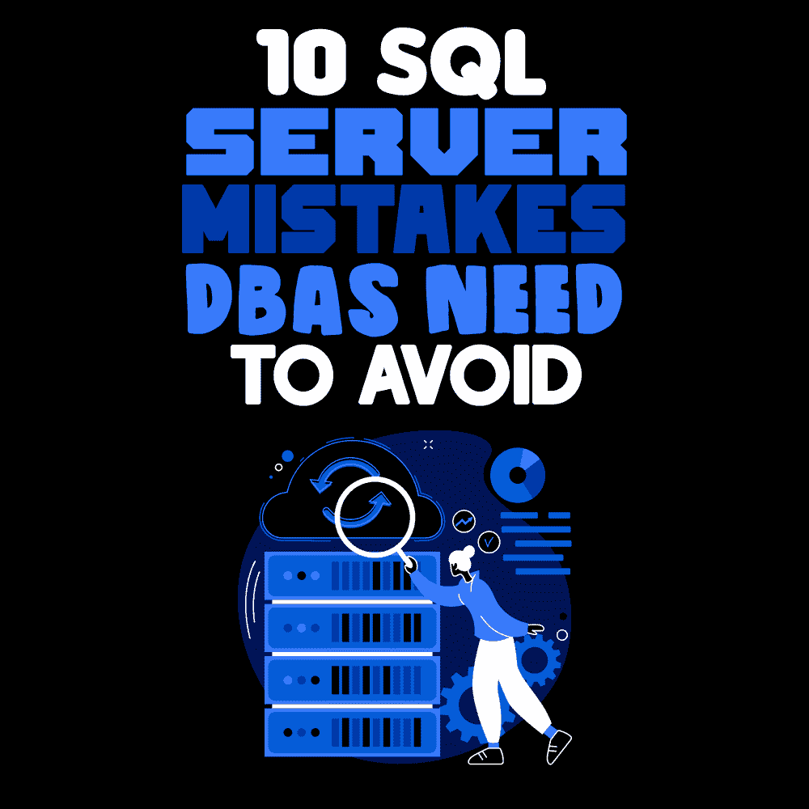

# 数据库管理员需要避免的 10 个 SQL Server 错误

> 原文：<https://simpleprogrammer.com/sql-server-mistakes/>

Everyone makes mistakes, even [experienced DBAs](https://simpleprogrammer.com/dbas-devops/) (database administrators). And the interesting thing about the mistakes DBAs make is that they don’t all relate to technology. As you will see, many of the top DBA mistakes happen due to immature policies and practices.

以这些为例:

*   停机时间会给公司带来多大的损失？
*   在一个工作日、一个月甚至一年中，您的数据库在什么时候最繁忙？
*   典型流程的步骤有哪些？

我们不包括与数据库开发和设计相关的错误，而是严格关注 DBA 犯的常见管理错误，尤其是关于团队如何交互和构建流程的错误。

以下是数据库管理员应该避免的 10 大 SQL Server 错误。

## 10.存储:空间与 I/O 速度

我们倒计时的第一个错误是，数据库管理员通常认为存储只是原始磁盘空间，而不是 I/O 速度。这是因为我们按千兆字节支付空间费用，无论是硬盘、固态硬盘还是云存储。

因此，DBA 很少讨论什么是吞吐量、工作负载或性能需求。许多数据库管理员无法平衡不同类型应用程序的 I/O 需求。例如，OLTP 应用程序需要快速的随机 I/O，而 BI 应用程序和备份/恢复流程需要快速的序列化 I/O。

当我们只谈论空间时，我们并没有谈论我们的最终用户需要的具体性能水平。

## 9.商业无知

商业无知的错误有两种不同的形式。许多 DBA 认为他们的工作只是与数据库打交道。他们不把机器作为一个整体来考虑；他们只考虑备份数据库、恢复数据库、保护数据库、对数据库执行预防性维护操作等。最终，他们不知道 SQL Server 如何工作。

其次，许多数据库管理员并不认为他们实际上是真正的企业 IT 资产(数据)的守护者。您需要知道企业如何使用数据，以及当某个特定的应用程序停机时谁会关心。

停机时间给公司造成了多少损失？这些系统的忙和慢周期是什么？在一个工作日、一个月甚至一年中，您的数据库在什么时候最繁忙？如果没有这方面的知识，数据库管理员就是无法在工作场所增加业务价值的 IT 无人机。

如需了解 SQL Server 内部的更多技术信息，请访问[PASS.org](https://www.pass.org/)、[SQLPerformance.com](https://sqlperformance.com/)和[TechRepublic.com](https://www.techrepublic.com/)。

## 8.没有故障排除方法

DBA 犯的另一个常见错误是他们通常没有故障排除的方法。你的清单是什么？在一个典型的流程中，您会遵循哪些步骤？当 SQL Server 或 Azure SQL 开始出现问题时，您是否有确保最佳结果的流程？

要成为一名成功的 DBA，你不一定要精通故障排除。但是您需要有一个循序渐进的清单来执行根本原因分析。如果你不这样做，你将会浪费时间和精力，错过各种错误和问题。你会错过一个系统正走向灾难性失败的线索。如果您有 SLA，您将会错过它们，并且响应时间很短。

解决不了问题你也就失去了公信力。如果你希望你作为 DBA 的观点得到尊重和重视，就不要犯这个错误。

## 7.使用默认设置

Another big mistake is going with the default configuration settings. The SQL Server defaults are designed to focus on reliability and not [database performance](https://www.sentryone.com/resources/sql-server-monitoring-roi-calculator). It’s designed so that a non-DBA can buy it, install it, and run it for years and not have it crash.

但是因为您是 DBA，所以您可以做许多事情来更改这些默认值并提高性能。您可以利用服务器和数据库级别的配置设置，例如*最大并行度、并行的成本阈值或针对特定工作负载的优化。*

我在我管理的任何生产系统上都更改了默认设置。例如，永远不要使用内存设置、文件/文件组以及数据库增长方式的默认值。请记住—默认值旨在为 SQL Server 提供最长的正常运行时间，而不是最高的性能。

## 6.事后才想到安全性

IT 团队中最大的错误之一是开发团队、DBA 和网络管理团队都认为其他团队负责安全。因此，没有人真正负责安全。本质上，这是一场没有人掌权的相互指责。

我不是让你成为安全专家，但你需要确保有人负责安全。由于 SQL 注入攻击是任何类型的安全漏洞中最具破坏性的一种，所以关注至少一些安全基础知识是非常重要的。

要了解数据库安全基础知识的最低水平，请查看我在 SQLBits VIII 中的视频和幻灯片，标题为 *[了解和防止 SQL 注入攻击](https://sqlbits.com/Sessions/Event8/Understanding_and_Preventing_SQL_Injection_Attacks)。*

## 5.自动化不足

在拥有半打 SQL 服务器的小型企业中，自动化不足的情况经常发生。但这种事情比它初看起来有更多的含义。简而言之，自动化使您能够提高准确性，减少错误，并大大增加单个 DBA 可以管理的 SQL Server 或 Azure SQL 数据库的数量。

我总是鼓励人们更聪明地工作，而不是更努力。通过脚本自动化可以让你做到这一点。例如，一旦您有了一个可用的 PowerShell 或 T-SQL 脚本，您就可以将它推广到任意多的应用程序。

SQL Server 社区广泛推广和共享自动化最佳实践。我喜欢宣扬的一个很棒的例子是 [dbatools.io](https://dbatools.io/) ，这是一个由世界各地的人们共同努力的开源社区。它包含 400 多个脚本，全部用 PowerShell 编写。一定要去看看。

## 4.工作的错误特征或技术

当您有一个初级 DBA、偶然的 DBA 或同时也是开发人员的全能 DBA 时，这种错误经常发生。当有新的特性需要测试和实现时，他们往往会很兴奋。要成为一名优秀的 DBA，您必须记住，您是所管理数据库的性能和可靠性工程师。数据才是最重要的，而不是刚刚发布的酷炫新功能。

您管理您的数据库所面临的风险，并且每个新的“闪亮”特性在实现时都带有一定的风险。你的工作是确保数据是安全的，不会被破坏、损坏或变得过于复杂——所以避免新的时尚。

不要忘记，从历史上看，微软已经推出了新的功能集，但并不长期支持所有的功能集。旧的例子包括英语查询和通知服务，而新的例子包括主数据管理和数据质量服务。这些功能已经很久没有新的版本或创新了。

作为一名 DBA，先不要着急，等到知道 SQL Server 内部将长期支持一个新的特性集。

## 3.对开发、开发和变更管理漠不关心

许多 DBA 不关心代码，但他们应该关心。T-SQL 代码可能属于您的开发团队的领域，但它对任何 SQL Server 数据库的执行方式都有很大的影响。我鼓励你要求代码评审来识别最差的实践。如果您曾经迁移到云，代码审查变得必不可少，因为在云中，您为 CPU、I/O 和数据出口付费。

如果您在本地数据库中编写了糟糕的代码，这都是沉没成本，所以当它不能以最佳方式执行时，这并不重要——只要最终用户满意。但是在云中，如果它性能不好，你实际上要付出更多，因为它消耗了所有的资源。您通常不必是修复代码的人，但是您应该能够识别它并确保您的开发团队避免最坏的实践。

我也看到很多 DBA 不关心[变更管理](https://www.amazon.com/dp/1422158004/makithecompsi-20)，这是一个很大的错误。我见过数据库管理员花费数天甚至数周时间试图修复数据库代码变更管理出现问题的情况，例如，当代码部署破坏了应用程序中的重要行为，然后需要回滚时。我鼓励您继续关注变更管理，并确保您平等地对待您的数据库工件和常规应用程序工件。

我推荐简单回顾一下我的书 [SQL，因为它包含了专业数据库管理员和开发人员的经验，他们使用 SQL 的变体来支持复杂的企业应用程序。](https://www.amazon.com/dp/0596518846/makithecompsi-20)

## 2.预防性维护不足

我看到数据库管理员犯的另一个大错误是预防性维护。他们没有意识到 SQL Server 需要定期维护和整理。

预防性维护提供了各种好处。唯一的缺点是，在不影响系统用户的情况下，您必须找到时间来做这件事。

您通常需要采取的常见预防性维护步骤是损坏检查以及备份和恢复验证。您需要执行数据库一致性检查以发现损坏，以及碎片维护和索引统计信息维护。

## 1.备份和恢复

The number one mistake of SQL Server DBAs is believing you can recover a database just because you have a backup. That is not true. DBAs tend to perform the backups (and trust them), and then find that three months later, when they need to recover it, it won’t work. SQL Server will allow you to take backups of databases that have corruption in them. But it won’t allow you to restore a corrupted database!

我强烈建议你以急救先遣队为榜样。全面演练！定期(对我来说是每季度一次)做一个数据库备份，并执行一个完整的恢复测试，作为你正常流程的一部分。每年至少执行两次备份和完整恢复测试。

此外，请记住，您必须执行这些测试，因为萨班斯-奥克斯利法案(SOX)、 [GDPR 法案](https://simpleprogrammer.com/general-data-protection-regulation-gdpr/)和其他数据合规性法律要求您访问旧数据。SOX 说你必须能够回溯七年来恢复特定种类的财务数据。确保您测试的数据来自很久以前！这将是一个巨大的焦虑缓解剂。

## 通过检查这些场景来避免错误

作为一名 DBA，不要忘记您的工作是成为数据的守护者和保护者，无论何时何地。虽然我们讨论的失误中只有少数是由于技术技能，但大多数是管理、流程和业务问题。如果你能控制住这些情况，你将会更加成功，并成为公司极其宝贵的财富。