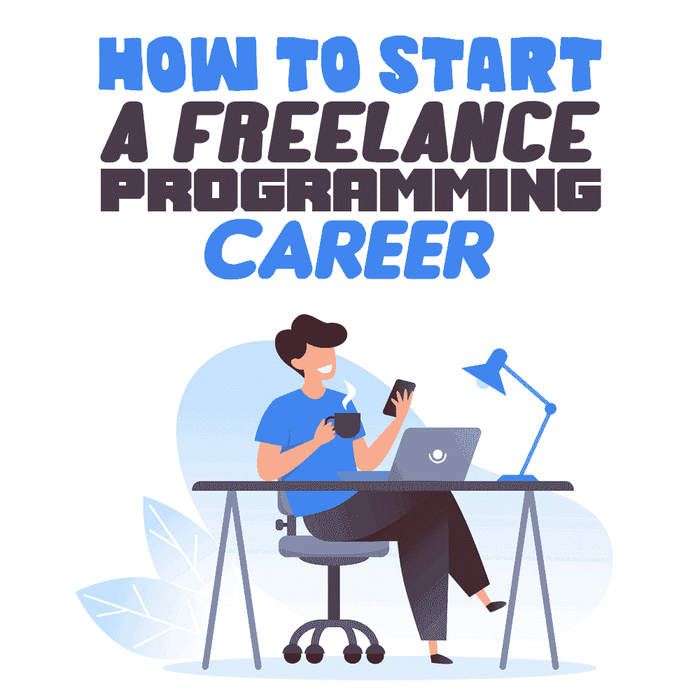

# 如何开始自由编程生涯

> 原文:[https://simple programmer . com/start-freelance-programming-career/](https://simpleprogrammer.com/start-freelance-programming-career/)

Are you tired of boring 9-5 office jobs and looking for a little more freedom? Maybe there’s something about going into the office every day that has you looking for alternative, more remote programming career options. Whatever your reasoning may be, starting a career in freelance programming can be the answer you’re looking for.

自由职业者和远程工作可能是一种非常有利可图的赚钱和建立成功职业生涯的方式，也就是说，只要你为之努力。

我重复一遍，自由职业不是一件容易的事情。虽然当自己的老板有很多自由，但也有很多责任你必须从一开始就承担起来。不再有其他人在那里握着你的手或陪你走过这个过程。

你成为自己的老板。见鬼，你是首席执行官、首席运营官、首席财务官和公关主管。你必须支付营业税，持有营业执照，并推广/宣传你的业务服务。都是你做的！

如果你失败了，*你*失败了，*你*必须振作起来，继续前进。

现在，如果你已经读完了所有这些，并且仍然有兴趣成为一名自由职业者，那么恭喜你！你正在成为一名成功的自由职业程序员。

下面是一些帮助你开始职业生涯的建议。如果您完全是编程新手，我建议在实施本文提供的任何建议之前，先学习一两件关于编程的基础知识。如果你想快速开始你的教育，[这里有一个关于如何快速学习编程基础的课程](https://simpleprogrammer.com/products/learn-anything-quickly)。

我们开始吧！

## 找到你的位置

当你开始自由职业之旅时，你需要做的第一件事就是找到你的定位。利基市场本质上是一般市场的一个子集，由它自己的一套特征来定义。换句话说，你的定位是你最想从事或发现自己最想从事的特定类型的编程。

这个专业可以是从游戏或移动开发到网络安全甚至比特币的任何东西。你越具体，你就越是专家。

通过[细分](https://simpleprogrammer.com/niche-down-freelance-programmer/)，你将能够更快地获得经验，在你的细分市场中变得更有效率，轻松地推销自己，并变得更容易被其他潜在客户推荐。

如果你还不能决定你的完美定位，不要担心。慢慢来，尝试几个不同的编程领域，看看什么最适合你，这是没问题的。人们一直在改变他们的定位，所以如果需要的话，慢慢来，做你的研究，并在做的时候享受乐趣。

## 建立在线投资组合

拥有一个在线作品集是你自由编程成功的关键。活页夹和基本简历的时代已经一去不复返了([尽管你仍然需要其中的一份](https://simpleprogrammer.com/programmer-resume-guide/))。如果你真的想成为自由职业者，那么在线作品集是向潜在客户展示你作品的最佳方式。

你要包括你最好的工作例子，并突出你所拥有的对潜在客户有吸引力的具体技能。这些可以是你可以用来编码的语言，也可以是你有使用经验的操作系统和工具。你也要包括你从以前的客户那里得到的任何积极的推荐。这有助于将你推销给你的客户，让你在你的领域中脱颖而出，成为备受尊敬的专业人士。

有许多不同的方法可以让你制作一个在线作品集。最基本的选择是创建一个免费的个性化网站，把你所有的作品放在上面让客户看。也有一些自由职业网站，你可以用它们来创建和建立一个免费的编程组合(下面会有更多的介绍)。

过一段时间，你可能会考虑购买自己的个人网站域名，以展示自己是一个更专业、更认真的程序员。

## 拓展你的沟通技巧

当你是一名自由职业者时，你不再有工作分配给你的奢侈。现在你必须走出去，为自己找到那份工作。

要做到这一点，每个伟大的自由职业者都需要有敏锐的沟通技巧。你不仅需要知道你在说什么，你还需要知道如何建立关系网和推销自己——你的编程服务会随后到来。

当然，你可能是世界上最好的程序员，但是如果你不能让客户相信你是值得投资的人，你将永远不会成功。

当处理棘手的客户或化解你和你的工作受到审查的激烈局面时，良好的沟通技巧也会派上用场。

提高沟通能力的最好方法之一就是提高你的软技能。

这些可以是从保持你的主动性和组织性到理解用户的观点和保持积极的态度。

简单程序员自己的 [John Sonmez 写了一本关于开发你的软技能的书](https://www.amazon.com/Soft-Skills-software-developers-manual/dp/1617292397)，他向你展示了如何通过在你的工具带上添加一些软技能来促进你的自由职业编程生涯。

## 注册自由职业网站

如果你觉得自己没有获得高薪自由编程工作的经验，不要担心。有很多自由职业者的网站，你可以用来找到即时的工作，这将有助于你建立你的在线投资组合。

你可以找到大量的工作，从绝对的初学者到一流的专家。很快你就会看到你的投资组合增长，你会比你想象的更快达到专家的水平。

一些适合自由职业者的网站包括:

*   [向上工作](https://www.upwork.com/freelance-jobs/)
*   五个
*   [自由职业者](https://www.freelancer.com/)

注册一个自由职业网站是一个快速简单的过程。你甚至可以从今天开始你的第一份编程工作！

我在注册 Upwork 后获得了我申请的第一个项目。只要你能证明自己的价值，并具备适当的软技能，你就能快速轻松地赢得客户。

虽然这些网站可能不适合所有人，或者可能只是建立你的在线投资组合的临时解决方案，但它们绝对是启动你自由编程生涯的好方法。

## 跟上当前的技术进步和趋势

Now that you’re all set with your work and on your way to attracting clients, the last thing you need to do is keep yourself up-to-date with the newest technology advancements and trends in the world of programming.

跟上你的利基市场和你周围的类似利基市场是在竞争中始终领先一步的最好方法。你也永远不想落后。随着技术变化和升级的速度，最热门的商品可能会在发布一个月后变得无关紧要，所以保持警惕是明智的。

关注相关的编程博客，搜索最新的趋势，加入一些脸书编程小组，订阅一些技术杂志和时事通讯。这些都是确保你永远了解情况的好方法。

谁知道呢，也许你会学到一些新的技能或编码技术，可以为你的业务增加额外的价值。

您可以通过注册免费的 [Simple 程序员简讯](https://simpleprogrammer.com/lp/simple-programmer-newsletter-lp/)来开始这项工作，在那里，John Sonmez 将为您提供最新的最佳技巧和经过验证的理论，您可以用它们来提升您的品牌，并在您所有的编程工作中取得绝对的成功。

## 一切从你开始

自由编程可以是一项非常赚钱的工作，只要你全身心地投入这项工作。您的成功完全取决于您如何利用今天在这里学到的信息前进。

不要只是坐着等待明天的到来！

继续前进，找到你的定位，建立网上投资组合，在那些软技能上努力，然后开始工作。不要忘记继续学习每一步。

编程快乐！