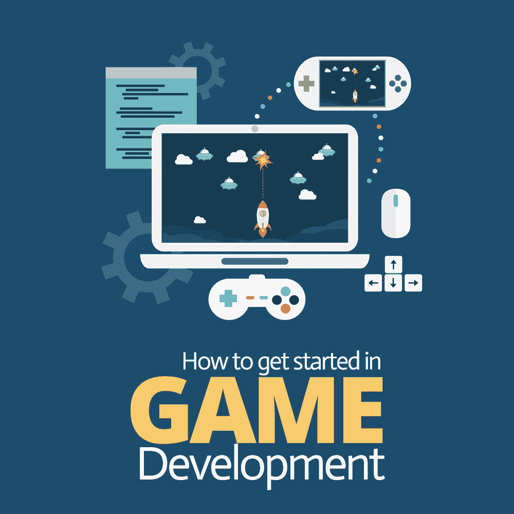
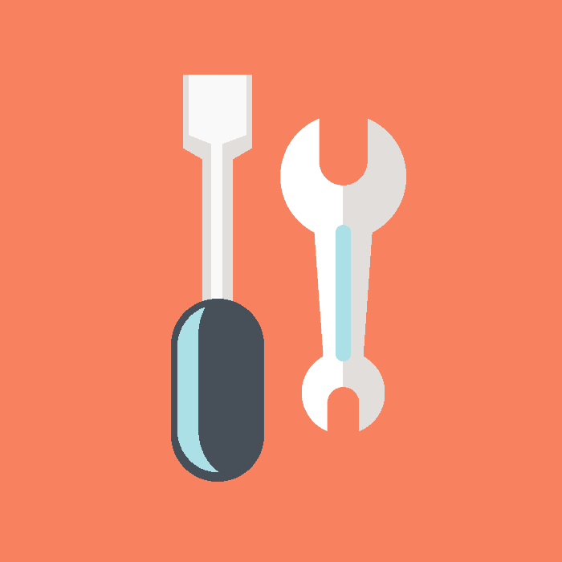
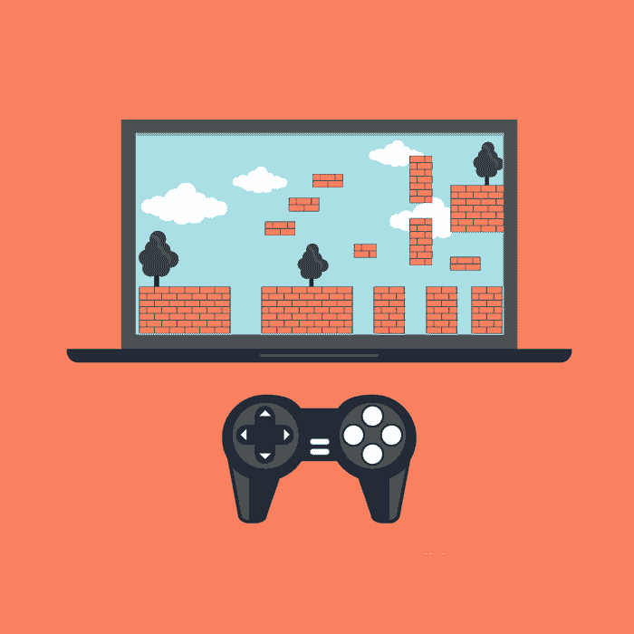

# 游戏开发如何入门

> 原文：<https://simpleprogrammer.com/started-game-development/>

For a lot of 9-to-5 developers, the idea of building a video game on their own often seems like a monumental task. Game developers need to consider art, animation, physics, math, input, rendering, shaders, and countless other things that probably seem like they are in no way relevant to the daily job of building websites, services, or business apps.

如果你是一个想进入游戏的开发者，你可能会认为游戏和应用程序开发有很大的不同。但是重要的是要认识到每种类型的开发中的大部分工作都是相似的。作为一名游戏程序员，日复一日，你大部分时间都在编写代码，解决问题——这和你开发商业应用程序是一样的。

学习如何开发游戏可以在你的职业生涯中帮助你，通过使你成为一个更好的整体程序员，或者只是通过学习如何灵活和增加新技能到你的投资组合中。

在这篇文章中，我将解释[游戏开发](https://simpleprogrammer.com/software-vs-game-development-money/)与应用程序开发的不同之处，描述如何开始制作自己的游戏，并提供一些关于跳跃时需要注意的建议。

## 游戏开发的差异

那么，游戏开发和 app 开发有什么区别呢？

嗯，第一个区别是开发环境。对于任何应用程序开发来说，环境通常都非常专业。当然，您可以在任何编辑器中编写代码，但是您可能已经选择了最适合您正在处理的特定项目类型的编辑器。

游戏开发也使用特定的开发环境。大多数时候，这种开发环境是游戏引擎的“编辑器”和类似 Visual Studio 的代码工具的混合。如果你使用虚幻，你将使用虚幻编辑器和 Visual Studio 与 C++。对于 Unity，你使用的是 Unity 编辑器和 C#(在 VS、Rider、VS Code 或 MonoDevelop 中)。

其中一半听起来可能很熟悉。我们都用过代码编辑器。但是为什么游戏开发需要额外的引擎“编辑器”呢？

引擎的编辑器是一切联系在一起的地方。它是你放艺术的地方，连接你的代码，建立你的关卡，配置动画，以及做其他不仅仅是写代码的事情。

它还使您的开发体验变得更加容易。许多你认为游戏开发“很难”的事情在今天的引擎下变得非常简单。

想要一个像真实物体一样掉到地上的球吗？没问题；加上正确的物理成分就大功告成了。想让它反弹吗？只需添加一个物理材料，并调整弹性系数。不需要代码，不需要特殊的数学技能——只需要知道要添加什么组件。

同样的想法也适用于你想在游戏逻辑之外做的大多数事情(游戏逻辑就像你的商业应用程序逻辑一样；所有部分都特定于您的用例)。所有的“硬东西”(例如物理、渲染、设备输入、音频)都已经完成。它们是已经解决的问题，你只需要知道解决方案在哪里。

我认为开发一个游戏很像开发一个网站。很久以前，您必须处理传入的网络流——现在，您只需在您的框架中找到合适的位置，并专注于您的特定业务问题。用同样的方式思考游戏开发。你有一个目标，你有一个巨大的框架，你只需要把各个部分连接在一起，直到一切正常。

## 入门指南

## 

T2】

我通常对任何有兴趣开始游戏开发的人的建议和我对开始任何其他类型开发的人的建议很相似:从小处着手。

挑一个已经存在的简单手机游戏。然后选择一个更简单的，并通过教程重新创建。有很多东西需要学习，投身于一个巨大的项目肯定会让你不知所措、不知所措、沮丧和失败。所以再一次，选择你能想到的最简单的游戏开始。

事实上，我通常建议人们从《T2》中的《Flappy Bird》开始。

有了[右](http://unity3d.college/intro-to-unity3d-building-flappy-bird/) [教程](https://unity3d.com/learn/tutorials/s/interactive-tutorials)再加上对编程的一点了解，你可以在一天之内构建这些小游戏。在整个过程中，您将开始学习编辑器，发现新的组件，并意识到只需要很少的代码(在这个过程中，您将学会一点 C#)。

当你[完成游戏](http://www.amazon.com/exec/obidos/ASIN/178528214X/makithecompsi-20)时，你可以将它们构建到你的手机上，然后与你的朋友和家人分享。很简单！

你可以通过构建游戏来练习的另一个技能是如何开发可以在不同平台之间切换的东西。这项技能很重要，因为你的应用程序所在的平台越多，你的工作就越有价值。

事实上，我如此喜欢 Unity 作为游戏引擎的原因之一是它可以方便地切换你的目标平台。您可以先为 Windows 或 Mac 构建游戏，然后只需在构建设置中选择一个新的目标设备，无需任何更改或定制工作即可推出您的游戏或应用程序。

我以前用过像 Xamarin 这样的跨平台工具，虽然它们很好，但是它们远没有 Unity 的易用性好。只需选择新平台，点击“切换”，然后构建。大多数时候，它只是工作，没有变化。你可以选择所有的移动平台，WebGL、Linux、Mac、Windows、Xbox、Playstation 等等(总共大约 30 个平台)。

即使你对游戏并不特别感兴趣，为商业应用使用游戏引擎每年都变得越来越流行(尤其是真正交互式/可视化的应用)。我所做的 Unity contract 开发工作有一半是非游戏应用程序，比如可视化数据和位置，以及为信息亭构建交互式显示器。

能够切换平台并给客户一个移动版本的 kiosk 应用程序总是会让他们喜笑颜开(大约需要 10 分钟)。

## 为实践开发 2D 游戏

我提到过，你可能应该从一个简单的游戏开始。一个简单的游戏通常意味着一些 2D。你可能会想“我讨厌 2D 手机游戏”

你并不孤单

但这不是跳过简单项目的理由。实际上，2D 游戏在技术上和 3D 游戏没有什么不同。你在做同样的事情，只是把一切都变平了。

在 Unity 这样的引擎中，从 2D 到 3D 开发的过渡几乎是无缝的。你只需按一个按钮，你的视角就会切换。

你可以使用 2D 精灵来构建游戏，或者你可以完全用 3D 来构建游戏，完成后只需交换相机设置。这是我一直使用的一种技术——建立 3D 模型，然后使用相机使它们看起来平坦。

## 在你的游戏中加入艺术

十年前，你会很倒霉。为游戏寻找好的美术作品是一项既昂贵又耗时的任务。但是随着独立发展的爆炸式增长，低价优质艺术的来源激增。

我主要将 Unity 引擎用于游戏开发，并发现它在 Unity Asset Store 中以低价提供了成千上万的图形和艺术作品——而且很多都是免费的。

以我的经验来看，你想要的任何东西都可以在你的游戏中的现有引擎中找到。不需要学习建模，不需要找艺术家，甚至不需要雇佣动画师。(当然，一个更大的团队会包括这些角色，或者想雇人专门为他们的游戏创作艺术，但开始单飞时，这些行为更多的是借口，而不是实际需求。)

进口这种艺术很简单。把它放到 Unity 项目视图中，你就完成了。艺术品已经可以使用了。将它从项目视图中拖动到场景中，它就会进行渲染——记住，艰苦的工作已经为您完成了。

这同样适用于音乐、音效、粒子、着色器，以及除了你的代码和游戏愿景之外的所有东西。就像你的第一个游戏的美术或图形一样，你可以依赖你的引擎提供的东西，而不是试图创造一些全新的东西。记住，保持简单。

## 游戏开发是一项很好的技能

## 

T2】

开始[游戏开发很容易](http://www.amazon.com/exec/obidos/ASIN/178528214X/makithecompsi-20)。如果你能编码，你就能开发游戏。这需要一些工具和一些时间，但它是一项有用的技能，即使对应用程序开发人员来说也是如此。

知道如何开发游戏，即使是简单的游戏，也能建立你的技能。它还可以提供一种向客户展示商业应用的有用方式。您将能够提出具有惊人的交互式视觉效果、通常不会提供的设备和平台以及许多其他令人印象深刻的功能的选项。

所以，如果你已经准备好开始，或者只是想涉猎一下，看看是否真的像我说的那么简单，为什么不今天就试着做点什么呢？

选择一个简单的游戏来练习，不要担心像艺术这样闪亮的东西:开始构建。

一旦你完成了第一个构建，如果你和我一样，你会被吸引……也许会在游戏开发的美妙世界中进行职业转换。