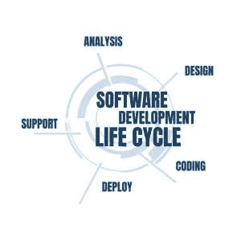

# 如何成为一名伟大的软件工程师(没有学位？)

> 原文：<https://simpleprogrammer.com/step-step-path-becoming-great-software-developer/>

如果你正在考虑成为一名软件工程师(或者开发人员——他们非常相似，我们将在下面讨论)…这个指南将会教你所有的相关知识。

你会得到一个完整的如何实现这个目标的一步一步的路径。

享受您的 15 步软件工程师路线图！

***<u>这是你吗？</u>***

**你喜欢解决棘手的问题……**

作为一名软件工程师，你将运用你的智慧和创造能力来解决难题，并通过为你的雇主或客户解决问题来提供大量的价值。

**你喜欢沉浸在一个课题的研究中……**

要成为一名软件工程师，你需要学习一些复杂的技能。从那以后，你也永远不会停止学习。如果你想拓展你的知识，提高你的技能，这可能是你最完美的职业道路。

**你想和其他人一起实现宏伟的目标……**

住在地下室的开发人员独自解决编码问题是一个神话。大多数时候，你必须领导他人或与他们合作解决问题。你还会积极参加会议，做关于你工作的报告。

**你想通过这样做比大多数同龄人赚更多的钱…**

那为什么不成为一名软件开发人员或工程师呢？

## 

T3】

## 到底什么是软件工程师？

软件工程师是一名计算机专家，他使用工程原理来设计、创建、调试、测试、部署和维护软件应用程序的系统和代码。

软件工程师与团队合作，为客户在各个领域的问题创造有效的软件解决方案。

### 软件工程师 vs 软件开发人员

大多数人交替使用软件工程师和软件开发人员。

事实上它们非常相似。

软件工程师从更广阔的角度分析和塑造(阅读:*工程师)*一个项目。除了软件开发任务之外，他们还高度参与规划和指导。

### 软件工程师是做什么的？

软件工程师做什么简单地说:作为一名软件工程师，你在工程 [*软件开发生命周期*](https://www.servicenow.com/products/devops/what-is-sdlc.html) 的所有部分。

定义问题和目标。实现代码。评估和测量已部署的软件程序。改变系统和改进程序。提供持续的管理和支持。

**你将要做的 15 个例子:**

1.  确定客户需要通过新的软件应用程序解决的问题
2.  [运行新的或现有软件的测试](https://techbeacon.com/app-dev-testing/5-key-software-testing-steps-every-engineer-should-perform)
3.  纠正系统或应用程序的问题
4.  从头开始构建新程序
5.  管理软件工程项目——通常同时管理多个项目
6.  使用模型来详细理解和展示项目
7.  创建项目的概览图
8.  迭代新版本的代码
9.  对团队的产出进行质量控制
10.  记录您团队的流程
11.  研究有助于完成任务的信息和工具
12.  与顾客或客户沟通
13.  自己编写高效的代码
14.  成为年轻开发人员的导师
15.  向团队中任何需要帮助的人提供帮助

### 日复一日做软件工程师是什么感觉？

如果你成为一名软件工程师，你的工作日可能是这样的:

*   你准备你的时间表。无论您是在办公室还是远程工作，您都希望将您和您的团队当天的任务全部安排好。
*   你开始着手解决一个软件工程问题。您正在为客户问题的软件解决方案进行概述和建模，并为您的团队提供如何实施该解决方案的指导。
*   **你参加了一个会议**。作为一名软件工程师，你与程序员和测试人员一起工作，他们帮助你实现你所建模的解决方案。你需要经常召开会议来协调这项工作。
*   **您修复您正在开发的应用程序的问题**。通过测试人员的反馈，或者你自己的评估，你总是面临新的挑战。您将工作日的部分时间用于故障排除:修复无效代码、调试和解决安全问题。
*   你启动了一个新软件。在密切观察它如何执行的同时，你向世界发布了一个完整的应用程序。
*   **你服务一个活的产品**。在你为顾客或客户工作的过程中，你一直在衡量你的成品的性能。您提供技术支持，解决出现的任何问题，并继续更新软件。

## 成为一名软件工程师有多难？

从头开始学习软件工程，经历充满挑战的面试过程，并管理工作中各种各样、智力要求高的任务是很难的。

但是，如果你愿意尽你所能，你会克服这些困难，享受作为一名软件工程师的充实的职业生涯。

*以下是你将面临的三大挑战*:

### 1.你必须有耐心和毅力来完成你的学业

对于一个有抱负的软件开发人员/工程师来说，有很多东西需要学习。基本上，如果你选择成为一名软件开发人员，你将永远是一名学生，你将不得不不断改进并跟上你的教育。

当你学习你的第一门编程语言时，你可能会觉得特别有挑战性。如果一切都不顺利，你也不能气馁。

有时候，你不得不反复解决一个学习问题。当你成功地增加了一项技能后，你也不能自满——还有更多的技能需要学习！

但是如果你日复一日地坚持下去，你就有能力开始申请你的第一份开发工作，这是不可避免的。

### 2.你必须在沟通、团队合作和领导技能方面下功夫

反对所有的刻板印象——作为一名软件工程师，你不是一个孤独的地下室居住者！

*   你在工作中承担责任
*   你在与团队成员协调并委派给他们
*   你在和顾客交流

如果到目前为止你还没有磨砺你的沟通、表达和公共演讲能力，那么你的工作已经为你准备好了。这些事情对于喜欢编码的个性类型来说是一个挑战。

但是让我告诉你，一旦你在这些技能上变得更好，这是令人振奋的——这就是它们，任何开发人员都可以学习的软技能。现在，您不仅可以为客户的问题设计解决方案，还可以与他们进行良好的沟通，并带领您的团队成功实施。

作为一名软件工程师，你的生活将会轻松十倍，更加愉快。

### 3.你需要精神上的严谨

首先，任何项目都需要的“系统思维”需要大量脑力。但是，这是你作为软件工程师的与众不同之处，所以你必须一次又一次地投入精力。

其次，你必须能够战胜挑战。无论你是自学(需要最大的意志力)，还是获得学位(期限将至)，还是参加课程或训练营(长时间工作和同伴压力)——你都在选择一条艰难的道路。面试准备很难。

在工作中同时处理多个项目和解决一个又一个问题也很困难。你必须有克服所有这些障碍的精神力量。但也许你是那种在受到挑战时会茁壮成长的人？

## 你应该成为一名软件工程师吗？利弊

### 

T3】

### 骗局

你将花费数百个小时不懈地学习

你需要花几个月的时间来学习在这个行业工作所需的编程语言。准备工作面试需要几个月的时间。

如果这听起来对你来说太令人生畏，也许你不应该成为一名软件工程师。

你将在你的教育上投资数千美元

尤其是如果你去上大学，你将花费数万元成为一名软件工程师。虽然你可以走完全自学的道路(我们稍后会谈到这一点):

即使你选择不去上大学，花些钱，你也能加快速度，在更短的时间内接受更深入的教育。

**你将工作相当长的时间**

但是，这对于任何更高级别的工作来说都是正常的。除非你是一名自由软件开发人员，并且只接待有限的客户，否则你应该做全职软件工程师。

**你可能最终会付出“拥有一份好工作”的机会成本**

[https://www.youtube.com/embed/kA-ab-is8TQ](https://www.youtube.com/embed/kA-ab-is8TQ)

这是如果你考虑成为一名高薪软件工程师和自己创业的长期前景。很容易永远呆在那份轻松的工作中，而不是抓住机会在生意中赚更多的钱。

### 赞成的意见

你的需求量会很大

近年来，对软件工程师的需求翻了一番，而且还会继续增加。根据美国劳工统计局的数据，到 2030 年，T2 的工作岗位数量将增长 22 %( T3)——远远高于平均水平。这意味着你将有很好的机会在这个领域找到一份好工作。

你会赚很多钱的

软件工程师的年薪在 3.6 万到 26.5 万美元之间。在美国，平均工资是 12 万美元——对于一个工薪员工来说，每小时超过 50 美元。根据客户的不同，[自由软件开发者每小时可以赚 100 多美元。这将使你进入在美国工作的专业人士的上层。它会给你一种大多数人只能梦想的生活方式！](https://simpleprogrammer.com/software-developer-hourly-rates/)

#### 软件开发人员工资

2020 年，软件开发人员的平均工资为 110，140 美元。

#### 入门级工资

在美国，初级软件工程师的平均年薪是 73691 美元。

#### 首席软件工程师工资

在美国，一名首席软件工程师的总薪酬估计为每年 150，667 美元

你将做令人兴奋的工作，帮助很多人

如果你喜欢挑战，喜欢成为高水平的问题解决者，你就选择了完美的职业。此外，您将帮助您的客户启动他们的项目。

在许多情况下，这意味着你正在改善成千上万用户的生活——或者直接通过他们使用你写的软件，或者间接地通过你的代码促进他们受益的产品或服务。

### 如何在没有经验的情况下从零开始成为一名软件开发人员:15 步路线图

### 1.找到你的原因并设定一个目标

首先也是最重要的是，对于你成为软件工程师或开发人员的目标，要有一个清晰且雄心勃勃的理由。确保你的理由足够强大，让你坚持下去。

也许你讨厌你现在的工作，比如销售或者会计，想成为一名开发人员。你想为一家很酷的新科技公司工作，拿着软件工程师的高薪。

我见过很多人停止编程，因为他们觉得继续下去太难了，但是如果你有一个强烈的“为什么”，当你面临障碍时，继续努力比简单地放弃更容易。

否则，你实际上不会去做。很难。从对任何事情一无所知到变得真正擅长是很难的。

这并不意味着你不必热爱编码的每一分钟。

但是你必须喜欢处理和解决困难的问题。

你也不会因为和别人一起工作或者领导别人而感到厌烦。

如果你真的想要它，并且你愿意在这个职业上全力以赴——你将能够成为一名软件工程师。

### 2.选择你的职业道路

软件工程师有不同的专业。作为一名专家，你更有可能被录用。你将能够要求更高的薪水，因为你的专业知识是罕见的。

所以，选择一个你想专攻的领域，并开始朝着精通它的方向努力。

以下是软件工程师的一些职业道路专业化:

*   CRM 工程师
*   软件集成工程师
*   质量保证工程师
*   [游戏工程师](https://simpleprogrammer.com/started-game-development/)
*   安全工程师
*   NLP 工程师
*   机器学习工程师
*   [区块链工程师](https://simpleprogrammer.com/beginners-blockchain-programming/)

### 3.选择你的第一语言

在我们能跑之前，我们必须学会走。

你走过[学习如何用一种编程语言](https://simpleprogrammer.com/top-10-programming-languages-learn-2018-javascript-c-python/)编程。如果你试图一次学习 5000 万种东西，并且把自己分散得太开，你是学不会走路的。

下面是开始学习第一语言的 4 个成功步骤:

**1。从对你最有用的语言开始**

选择一门你认为你的职业生涯可能会围绕的编程语言。编程语言本身并不那么重要，因为你应该从长计议。我的意思是你不应该试着去学习一门“简单”的编程语言。

只要学习你感兴趣的语言，你就可以在接下来的几年里用它来编程。你想挑选一些有持久价值的东西。

**2。适当开始你的学习之旅**

一旦你选择了你将要尝试和学习的编程语言，试着去找一些独立于该编程语言的书籍或教程。

我这么说的意思是，你不要去找那些会一下子教会你太多东西的学习资料。您希望找到只关注语言而不是完整技术堆栈的初学者资料。

在阅读一本书或一个教程之前，你要先看三遍。你不会在第一次尝试中获得“编程”——没有人会这样做。你需要反复接触，才能开始最终明白，才能明白是怎么回事。在那之前，你会感到很失落，这没关系，这是过程的一部分。

接受现实，勇往直前。

**3。马上开始编码**

当你通读材料或者浏览你挑选的教程时，确保你真的写了代码。如果可以的话，做做运动。尝试你所学的。试着把东西放在一起，使用你学到的每一个概念。

是的，这是一种痛苦。是的，从头到尾读一本书更容易，但如果你真的想学习，你需要*做*。

当你写代码的时候，试着确保你理解你写的每一行代码是做什么的。这同样适用于你阅读的任何代码。如果你接触代码，放慢速度，确保你理解它。有什么不懂的，就去查。

花时间这样做，你就不会一直感到失落和困惑。

**4。开始构建你的第一个小项目**

现在，您已经对一种编程语言有了基本的了解，是时候将这种了解付诸实践，并找出您的差距所在了。做到这一点的最好方法是尝试和建立一些东西。

在这一点上不要过于雄心勃勃，但也不要过于胆怯。为一个应用程序挑选一个足够简单的想法，这样你只需花些力气就能完成，但不需要花上几个月的时间。

尽可能地将它局限于编程语言。不要试图做全栈的事情(也就是说，使用从用户界面到数据库的所有技术)——尽管你可能需要利用某种现有的框架或 API。

对于你的第一个真正的项目，你可能会考虑复制一些已经存在的简单的东西。找一个简单的应用程序，比如待办事项应用程序，然后直接尝试复制它。不要让你的设计技能成为学习编码的绊脚石。

#### 成为软件工程师所需的语言

软件工程师使用的顶级语言有 Python、Java、JavaScript、TypeScript、C#、C++、Go、HTML、Ruby 和 Kotlin。它们的难度各不相同——如上所述，选择一个你想要的工作需要的。例如，你可以通过查看招聘启事找到答案。

你甚至可以打电话给做招聘广告的公司，问他们你需要哪些技能来胜任这个职位。

### 4.了解编程基础和最佳实践

您需要学习如何编写易于理解和维护的干净代码。为了做到这一点，你需要大量阅读并看到许多好代码的例子。

用以下关于编码基础的书籍充实你的图书馆:

*   代码完成
*   干净的代码
*   重构
*   有效地使用遗留代码
*   编程珍珠—(做练习)

**和特定于语言的结构书籍，如:**

*   JavaScript:好的部分
*   有效的 Java
*   有效的 C#

在这一点上，你真的想把你的学习集中在编写好代码和使用现有系统的结构化过程上。

您应该努力在您选择的编程语言中轻松实现一个算法，并以一种易于阅读和理解的方式来实现。

### 5.学习数据库技术

大多数软件开发人员需要了解一些数据库技术，因为大多数系列应用程序都有一个后端数据库。因此，确保你不忽视在这方面的投资。

如果您学习 SQL，您可能会看到最大的好处——即使您计划使用 MongoDB 或 Raven 这样的 NoSQL 数据库，学习 SQL 也会给您一个更好的工作基础。需要 SQL 知识的工作比 NoSQL 多得多。

不要太担心 SQL 的味道。不同的 SQL 技术非常相似，如果您了解一种 SQL 技术的基础知识，在它们之间切换应该不会有问题。只要确保您学习了关于表、查询和其他常见数据库操作的基础知识。

我建议您选择一本关于 SQL 技术的好书，并创建几个小的示例项目，这样您就可以实践您正在学习的东西——始终实践您正在学习的东西。

**如果可以的话，你对 SQL 有很好的了解:**

1.  创建表格
2.  执行基本查询
3.  将表连接在一起以获取数据
4.  理解索引工作的基本原理
5.  插入、更新和删除数据

此外，您将希望学习某种对象关系映射技术(ORM)。您学习哪一种将取决于您正在使用的技术堆栈。

寻找适合你所学框架的 ORM 技术。可能会有几个选项，所以你最好选择最流行的一个。

### 6.决定如何成为一名开发人员

从以下 5 种方式中选择一种成为软件工程师:

1.  获得大学学位
2.  参加(面对面的)编码训练营
3.  获得证书
4.  完成在线课程
5.  完全靠自己学习

#### 程度

这是你时间最长和最昂贵的选择。

你将深入学习数学和基础知识，比如数据结构和算法。大学毕业后，你会比那些选择 DIY 道路的人拥有更多的关于计算机科学基本概念的知识。你将学习计算机体系结构、数据库和源代码管理。

但是，举例来说，你可能没有经历过训练营的人那么多实用的编码技能(90%以上是实践)。

即使你走的是传统的大学路线，也要在空闲时间自己动手做东西。应用这些理论知识是真正的成长所在。这是你如何确保你已经准备好在“现实世界”中从事软件工程工作。

##### 成为软件开发人员需要什么学位

当你学习成为一名软件开发人员/工程师时，你可以读大专，学士和硕士，甚至博士学位。

对开发人员来说，最受欢迎的研究领域是计算机科学——一个更理论化的研究方向——和软件工程，后者更实际一些，需要花更多的时间实际编码。

#### 课程

今天有数百门在线课程在几周或几个月的时间内教授你软件工程的各个方面。如果你能够独立学习，但仍然希望以易于消费的在线形式获得指导和资源，那么课程是很好的选择。

缺少的是大学或训练营的社区方面。另一方面，在线课程通常更实惠，也更容易成功完成。

#### 证书

如果你不确定是否要攻读一个昂贵的多年制学位，你可以选择先获得软件工程证书。这些比较便宜，你只需要六到十二个月就可以完成一个。

#### 编码训练营

全力以赴一到六个月，做好第一份工作的准备。这是编码训练营的承诺。

和其他志趣相投、有抱负的软件开发人员一起，你沉浸在学习和编码中——每天 8-12 个小时。

因为他们如此专注于让你立即执行你所学的一切，你可以期待在仅仅几个月的训练营后成为一名合格的程序员。

#### 自学成才

##### 没有学位真的能成为软件开发人员吗？

没有学位也完全有可能成为软件开发人员或工程师。

你可能会说，不上大学会给你带来优势:你省下的时间和金钱可以投入到你的自主项目、实用强化课程和面试准备中。一些雇主确实要求你有学位，而另一些雇主只关注你能展示的技能。

同样，作为一名自学成才的开发人员，在实际应用方面，你往往处于领先地位——尽管你可能不太精通计算机科学概念、数学问题、数据结构和算法。

### 7.通过实习获得经验

我建议，一旦有实习机会，你就开始准备并申请，这样你就可以做好准备，迈出第一步。

因为最困难的事情之一是，即使你有知识，即使你了解如何编程和编程语言，以及如何使用工具和技术:没有人会给你机会。

没有经验是很难进入职场的，而实习是一个很好的方式。

### 8.保持消息灵通

永远不要停止学习。永远不要停止阅读。总是按照自己的方式阅读一本书。永远提升自己。

你的学习之旅永远不会结束。你不可能知道一切。如果你在职业生涯中不断学习，你就会不断超越你的同龄人。

以下是您了解软件工程专业趋势和发展的最佳方式:

*   活动和会议
*   新闻
*   播客
*   书

### 9.致力于所有软件工程技能

确保你正在提高成为一名优秀软件工程师所需的所有软硬技能。

这些是您需要的最重要的:

#### 软件工程师技能

*   批判性思维&关注细节
*   通讯技能
*   合作的心态
*   时间管理
*   多任务处理
*   解决纷争
*   测试
*   设计和开发数据库
*   Java Script 语言
*   C#
*   C++
*   超文本标记语言
*   计算机编程语言
*   面向对象的程序设计(Object Oriented Programming)
*   结构化查询语言
*   。网

#### 首席开发人员技能

*   可靠的
*   有动机的
*   高度技术性
*   谦逊的
*   有信念
*   良好的沟通技巧
*   可靠的

### 10.建立你的投资组合

[https://www.youtube.com/embed/sed0aYdn3ow](https://www.youtube.com/embed/sed0aYdn3ow)

开始[建立你的投资组合，因为你正在成为一名软件工程师](https://simpleprogrammer.com/how-to-build-a-portfolo/)以增加你在市场上的价值。如果你能展示出你已经在现实世界中运用了所有学到的技能，这会让你对未来的雇主或自由职业者更有吸引力。

#### 做编码项目

从小项目开始，随着你技能的提高，逐步升级到更具挑战性的项目。与此同时，记录你正在做的每一件事，这样你就可以炫耀它，并利用它来建立你作为开发人员的权威和个人品牌。

#### 创建您的开发者网站

开始你自己的开发者博客门槛很低，而且非常有效。如果你经常坚持写博客，几乎可以保证有人在网上搜索你的名字会找到你的博客。

把博客想象成你的一个广告，它日以继夜地为你工作，除了偶尔给它喂食，你什么都不用做。

除了博客给你提供的外部机会，它还提供了一些很好的个人发展机会。我觉得没有比写作更好的提高沟通能力的方法了。

写作教会你用别人能理解的方式清晰地组织你的思想。总体来说，你写得越多，你就会成为一个更好的沟通者。

写博客还可以帮助你记录自己的职业生涯和进步，并提供一些历史文献和参考资料，你可以回顾过去，看看你是如何解决某个特定问题的。

每个软件开发人员都应该有自己的博客:它就像绝地武士的光剑。

#### 学会推销自己

我认为这非常重要，所以我围绕这个想法建立了一个完整的课程。[学习如何作为一名开发人员推销自己](https://simpleprogrammer.com/products/how-to-market-yourself/)并在你的职业生涯中不断地这样做。

弄清楚如何为自己创造一个个人品牌，为自己在业内树立一个好名声，你就永远不会缺少一份工作。

如果你学会推销自己，你就能决定自己的未来。这需要一些努力，但非常值得。

### 11.创建你的简历

归根结底，简历更多的是广告，而不是其他。你可以把简历想象成给你的一页广告。事实上，如果你想拥有一份好的——不，是一份出色的——简历，你就必须这么想。

简单的事实是，对于你申请的大多数工作来说，人们唯一能看到的就是快速浏览你的简历 15 秒钟。正是在这 15 秒钟里，你的人生轨迹可以被确定。面试还是被拒。

不管你喜不喜欢，一份好的程序员简历很重要。

最后，你要非常清楚地描述你的技能和专长是什么，你过去是如何利用它们来取得巨大的成就的，以及这些技能如何可以转移到你申请的未来职位上。

### 12.申请你的第一份软件工程工作

你将面临另一个障碍——那就是找到一份工作。

这可能是我今天提到的所有事情中最困难的。即使你遵循了我所说的一切，并且确实是一个伟大的程序员，没有人会给你机会，除非你正确地定位自己。

### 13.掌握面试技巧

不管你喜不喜欢，如果你想得到一份软件工程师的工作，面试技巧是很重要的一部分。成为一个优秀的面试者本身就是一个完整的游戏。

提前几个月做好准备，研究编码问题，和朋友进行模拟面试。

#### 练习面试问题

在你的软件工程面试中，你会被问到不同主题的问题:

*   计算机科学基础
*   编码问题
*   行为问题

为了在编码面试中脱颖而出，提前个月准备这些问题。

### 14.教

在你学习的整个过程中，你也应该教他们。不管你是初学者还是专家，你都有一些有价值的东西可以教，此外，教学是最好的学习方式之一。

记录你的过程和旅程，沿途帮助他人。

### 15.继续你的教育

我要说的是，无论你如何学习如何成为一名软件开发人员，它仍然需要采取行动，写代码。仅仅在学术上阅读——走过场——是不够的。

你需要创建一些真正的应用程序，现在在移动开发领域有很多机会。人们很容易创建自己的移动应用程序。与过去相比，即使是 web 应用程序也相当容易。

你实际上可以创建一个工作应用程序，你实际上可以出售，赚一些钱，并建立一个业务。

## 成为一名软件工程师需要多长时间？

成为一名软件工程师可能需要三个月到四年的时间。通过课程或训练营，你可以在 3-6 个月后开始申请工作。大学要花 2-4 年才能读完。成为自学成才的软件工程师需要几个月或几年的时间，取决于你的努力。

## 你长大后能成为一名软件工程师吗？

[https://www.youtube.com/embed/kzojJZruE6o?start=137](https://www.youtube.com/embed/kzojJZruE6o?start=137)

是的，当你 30 岁或更老的时候，成为一名软件工程师是完全可能的。你可以像年轻人一样经历同样的步骤。在你的新职业上投入几年后，你可以在这方面出类拔萃——即使你不再年轻了！