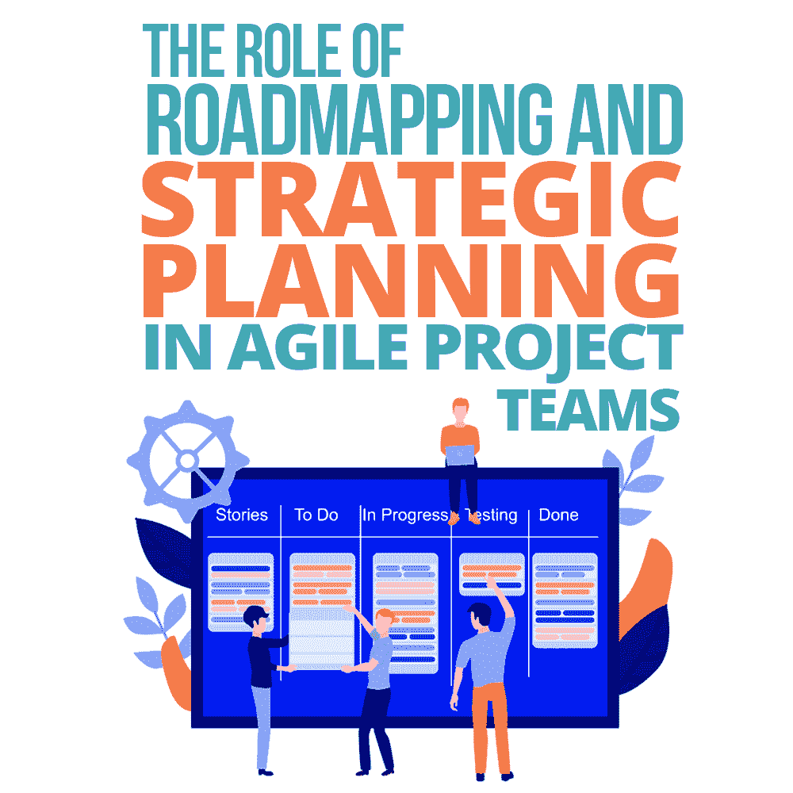

# 路线图和战略规划在敏捷项目团队中的作用

> 原文：<https://simpleprogrammer.com/strategic-planning-agile/>

There has been a huge amount of research and development into how teams are formed to tackle software projects. There are different versions of these new teams; some practice Scrum, some use Kanban, and the word Agile is thrown around a lot!

我们今天所知道的这些方法中的大多数都是为了应对软件团队中的高失败率而形成的。斯坦迪什集团 1994 年的报告名为《混乱报告》,其中著名的记录是只有 16.2%的软件项目在预算内按时完成。这导致了许多看待开发过程的新的和创新的方法，包括 1995 年的 [Scrum](https://simpleprogrammer.com/focus-basics-art-mastering-scrum/) 和 1996 年的[极限编程](https://simpleprogrammer.com/pros-cons-extreme-programming-xp/)。

一般来说，这些技术现在被统称为敏捷方法，因为它们都拥有相似的价值观:将团队放在第一位，并确保他们能够对开发过程中发生的变化做出反应，而不是遵循僵化的计划。

敏捷方法可以给采用它们的团队带来巨大的好处。团队更加协作，这导致更好的解决方案和更有可能满足用户需求的最终产品，并且收到积极的反馈和批评可以导致团队成员的动力增加。

然而，当采用敏捷方法时，有一件事经常会被忽略，那就是高层次的或者战略性的计划。没有战略计划，团队可能会开始偏离轨道，关注对业务来说不重要的事情，或者忽略重要的事情。或者团队在完成冲刺或里程碑后会失去成就感，如果工作流感觉只是不断到来。

我当然不是建议我们抛弃敏捷，但是我认为在我们的敏捷过程中有一个我们经常错过的计划阶段:战略，或者长期计划。通过将集体战略计划整合到敏捷过程中，我们可以帮助减轻开发团队偏离轨道或失去动力的风险。

## 战略计划

战略计划是对企业长期目标和期望的高度概括。好的战略规划应该涵盖广泛的范围，而不涉及不必要的细节——应该尽可能精简。

战略计划的主要目的是形成共识，消除人们可能持有的任何错误假设，并确定目标、优先事项和利益相关者。因此，它可以完美地融入到其他敏捷过程中，例如，冲刺规划。

除了要精益，还要迭代。当我第一次遇到战略规划时，我认为它违背了敏捷宣言的原则:当敏捷被设计为在计划不可避免地改变时具有灵活性时，花时间规划似乎毫无意义。

但是战略计划既不是项目的指南，也不是项目的合同；这是一个抽象的总结，因此它应该具有与项目资产的其余部分相同的灵活性。该计划应定期重新审查，以了解愿景、优先事项和目标是如何变化的。

保持战略计划的可操作性非常重要。该计划将导致的行动对团队的每个成员来说都是不同的。迫使利益相关者联合起来，推动发展，或者激发跨部门的合作是好的战略计划应该采取的行动的几个例子。

在团队中实现战略规划的一个真正有用的工具是项目路线图。

### 项目路线图

路线图详细描述了一个团队或企业希望在未来几个月或几年内完成的旅程。可以为特定的产品或项目创建路线图，但从整体上看，路线图同样有效。

他们专注于定义目标或抱负。这有助于对一段时间内的预期结果达成共识。此外，在路线图中，大问题被分解成里程碑。这有助于任务的优先级和组织。

为了制定有价值的战略计划和路线图，收集尽可能多的想法和观点非常重要。这就是跨职能团队的用武之地。

### 跨职能团队

跨职能团队正如其名:通常在公司内执行不同职能或角色的团队。团队可以包括软件开发人员、经理、设计师、营销专家或客户服务代表。价值来自于拥有许多不同的视角和经验。

在会议期间，寻求每个人的意见是很重要的，因为每个人都能够以独特的方式处理问题。因为开发过程迭代通过公司中的每个角色，所以战略计划也应该如此。为了确保每个人都有机会做出贡献，每个职能部门都应该有时间进行活动，从其他人那里获得信息，并参与其中，提供信息和见解。这确保了该计划是多方面的，这意味着它将比侧重于单一议程的计划更加全面和包罗万象。

## 战略计划的要素

When conducting a strategic planning session with your cross-functional team, there are five stages that can be helpful to look at:

### 目标和成功因素

目标或期望是你的企业想要达到的东西:你的产品或服务的理想状态。他们不一定是特定于最终客户的，而是应该将业务作为一个整体来考虑。

将每个目标分成更小的工作块会很有帮助。一种方法是从团队中每个部门或职能的角度来看待它。每个职能部门都有一套不同的行动来帮助团队实现目标。

除了目标，成功的因素也应该写下来。成功因素是指示目标是否已经实现的度量或观察。这些将特定于他们打算评估的目标，并且可能因团队的每个成员而异。重要的是，成功因素不能像合同一样；他们不应该在这个阶段设定估计值。相反，成功因素应该确定可以用来判断目标是否已经实现的度量标准。

一个示例目标可能是与特定角色或特定类型的客户建立更好的客户关系。这个目标很模糊，但是可以分解成一些任务。

设计师可以研究如何改进外观和感觉以适应客户，客户支持可以评估他们如何更好地建议或指导他们，技术团队可以引入满足他们需求的新功能。一个显而易见的成功因素是为这类客户评估产品/服务的销售或使用情况。

### 利益相关者、客户和交易

利益相关者是在实现目标时必须寻求其意见的人或人群。在战略规划期间，应该通过分析谁需要参与实现目标的过程来确定利益相关者。确定利益相关者是战略计划中最重要的阶段之一，因为如果没有与对结果投入的所有各方的合作，目标就无法实现。

当确定利益相关者时，记录他们与目标的关系很重要，这样每个人都知道谁对过程的每个部分负责。此外，整个团队应该知道谁是共同致力于一个目标的利益相关者，以便每个团队成员都知道他们应该向谁报告或从谁那里接收输入。

一些涉众将只参与某些阶段:一些将是领导者，而其他的将被团队的其他成员所依赖。企业应该致力于在所有利益相关者之间达成对目标的共识。

客户和交易一起走；客户是最终用户，交易是企业和最终用户之间必须发生的任何交换。如果客户被及早识别，那么就更容易确保产品或服务是根据正确的用户需求来设计和开发的。识别事务还可以从技术和人员管理的角度促进对基础设施的讨论。

回到客户参与的例子，涉众可能包括软件开发人员、设计人员和客户支持团队，以及一些管理层成员。客户将是目标人物，交易将是产品或服务的营销以及企业和客户之间的持续互动。

### 架构和基础设施

根据目标的不同，这个阶段会有不同的权重。它包括评估需要对现有架构或基础设施进行的任何更改，以确保目标成功。这包括技术和业务基础设施，因此可以包括数据存储或员工。

许多项目失败了，或者被推迟了，因为在过程中没有足够早地评估基础设施，所以这是形成战略计划的重要阶段。

在我们的示例目标中，系统可能需要升级以应对更高的吞吐量或数据收集。此外，客户支持团队可能需要扩大或提供一些培训。

### 优先事项和挑战

Goals should be prioritized so that there is a shared understanding of what is most important to the business. This discussion can often be difficult because different team members may have differing opinions on the prioritization of goals. Ultimately, the important part of this stage is having a shared understanding of what order the goals should take when starting development.

达成目标时可能面临的挑战，现阶段大多是未知的；然而，通常存在可以预见的共同挑战。通过讨论可能的挑战，团队可能会被提示执行进一步的研究或培训，在处理目标的特定部分时改变开发过程，或者寻求专家的咨询。

客户参与目标中可能面临的一个挑战是对目标客户需求的误解。这可以通过执行研究和需求获取来缓解。

### 发布和最终用户

这是另一个多方面的步骤。在整个过程中可能会出现技术发布或部署，当新功能或产品对用户可用时会出现业务发布，当寻求潜在客户的注意时会出现营销发布。如果一些目标可以很容易地被分解成独立工作的部分，那么它们就适合增量发布。

除了发布之外，弄清楚如何针对最终用户评估目标也是很重要的。这可能与上面提到的成功因素不同；它旨在发现最终用户是否对新产品或服务感兴趣。一个强大的技术是 [A/B 测试](https://simpleprogrammer.com/best-practices-deployment/)。

示例目标可能涉及多个版本，包括一些新特性和设计变更。使用 A/B 测试，团队可以评估相对于旧内容，目标客户如何参与新内容。

## 将战略规划添加到您的敏捷开发过程中

敏捷开发方法非常有助于我们实现目标。然而，如果它们没有与有效和协作的战略规划相结合，那么它们经常会导致我们偏离轨道或失去动力。通过使用跨职能团队和路线图，将战略规划整合到敏捷开发过程中是非常容易的。