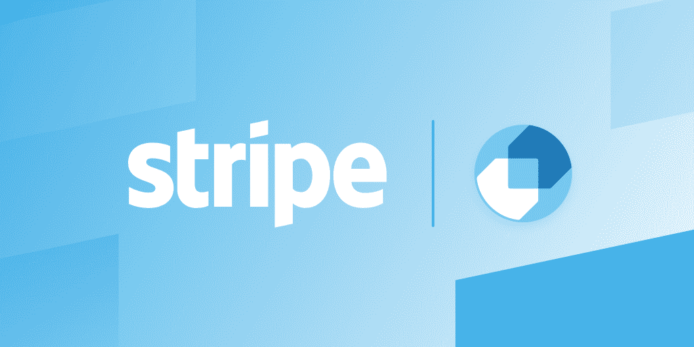
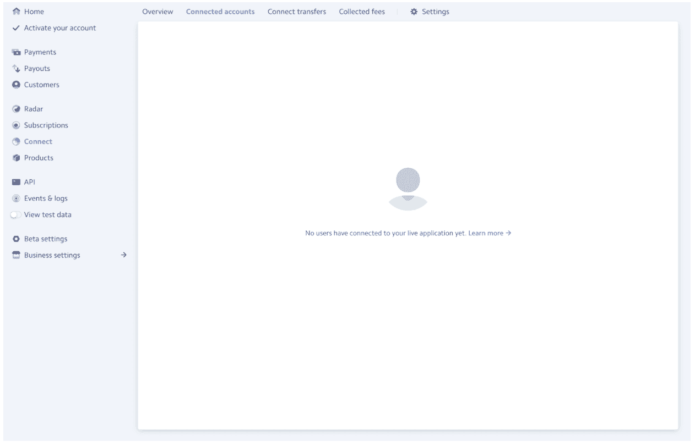
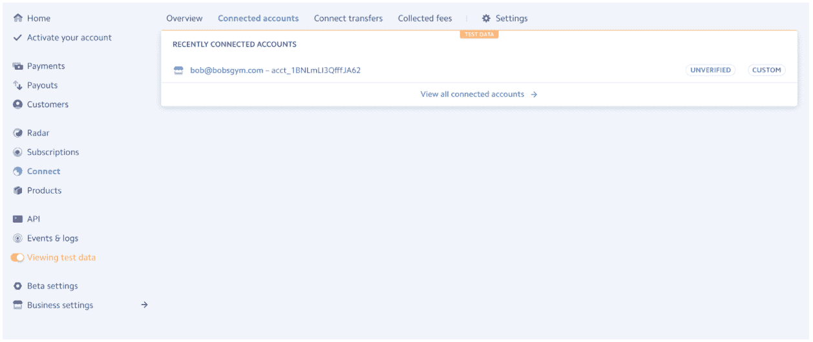
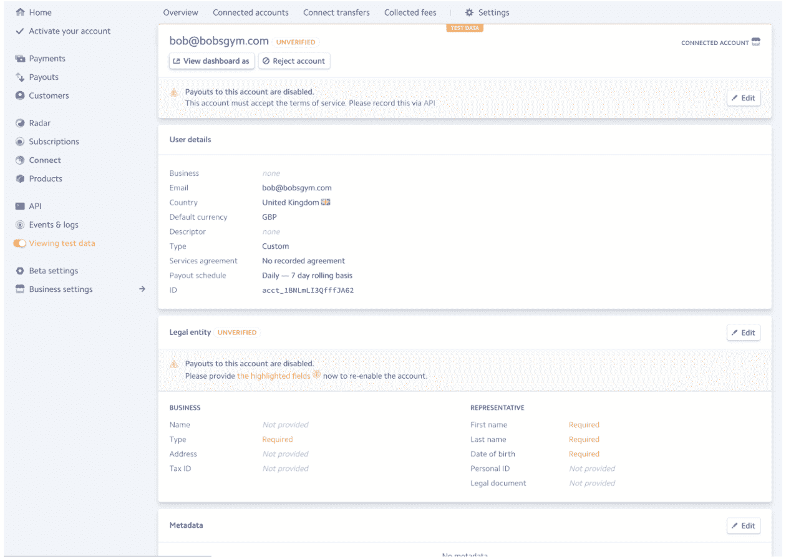
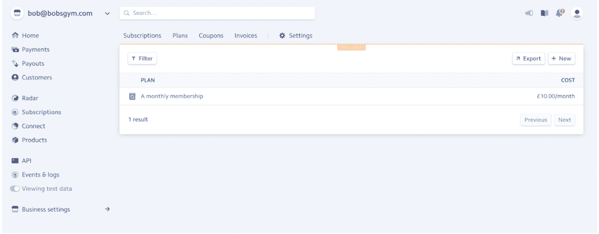
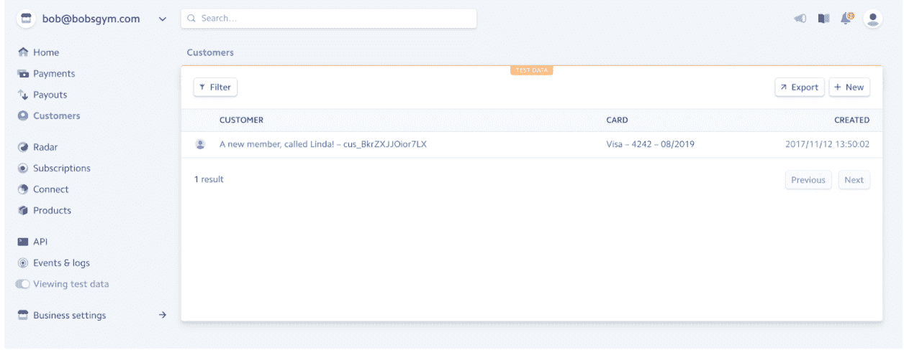
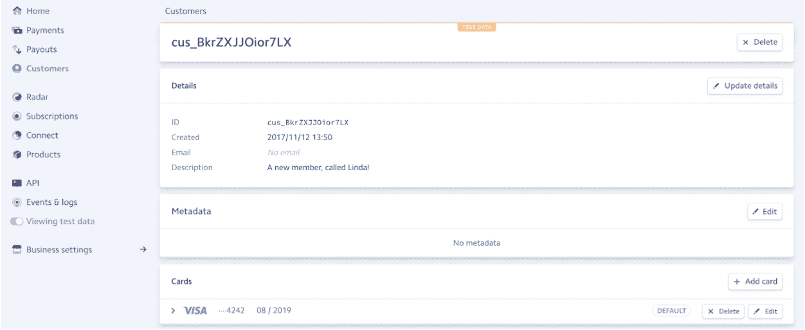
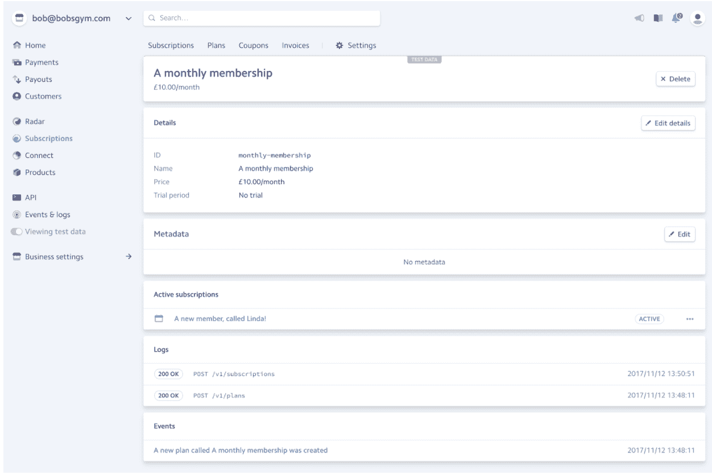
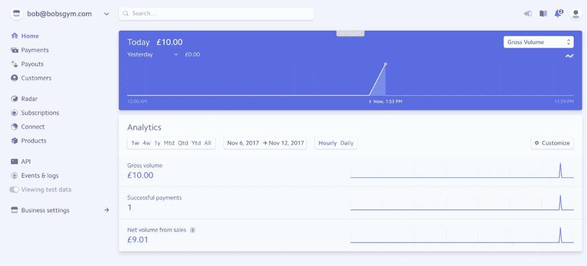

# Stripe Connect:用 Stripe 构建平台业务的终极指南

> 原文：<https://simpleprogrammer.com/stripe-connect-ultimate-guide/>

你有没有想过创办一家像 Airbnb、优步、易贝或谷歌这样的公司需要什么？这听起来令人兴奋，但也令人害怕。

像这样的大型科技企业不像“普通”企业。他们有许多不同的活动部件。他们最大和最可怕的技术障碍之一是支付。他们有客户需要支付个人，然后商家也需要提成。如果他们希望在支付法规和税法不同的国家和货币之间开展业务，该怎么办？

整个支付业务看起来就像一场噩梦。这几乎就像是，如果你想创建一个需要复杂支付系统的企业，你唯一可以实现的方式就是拥有一个非常昂贵的支付专家团队，这可能意味着昂贵的顾问和经验丰富的软件工程师。听起来，轻松管理支付只对拥有大量现金的大企业有效，对吗？

不再是了。Stripe 在线支付使建立支付架构变得容易。你现在可以在网上支付，设置试用期，支付转介:你能想象的一切都有可能与几行代码和在几个小时内！

为了向您展示 Stripe Connect 如何为您服务，首先我们将回顾平台业务模式的历史，以及为什么您应该考虑建立基于平台的业务。然后，我们将讨论 Stripe 到底是什么，以及如何使用 Stripe 通过四个简单的步骤导航平台创建中最可怕的部分——支付。虽然这些示例使用了 NodeJS 和 React，但是它们很小而且简洁，这意味着即使不是技术人员也能理解它们。

我将带你走过每一步，但为了尽可能简单，我还创建了一个涵盖所有步骤的演示，你可以在这里查看。

## 利润丰厚的平台商业模式

平台是一种特殊类型的业务。平台业务不是销售商品本身(这被称为管道业务)，而是代表其他供应商交易商品或服务，平台是连接买家和卖家的架构。

谷歌是这种技术商业模式的先驱。现在，大多数大型现代科技公司都采用平台模式运营。例如，YouTube 不创建自己的内容；它的用户有。优步没有出租车；它将乘客和司机联系起来。Airbnb 并不拥有它出租的住宿；个人用户有。

每一个可以想象的利基市场都对平台商业模式的创新开放。平台甚至正在连接[遛狗者](https://www.borrowmydoggy.com/signin)。(想借狗一天？你可以。)在未来，可能会出现咖啡师分享咖啡制作技巧的咖啡师平台，或者允许摩托车爱好者交易稀有发动机零件的平台。

如果你想了解更多关于平台的历史以及如何构建一个平台，请查看[平台革命](http://www.amazon.com/exec/obidos/ASIN/0393354350/makithecompsi-20)。

但是启动一个平台商业模式需要哪些技术层面的东西呢？大部分平台业务都是应用。这意味着您将需要一台应用服务器，您可能需要某种形式的身份认证，并且您将需要某种方式来接受支付，这就是我们使用 Stripe 的原因。

## 条纹救援！

直到最近，在线支付还很困难。Paypal 借助易贝的力量，创造了一个简单的在线支付解决方案，彻底改变了支付方式。自那以后，世界已经适应了在线支付的思想，这就是 Stripe 的用武之地。Stripe 出生于 2011 年，由爱尔兰兄弟帕特里克和约翰·科利森创建。创始人希望建立一个解决方案来挠他们自己的痒，这意味着设计一个针对开发者的支付解决方案。

## 什么是条带连接？

Stripe 提供了一套服务，其中之一就是 Stripe Connect。Stripe Connect 允许个人将其业务转变为一个平台。然后，平台可以注册“小型企业”作为其支付生态系统的一部分，并控制这些小型企业与其客户之间的支付互动。

## Stripe 的成本是多少？

条带确实有一个[成本](https://stripe.com/pricing)。关于 Stripe 成本的详细信息，请查看他们的支付页面。

## 条带连接教程

既然你对什么是平台很感兴趣，那么让我们来学习构建一个平台(支付部分)需要什么。本教程将带您了解 Stripe 最复杂的支付流程之一:重复支付，平台从中收取重复费用。

由于这种支付模式的复杂性，我们将使用健身房平台的例子来简化生活。想象一下，健身房可以注册，然后使用平台向会员提供定期付款计划。这就是我们今天要建造的。

对于本教程，我们假设您已经在 Stripe 上[注册了一个帐户，允许您将应用程序连接到 Stripe API。在 NodeJS 中，可以将 Stripe 与名为“](https://dashboard.stripe.com/register) [Stripe](https://www.npmjs.com/package/stripe) ”的 npm 包连接起来创建帐户后，您现在可以开始完成平台的四个步骤:

*   创建帐户(健身房)
*   为该帐户创建计划(每月会员计划)
*   创建帐户的客户(注册健身会员)
*   订阅该客户(健身者的月订阅)

## 条带连接帐户的类型

在我们继续之前，我们需要了解条带帐户是如何工作的。企业需要向 Stripe 注册，因为他们需要输入详细信息才能获得报酬。他们注册这些帐户的方式是条带帐户类型之间的差异。

Stripe Connect 为[提供了三种创建账户的方式](https://stripe.com/docs/connect/accounts)。这些类型是:

*   标准
*   表达
*   习俗

这些类型的区别在于:

**用户体验。**标准账户是一种更具颠覆性的体验。要创建一个帐户，企业所有者必须被重定向到 Stripe 网站进行注册，然后返回到平台。现在，企业所有者必须维护两个帐户，一个用于平台，一个用于 Stripe。Stripe 是他们需要去做一切支付相关事情的地方:更改支付方式、取消订阅等。平台处理业务功能。另一端是自定义账户类型，平台所有者代表企业所有者创建一个条带账户。这带来了更加无缝的体验，因为企业不必管理两个账户，整个体验都在平台上策划。

**责任。**自定义帐户意味着平台负责条带交互。这使得平台有责任提供所有必要的功能。这些都必须是定制的，并与 Stripe API 交互。为了使用自定义帐户，平台所有者还必须是注册企业。这些是更无缝体验的成本。虽然 stripe 非常安全，但任何计算错误或错误的付款都意味着平台要承担责任，因此建议进行良好的测试并建立稳定的平台。

平台的需求将决定你决定使用哪种类型的账户。如果平台通过个性化销售策略每年只注册几个客户，那么使用标准账户应该没问题，因为平台所有者可以在业务中走一遍，为他们做好准备。然而，这并不具有可扩展性。如果你的业务类似于 Airbnb，那么每个新主机都不会有手持设备的旅程。Airbnb 希望为新主人确保最无缝和建立信心的入职旅程，这些新主人可能会有点担心把自己的房子单独留给顾客。

在本教程中，我们将使用 Stripe 自定义帐户类型来获得更加无缝的体验。

## 第一步:创建账户

作为平台所有者，您已经在 Stripe 上拥有一个帐户。因此，如果你正在创建一个健身房平台，这第一步包括注册一个健身房业务连接到你的平台。我们正在为企业创建一个自定义帐户，这样他们就不必做这项工作，这样我们就可以控制更多的客户体验。

要在自定义帐户下注册企业，我们需要从企业那里获得一样东西:他们的电子邮件。然后，平台所有者将向 Stripe 提交商家的电子邮件和原产地。

此请求将返回一个帐户 ID；保管好它，你以后会需要它的。

关于此 API 的详细信息，请查看文档。

您的 connect 平台没有注册帐户。

您新连接的帐户(健身房业务)

## 第二步:在新账户中创建一个计划

太好了，现在你的平台上注册了一家企业！但现在，这些企业想要会员类型，也就是所谓的“计划”。这些计划然后由企业客户订阅。企业可能想要一种持续一年的会员类型，并以较低的月付款或定期月订阅(我们现在将这样做)来奖励会员的忠诚度。

对于这一步，您需要定义支付的“间隔”，然后添加计划的费用。(在这个例子中，我用了 1000 便士，这意味着你的月计划现在是 10.00 英镑。)您还需要一个名称，以便在您的应用程序中显示该成员身份。你需要出示身份证。您可以按照您喜欢的任何方式定义这个 ID，作为人类可读的字符串或者作为您自己的数据库中的 ID。最后，您需要为计划的所有者提供帐户 ID。

重要提示:您可能会注意到，在这个调用中有两组参数。第一份详细说明了计划；第二部分是创建计划的账户。如果您调用这个 API 而没有传递第二个参数，您将在平台帐户上创建一个计划，这意味着平台将提供健身房会员资格(这不是我们想要的)。这就是为什么您必须将帐户 ID(在步骤 1 中获得)作为第二个参数传递给 create plan API。Stripe 在其大多数 connect APIs 中使用这种 ID 传递模式。

除了以后的计划 ID 之外，您不需要记住这个 API 的任何响应。

关于该 API 的详细信息，请查看文档。

单击“查看仪表板身份”以查看注册帐户的仪表板

Bobsgym 现在有每月会员计划！

## 步骤 3:创建该计划的客户

现在在平台上，有一家健身房，那家健身房提供月卡。要注册一个计划，需要两个步骤，第一步是创建一个使用付款方式的客户，第二步是为客户订阅一个计划。第 3 步是前者，创建企业的客户。

要注册客户，您需要描述他们。使用他们的名字，以便以后可以找到他们，然后下一步，您需要传递一个支付令牌。为了简单起见，在这个例子中，我使用了 Stripe 文档中的一个[测试令牌](https://stripe.com/docs/api#tokens)。

好吧，为了简单起见，我们使用了一个测试令牌，这是有点作弊。为了获得令牌，您需要使用 Stripe 的 [Checkout](https://stripe.com/docs/checkout/tutorial) 小部件从您的客户那里收集支付信息。该小部件收集卡信息，并将其直接传递给 Stripe(不通过您的服务器)，然后给您一个令牌作为响应。

这个 API 返回您的客户 ID，在最后一步中您需要保留这个 ID。

关于该 API 的详细信息，请查看文档。

Bobsgym 的新客户，琳达

## 步骤 4:为客户订阅该计划

我们走，这是它。您平台之旅的最后一步。这一步包括客户在哪里注册该计划(以及在哪里付款)。

对于这一步，您需要之前在每个步骤中创建的所有三个项目。账户(健身房)、计划(会员)和客户。这里你需要的最后一条信息是你作为一个企业想要得到的百分比。在这个例子中，我们使用值 5，这意味着客户支付 10，您将收取该金额的 5%。最后， [Stripe 将从为您提供的服务中提成](https://stripe.com/gb/pricing)。

然后，您的 API 调用将返回一个订阅 ID。如果要取消或检查订阅，您可能需要存储此 ID 以备后用。

关于该 API 的详细信息，请查看文档。

每月会员现在有一个订户:琳达！

鲍勃的健身房有 10 的收入，这是 9.01 后的费用和 5%的平台

在平台仪表板上，10 现在已经通过平台，它在订阅费方面取得了 0.50 英镑(10.00 英镑的 5%)。

## 构建平台商务支付系统的简单方法

就是这样！

这是通过四个简单步骤创建平台业务的简单方法。现在，您知道了什么是平台业务，为什么未来意味着平台业务将无处不在，以及 Stripe 使平台业务易于操作的真正力量。

现在是时候想出完美的利基，并得到建设！