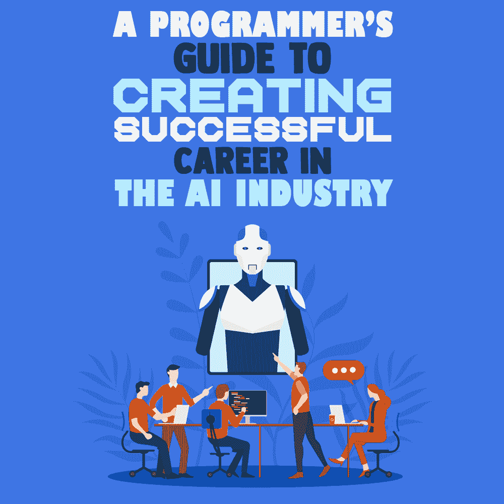
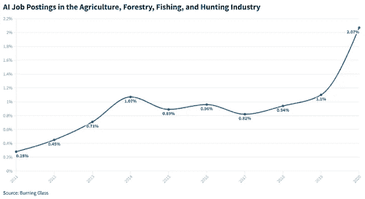

# 在人工智能行业创造成功职业的程序员指南

> 原文：<https://simpleprogrammer.com/successful-career-in-ai-industry/>

[IT 产业](https://simpleprogrammer.com/it-what-is/)是世界上发展最快的产业之一。到 2026 年，其市场规模预计将达到令人震惊的 1.5 万亿美元。

与此同时，人工智能(AI)也在不断发展。据 Statista 称，这项创新技术预计将在 2020 年创造 226 亿美元的收入。

因此，似乎这两个行业对技术策划人来说都非常有吸引力。但问题是，如何到达那里？

在这篇文章中，我将把通往人工智能职业的道路分成几个不同的阶段，来学习如何成为一名成功的人工智能工程师。

## 什么是人工智能？

人工智能的技术是创新的，也是有争议的。因为它非常强大——同时仍然没有得到很好的探索——人们害怕它，并开始讲述人工智能接管世界和取代人类成为工人的故事。

现在，我可以肯定的是，AI 是从[机器学习技术](https://www.amazon.com/dp/1492032646/makithecompsi-20)中蹦出来的。工程师们没有一直训练机器，而是创造了一套算法组合，让机器能够自我训练。

答对了。我们拥有 21 世纪的技术。

几年后，算法变得如此熟练，以至于它们现在从事我们所说的“深度学习”。他们需要越来越少的人力投入，变得更加自主。此外，人工智能现在拥有比以往更多的信息，这创造了更多的学习机会。

人工智能技术在几乎所有行业都有应用:医疗保健、交通、金融、[虚拟现实游戏](https://simpleprogrammer.com/programmers-competitive-vr-gaming-industry/)、广告、制造业等等。

## 云存储和 AI 有什么关系？

几年来，我们目睹了大规模的云迁移。换句话说，由于负担能力、环境问题和网络安全，企业正在将在线服务从物理服务器转移到云存储。

为什么人工智能与此相关？因为人工智能为云服务器提供动力，并能够从它存储的数据中学习。通过这种方式，它可以在任何人注意到之前解决问题，甚至预测和防止问题发生。

亚马逊的 Alexa 和谷歌助手是云和人工智能融合的绝佳例子。此外，这些功能只是宣布了未来我们可以期待的类似设备的大趋势。

反过来，这一趋势为维护人工智能云系统的人工智能工程师创造了巨大的需求。

## AI 哪里可以工作？

话虽如此，接下来的问题是“作为人工智能专家，你能在哪里工作？”下面是一些目前从 AI 中欣欣向荣的行业、公司，甚至政府机构。

### 技术和计算机科学

质量保证(QA)测试是软件开发的一项重要服务。[到 2026 年](https://codoid.com/latest-post/what-are-the-current-trends-in-automation-testing-in-2022/)，问答市场预计将达到 499 亿美元，是现在的两倍多。因此，知道如何利用人工智能和机器学习(ML)进行软件测试和调试可能是一项有利可图的技能。

另一个例子是脸书，或者他们现在更喜欢称之为 Meta。它是一个知名的社交媒体平台，利用 AI 开发了 Oculus 虚拟现实。

*   空缺职位:目前，Meta 有 100 多个与人工智能相关的职位空缺，其中包括研究科学家、光学科学家、SWE 专家等等。
*   从实习生到专家，所有经验水平都受欢迎。
*   通常情况下，AI 工程学士学位是最低要求。
*   在大多数情况下，至少需要 1 年以上的专业经验
*   世界上超过 80%的人工智能工程师在脸书或谷歌工作。

此外，不要忘记脸书/Meta 还拥有最受欢迎的消息应用之一 Whatsapp。Whatsapp for business 创造了一个聊天机器人，这样人们就可以像与真人对话一样与企业交流。例如，一个电子商务网站的幕后人员可以训练聊天机器人提供关于已订购商品的当前交付状态的信息。

如前所述，**亚马逊**是交互式 AI 系统 Alexa 的创造者。2021 年 9 月，该公司宣布计划招聘 5.5 万人担任企业和技术角色。

*   空缺职位:目前，亚马逊有 800 多个人工智能相关的空缺职位，包括数据科学家、应用科学家、软件开发工程师、深度学习架构师等等。
*   远程和办公室工作都可以。
*   通常，至少需要 2 年以上的专业经验
*   一般来说，至少需要计算机专业的学士学位。

### 卫生保健

医疗保健是人工智能技术最有前途的领域。仅在 2019 年，投资者就向医疗保健人工智能初创公司投入了超过 40 亿美元。疫情之后，人们对医疗保健改善的兴趣只会继续增长。

一个基本的谷歌搜索就会发现数百个与人工智能和医疗保健相关的工作，如学习专家、首席架构师、高级医疗保健 IT 顾问等。

### 农业

人工智能系统通过提高整体质量和收获利润来帮助粮食生产。2020 年，农业部门人工智能职位的百分比翻了一番。

[来源](https://spectrum.ieee.org/ai-jobs-farm-forest)

最常见的农业技术职位有:

*   软件工程师
*   UI/UX 专家
*   数据分析师
*   人工智能专家
*   业务开发和销售
*   数字内容创建者
*   营销传播
*   财务(运营和公司财务)。

### 国营部分

人工智能算法帮助美国宇航局的科学家理解关于宇宙的大量数据。目前，NASA 喷气推进实验室有超过 150 个与人工智能相关的职位空缺，包括数据科学家、高级软件工程师、软件系统工程师等。

### 营销

有很多创业公司开发应用程序来帮助营销人员自动化他们的策略。而且，你可能猜到了，大部分都在找 AI 工程师。

短信营销策略可以在很大程度上受益于人工智能。例如，一个人工智能驱动的[短信 API](https://www.smsapi.com/blog/api-smsapi-essentials-developer-guide/,) 可以快速有效地执行短信营销活动。除此之外，人工智能还可以帮助内容创建、通用或常见问题以及个性化客户体验的许多元素。

尽管如此，不要忘记，尽管这个名单上的公司是世界上最成功的公司，但它们不是唯一应用人工智能的公司。相反，人工智能正在成为一种主要趋势，正如我们所说的那样，越来越多的企业正在实施它。

并不是所有的都是大规模的，所以，虽然目前人工智能领域有很多工作机会，但你可能需要知道去哪里寻找以及如何展示自己。

## 人工智能所需的技能

为了成为人工智能专家，个人需要具备一系列复杂的技能。从技术技能开始，这是一个普通的人工智能和人工智能工程师应该知道的:

*   r，Python，Java，C++
*   定量分析
*   商业头脑
*   超过
*   结构化查询语言
*   （舞台上由人扮的）静态画面
*   Hadoop、Spark
*   概率和统计计算
*   报告和演示技巧
*   数据库管理
*   数据分析
*   数据可视化
*   提取和信号处理技术
*   Unix 工具(awk，grep，cat，sort，find，cut，tr 等。)

当然，根据资历和具体的工作岗位，你可能不需要知道列表中的所有事情。例如，要申请脸书大学的初级研究实习生职位，你需要:

*   计算机科学或相关领域的博士或硕士
*   在计算机科学或相关领域发表的论文
*   了解如何使用 C、C++、Python、Lua 或其他语言
*   定量分析技能
*   深度学习的经验
*   数据分析经验

另一方面，要成为亚马逊的高级软件开发工程师，你需要:

*   在新的和当前系统的架构和设计方面有 2 年以上的经验。
*   3 年以上 Java、C++或 C#编程经验。
*   4 年以上专业软件开发经验。
*   2 年以上作为导师、技术主管或领导工程团队的经验。
*   深度学习系统的经验。

正如你所看到的，每个工作岗位都是特殊的，但你可以预期，入门级职位将重点放在你熟悉的事情上，而高级职位将重视你实际能做的事情。

## 个人技能

Other than having knowledge of the aforementioned software and tools, an AI expert is expected to be:

*   好奇的
*   创造性的
*   病人
*   坚持的
*   紧跟最新趋势
*   快速的学习者

作为一名有抱负的 AI 工程师，你应该注意你的软技能，原因有几个。首先，对于上面列出的大多数职位，你很可能不会在真空中工作。你将成为团队的一员，你需要在复杂的社会和企业系统中导航。

其次，虽然人工智能是关于编程和计算机的，但它的目的是理解、适应和模仿真实的人类行为。因此，为了制造对客户有用的 AI 系统，你必须了解人类的需求和心理。

## 正规教育

一般来说，公司认为计算机科学硕士学位是招聘人工智能职位的最低要求。当然，更高层次的教育是一个优势。

此外，**特定类型的计算机科学学位**也是相关的。计算机科学的一般课程只能简略地涉及人工智能。另一方面，一个人工智能的专业学位对雇主来说更有价值。

对雇主来说，另一个重要因素是你的投资组合。如果你有丰富的编程经验，那么他们可能会忽略你没有研究生学位。简单来说，雇主更看重经验，而不是理论知识。

此外，还有各种各样的替代方式来了解人工智能。有[发展课程](https://teamtreehouse.com/library/careers-foundations)和训练营、网络研讨会、在线课程等等。你可以像那样开始，或者补充你在计算机科学方面的一般知识。

## 必需的经验

一旦你获得了学位，你将面临至少 50 个同样拥有学位的人。你怎么把自己和他们区分开来？答案当然是经验。

请记住，即使在获得学位之前，考虑你的投资组合也是至关重要的。

获得与众不同的人工智能经验的方法之一是成为你所在大学的人工智能社区的一员。你可以参加令人兴奋的个人或学校项目，或者去实习。

当然，你会看到有些机会比其他的更好，更被未来的雇主看重。试着寻找知名公司的课程和实习机会。

例如，假设你正在大学提供的免费人工智能课程和谷歌提供的 200 美元的专业机器学习工程师认证之间进行选择。除非你的大学提供的课程非常特别，否则你可能会投资谷歌的培训。在你未来雇主的耳朵里听起来会好很多。

对大多数雇主来说，至少一年的工作经验是极其重要的。这向他们表明，你至少对事情在实践中是如何运作的有一个基本的了解。此外，这也有助于他们确定你与特定职位的相关性。

## 在人工智能中查找工作

最后，一旦你拿到了文凭，有了令人兴奋的作品集，有了对优秀职业的强烈渴望，你就会开始寻找你的第一份工作。

找工作最重要的地方是 LinkedIn、ZipRecruiter 和谷歌求职。这些平台是最受欢迎的，可以把你和最多的雇主联系起来。当你在寻找理想的工作时，考虑一下你希望走的职业道路，因为技术工作有很多不同的方向。

另一种方法是直接接触一家公司。选择一家公司可能取决于你的个人兴趣和以前的知识。例如，如果你对语言和语言学有些兴趣，但仍想成为人工智能专家，那么你可以接触 Grammarly 或 Jarvis 等公司。

或者，你可以加入接管[网络开发](https://simpleprogrammer.com/ai-for-web-development/)的人工智能爆炸。除了现有的巨头如亚马逊和谷歌之外，你可以在任何一家为满足未来几年不断增长的需求而成立的公司工作。

最后，你所在国家的许多专业组织和公共机构可能需要人工智能专家。

## 人工智能和薪酬方面的职业

One thing is certain: AI engineers are among the best-paid experts in the world. The average annual income for AI-related positions in the US was $126,830/year in 2020\. And, in 2022, it grew to $137,750\. Most AI engineers start with $112,355/year while senior-level positions make up to $195,000 annually.

另一方面，机器学习的薪酬略低，每年约为 112，930 美元。然而，预测称，对人工智能的需求正在增长，工程师的收入将很快与人工智能专家持平。

## 现在你已经为一个有价值的人工智能职业做好了准备

人工智能专家是一个非常有前途的职业。然而，通常情况下，开始会很艰难。

为了在人工智能劳动力市场中脱颖而出，你需要提供正规教育、工作经验和个人技能的特定组合。

人工智能将会一直存在。它在从 web 开发到医疗保健和游戏的一系列活动中都有应用。这是个好消息，因为这意味着未来对人工智能专家的需求只会继续增长。