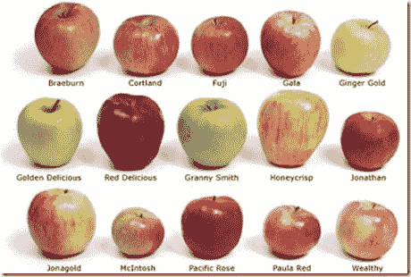

# 开关只是一种幻想

> 原文：<https://simpleprogrammer.com/switch-is-just-a-fancy-if-else/>

抱歉扫了你的兴。我知道您刚刚将一系列 if-else 语句重构为一个 switch 语句，并且您觉得自己今天做了一件好事。

在我把你的桂冠撕成碎片之前，花点时间在你的桂冠上休息一下吧。

去吧，我等着。

好了，现在我们言归正传。

## 用不同的方式说同样的事情

将 if-else 语句更改为 switch 语句的问题是，除了使用的方言之外，实际上什么都没有改变。

都是苹果！

现在，就维护目的而言，switch 比 if-else 稍好，但也好不到哪里去。两种结构(switch 和 if-else)都试图将某种形式的数据(映射)表示为代码。

现在数据和代码都没有明确的划分。但是，总的来说，我们有一个什么构成数据，什么构成代码的概念。

数据是一些本身不包含逻辑的信息。

代码是一些信息，主要是指令和逻辑。

因此，我认为 switch 语句和 if-else 语句都试图将数据视为逻辑。它们都是混合了数据元素和逻辑元素的代码结构，并没有清楚地将两者分开，尽管 switch 语句在这方面做得稍好一些。

考虑 if-else 和 switch 语句的最基本形式。将一段数据直接映射到另一段数据的表单。

*如果“A”则返回“小猫”，如果“B”则返回“小狗”…*

*开关(数据 1)，情况“A”:返回“小猫”，情况“B”:返回“小狗”…*

当我以这种形式重写时，相似之处变得更加清晰。我们也可以很容易地将逻辑与数据分开。

**数据:**

*   " A "
*   " B "
*   “小猫”
*   “小狗”

**逻辑:**

*   将数据集 1 的某些内容映射到数据集 2 的某些内容。
*   返回映射值。

这两种形式(switch 或 if-else)的问题在于，它们都倾向于将逻辑和数据混合在一起。

## 为什么逻辑和数据混在一起不好？

让我问你一个问题。哪个更容易改变？

希望是数据而不是逻辑。

考虑一下[单一责任原则](http://en.wikipedia.org/wiki/Single_responsibility_principle) (SRP。)

一个模块应该有且只有一个改变的理由。理想情况下，我们希望将逻辑从数据中分离出来，这样我们就可以独立地改变这两者。

坚持我们设计的例子，假设我们想要制作“恐龙”而不是“小猫”的“A”映射，或者我们想要添加更多的映射。我们应该能够以一种完全不干扰逻辑或添加新逻辑的方式做到这一点。

如果我们有一个 if-else 结构，我们将不得不添加更多的 if-else 结构或者改变执行逻辑的方法中的数据值。这同样适用于 switch 语句。我们并不是在一个地方声明我们的数据，在另一个地方声明我们的逻辑，它们在代码中是并排的，紧挨着的。

假设我们想改变逻辑，不返回一个值，而是把它赋给某个变量，或者反过来。同样，我们面临着在多个地方改变逻辑，在与数据相同的模块中。

考虑这样一种情况，我们想从一个文件或其他数据源中读取数据。使用开关或 if-else 结构可能吗？不尽然，因为数据本质上是“硬编码”到逻辑中的。

## 我们能做些什么呢？

因此，到目前为止，希望您已经明白，您将 if-else 重构为 switch 语句并没有真正解决将数据和逻辑混合在一起的基本问题。

但是现在你有另一个问题。您需要将数据和逻辑分开，以便它们可以独立地改变。你想成为 SRP 的好管家。您希望有一天能够从文件或数据库中读取数据，这样您甚至不必重新编译代码来更改它。

在我的下一篇文章中，我将向您展示如何获取 switch 语句，并将其重构为一种更好的形式，将数据与逻辑分离开来。

我将讨论 switch 语句的不同“形式”,以及为什么选择一种特定的重构方法。