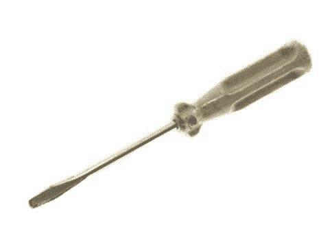

# 换挡就是磨齿轮

> 原文:[https://simple programmer . com/switching-gears-is-grinding-gears/](https://simpleprogrammer.com/switching-gears-is-grinding-gears/)

年轻的程序员请注意，这是你将听到的最重要的编程建议。

也许不是，但这可能是你今天听到的最重要的编程建议。

> “换挡就是磨齿轮。”

我从事编程工作已经有一段时间了，我逐渐意识到影响我工作效率的最大的事情是转换齿轮。

我说的换挡是什么意思？

## 许多不同的背景

切换齿轮可以应用于各种不同的环境，但基本上是当你正在处理一些任务或技术，不得不停止你正在做的事情，或者做其他事情，或者改变你正在做的事情的类型。

这和多任务处理真的有点不同。多任务实际上是试图同时做多件事情。它通常涉及大量快速的上下文切换，但对于这篇文章，我更关心的是打破节奏的总体思路。

我认为，如果我们谈论这个想法的一些具体应用，以及为什么它们是有害的，那么谈论这个话题就容易多了。

## 切换问题

在当今软件开发的敏捷世界中，我们经常被要求从一个问题域切换到另一个问题域，因为我们的许多迭代包含了系统不同部分的不同特性和需要修复的 bug 的混合。

您是否曾经遇到过这样的情况:您刚刚开始理解代码库的某些方面是如何工作的，或者如何与特定的客户一起处理特定的问题，然后不得不切换到其他方面并重新开始？

即使当你切换回原来的工作环境，如果时间足够长，它又会变成新的。你必须重新学习你上次学到的东西，当你开始进入最佳状态时，循环又开始了。

这种转换方式至少是令人沮丧的，最多是彻底的挫伤积极性和生产力。

不幸的是，对于大多数开发人员来说，这个问题超出了您的控制范围。但是，请注意产品所有者和项目经理，迭代应该有目标是有原因的。

如果你作为一名开发人员正处于岌岌可危的境地，试着制造一些噪音，让你的管理人员和产品负责人知道，当你不总是转换齿轮时，你的团队会更有效率。

以我的经验来看，在一段时间内，用共同目标和相关特征的协同作用取代这种不断的环境转换，会对生产力产生惊人的影响，这是任何严肃的商人都难以忽视的。所以大声说出来！

## 交换技术

这是我讨厌 JavaScript 的主要原因。这就是为什么即使在 web 开发如此丰富的情况下，我仍然宁愿编写客户端应用程序。

切换技术是痛苦的！

这是在今天的开发环境中不可避免的事情之一。如果你是一名 web 开发人员，你将会使用 HTML、JavaScript，可能是某种服务器端语言，最有可能是某种形式的 SQL。

这真的不值得尝试去对抗，因为你这样做是违背技术的。虽然，我确实认为这可能是 Node.js 最近流行的原因之一。

我们可以尝试做的是尽可能减少上下文切换。我们通过坚持一种特定的做事方式来做到这一点，而不是追逐每周出现的 JavaScript 框架的每一项新技术。

我不是说不要学习新东西。永远学习是非常重要的。

我要说的是，试着找到你正在使用的技术栈的某种节奏，并且试着不要改变它。

特定技术培训在这方面也很有帮助。例如，我需要更好地学习 JQuery。问题是，当我在开发一个基于 web 的特性时，我没有被强迫去学习 JQuery，因为我在这个环境中的时间还不够长。

那我该怎么做呢？

我浪费时间搜索答案。我知道我来这里的时间很短，我需要咬紧牙关，花一些专门的时间来真正彻底地学习 JQuery，因为通过一次谷歌搜索它的一小部分，我并没有真正取得多大进展，上下文切换最终窃取了我从记忆中所学到的东西。

另一个方面是团队的理念。许多软件开发团队不喜欢将他们的开发人员专门化到一个焦点领域。我完全同意非专业化的想法。

但是！让同一组开发人员在一段时间内致力于一组特定的技术或代码库的一部分，可以获得巨大的好处。在这篇文章的最后，我会更多地讨论这个问题，但基本的想法是，人们需要时间来找到他们的最佳状态。

我认为最好是将任何大型团队分成更小的专注于技术领域的团队，每 3 个月左右定期轮换一次。这里的想法是，你给这些团队足够的时间来做好他们正在做的事情，并真正记住他们所学的东西，但你要经常轮换他们，以免他们最终成为无法看到全局的专家。

## 交换团队

这通常不是问题，但它可能取决于您的工作环境。

团队需要足够的时间来经历形成、冲击和规范阶段。如果你不断地通过更换团队成员来打断这个过程，你永远也不会让团队作为一个独立的实体来运作。

团队通常比个人更有效率，因为他们受益于协同作用，当 1 + 1 =大于 2 时。

但是就像一辆大卡车需要时间来加速一样，一个团队也需要时间来启动。同样像一辆大卡车一样，一个团队可以获得个体开发人员很少能获得的动力。

一个较小的方面是结对编程。我想很多人已经成功地一天左右交换一次编程对，但是我想更多的团队已经成功地以更长的时间间隔交换编程对。

对我来说，这个区间是变化的。有时候，我觉得我需要和一个队友保持配对超过 2 周，这是我们的常规间隔，有时候 2 周也可以。这取决于你在做什么，你有多少动力。

他们在这里的关键是要确保你给团队足够的时间来拿起自己的旗帜和桩他们的领土。团队可以花一些时间找到他们的共同目标。自我指导确实有助于这一点。

## 凹槽

有没有试过用螺丝刀拧平头螺钉，但是拧不动，因为你似乎无法将螺丝刀的头部插入螺钉的凹槽中？

你把那把螺丝刀稍微拧一下，直到它最终滑入凹槽。然后当你转动螺丝刀时，螺丝也随之转动。

作为人类，我们倾向于像螺丝刀一样，我们必须找到自己的最佳状态。我们都有一段调整期，在这段时间里，我们在摸索前进。

非常重要的一点是，要确保我们不会频繁地转换齿轮，以至于一旦进入最佳状态，我们实际上就不会转动任何螺丝。

不管你在做什么样的环境切换——不管是问题领域、技术还是团队——重要的是要确保你不会花 90%的时间去寻找最佳状态，而只花 10%的时间去“最佳状态”

根据你在做什么和上下文切换是什么，切换上下文之前的适当时间会有所不同，但我认为意识到这一现象并围绕它进行计划是非常重要的。如果你不这样做，你最终会原地打转，至少可以说是没有成就感的。