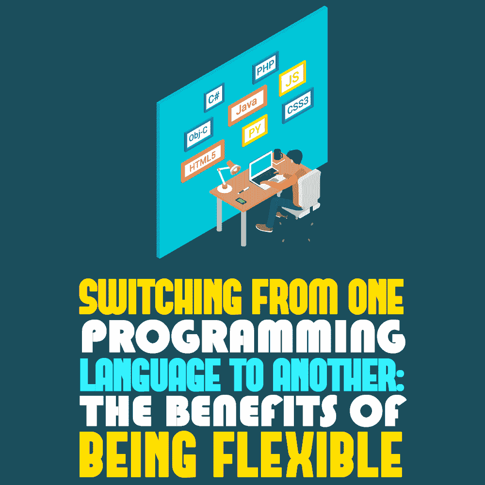

# 从一种编程语言切换到另一种编程语言:灵活性的好处

> 原文:[https://simple programmer . com/switching-programming-languages/](https://simpleprogrammer.com/switching-programming-languages/)

<figure class="alignright is-resized">

</figure>

如果想成为最好的，任何专家都应该扩展他们的知识和技能。这适用于许多领域，包括编码。

编程语言定期发展，项目变得更加苛刻。今天，只懂一种语言是不够的。甚至编程大师 Joel Spolsky 也说至少有四种语言可以让你成为成功的开发者——c#、Java、PHP 和 Python。因此，了解他们可以给你一个竞争优势。

但是，成为“通晓多种编程语言的人”有什么好处呢？有哪些有效切换的小技巧？而如何才能避免变成一个“[永远的新手](https://dev.to/defgrav04/always-a-beginner-jumping-from-one-programming-language-to-another-3h19)”？

请继续阅读，寻找答案。

## 编码员为什么要换？

一些程序员可能认为语言转换不常见，认为最好掌握一种语言。但实际上，许多编码员练习语言转换。发生这种情况有以下一个或多个原因:

*   适应当前的编程趋势。
*   想要改变工作的细节。
*   旨在得到想要的工作。
*   提高专业技能。

语言切换是一种常见的做法，但是每个开发人员都有自己的经验。尽管如此，分析大量的用例，一个通用规则是适用的:你需要知道你为什么要转换，这样你才能选择适合你的语言。

## 如何选择一门新的语言来学习

当人们选择学习一种语言时，首先要注意的是它的相关性和灵活性。

所以，在赶潮流之前，先做好以下几件事。med rectangle-4-multi-110 { border:none！重要；显示:屏蔽！重要；浮动:无！重要；行高:0；边距-底部:15px！重要；左边距:0！重要；右边距:0！重要；margin-top:15px！重要；最大宽度:100%！重要；最小高度:250px 最小宽度:250 像素；填充:0；文本对齐:居中！重要}

首先，分析[市场趋势](https://medium.freecodecamp.org/which-programming-language-should-you-learn-next-487d077baa32)——需求、职位空缺、薪资以及进入壁垒。

其次，确立你的学习目的:

*   你想成为一名移动应用程序(原生或混合)的开发者。
*   你想涉足娱乐行业，开发游戏、赌场解决方案等。
*   你想创建电子商务网站。
*   你在寻找像区块链一样成熟和创新的东西。

你的最终目标将有助于确定你应该关注的语言。

最后，值得考虑你以前的语言，因为它可以定义一门新编程语言的学习曲线有多陡。事实上，大多数编程语言都是相互依赖的，并且有很多共同点——模式、算法、语法等等。因此，理解这种相互依存关系是提高你学习新语言能力的重要一步。

## 编程语言:相互依赖和模式

当从一种编程语言切换到另一种编程语言时，您不会希望花费大量时间来掌握新的编码原则。为了促进学习过程，你可以选择同一语系的语言或者先探索基础语言。

### 学习 C 系列语言

有些专家会建议你开始学习 C 语言。这种语言帮助你理解所有的基本规则和编码模式。在你理解了基础知识之后，任何编程语言对你来说都会变得容易得多。

此外，许多语言都属于 C 家族，例如，Go、Objective-C、C++和 Java。甚至像 Python、Perl、PHP 和 Ruby 这样的语言也有类似于 C 的语法和编程基础，尽管它们不属于这个家族。

来自同一家族的语言有相关的模式、语法和库，所以没有必要转换到不同的编码方法。因此，如果你已经掌握了一门 C 语言，那么转到，比如说， [C++](https://simpleprogrammer.com/what-does-cc-mean/) 或者 [Java](https://simpleprogrammer.com/common-mistakes-learning-java/) 对你来说不会有任何问题。

### 在不同语系的语言之间切换

<figure class="alignright is-resized">

</figure>

尽管如此，其他开发人员发现以前的方法过于保守，甚至过时。他们甚至建议从 Python 开始，Python 类似于 JavaScript，因为它很灵活。Python 支持不同的编程范例，拥有庞大的标准库，并且具有易于理解的语法。使用它，您可以创建从简单的 web 应用程序到神经网络的任何东西。

此外，还有人认为，学习 Haskell 后，任何语言都会更容易掌握，因为这是最纯粹、最经典的语言。

然而，学习一门新语言通常不是一件容易的事情。你的进步可能会因为各种因素而缓慢——二流的学习材料，缺乏动力，或者目标不明确，等等。语言的复杂性会引发更多的问题。

例如，如果你已经使用 JavaScript 很长时间了，那么很难快速切换到 C#。不同的语言范式需要不同的思维。

但是不要害怕！只是习惯的问题。开始是困难的，但会变得容易。

### 最重要的是基础知识

大多数专家都同意一件事:你首先需要掌握一门基础语言。许多人认为必须学习的语言包括:

*   计算机编程语言
*   服务器端编程语言（Professional Hypertext Preprocessor 的缩写）
*   Java Script 语言
*   C++
*   [C#](https://simpleprogrammer.com/cindepth)
*   爪哇
*   哈斯克尔
*   红宝石
*   目标-C

今天，这些也是最流行和最广泛使用的编程语言。当然，你不必一下子学会所有这些语言。只是他们现在正在为编程树立潮流。

## 学习新语言的最佳实践

如果你真的想掌握一门新的编程语言，请记住，你必须有耐心，持之以恒。试着考虑这些简单的建议:

### 知道你的学习目标

如果你明白你为什么要学习某种编程语言，你可以在哪里应用它，你会更专注，更有动力。

大致来说，学习另一种编程语言有两个常见的原因。第一个是新的项目需求，因为有些语言比其他语言更适合特定的项目。假设你需要开发一个网站游戏。在这种情况下，最好的选择是 JavaScript，所以成为 Haskell 专家对这个项目没有太大帮助。

另一个原因是扩大你的投资组合以增加职业机会。

新技术每天都在涌现，影响着编程语言的使用方式。一些语言变得过时了，而另一些却越来越受欢迎。要成为一名优秀的开发人员，你需要掌握新语言的发展趋势。

### 使用质量培训材料

选择[专业手册](https://simpleprogrammer.com/sevenlanguages-sevenweeks)和视频教程。像《T2》这样的书对有效学习没有好处。

幸运的是，有许多有用的资源可供你利用。免费的课程可以去查 Coursera，edX，或者麻省理工。此外，还有特定行业的论坛，经验丰富的开发人员可以在这里分享他们的见解，并指导新手了解错综复杂的编程。一个这样的例子是堆栈溢出。

### 实践

例如，要想成功地学习德语，你必须练习说。同样适用于 Python、Java、Rust 等。编写代码和简单程序的字符串，并使用编码模拟器。为了提高你在一门新的编程语言中的技能，你可以选择专门的平台——有很多这样的平台，比如 Coderbyte、CodinGame 和 Codewars。

### 实验

编码大师建议学习者尝试将程序从一种语言转换成另一种语言。将现有项目的代码库转换成一种新的语言可能是一个耗时但却很有帮助的过程。有了它，您可以探索各种编码挑战，并通过试验新概念和范例来解决它们。

遵循这些建议将有助于简化语言转换的过程，并防止你感觉自己像一个“永远的初学者”你要记住，一个好的程序员并不是懂得尽可能多的语言基础的人；他们是知道如何有效利用它们的人。

## 通过语言切换成为受欢迎的开发人员

<figure class="alignright is-resized">

</figure>

语言切换是[代码掌握进化](https://gorillalogic.com/blog/theory-of-evolution-moving-from-one-programming-language-to-another/)时代的正常做法。专业开发人员学习新语言是为了改变编程细节或获得坚实的竞争优势。

总的来说，要想成为抢手的开发者，就要通过不断掌握各种编程语言的原理和算法来加深对它们的了解。当然，别忘了分析市场趋势。

一旦你知道所有的来龙去脉，你就能毫不费力地找到提高编程技能的最佳机会，并在就业市场上保持吃香。