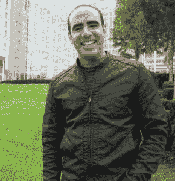

# Taiseer Joudeh 如何在 14 个月内创建了一个非常成功的技术博客

> 原文:[https://simple programmer . com/tai seer-Jou DEH-build-exceibly-successful-technical-blog-14-months/](https://simpleprogrammer.com/taiseer-joudeh-built-incredibly-successful-technical-blog-14-months/)

  

Taiseer Joudeh 是微软 ASP.NET/IIS 的 MVP，在开发和管理金融、运输、物流和电子商务领域的不同软件解决方案方面拥有超过 8 年的经验。

我最近有机会采访了非常多产和友好的，[泰瑟尔·朱德。](http://bitoftech.net/)

当我看到他在 Twitter 上提到我时，他第一次引起了我的注意，感谢我帮助他获得了微软 MVP，并在他的博客帖子中提到了我。

<article role="article" data-focusable="true" tabindex="0" class="css-1dbjc4n r-14lw9ot r-1ny4l3l r-1inuy60 r-1yt7n81 r-ry3cjt r-m611by r-o7ynqc r-6416eg" onmouseover="this.style.backgroundColor='rgb(245, 248, 258)'" onmouseout="this.style.backgroundColor='rgb(255,255,255)'">[Taiseer Joudeh@TJoudeh](https://twitter.com/TJoudeh?ref_src=twsrc%5Etfw%7Ctwcamp%5Etweetembed%7Ctwterm%5E550766293855395840%7Ctwgr%5E%7Ctwcon%5Es1_&ref_url=https%3A%2F%2Fpublish.twitter.com%2F%3Fquery%3Dhttps3A2F2Ftwitter.com2FTJoudeh2Fstatus2F550766293855395840widget%3DTweet)John [@jsonmez](https://www.twitter.com/jsonmez) Thanks for all the inspiration and motivation you blog about! I'm MVP now.Special thanks for you here: [http://t.co/tmQ9cL6m4V](http://t.co/tmQ9cL6m4V)[5:31 AM · Jan 2, 2015](https://twitter.com/TJoudeh/status/550766293855395840?ref_src=twsrc%5Etfw%7Ctwcamp%5Etweetembed%7Ctwterm%5E550766293855395840%7Ctwgr%5E%7Ctwcon%5Es1_&ref_url=https%3A%2F%2Fpublish.twitter.com%2F%3Fquery%3Dhttps3A2F2Ftwitter.com2FTJoudeh2Fstatus2F550766293855395840widget%3DTweet)[3](https://twitter.com/intent/like?ref_src=twsrc%5Etfw%7Ctwcamp%5Etweetembed%7Ctwterm%5E550766293855395840%7Ctwgr%5E%7Ctwcon%5Es1_&ref_url=https%3A%2F%2Fpublish.twitter.com%2F%3Fquery%3Dhttps3A2F2Ftwitter.com2FTJoudeh2Fstatus2F550766293855395840widget%3DTweet&tweet_id=550766293855395840)[0](https://twitter.com/TJoudeh/status/550766293855395840?ref_src=twsrc%5Etfw%7Ctwcamp%5Etweetembed%7Ctwterm%5E550766293855395840%7Ctwgr%5E%7Ctwcon%5Es1_&ref_url=https%3A%2F%2Fpublish.twitter.com%2F%3Fquery%3Dhttps3A2F2Ftwitter.com2FTJoudeh2Fstatus2F550766293855395840widget%3DTweet)</article>

当我看到他在 2013 年 11 月开始写博客，并且在不到一年的时间里，每月浏览量已经超过 100，000 次时，我感到很惊讶！

这是相当疯狂的增长。这个博客每个月的浏览量只会稍微多一点，而我已经坚持写了大概 5 年了。

因为我刚刚创建了一个[免费电子邮件课程来帮助新的技术博客作者入门并取得成功](http://devcareerboost.com/blog-course/)，我认为采访泰瑟尔并问他是如何在短时间内取得如此巨大的成功是完美的。

我录了一段[和泰瑟](http://youtu.be/-2WZco-8P4c)的视频访谈，但是泰瑟也很好心的给我提供了一些详细的书面回答，他们写得太好了，我决定把他们做成 Q & A 的博文，贴在这里。

## 问:是什么让你开始写博客的？

答:有两个主要原因促使我开始写博客。我非常相信这句名言，“如果你想掌握某样东西，那么你需要教它。”大约一年前，我正处于学习如何使用 AngularJS 构建 SPA 以及如何使用 ASP.NET Web API 构建 RESTful 后端服务的阶段。我读了很多帖子、技术文章，也看了很多视频教程。

我觉得我学得太多了，我想找到一种更清晰地表达和分享我的知识的方法，所以最简单的方法就是写关于它的文章和博客；为什么不分享我在这期间学到的东西，听听人们的反馈呢？我相信这是开始博客之旅的主要动机。

促使我开始写博客的第二个原因是我想在软件行业建立一个名字和良好的声誉。我认为最简单的开始方式是创建一个博客并维护它。这个博客是我在网络上的中心基地，我用它来表达我的想法并与社区分享。如果有人用谷歌搜索你的名字，并在网上找到你写的有用内容，这很好。

## 问:你是如何快速增加博客访客的？

有许多因素有助于在短时间内获得大量的游客。我将与您分享这些因素:

在你开始写博客之前，最好集中精力，找一个合适的领域来谈论和写博客。人们会很容易记住你，你的帖子会集中在这个技术领域，所以就我而言，我没有来谈论涵盖 Web 表单、MVC、SignalR、性能、安全等的整个 ASP.NET 技术栈。我选择了一个利基领域，即 ASP.NET Web API 框架，然后我发现自己涵盖了 ASP.NET Web API 框架中的一个较小的利基领域，即安全性、开放认证和授权。这种高度集中的利基帮助我建立了广泛的基础观众。

我相信当我开始的时候，互联网上只有很少的帖子或教程涉及 RESTful 服务的安全部分，正如你所知，任何应用程序的安全性都是不可战胜的。我记得我在谷歌搜索中查看了导致我的博客的查询和关键字，诸如“Web API 认证”、“Web API 安全”等关键字名列前茅。所以，我认为人们想知道更多。我决定建立关于 ASP.NET Web API 安全性的教程，并在这些教程中发表了 10 多篇详细的帖子，其中一些帖子收到了 500 多条评论，这表明读者的参与程度。

我总是努力提供高价值的帖子和内容。我想比起帖子的数量，我的写作风格更注重内容的质量和深度细节。受众总是在寻找详细的内容和帖子；他们在寻找价值。他们在寻找能帮助他们更好地完成工作的东西，或者能教会他们新技能或新概念的东西。

所以在我的案例中，我选择了一个我擅长的大主题。我试着把它分解成小块。如果你注意到的话，我的大部分教程都被分成了多个更小的系列，然而更小的系列意味着这些帖子的长度在 2000-4000 字之间，并且有很深的技术细节。当我开始 Web API 安全系列时，我同时发布了它的两个部分，然后读者开始留下评论，询问即将到来的部分。人们总是在帖子中寻找价值，我猜读者倾向于阅读较小的、有逻辑联系的部分，而不是阅读可能使他们厌烦和困惑的很长的技术文档。

我有一条黄金法则，每次我想写博客时，我都遵循这条法则:如果你写博客是因为你觉得这是工作，那么请不要写博客，你必须写博客，因为你对你写的东西有热情，你想帮助那里的人，你想表达和分享你的想法。

同样，写作，不要期待任何回报。尤其是如果你是博客新手，人们可能以前不认识你，你需要建立信誉和良好的声誉。我想遵循这条规则，你会有一个很好的追随者基础，人们会喜欢并分享你制作的内容。

## 问:你建议其他博主遵循哪些技巧和诀窍？

我相信任何一个开设新博客的人面临的主要障碍之一就是吸引访客。一开始我也有同样的经历，我问自己那些消极的、没有动力的问题，比如:我在为谁写作？我是在白白浪费时间吗？有人会对我的内容感兴趣吗？

但是我遵循了一些其他成功的博客作者已经遵循并分享的技巧。结果成功了。我在这里保留了一份清单，以防我遗漏了什么:

*   首先，你应该对你想谈论的事情有热情。我们之前讨论过这个问题，但是一旦你写了一篇帖子，写它是因为你喜欢分享和表达你的想法，永远不要写一些东西，因为你觉得这是你必须完成的任务，否则你会很早就厌倦，你会退出博客。
*   试着用自己的语言和写作风格，用简单的方式表达复杂的话题。不要假装成别人，在提供信息时要大方，说你不知道这一点也没什么错。你会惊讶地发现，其他专家正在阅读你的帖子并回答你的问题！
*   你必须持之以恒，试着每个月至少发 3 个帖子。如果你中断一段时间，人们会忘记你。
*   在其他排名更高、受众更多的网站上分享你的帖子是没问题的。对我来说，我使用他们的技术博客订阅功能在 CodeProject.com 上分享了我的一些帖子，你会惊讶地发现他们会给你带来如此大的流量！
*   如果你像我一样在写教程或技术文章，尽可能做两件事；**把你的代码放在 GitHub 或者 Bitbucket** 上，不要只是把代码片段放在帖子本身上。人们喜欢下载代码，然后运行它，玩它。同样，**试着提供你正在制作的教程的工作演示。**人们倾向于玩演示，希望在实施之前知道它提供了什么功能。
*   这一点非常重要，对任何留下评论或发送电子邮件的人都要友善、友好、耐心、乐于助人。如果你在写高质量的内容，期待你会收到评论和电子邮件，你应该回复并参与其中。给你留言的读者会把你的文章读完，他很可能会关注你的博客。所以回答并与评论的读者接触；你会惊讶地发现这些评论为博客本身增加了多少价值，讨论变得非常有趣，这将激励其他读者放弃评论，因为他们知道你会帮助他们并回答他们的问题！
*   在社交媒体上分享你的博客文章。对我来说，twitter 是一个伟大的平台。不要忘记使用正确的标签，人们会很容易找到你的推文，你很有可能被拥有大量粉丝的人转发。同样，一天多次发同样的推文可以让不同时区的更多人看到，但不要给你的粉丝发垃圾邮件。
*   在 Reddit 等网站上与合适的 sub reddits 和黑客新闻分享你的博客文章。如果你站起来投票，你无法想象你会从这些网站获得多少流量。同样，也有人经营着非常成功的技术时事通讯，拥有庞大的受众基础；去寻找他们在你的利基领域，接近他们，他们会很乐意将你的内容纳入他们的通讯。
*   当你在写帖子的时候，**思考 SEO 的基础知识**，写一些 SEO 友好的帖子。这是一个很大的话题，但至少要使用正确的关键词，并在你的文章标题、URL 和元描述中包含这些关键词。
*   不要浪费太多时间去创建一个拥有世界上最好的用户界面和 UX 的完美网站。只专注写帖子。我从 wordpress.com 开始，用一个非常简单的免费模板，然后 3 个月后，我觉得我需要对我的网站有更多的控制，所以我把它搬到 wordpress.org，自己主持。这里只有一个建议，就是从一开始就购买自己的域名，因为如果你在 WordPress.com 注册，你可以开始免费使用子域名，然后如果你决定以后转向自托管，这一步会更难。
*   **去回答一些关于堆栈溢出的问题**，如果他们回答了这个问题，就参考你的帖子。

如果你想创建自己的博客，就像 Tasieer 一样，这并不难。[在这里注册我的免费 3 周电子邮件课程](http://devcareerboost.com/blog-course/)，我会一步一步告诉你怎么做。