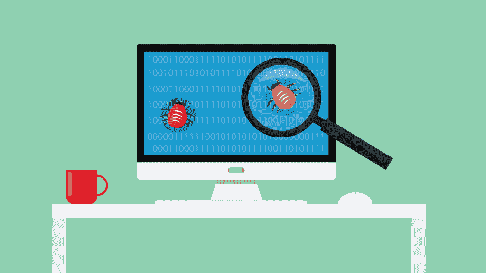

# 勇敢忍受不幸

> 原文：<https://simpleprogrammer.com/take-it-on-the-chin/>

我们都知道编程有时会变得非常困难。无论我们如何努力——我相信大多数程序员都非常努力——错误总是会出现。正当您认为您的工作已经结束时，一个需要您注意的错误出现了。

这真的会让人发疯。

程序员会花几十个小时试图找出如何解决一个问题。你知道那种感觉:当一切看起来毫无意义的时候，一行行的代码消耗了你的整个现实，它的目的不知何故迷失在所有的工作中。所有这些都消耗了大量的时间，并且需要极高的精神韧性。

管理时间会有所帮助，但我们必须学会如何正确地管理时间。成为一名优秀的程序员是一回事，成为一名成功的组织者是另一回事。但是时间管理并不是编码员的主要工作。这就是为什么，如果一个人在为一家公司编码，最好是把这项工作交给项目经理。

有太多简洁的应用程序可以帮助我们组织时间，我们应该充分利用它们的潜力。我们必须保护我们的生产时间。毕竟，我们中的一些人可能想要自己创业，并且需要知道如何最大限度地利用我们的时间。作为程序员，要想真正成功，我们需要保持理智，同时在不切实际的期限内修复耗时的 bug。在这篇文章中，我将探索一些有效的方法来做到这一点。

## 这真让我心烦

每个人都讨厌 bug，程序员和用户都一样。但是用户并没有花费大量的时间来构建这个漏洞百出的软件。他们的烦恼比不上程序员面对未知来源的错误时的沮丧。

当这些发生在他们的软件中时，程序员经常会感到失落和失败。这是理清思路，开始寻找解决问题的方法的最佳时机。我们必须首先找出错误的潜在原因。从这里，我们可以开始重新构建代码，以便在错误开始之前将其消除。

### 更好的注释和变量命名

bug 可能出现的一个原因是由于[糟糕的评论实践](https://simpleprogrammer.com/2015/04/13/why-comments-are-stupid-a-real-example/)。有时，我们不得不将注意力从实际的编码上转移开来，集中于记录代码做了什么，以及它如何与程序的更大目的相关联。从长远来看，这对我们帮助很大。

想象一下，你正在开发一个软件，在你完成制作后，它将会被理想地使用很长一段时间。由于消费者或市场的需求，很可能在这个过程中的某个地方需要改变程序的某些元素。以注释和评论的形式有一个路线图可以帮助解决未来的问题和扩展。就当是帮助未来的自己吧。

除了糟糕的注释实践之外，另一件让你烦恼的事情是糟糕的变量命名。[变量命名很重要，](http://www.cs.utah.edu/~germain/PPS/Topics/variables.html)当你继承别人的代码时尤其有用。如果你给你的变量起了正确的名字，你将为你的后继者节省大量的时间去弄清楚变量代表什么。

为了最小化 bug 的出现，您可能需要超越标准的注释实践。您可能想考虑以实验笔记的形式记录开发过程。科学家定期这样做是为了保护他们的研究，也是为了跟踪他们的发展。通过学习如何做实验笔记，从长远来看，你会为自己节省大量时间。

我知道代码维护真的很烦人，但这就是为什么尽早避免潜在问题很重要。如果你不这样做，你就只能忍气吞声，以后再处理。为了避免处理与 bug 相关的压力，请记住在编写代码时通过正确格式化代码来帮助您未来的自己和同事。

### 保持一致并认识到一致性

每个程序员都有不同的风格，但是你的风格需要保持一致。认识到自己和他人代码的一致性将对您有极大的帮助，因为一旦您注意到与标准代码布局不同的地方，您就会知道很有可能在那个看起来奇怪的部分中有一个 bug。

为了避免处理意外的错误，您还需要关注错误检查。请记住，尽管您可能认为您的代码牢不可破，但用户会找到方法来破坏它。

为了防止这种情况，您必须检查代码中每个操作的结果。您必须确定您的代码能够处理它应该处理的事情，并且能够以同样的方式处理意外的结果。

让真实的人来运行你的代码。你以后会为此而感谢自己的。测试将确保你的代码不可破解，更重要的是，你将避免不得不修复它的压力。

## 保持理智

一个[程序员的生活](https://simpleprogrammer.com/2015/08/24/are-you-in-control-of-your-life/)会变得艰难。由于你花在电脑前的时间太多，你可能会开始感到孤独。即使你和你的朋友谈论你的工作，他们也可能无法真正理解这份工作的挑战。考虑到我们中的一些人可能被困在忙乱的工作环境中，这可能会让人发疯。让我们看看如何在这种动态的工作中保持理智。

为大公司工作会非常困难。作为一名程序员，你只是机器中的一个齿轮，很容易失去目标感。但是如果你仔细观察，你会发现每个员工都有需要自己解决的问题。

### 专注于你的作品

如果你过于担心公司运作中的每一个细节，你可能会感到精疲力尽。我的建议是，不要对你看到的任何出错的事情都感到紧张。专注于你的部分，做你最擅长的事情:编码。

我们中的许多人进入编程是因为我们认为它是一种艺术形式；我们对此很感兴趣，也很满意。许多程序员保存文件，作为好代码的例子。这些例子在结构和执行上都很完美，很像一幅美丽的画。

然而在现实中，我们很少能够专注于创造这样的完美。出现这种情况的原因是我们经常工作过度。你不可能在紧迫的期限内创作出一件艺术品。这是当今程序员的另一个问题——他们工作太多了。

### 设定和协商标准

通过为自己设定某些标准来解决过度工作的问题。

但是，请记住，你的标准可能与其他程序员的不一样。如果你继承了一个项目，确保花尽可能多的时间弄清楚它是如何工作的，并弄清楚他们的标准是什么。

### 你总是在学习

程序员必须不断学习新的东西。不管你熟悉多少种语言、标准、协议或库，总会有更多。每周你都必须学习新的东西，并检查你已经弄清楚的东西的更新。

技术发展很快，你必须能够在压力下工作。程序员有时被要求在失去工作的威胁下为别人的代码工作几个小时。在这种情况下，只有当你[专注于你的目标](https://simpleprogrammer.com/2016/06/30/many-goals-cant-focus/)时，保持理智才是可能的，对许多人来说，这些目标主要是获得报酬、提高技能和获得更多报酬。

事实是，你无法改变当今科技世界的现状。互联网本身极其混乱，每天为数百万用户提供服务。所有这些用户都无意中试图破坏您的代码。

### 接受维护程序是一项无止境的任务

例如，社交媒体网站是现在最热门的。脸书必须全天候工作以保持稳定。因为为了让用户满意，一切都必须看起来运行顺畅，所以公司让程序员们夜以继日地工作。他们拼命维持应用程序的稳定性。用户数量庞大，让一切顺利运行的任务真的会让人失去理智。

编程世界已经变得有点疯狂了，因为它坚持规则，遵守主管们做出的每一个荒谬的决定。你可能有时会觉得你不得不每天抽一包烟来保持冷静，因为每天都有大量的工作堆积起来——不要这样。

相反，要注意你的心理健康，不要参与任何有损心理健康的项目。试着专注于做任何能让你的工作变得更简单的事情。这就是应用程序和工具可以帮助您的工作流程的地方。时间管理在这里是至关重要的，它可以决定你是在混乱中高效工作还是失去理智。

## 时间都去哪了？

我们都经历过最后期限像职业杀手一样悄悄逼近的时刻。这是世界上最糟糕的感觉，主要是因为挫败感和负罪感。

让我们回顾一下时间管理中需要注意的一些重要事项，看看如何才能成功。

### 设定期望

当经理要求你给他们一个完成的时间表时，你不能只给他们一个快速的估计。大多数时候，事情的结果会和你想象的完全不同。这就是为什么你需要正确地分析每一个工作单元。

除了估计编程时间，您还必须考虑花费在测试、调试和文档等方面的时间。否则，你的估计可能会大相径庭。要求经理在项目开始时给你他们对估算的要求。

下一步是根据工作单元的类型对它们进行分类，也就是创建规范工作单元。这将有助于您确定需要完成的工作类型以及它们的分布。一个[规范单元](http://www.businessdictionary.com/definition/specification-spec.html)将需要更多的文档和会议，更少的测试和调试，但是注意不要过度规范，因为这会导致不必要的工作过载。

现在，您应该测试完成简单的编程任务需要多少时间。将你的估计与实际完成时间进行比较。做完这些后，把注意力放在更复杂的任务上。分解复杂任务的工作单元，然后写下每个独立单元的估计值。随着时间的推移，你会注意到时间管理变得越来越困难，但毕竟，解决问题是你的天性，所以你应该能够相应地分配完成任务所需的时间。

### 运行一个示例项目

如果你真的想测试自己完成某项任务需要多少时间，明智的做法是先做一个[示例项目](https://sourceforge.net/p/vsrs/code/HEAD/tree/)。如果你认为这毫无意义，请三思。完成后，您甚至可以通过出售您的示例平台来赚点钱。示例项目可以包括制作计算器、网络浏览器或编辑器。

处理一个示例项目将使您能够创建完成某个工作单元所需时间的统计数据。然后，您可以将估计时间与实际完成时间进行比较。你可以使用一个项目管理软件，比如 [ActiveCollab](https://www.activecollab.com/) 来跟踪和记录你的示例项目的进度。

项目管理在工作组织和时间分配方面会给你很大的帮助。你会注意到不同的工作单元有不同的优先级。通常，最重要的任务具有最高的优先级。

### 监控并报告你的进展

您必须持续监控您的估计时间，并向管理层报告是否有任何变化的预期。如果你在一个重要项目的关键路径上，确保定期发送报告。你不必每天都做，但是每隔几天报告一次。

如果首席程序员不在，你可能不得不改变优先次序，重新安排时间表。有时，现有任务中会有优先级，例如紧急调试。这就是为什么，如果适用的话，最好事先咨询项目管理团队，并持续报告您的进度。

## 勇于解决问题

希望你现在有更多的策略来面对烦人的 bug 和烦人的截止日期保持理智。然而，最终，一切都归结于此。当灾难发生时，你可以采取两种不同的方式。恐慌，或者试图在不幸的场景中找到最好的解决方案。是的，总会有错误，总会有截止日期，但是记住，你可以处理它们。

我们是程序员，这就是我们的工作。

有时候，你可能会感到迷失，没有走上正轨。在寻找丢失的分号时，你可能看起来失去了所有的意义，但你并不孤单。不管一份工作有多难，也有这样的时刻，你确信你的职业是程序员，并且确信你不会用它来交换世界上的任何东西。

虽然在某些情况下时间可能会赶上你，但你将学会如何正确分配时间。通过走在时间的前面，通过计划，通过强有力的项目安排，你将创造出急需的空间来做你最擅长的事情——解决困难的问题。所以忍着点。只要有一点点勇气、计划和决心，你就能克服所有等待你的挑战。