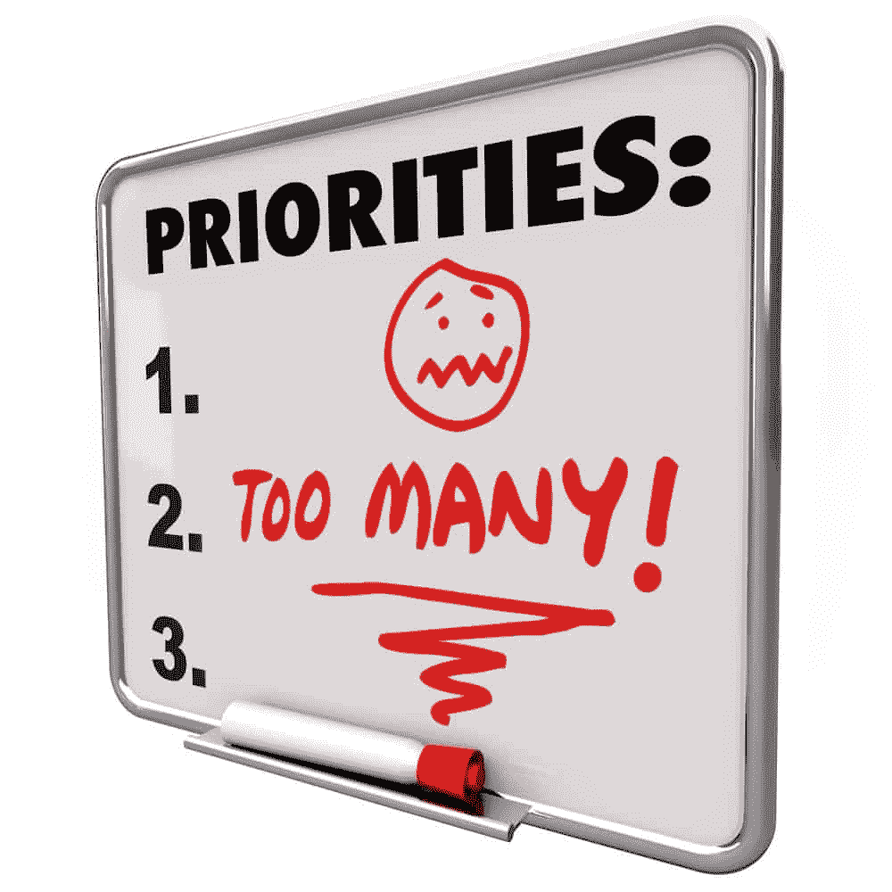
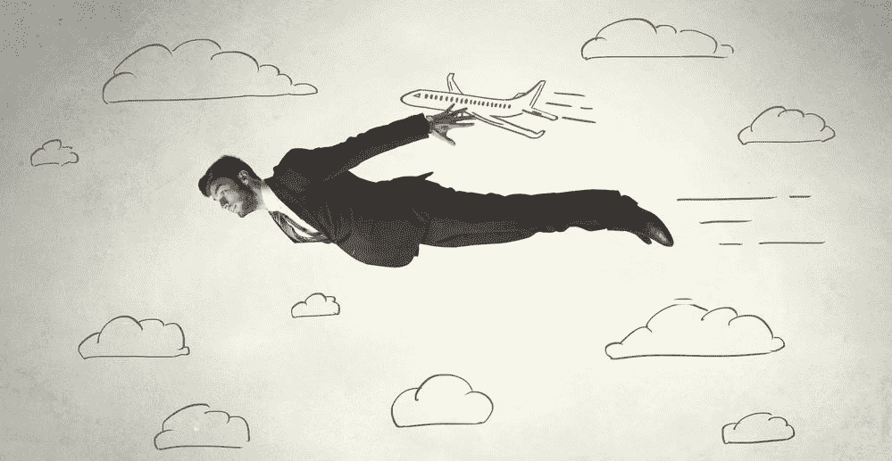
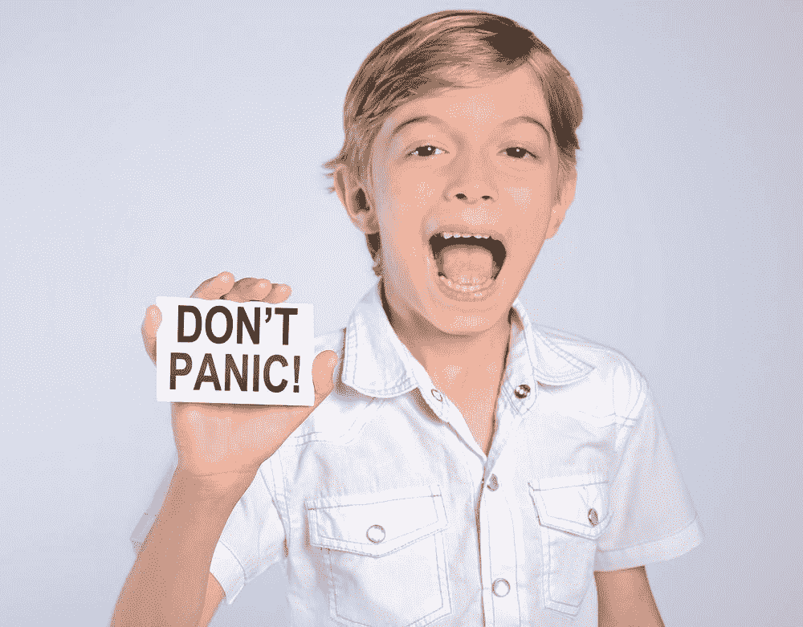

# 抽出一些时间

> 原文：<https://simpleprogrammer.com/taking-some-time-away/>

自 2009 年 11 月以来，我一直坚持每周写一篇博客，除了错过的几周。

那是很长的时间。

当我在欧洲旅行三个半月的时候，我甚至每周都写博客。

我不想打破这个记录。

我不想让任何人失望。

但现在，我打算有意识地休息一小会儿，让自己焕然一新，把事情搞清楚。

写这个都很难。

我强迫症的那一面尖叫着我断不了链子。

但是，我越来越觉得我需要休息，我需要离开一段时间，不要给自己太多压力。

这件事越积越多，我觉得我不能再忽视它了。

我现在这样说可能有点奇怪，因为我刚刚从一些人所谓的相当长的假期中回来。但我觉得，要么是时间不够，要么是我的脑袋仍然被简单的程序员所包裹。

老实说，可能两者都有。

我真的没有一个星期不思考简单的程序员和需要做什么。

尽管严格来说我只在周五工作，但我仍然在一周的时间里回复邮件和制作视频。

## 缺乏动力

我在这里会完全坦诚。

我早上起床，最近我就是没有动力去做任何事情。

作为一个生产力迷，我很难承认这一点。

但是最近[我在看板上写了六件事情，但是只有一件事情完成了——有时一件也没有。](https://simpleprogrammer.com/2014/10/09/plan-week/)

我早就感觉到了。

我不想称之为倦怠 ，但我猜想可能就是这样。

在过去，我总是能够克服“精疲力尽”，因为我能够让自己坚持下去，这样我就可以达到一些更高的目标。

我已经没有更高的目标了。

我真的没有我觉得需要去的地方。

我不再觉得有必要证明自己。

我不是在吹牛，但我赚了很多钱，[我出版了一本成功的书](https://simpleprogrammer.com/softskills)，我证明了我可以成为一名企业家。

就财务和商业成功而言，我真的没有太多动力去实现。

我也不想称之为抑郁症，因为我相信这是一个逃避的答案。

如果我把我正在经历的称为抑郁，那么我正在放弃控制。我承认我很无助，虽然我知道我不是。我可以掌控一切，我可以做出改变——这就是我写这篇文章的原因。

我想我愿意称我目前的状态为无聊。

我对每天做的事情不再感兴趣。

我对写一篇新的博客文章不感兴趣。

我对录制更多视频或管理简单程序员的日常任务不感兴趣。

我不是说我再也不会兴奋了，但是我需要休息一下，改变一下节奏。

我需要一些新的视角和更新，我不认为我会继续坐在电脑前一遍又一遍地做同样的事情。

## 我伤了自己

当我从欧洲回来的时候，[我想要对我将要在简单程序员](https://simpleprogrammer.com/2015/09/21/back-from-europe-and-updates/)这里做的新事物充满热情，以至于我在很大程度上假装了这种热情。

当我意识到这一点并试着去想一些我可以充满热情的事情时，我开始意识到我可能已经不知何故地打破了自己。

我想，在过去的几年里，我如此努力地工作，训练自己变得如此自律，以至于我打破了我内心的一些东西，我不知道如何才能让它回来。

我觉得我已经教会了自己如何成为一个机器人或一台可以完成大量工作的机器，但在这个过程中，我失去了所有的激情和欲望。

我试图弄清楚我对什么感到兴奋，我喜欢做什么，但我总是一无所获。

我找不到任何我真正想做的事情。

我曾经有很多激情。

我过去喜欢玩视频游戏，万智牌，看电影，甚至和朋友出去吃饭，但是 T2，我发现自己处在一个没有任何吸引我的地方，这有点可怕。

我觉得我把摩托车带进了车库妥善保管，以为当我终于准备好骑的时候，我总是可以掸掉它的灰尘并再次启动它，却发现当我启动 kickstarter 时，什么也没有发生。

我和自己做了一个交易，当我蹲下建造我的未来时，把我所有的激情和“乐趣”都放在一边，却发现我留下的面包屑被鸟儿吃掉了。现在我找不到回去的路了。

这是一个可怕的地方。

而且很难承认。

我不止一次想删除整篇文章。

我想相信只要躲进电话亭，我就能立刻从克拉克·肯特变成超人。但事实是…我不能。

当你努力到忘记生活的时候，你就有问题了。

当你看不到你为之努力的事情时，就有问题了。

## 你必须有意义

我已经教会自己在没有很多东西的情况下继续跋涉和忍受。

我可以几天不吃东西。

我可以不睡觉或不休息地工作。

我可以克服分心和拖延。

当我不喜欢的时候，当我觉得我已经失去了所有的动力的时候，我可以工作。

我甚至学会了如何从失败的虎口中夺取胜利，并比以往任何时候都更加强大。

但是我还没有学会如何去做没有意义的工作。

我觉得这就是我所失去的。

当你正在做的事情与目标无关时，即使是从灵魂深处，也很难鼓起动力。

桶是空的。这口井已经干涸了。

我不再能把我正在做的事情和我想要实现的事情联系起来，因为——目前——我没有任何想要实现的事情。

## 对自由的追求

长久以来，我一直在追寻自由。

我想为自己建立自由，这样我就可以真正做我一生中想做的事情。

我想买回我的生命，买回我的时间，真正的自由。

但是，颇具讽刺意味的是，通向我自由的道路却带走了它的意义。

我压抑了太多，努力了太多，以至于我已经不知道自己想做什么了。

我开始意识到，就自由而言，我很久以前就达到了目标，但我仍然继续跋涉，从未完全拥抱它。

这不是一件容易接受的事情。

如果你可以做任何事，你会做什么？

我是说任何事情。

如果你不需要薪水。如果你能随心所欲地度过每一天。

我曾经有这些问题的答案，但现在我不知道了。

我必须找到这些答案。

我不能继续我正在做的事情，直到我知道我为什么要做这件事，并且我已经选择了那条路，而不是我已经选择了安全或舒适的路。

## 休息一下

这就是为什么我要休息一下。

我正在整理一些东西，这周之后，我将专注于重新发现我想做的事情，现在我真正自由了。

但是不要担心，我不会杀死简单的程序员。

你可能甚至没有注意到我走了。

我已经考虑这个问题有一段时间了，这就是为什么我开始转型，让简单的程序员不仅仅是我一个人。

我相信你已经看过一些由我们的作者发表的精彩文章了。

我很高兴在简单程序员社区中有这么多的人能够看到简单程序员的愿景并为之做出贡献。

因为我有一段时间不会写作，他们会是另一个空缺。如果你对写作感兴趣，在这里申请。

我还会继续发布我的 YouTube 视频，因为我是成批发布的。所以，至少在接下来的两个月里，应该还是会有大量的视频。

简单的程序员播客也是如此。

我也会尽量避免使用电子邮件。所以，如果你给我发邮件，你很可能会收到我团队中某个人的回复。(这可能会是最艰难的挑战。)

## 最后一个音符

有些人不可避免地会问我，我的决定是否正确，是否值得，我是否会再次这样做，或者我是否后悔我所采取的行动。

我个人没有任何遗憾。

我认为我走到今天的路是我需要走的路。

过去的五年是一段疯狂的旅程。

我不得不努力工作来取得我已经取得的成绩，我会再做一次。

但是是时候继续前进了，是时候成长了。

我必须重新找回我失去的东西，回来时比以前更强更好。

我觉得这整个过程是我蜕变过程中必不可少的一步。

我不知道未来会发生什么，但我知道它是光明的。

至于有人在考虑我的道路，想知道所需要的工作和牺牲对他们来说是否值得……我无法回答。

但是我要告诉你:

自由的代价确实很高。

任何跟你说不的人都是一派胡言。

由你来决定你是否愿意付出这个代价，以及你想走多远。

特别感谢赞助这篇文章的[泽法](http://www.getzephyr.com/)。泽法是敏捷开发和软件测试领域的思想领袖，也是 Simple 程序员的长期合作伙伴。如果你正在寻找一个[测试管理解决方案](http://www.getzephyr.com/)，我强烈推荐他们。