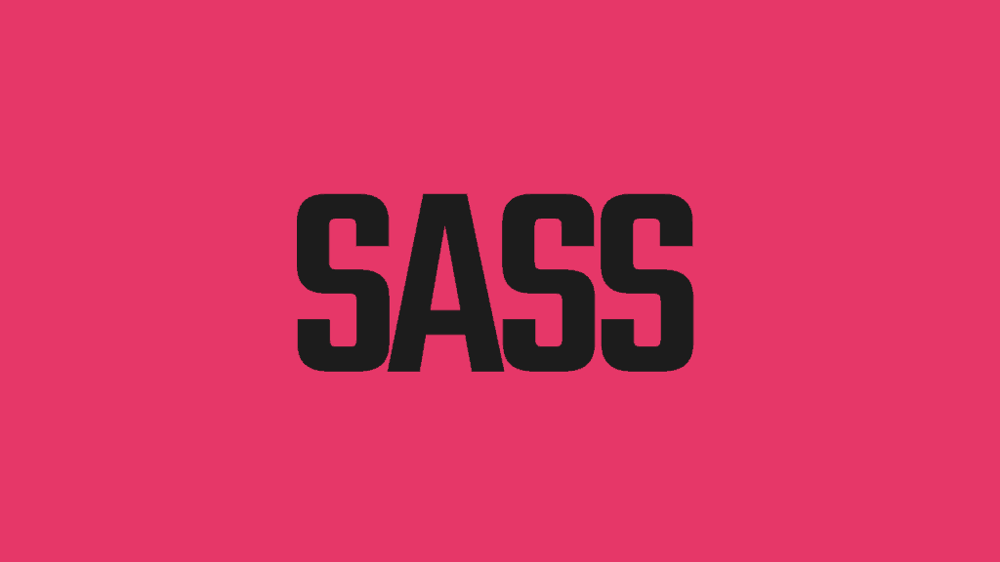
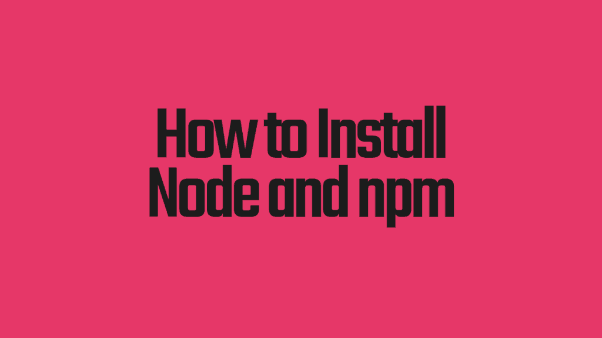

# 用一些粗鲁的话驯服你的 CSS

> 原文：<https://simpleprogrammer.com/tame-your-sass-css/>

想象一下这个:

后端开发已经从他们的微服务、精心定义的 API 和抽象层中脱离出来，并被扔给前端团队来帮忙。

时间紧迫，必须在最后期限前完成。

我们的后端开发人员负责修复一些样式问题，深入研究 CSS 和恐怖:

是的，[神奇的数字](https://en.wikipedia.org/wiki/Magic_number_(programming)#Unnamed_numerical_constants)一眼望去，字体堆栈无处不在，样式呈现在 CSS 选择器无组织无休止的游行中。

现代 CSS 曾经把我们从内联 HTML 样式中拯救出来，但现在它又回来活生生地吃掉我们。当然，这不是 CSS 的错。

杂乱无章的 CSS 定义只是大型活跃团队的复杂 web 应用程序的产物。

但是对于这样的问题有一个极好的解决方案: **CSS 预处理器。**

特别是，Sass CSS 预处理器是一个很好的选择，它可以让松散的 CSS 样式变得更加健康，这会让我们的后端开发更加开心。

如果你觉得这听起来不错，那么请继续阅读，了解:

*   Sass CSS 预处理器如何通过嵌套、变量、混合和继承来简化 CSS。
*   如何安装 Sass 并立即开始在自己的 CSS 上使用**。**
*   **如何设置 Sass 来自动处理你的 Sass-y CSS。**

**本文*假设您至少对 CSS 有一点了解。如果你不是，看看[这篇文章，这是对 CSS](https://www.lukefabish.com/tutorial-css-for-beginners/) 的初学者友好的介绍，然后马上回来。***

## **那么什么是 CSS 预处理器呢？**

**CSS 预处理器是一个开发工具，它可以把比普通 CSS 更好的东西拿出来，然后把普通的 CSS 放到浏览器中。**

**有很多工具可以做到这一点。最常见的有[少](http://lesscss.org/)、[萨斯](http://sass-lang.com/)、[手写笔](http://stylus-lang.com/)和 [PostCSS](http://postcss.org/) 。**

**这些工具中的每一个都有自己的*语法*用于向 CSS 添加特性，例如:**

*   **嵌套(或层次)——构建你的样式规则，使它们之间的关系变得明显。**
*   **变量——不再有神奇的数字！**
*   **mixins——定义一组样式一次，并多次使用它。**
*   **继承——一个 CSS 规则可以继承并“扩展”另一个。**

**这些都是很棒的特性，几乎所有的 CSS 预处理程序都提供了这些特性，但是让我们仔细看看一个预处理程序:Sass。**

## **什么是萨斯？**

****

**首先，Sass 代表“语法上令人敬畏的样式表”，对我来说，这听起来像是一个很酷的缩写词的理由，但它们*确实*提供了——Sass*在语法上令人敬畏。***

**它也是应用最广泛的 CSS 预处理程序。2016 年的一项调查发现 63%的网络开发者使用 Sass。**

**它最初是在 Ruby 中实现的，Ruby 是一个依赖于许多开发人员的工具，但幸运的是，Sass 现在已经是 npm(节点包管理器)打包和构建系统中成熟的一部分了。**

**这使得[很容易安装](http://www.amazon.com/exec/obidos/ASIN/0994182678/makithecompsi-20)并像其他 npm 包一样使用。**

**除此之外，Sass 还拥有出色的工具支持和语法，在简洁和可读性之间取得了良好的平衡。**

**最后，它很容易学习并立即开始使用。**

## **警告！SCSS 对萨斯**

**现在 Sass 有一个非常令人困惑的情况——它支持两种完全不同的语法。其中一个语法叫做*Sass*；另一个叫做 *SCSS* 。**

**事实上，有工具*和*一种叫做 Sass 的语法也没有什么帮助。**

**萨斯语法 vs SCSS 语法是人们喜欢参与圣战的事情之一，但我更喜欢 SCSS，因为:**

*   **SCSS 是 CSS3 的超集—普通 CSS3 被 Sass 成功处理。**
*   **如果你是第一次来 SCSS，SCSS 这个词就比较容易听了。**
*   **这是官方 Sass 文档中使用的默认语法，这让您在阅读 Sass 时更加方便。**
*   **开始改进一个现有项目的 CSS(对我来说是正常的情况)更容易的方法是慢慢地向它添加 s CSS 规则。将大量现有的 CSS 规则转换成 Sass 将是一项艰巨的任务。**

**话虽如此，您也应该检查一下 Sass 语法，尤其是对于新项目。所有这些概念都适用于它，但它是一个更简洁的语法。**

**所以当你在这里看到一些 Sass 样式时，它是在 SCSS 语法中。**

## **您现在可以使用的 Sass 功能**

**对！是时候让我们的 [CSS 按顺序](http://a.co/8z7IRtm)了。我们将首先研究 Sass 的特性，然后安装并使用它来处理一些示例 Sass 样式。**

**我们将从向 CSS 添加一些结构开始:**

## **用 Sass 嵌套**

**关于 CSS 的事情是这样的:当你在看一个 CSS 文件时，你必须想象样式规则将被应用到的页面的结构。**

**例如:**

**从上面，我们知道 li 元素有默认的定义，并且有某种侧导航，它将有 li 元素，其中有*锚*元素。**

**这很容易理解，但是你需要考虑元素是如何构成的。**

**不如这样:**

**我们不仅只有一个 *#sidenav* 的条目，而且我们可以看到它里面将有 *li* 元素，这些元素又包含锚元素。嵌套结构更加直观。**

**媒体的询问呢？它们是复制 CSS 选择器的不可思议的来源。它们也可以嵌套，这样我们就不用重复指定相同的选择器了:**

**因此，不用在@media 查询中重复所有的选择器——现在媒体查询可以直接放在选择器中。**

**但是，我完全可以听到你说，那些媒体查询一次又一次地出现，带有那些硬编码的 *max-width* 值怎么办？**

**这将是一场维护噩梦。**

**幸运的是，通过增加变量，Sass 也解决了这个问题。**

## **变量如何帮助 Sass CSS**

**程序员有*干* ( [不要重复自己](https://en.wikipedia.org/wiki/Don%27t_repeat_yourself))钻了进去，然后还得用 CSS，这个*连干都没听说过。***

**Sass 中变量的引入允许我们将一个值定义为一个变量，我们可以在整个样式规则中使用它。那要干燥得多。**

**虽然有可能*重定义* Sass 变量，但是最好把它们当作一个常量，所以如果你需要改变那个值，你只需要在一个地方改变它。**

**让我们通过扩展前面的例子来看看它是如何工作的:**

**在这里，我们在媒体查询中一遍又一遍地重复这个最大宽度值。如果我们想改变屏幕宽度，我们开始适应我们的风格呢？那么我们必须改变所有的@media 查询。**

**我们可以使用一个变量来代替它:**

**设置 *$mobile-screen* 变量并在我们的媒体查询中使用它使得我们的 CSS 更易于维护。一个很好的奖励是，我们也有一个有意义的名称应用到我们的最大宽度。**

**变量的语法与普通 CSS 样式规则的语法非常相似:**

**这个变量就像一个普通的样式规则，除了在开始有一个$之外，并且它没有出现在 CSS 选择器中的*。***

**当然，我们并不局限于媒体查询值——我们可以使用 Sass 为变量分配颜色、字体堆栈和任何类型的度量。在整个 CSS 中重复出现的任何值都可以用变量替换。**

**但是如果您发现自己重复 CSS 样式规则的*组*会怎么样呢？**

**输入混音:**

## **Mixins:用 Sass 变得更干**

**我们可以把 mixins 想象成一桶我们想要重用的样式。**

**假设我们有一些字体和边框样式想要应用到整个 CSS 中:**

**当然，我们可以把它放在一个类选择器中，然后把这个类应用到 HTML 中。问题是，一些元素可能有附加到高度特定的选择器的竞争规则，所以它们击败了我们的花哨样式。**

**我们可以做的是:**

**这很好。我们的菜单项和按钮可以有标准化的样式。但是我们也可以将这些混合参数化，这样它们就像一个函数一样工作:**

**我们已经向我们的*标注* mixin 添加了一个$borderwidth 参数，并赋予它默认值 1px。**

**这太棒了。现在我们可以有相同的风格，但配置它每个选择器*；这结合了出色的外观一致性和极大的灵活性。***

**现在我们有进展了。我们添加了一些结构，并利用变量和混合来减少重复。**

**下一步是什么？让我们看看如何利用预定义的样式来轻松地创建新样式。**

## **遗产**

**继承通常是与面向对象编程联系在一起的(并不是正面的！)，但是在 Sass CSS 中，它给了我们一个机会来利用预定义的样式，不费吹灰之力就创造出新的样式。**

**让我们看看它是如何工作的。以下是迄今为止我们的口水战总结:**

**现在，假设我们想要一个新的样式，它结合了我们现有的导航样式*和带有边框的元素*。**

**我们可以在 CSS 选择器中使用 *extend* 关键字来继承另一个选择器的样式。让我们来看看:**

**这是一个非常简短的定义，但让我们看看它给我们带来了什么:**

*   **来自#sidenav 的风格，包括*李*、 *a* 、 *@media* 定义。**
*   **在*标注*中定义的边框样式和字体堆栈。**

**对于这样一个小小的样式定义来说，这是一个很大的样式。**

## **如何将 SASS 添加到 npm 构建中**

**但是我们如何在日常开发环境中使用 Sass 呢？最好的方法是将您的 Sass 合并到 npm 构建过程中。**

**使用 npm 使 CSS 转换自动化将使您可以在浏览器中直接看到您的样式更改，这对于自动将更改部署到登台和生产环境是必需的。**

**请注意:我们将从命令行完成大部分工作。如果你不确定如何在你的电脑上做到这一点，现在是一个学习的好时机。**

**如果你使用的是 Windows，命令提示符是一个非常棒的老派起点。**

**在 macOS 和 Linux 上，您需要打开一个终端(macOS 上的终端应用程序)。Zed Shaw 在这里有一个关于如何在 macOS 和 Linux 中使用终端的很棒的迷你课程。(他也覆盖了 Windows，但是用的是 PowerShell 而不是 cmd.exe。我认为 cmd.exe 对初学者更友好。)**

## **如何安装节点和 npm**

****

**Node.js 和 npm 在一个包中结合在一起。**

**如果您已经做过一些 web 开发，那么您很有可能已经安装了 node 和 npm。**

**要进行检查，请打开命令提示符(Windows 上的 cmd.exe，macOS 上的终端)并键入 *node -v.***

**如果你安装了 node，它会打印出版本号。太好了！直接进入下一部分。**

**如果你没有安装 node， *node -v* 会让你的命令提示符抱怨。别担心，我们现在会解决这个问题。**

**对于 macOS 和 Windows，最简单的方法是进入[节点下载页面](https://nodejs.org/en/download/)，为您的系统下载一个安装程序，双击该安装程序，然后按照说明进行操作。**

**如果你在 Linux 上，使用系统的包管理器(apt-get，yum 等)可能会更容易。您可以在[节点的软件包管理器安装页面](https://nodejs.org/en/download/package-manager/)上找到相关说明。**

**一旦你这样做了，回到你的命令提示符，键入 *node -v* 和*NPM–v*进行更好的测量。这是我的展示:**

## **建立一个测试项目，并为 npm 安装 SASS**

**现在您已经安装了 node 和 npm，让我们设置一个测试目录来测试一些 Sass。注意，因为我在 Mac 上，所以我将使用适用于 Mac 和 Linux 的命令。**

**创建一个名为 sass-test 的新目录，并切换到该目录:**

**现在您已经在 *sass-test* 目录中，让我们初始化 npm:**

**这个命令创建一个 package.json 文件，npm 使用它来跟踪您正在使用的包，以及它应该对它们做什么。 *-y* 标志告诉 npm 不要用许多关于初始化的问题来打扰你。**

**现在是时候为 npm 安装 Sass 了:**

**首先，这产生了*大量的*输出。不要担心那个。**

**这里要注意的主要事情是，我们正在安装节点知道如何运行的 Sass 版本。— *save-dev* 标志表示 *node-sass* 应该*而不是*包含在产品发布中—它只是用于开发。**

**现在我们已经安装了 node、npm 和 Sass。我们该拿他们怎么办？**

## **使用 npm 运行您的 SASS 预处理器**

**让我们得到一些可以使用的 CSS。我们将使用本文前面的例子 Sass CSS。**

**在你的 *sass-test* 目录下，新建一个名为 *app* 的目录，然后在该目录下新建一个名为 scss 的目录。**

**注意:scss 是我们对萨斯 SCSS 语法的扩展。如果我们使用 SASS 语法，我们的扩展名应该是. sass.**

**将 *app/scss* 目录下的以下内容保存为 *app.scss* :**

**现在，确保您仍然在 *scss-test* 目录中，运行以下命令:**

**这意味着:**

1.  **我们是这样运行 Sass 的: *node_modules/。bin/node-sass***
2.  **这是我们要处理的文件: *app/scss/app.scss***
3.  **这是我们想要 CSS 输出的地方: *dist/css/app.css***
4.  **请很好地格式化我们的 CSS:*–输出样式扩展***

**因此，请查看 *dist/css/app.css* 文件。你会看到它里面有常规的旧 CSS 实现了我们的 Sass CSS 样式。**

**但是我们运行的获取 CSS 的命令是 *long* 。谁想把这个打进去？肯定不是我。**

**为了让生活更轻松，我们将让 npm 为我们运行它。编辑 sass-test 目录中的 package.json 文件。它看起来应该是这样的(如果有微小的差异，请不要担心):**

**在脚本部分，我们将添加一个命令来运行我们的 Sass。更新您的文件，使其显示如下(突出显示更改):**

**(注意*脚本*下第一行末尾的逗号。)**

**一旦添加并保存了 package.json，现在就可以像这样运行您的 Sass 构建了:**

**那就简单多了！但是每次你改变风格的时候都这么做有点无聊。**

**自动做怎么样？**

## **设置一个观察器来自动将你的 Sass CSS 编译成 CSS**

**Sass 拥有强大的能力，可以自动监视您的 Sass CSS 文件，并在它们发生变化时进行处理。**

**让我们向 package.json 添加另一个命令来完成这项工作(再次突出显示更改):**

**这里的重要变化包括:**

*   **告诉 Sass 监视目录的变化(不仅仅是文件):*–w app/scss***
*   **告诉 Sass 将 CSS 输出放在哪里:*–o dist/CSS***

**其他都一样。**

**现在，您可以执行:**

**请注意，您无法再次获得命令提示符。萨斯只是坐在那里，等待变化。**

**作为一个实验，对 *app/scss/app.scss* 文件进行更改，保存它，并看到这些更改立即反映在 *dist/css/app.css* 文件中！**

**很酷吧。**

## **Sass:让 CSS 更强大、更简单**

**好了，我们已经讨论了很多内容，但是我希望你已经接受了使用 CSS 预处理程序的好处，特别是 Sass。**

**通过使用 Sass，您可以使 CSS 更加简洁和可维护:**

*   ****嵌套**让 CSS 规则的结构更加明显。**
*   ****变量**通过用有用的名字在变量中捕获幻数，使 CSS 更易维护。**
*   **混合使 CSS 更加简洁、可维护和可读，并捕捉经常一起出现的样式规则。**
*   ****继承**使用 *@extend* 关键字重用现有样式，在现有样式的基础上合成新样式。**

**还记得我们在开始提到的后端开发吗，被 CSS 无组织的蔓延吓坏了？通过 Sass，他们获得了结构、干代码和命名抽象。现在我们的 dev 会开心多了。**