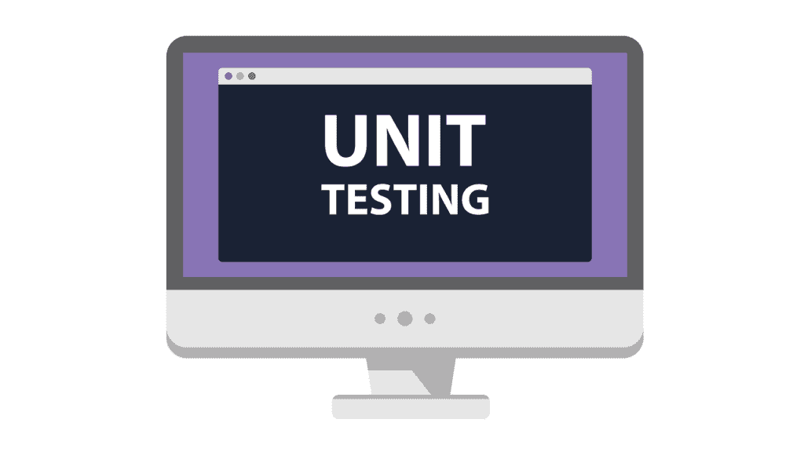

# 什么是 TDD？什么是单元测试？

> 原文：<https://simpleprogrammer.com/tdd-unit-testing/>

我对测试驱动开发和单元测试又爱又恨。

我一直是这些“最佳实践”的热情支持者，但我也对它们的使用持怀疑态度。

软件开发中的一个大问题是当开发人员——或者有时是管理人员——他们本意是好的[应用“最佳实践”,仅仅因为它们是最佳实践](https://simpleprogrammer.com/2010/04/17/when-doing-the-right-thing-is-wrong/)和[不理解他们的原因或实际用途](https://simpleprogrammer.com/2013/02/17/principles-are-timeless-best-practices-are-fads/)。

我记得在一个这样的软件项目中，我被告知我们将要修改的软件有大量的单元测试——大约 3000 个。

通常这是一个好迹象。

这可能意味着该项目的开发人员也实现了其他的最佳实践，并且在代码库中将会有一些类似的结构或者有意义的架构。

听到这个消息我很兴奋，因为这意味着我作为开发团队的导师/教练的工作将会更容易。由于我们已经有了单元测试，我所要做的就是让新团队维护它们，并开始编写他们自己的单元测试。

我打开我的 IDE，将项目加载到其中。

这是一个大项目。

我看到一个标签为“单元测试”的文件夹

太好了。让我们运行它们，看看会发生什么。

只花了几分钟，让我惊讶的是，所有的测试都运行了，一切都是绿色的。他们都通过了。

现在我真的开始怀疑了。**三千个单元测试，都通过了？**

这是怎么回事？

大多数时候，当我第一次被拉到一个开发团队来帮助指导他们时，如果有任何单元测试的话，就会有一堆失败的测试。

我决定随机抽查一个测试。

乍一看，这似乎很合理。

这不是我见过的最好的、最具解释力的测试，但我能看出它在做什么。

但是后来我注意到了一些事情…

没有断言。

实际上没有测试任何东西。

测试有步骤，并且这些步骤正在运行，但是在测试结束时，应该检查一些东西，但是没有检查。

“测试”没有测试任何东西。

我打开了另一个测试。

更糟。

assert 语句在某个时候测试某个东西，被注释掉了。

哇，这是通过测试的好方法；只需注释掉导致它失败的代码。

我检查了一次又一次的测试。

他们都没在测试什么。

三千次测试都毫无价值。

**编写单元测试和[理解单元测试](https://simpleprogrammer.com/2010/10/15/the-purpose-of-unit-testing/)和测试驱动开发有巨大的区别。**

## 什么是单元测试？

单元测试的基本思想是**编写尽可能使用最小“单元”代码的测试。**

单元测试通常是用与应用程序本身的源代码相同的编程语言编写的，并直接使用这些代码。

把单元测试想象成测试其他代码的**代码。**

当我在这里使用“测试”这个词时，我使用得相当宽松，因为**单元测试并不是真正的测试。**他们不测试任何东西。

我的意思是，当你运行一个单元测试时，你通常不会发现一些代码不工作。

当你*编写*一个单元测试的时候，你就会发现那些信息。

是的，代码以后可能会改变，测试可能会失败，所以从这个意义上说，单元测试是一个回归测试。然而，总的来说，单元测试不像常规测试，在常规测试中，你有一些要执行的步骤，你可以看到软件的行为是否正确。

作为一名编写单元测试的开发人员，**当你编写单元测试的时候，你会发现代码是否做了它应该做的事情，因为你将不断地修改代码，直到单元测试通过。**

为什么要编写一个单元测试，而不确保单元测试通过呢？

当你这样想的时候，单元测试更多的是在一个非常低的层次上为特定的代码单元指定绝对的需求。

你可以把单元测试看作一个绝对的规范。

单元测试规定，在这些特定的输入条件下，这是我应该从这个代码单元得到的输出。

真正的单元测试测试尽可能最小的代码内聚单元，在大多数编程语言中——至少是面向对象的语言——它是一个类。

## 什么叫做单元测试？

单元测试经常与集成测试混淆。

一些“单元测试”测试不止一个类或者测试更大的代码单元。

许多开发人员会争辩说这些仍然是单元测试，因为它们是用底层代码编写的白盒测试。

你不应该和这些人争论。

请记住，这些是真正的集成测试，真正的单元测试是测试尽可能孤立的最小代码单元。

另一件经常被称为单元测试的事情是编写没有断言的单元测试。换句话说，单元测试实际上并不测试任何东西。

任何测试，不管是不是单元测试，都应该有某种检查——我们称之为断言——来决定它是通过还是失败。

一个总是通过的测试是没有用的。

总是失败的测试是没有用的。

## 单元测试的价值

为什么我如此坚持单元测试？

把单元测试叫做真正的测试，不孤立地测试最小的单元，有什么危害？

那么如果我的一些测试没有断言呢？他们至少在实践这一准则。

让我试着解释一下。

**[执行单元测试有两个主要的好处，或者说原因](https://simpleprogrammer.com/2010/10/15/the-purpose-of-unit-testing/)。**

第一个是**改进代码的设计。**

还记得我说过单元测试不是真正的测试吗？

当你编写适当的单元测试，强迫自己隔离最小的代码单元时，你会发现代码设计中的问题。

您可能会发现隔离该类而不包括它的依赖项极其困难，这可能会使您意识到您的代码耦合得太紧。

您可能会发现您试图测试的基本功能分散在多个单元中，这可能会让您意识到您的代码不够内聚。

你可能会发现，当你坐下来编写单元测试时，你意识到——相信我，这种情况是会发生的——你不知道代码应该做什么,所以你不能为它编写单元测试。

当然，您可能会在代码实现中发现一个实际的 bug，因为单元测试迫使您考虑一些边缘情况或测试您可能没有考虑到的多个输入。

通过编写单元测试并严格坚持让他们独立测试最小的代码单元，你会发现代码和这些单元的设计存在各种各样的问题。

在软件开发生命周期中，**单元测试更多的是评估活动**而不是测试活动。

单元测试的第二个主要目的是**创建一套自动化的回归测试，它可以作为软件底层行为的规范。**

那是什么意思？

当你换屎的时候，你不会打碎屎。

在这种情况下，单元测试就是测试:回归测试。

但是单元测试的目的不仅仅是构建这些回归测试。

在现实世界中，单元测试很少能捕捉到回归，因为改变你测试的代码单元几乎总是涉及到改变单元测试本身。

作为黑盒测试活动，回归测试在更高的层次上更有效，因为在那个层次上，代码的内部结构可以改变，而外部行为应该保持不变。

单元测试测试内部结构，所以当结构改变时，单元测试不会“失败”它们变得无效，必须被改变、丢弃或重写。

现在你比大多数 10 年软件开发老手更了解单元测试的真正目的。

## 什么是测试驱动开发(TDD)？

还记得我们谈论软件开发方法的那一章吗，瀑布方法通常不实用，因为我们从来没有预先制定完整的规范。

TDD 的思想是，在你写任何代码之前，你写一个测试，作为代码应该做什么的规范。

在软件开发中，这是一个非常强大的概念，但是经常被误用。

TDD 通常意味着使用单元测试来驱动正在编写的产品代码的创建，但是它可以应用于任何级别。

然而，为了本章的目的，我们将坚持最常见的单元测试:应用程序。

TDD 将事情颠倒过来，这样你就可以先写单元测试来测试代码，而不是先写代码，(我们知道事实并非如此)，你可以先写单元测试，然后写足够的代码来通过测试。

这样，单元测试就“驱动”了代码的开发。

这个过程一遍又一遍地重复。

您编写另一个测试来定义代码应该做的更多功能。

您更改代码或添加代码以使测试通过。

最后，[你重构代码](http://amzn.to/2coV0DA)——或者清理它——使它更简洁。

这通常被称为“红色、绿色、重构”，因为首先单元测试失败(红色)，然后编写代码使其通过(绿色)，最后代码被重构。

## TDD 的目的是什么？

就像单元测试本身可能是被误用的最佳实践一样，TDD 也可能是。

很容易将你正在做的事情称为 TDD，甚至跟随实践，却不明白你为什么这样做或它所提供的价值。

**TDD 最大的价值就是测试恰好做出优秀的规格。**

TDD 本质上是编写明确的规范的实践，在编写代码之前可以自动检查这些规范。

为什么测试是如此重要的规格？

因为他们不会说谎。

他们不会告诉你你的代码应该以一种方式工作，然后告诉你在你花了两个星期捣激浪并让一切工作之后，它实际上应该以另一种方式工作，“这都是错的；我根本不是这么说的。”

如果编写得当，测试要么通过，要么失败。

测试明确规定了在特定的环境下应该发生什么。

因此，在这方面，我们可以说 TDD 的目的是确保我们在实现之前完全理解我们正在实现什么，并且我们“做对了”

如果你坐下来做 TDD，却不知道测试应该测试什么，这意味着你需要去问更多的问题。

TDD 的另一个价值是保持代码简洁明了。

代码的维护成本很高。

我经常开玩笑说，最好的程序员是那些编写最少代码的人，甚至[找到了删除代码的方法](http://elegantcode.com/2010/06/06/the-best-code-you-will-ever-write/),因为那个程序员找到了减少错误和降低应用程序维护成本的可靠方法。

通过利用 TDD，您可以绝对确信您不会编写任何不必要的代码，因为您只会编写通过测试的代码。

软件开发中有一个叫做 YAGNI 的原则，否则你就不需要它了。

TDD 预防 YAGNI。

## 典型的 TDD 工作流

从纯学术的角度理解 TDD 可能有点困难，所以让我们探索一下一个示例 TDD 会话可能是什么样子的。

您坐在办公桌前，快速勾画出您认为的某个功能的高级设计，该功能允许用户登录应用程序并在忘记密码时更改密码。

您决定首先通过创建一个类来实现登录功能，该类将处理执行登录过程的所有逻辑。

您打开您最喜欢的编辑器，创建一个名为“空登录不登录用户”的单元测试

您编写单元测试代码，首先创建一个 Login 类的实例(您还没有创建)。

然后，编写一些代码来调用 Login 类上的一个方法，该方法传入一个空的用户名和密码。

最后，您编写一个断言，即 assert，它断言用户确实没有登录。

您试图运行测试，但是它甚至没有编译，因为您没有登录类。

您可以通过创建 Login 类以及该类上的一个用于登录的方法和另一个用于检查用户状态以查看他们是否登录的方法来补救这种情况。

您让这个类和方法中的功能完全为空。

您运行测试，这次它编译了，但是很快就失败了。

现在，您返回并实现足够的功能来通过测试。

在这种情况下，这意味着总是返回用户没有登录。

您再次运行测试，现在它通过了。

进行下一项测试。

这一次，您决定编写一个名为“当用户拥有有效的用户名和密码时，用户已登录”的测试

您编写一个单元测试来创建 Login 类的实例，并尝试使用用户名和密码登录。

在单元测试中，您编写一个断言，即 Login 类应该声明用户已经登录。

您运行这个新的测试，当然它失败了，因为您的登录类总是返回用户没有登录。

您返回到您的登录类并实现一些代码来检查正在登录的用户。

在这种情况下，您必须弄清楚如何保持这个单元测试是隔离的。

目前，最简单的方法是硬编码您在测试中使用的用户名和密码，如果匹配，那么您将返回用户已登录。

你做了那个改变，运行两个测试，它们都通过了。

现在，您查看自己创建的代码，看看是否有方法可以对其进行重构，使其更加简单。

所以你继续，创建更多的测试，写足够的代码让它们通过，然后重构你写的代码，直到你想不出更多的测试用例来实现你想要实现的功能。

## 这些只是基础

所以，你有它。

这些是 TDD 和单元测试的基础— [但它们只是基础](https://simpleprogrammer.com/2011/01/14/back-to-basics-unit-testing-automated-blackbox-testing-and-conclusions/)。

当您真正尝试隔离代码单元时，TDD 会变得更加复杂，因为代码是连接在一起的。

很少有阶级是完全孤立存在的。

[而是它们有依赖关系，那些依赖关系又有依赖关系等等](https://simpleprogrammer.com/2010/12/12/back-to-basics-why-unit-testing-is-hard/)。

为了处理这样的情况，经验丰富的 TDDers 使用了 mocks，它可以通过用预先设置的值模拟依赖项的功能来帮助您隔离各个类。

因为这是 TDD 和单元测试的基本概述，我们不会在这里详细讨论模拟[和其他 TDD 技术](https://simpleprogrammer.com/2011/01/23/back-to-basics-unit-testing-without-mocks/)，但是请注意，我在这一章中介绍的是一个有些简化的视图。

这个想法是给你 TDD 和单元测试背后的基本概念和原则，希望你现在已经有了。

* * *

