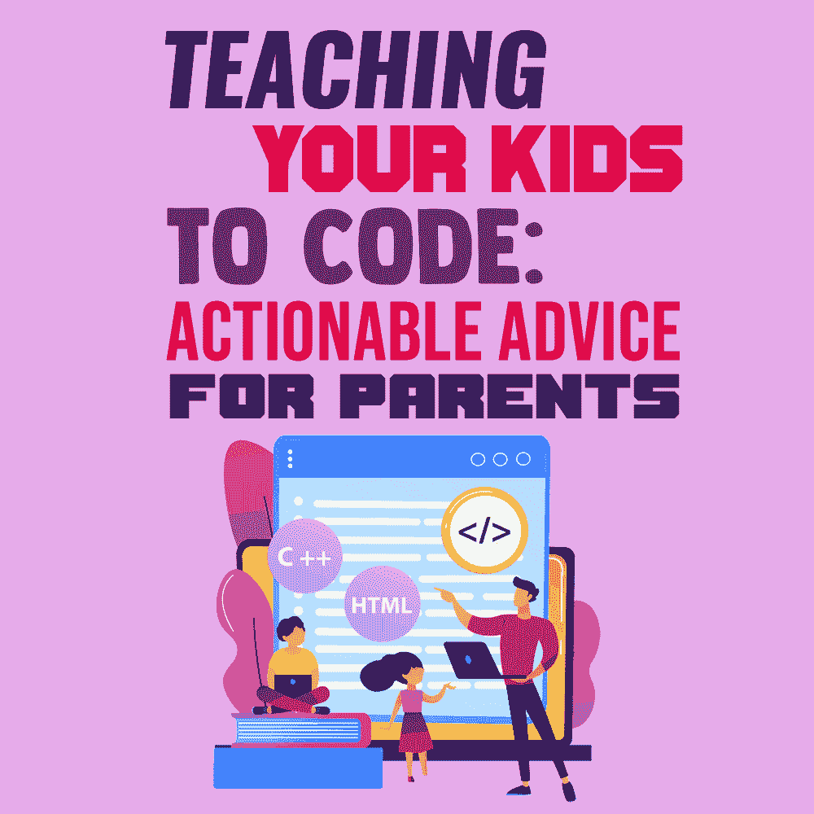
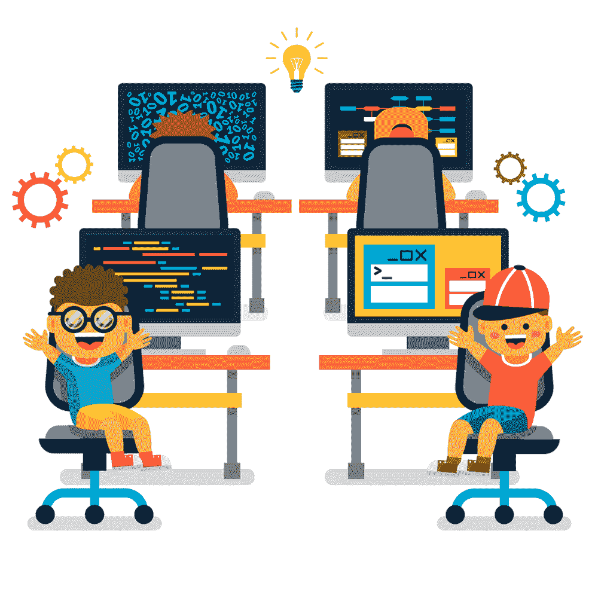
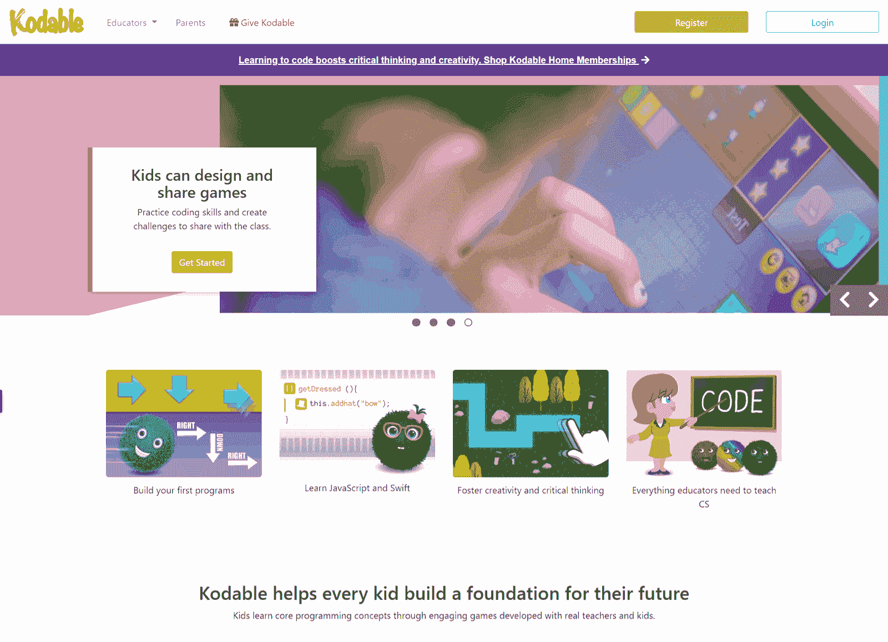
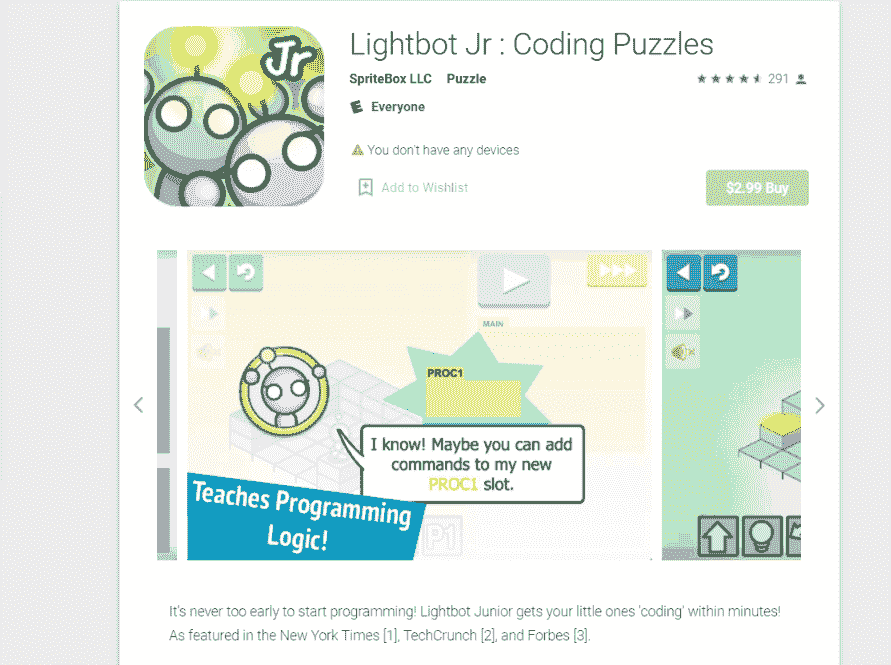
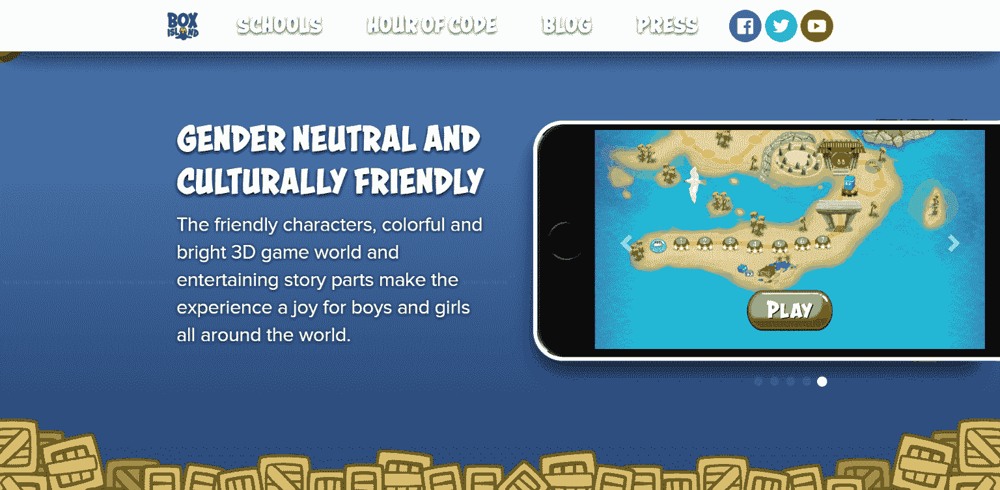
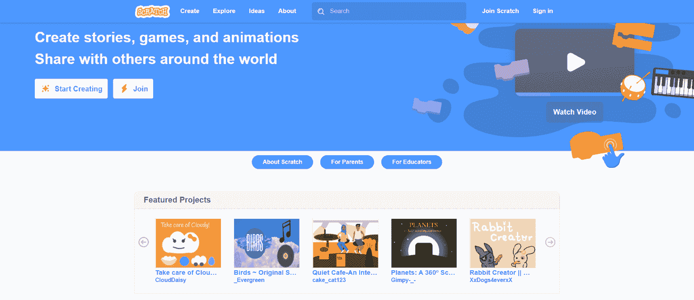
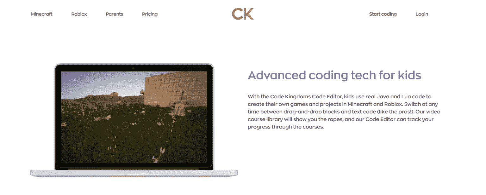
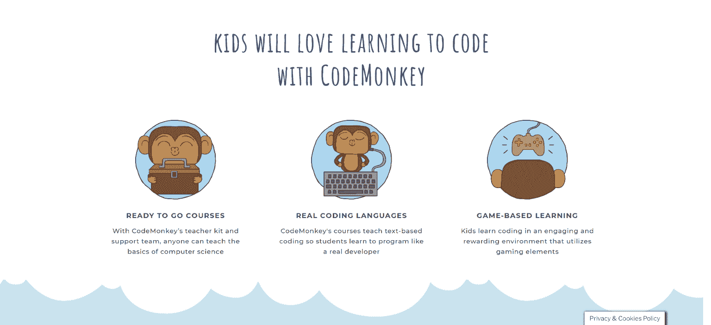

# 教你的孩子编程:给父母的可行建议

> 原文：<https://simpleprogrammer.com/teaching-your-kids-to-code/>

In today’s world, where everything seems to be online, it sometimes gets hard for parents to keep up with the times. This is especially the case if children get too attached to their gadgets, constantly glued to games on their phones or iPads. This is when many parents like you decide that it’s time to shift gears and show their kids what programming is about “behind the scenes,” turning their interests into beneficial skills.

IT 和 web 编程领域是一个很有前途的方向，可以鼓励你的孩子去探索。如果你亲自动手，这个想法会有两倍的吸引力，对吗？当然，孩子们一开始可能不会对编写代码或使用算法感到非常兴奋，但他们可能会发现他们喜欢创建自己的游戏或网站。

此外，教你的孩子如何编码可以帮助他们未来的职业生涯。毕竟，我们今天使用的大多数东西都有代码备份，从你的家庭安全系统到你的自动草坪洒水器。甚至我们的购物习惯也在网上发生转变，越来越多的渐进式网络应用和 Alexa 等助手就在我们的指尖。

在本文中，我将向您介绍关于教孩子编程基础知识您需要知道的一切，并且我将分享提示、工具和常见问题的答案。这样，你可以确保你的孩子学会如何以一种有教育意义的、有用的、最重要的是有趣的方式编码！

## 教孩子编码有什么好处？

随着科技的进步和发展，我们生活的所有领域都在受到影响和改变。由此可见，数字知识是教育将改变世界的一代人的必需品。毕竟，学习编程对孩子非常有益，原因如下:

*   他们可以发展逻辑思维，掌握编码基础，并学习如何正确地组织信息。
*   在网站上工作让孩子对 UX、用户界面和网页设计有了基本的了解，比如颜色安排和对象放置。
*   如果你尽早开始对他们进行信息技术教育，这将有助于他们进入高中和大学，尤其是如果他们决定学习技术学科。
*   最后，IT 知识会让你的孩子在未来选择职业时有更广泛的选择。这最终是一个重大的优势。

好消息是，如果你想教孩子编程，你不一定需要 IT 背景。但是如果你是一名开发人员，这是你的锦囊妙计——你只需要花些时间和你的孩子一起学习编程。

## 如何教孩子编码:从哪里开始

大多数情况下，是家长成为编程培训的发起者。有些父母在孩子 6 岁时就开始了他们的旅程，有些父母在 12 岁或以上就开始了。甚至有人试图让最小的孩子也参与进来，为初学走路的孩子引入编码。

这并不意味着有些起步晚，有些起步太早。这完全取决于父母对这一步的准备。在任何情况下，你都必须有耐心，并且记住，孩子比成人更难吸收这些信息。

此外，有许多资源可供孩子们使用:工具、游戏、教程、学校和计算机编程营。你也可以使用为学龄前儿童和小学生介绍编程而创造的技术，更不用说年龄较大的群体了。

当您开始孩子的编程之旅时，您必须牢记并决定几件事:

*   您孩子的年龄是多少(可能是最需要注意的事情)？
*   你的孩子对什么更感兴趣——他们想制作自己的游戏、网站等吗？？
*   你的目标是什么？你是否考虑让你的孩子以编程为职业，或者你只是想让他们参与进来，鼓励他们获得一些有用的技能？
*   你想让你的孩子参加在线或离线课程，还是在家自学编程？

根据你对这些问题的回答，你可以开始寻找最适合你的解决方案。让我们仔细看看这些问题。

## 我的孩子应该多大开始编程？

什么时候开始教孩子编程可能是最常见的问题。最公平的答案是，不存在被认为是最佳的宇宙年龄。

毫无疑问，**孩子越早开始，他们就有越多的时间[学习各种编程语言](https://www.amazon.com/dp/193435659X/makithecompsi-20)** 并使用不同的工具、平台和技术。这也将极大地推动[开始开发自己的东西](https://simpleprogrammer.com/inspiration-creativity-software-developer)，而不是像消费者一样使用现成的游戏或网站。例如，如果一个孩子非常喜欢电脑游戏，你可以将这种热情转化为一种挑战，让他们自己创造游戏。

大多数孩子擅长使用互联网，从很小的时候就知道如何使用应用程序。他们通常缺乏的是理解这一切是如何运作的好奇心。作为父母，你可以向孩子解释他们可以构建自己的应用程序、网站或游戏，以此来激励他们开始编程——即使他们只有 10 岁。

此时，你可能会想这对你的孩子来说是不是太难了。嗯，编程和编码与逻辑和抽象对象联系在一起。孩子们通常要到八年级才具备这样的技能。此外，如果我们谈论的是严肃的编码，那么扎实的数学知识是必需的。由此，我们可以得出结论，当你的孩子长到 14 或 15 岁时，认真地让他们参与编程是有意义的。

尽管如此，如果没有适当的准备，你的大孩子不能跳到困难的编程和高质量的编码，比如 C++。因此，尽早教孩子编程并尽早开始他们的编码之路是明智的。

因此，你应该明白的是，不同的年龄段有不同的编程语言和解决方案。稍后我们将更详细地讨论这一点。

## 确定孩子对编程的兴趣领域

It is highly important to find an IT niche that your kid will find engaging, not just one that interests you.

如果你强迫你的孩子学习你个人认为值得的东西，但你的孩子不感兴趣，你很可能会走进死胡同。让我们面对现实吧，你最不想做的事情就是强迫你的孩子学习一些东西，不管他多大。眼泪、抱怨和对抗不是我们想要的情绪，对吗？如果你继续努力，很有可能会永远失去他们的编码“风帆”。相信我，不管编码技能在未来对他们有多有用，这都是一个糟糕的实践。

请这样想:如何在不强迫孩子学习代码的情况下，让他们成为一名成功的程序员？可以采取哪些措施让他们对活动感兴趣，并激励他们不要放弃？

幸运的是，IT 领域有很多机会。记住，编程是一门技巧。帮助你的孩子获得所需技能的最好方法是让学习变得有趣和有创造性。如果在这个过程中有些许竞争和成就，那就太好了！孩子们喜欢得到徽章、奖章、奖杯和其他认可的标志。

这就是为什么在你决定一个方向之前，先试着确定你的孩子更倾向于做什么:

*   他们喜欢画画吗？
*   他们喜欢拼图吗？
*   他们喜欢游戏吗？
*   他们对数学和其他科学感兴趣吗？

当你开始为你的孩子寻找完美的学习道路时，把这些“发现”作为旁注。

## 我孩子的编码教育的目标是什么？

在您开始孩子的 IT 之旅之前，强烈建议您明确自己的目标。让您的孩子参与计算机编程的目标是什么？想想你的孩子在掌握编程的这个或那个方面后应该达到什么样的成就。

例如，如果你只是想让他们学习如何在高级水平上使用计算机，那么很可能你不需要他们去钻研像 C++这样的语言。使用像 Scratch 这样的工具学习，对网络如何工作有一个大致的了解，这已经足够让他们在同龄人中脱颖而出了。

如果你的目标是让你的孩子对作为未来职业的编程感兴趣，那么制定一个课程是有意义的。不仅要拿到所需的资料，如果没有时间传授自己的 [IT 知识](https://simpleprogrammer.com/increase-employability-programmer)也要找专门的学校。

## 对我的孩子来说，线下还是线上编程教育更好？

总的来说，对孩子们来说，课堂学习被认为是学习计算机编程的更有效的途径。除了获得新知识，孩子们还可以结交新朋友，与志趣相投的孩子交往。当然，在线教育模式在这个意义上是失败的。

但如果我们谈论的是 21 世纪 20 年代的现实，比如改变教育的柯维德·疫情和其他限制孩子离线学习的情况，那么是的，离线学习比根本不学习要好。

在这种情况下，尤其是如果你决定用书籍、应用程序、游戏和视频教程来教孩子编程，请记住，所有的信息都应该是小部分的。这样，你的孩子会更少分心，一次会收到最大量的集中的、有用的材料。

## 想法、提示和工具

决定了教孩子如何编码的基本框架后，是时候进入有趣的部分了。在这一部分，我将与你分享一些想法、技巧和工具，来帮助你走出第一步。

### 一种有趣的编程方式:为最小的孩子设计的游戏

如果你的孩子很小，编码很可能会有身体上的困难。当你的孩子在学前班时，他们可能不知道如何使用键盘或掌握必要的词汇。这就是为什么建议使用可视化编程语言。

以一种有趣的方式学习编程是一种自然而恰当的方法，可以让您释放孩子的全部潜力。这样，孩子们就可以做他们通常做的事情——玩耍——同时，他们也可以完成任务，解决游戏中提出的复杂问题。

这里有三个游戏可以考虑给还没上学的小孩玩:

*   **[Kodable](https://www.kodable.com)** 是一款 4 到 10 岁的孩子就可以开始玩的游戏。在迷宫格式中创建，孩子们完成任务，从而学习编程的基础。

    

    官方 [kotable](https://www.kodable.com) 网站截图

    T12】
*   **[Lightbot Jr.](https://play.google.com/store/apps/details?id=com.lightbot.lightbotjr&hl=en_US&gl=US)** 专为 4 至 8 岁儿童设计。这个应用程序可以教孩子们编程和编码的难题格式。因此，孩子被要求编写代码来控制机器人的动作，让它跳跃、行走等等。

    

    在 [Google Play](https://play.google.com/store/apps/details?id=com.lightbot.lightbotjr&hl=en_US&gl=US) 上拍摄的截图

    T12】
*   [**盒岛**](https://boxisland.io) 是一款帮助孩子学习编码基础知识的 3D 游戏。以探索或冒险的形式提供，孩子们完成处理算法和序列的任务，并在一个岛上旅行。

    

    官方[盒岛](https://boxisland.io)网站截图

    T12】

### 刮刮乐、《我的世界》和其他适合较大学龄儿童的游戏

你知道有儿童编程语言吗？此外，许多孩子对《我的世界》感兴趣，并按照各种教程学习如何创建新的纹理和项目，并将它们添加到游戏中。

让我们来看一些适合大孩子的游戏来教孩子编程。

*   [**Scratch**](https://scratch.mit.edu) 是一款互动直观的游戏，向 8 岁及以上的儿童教授编程和设计。孩子们学习[如何处理算法](https://www.amazon.com/dp/0262033844/makithecompsi-20)，数据，变量和基本的编码概念。此外，他们可以制作自己的游戏、视频和动画。

    

    T10】官方[划痕](https://scratch.mit.edu)网站截图
*   **[代码王国](https://codekingdoms.com)** 是另一款简洁的游戏，它提供了有趣的方式来吸引和教孩子们用 Java 和 Lua 编写[代码。孩子们将能够在《我的世界》和 Roblox 中创建自己的游戏和项目。该游戏有有趣的任务和机制，可以拥有良好的可视化结果，具有视频课程库，并有在线支持。](https://www.amazon.com/dp/0321356683/makithecompsi-20) [

    T10】官方](https://www.amazon.com/dp/0321356683/makithecompsi-20)[代码王国](https://codekingdoms.com)网站截图
*   **[CodeMonkey](https://www.codemonkey.com)** 是第三款基于游戏的教孩子编码的工具。最棒的是，它教授真正“成熟”的编程语言。孩子们通过执行任务来帮助猴子，此外，游戏还可以让孩子们发挥创造力，发展他们的逻辑、批判性思维和解决问题的技能。

    

    官方 [CodeMonkey](https://www.codemonkey.com) 网站截图

    T12】

### 你应该先教你的孩子哪种编码语言？

关于先教孩子哪种编码语言，有很多观点。同样，最适合孩子的编码程序很大程度上取决于他们的年龄。

也就是说，对于五年级或六年级的学生来说，像 ActionScript 这样的语言被认为是一个好的开始。这种语言相当简单，并提供可见的结果。同年龄组的孩子也可以开始学习 Pascal 课程。

然而，最值得推荐给儿童的严肃编码语言是 Python。它不像 C 语言那样需要过多的代码。

此外，你可以采取另一种方式，用你的计算机为孩子们编码的策略。创造一些他们会喜欢的有趣的东西，比如一个机器人，它会把你孩子每天的课外活动时间表发送给像 Telegram 这样的信使。

## 编码知识意味着更多的机会

教你的孩子计算机编程是一个很好的主意，越早开始越好。有了这样的知识，孩子们将来会有更广泛的职业选择。只要你设法启发你的孩子，并找到适合他们和你的解决方案，不管是游戏还是课程，这条路肯定值得一试！