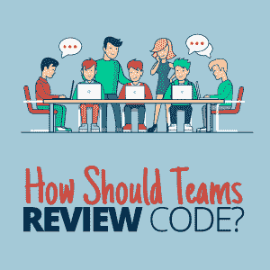

# 团队应该如何评审代码？

> 原文：<https://simpleprogrammer.com/teams-review-code/>

With the invention of source code management applications like Git, writing code is no longer a one-person action. Since code written by one programmer is at one point or another edited by another programmer, code ownership changes very fast.

一个程序员昨天写的代码今天可以被另一个程序员编辑和拥有。因此，在代码被合并之前，由团队审查代码[是很重要的，以确保每个团队成员都了解代码的状态。与此相一致，确保代码质量的最好方法之一是总是审查代码。](https://simpleprogrammer.com/why-code-reviews-make-better-code-teams/)

代码审查是一种既定的软件质量实践，这意味着如果你想继续告诉自己你是一个世界级的开发人员，代码审查必须成为你日常任务的一部分。

一些面试过程现在包括代码审查。这意味着代码评审是一项必须完成的任务，就像其他软件开发任务一样。

看到需要审查的代码并简单地接受它而不仔细检查是很诱人的。这有时是由于当前的工作太多，但是这不应该阻止你腾出时间来审查代码。即使代码审查很无聊，也要确保你首先理解了代码。

下面是一些关于如何更好地进行代码审查的建议。

## 先理解代码

在您证明这段代码是正确的之前，请确保您首先理解了代码以及它应该实现的目标。只有当你理解了代码应该做什么，你才能决定代码是否合适。所以直到你理解了一个代码，继续复习。

如果测试了一个方法或函数，请确保您理解该方法执行的先前操作以及新实现提供的升级。如果一个变量被重命名，要理解为什么。

这些是在您审查代码时必须确认的一些基本事项，没有这些，代码质量会大大降低。一旦代码审查不顺利，你的代码的[质量将开始恶化，你将不得不做额外的工作来让它回到以前的辉煌。](https://simpleprogrammer.com/5-tips-code-quality/)

## 提问

当你不理解某段代码时，问问题。你想看起来聪明，因此，你不想问愚蠢的问题(是的，有些问题真的很愚蠢)，但当你真的不知道什么的时候，你能为你的团队做的最好的事情就是问。

这有助于其他可能认为他们已经理解了代码的团队成员更好地理解它，并帮助那些不理解的人更好地掌握代码。这一点很重要，因为代码中的许多问题都来自于人们不理解其他程序员在试图做什么。理解代码的人越多，就越容易发现和解决问题。

你可能是代码的所有者，但你不需要总是解释你在做什么。在代码评审阶段，其他程序员应该与编写代码的程序员有相同的思维模式，因此，应该提出问题。

最后，对于每一个编写代码的程序员来说，让更多的人理解他们试图实现的目标是更好的，因为作为一名程序员，有时你会忘记你自己编写的代码到底试图实现什么。

## 在合并代码评审之前回答所有问题

Code should never be merged if questions are still pending. Due to the speed of code development and deployment, it is important that we consider not only the present, but also the future in everything that we do.

无论何时任何团队成员提出问题，即使代码已经被合并，也应该提供答案。

在一次代码评审中，当在另一次代码评审中被再次询问时，没有回答的问题有时会回来困扰编写代码的团队或开发人员。所有需要回答的问题都应该在第一次提问的时候就涵盖，这样人们就不会花费精力不止一次地做同样的事情。

有时候，另一个开发人员在开发他们的代码时会遇到一些错误。他们需要一段时间才能弄明白，如果其中一个开发人员回答了代码评审中的一个问题，那么这个时间就可以节省下来。这将为整个团队节省大量时间，而不是花费额外的时间来研究和解决问题。

此外，在开发人员合并他们的代码很长时间后，关于一些功能如何执行的问题会突然出现，如果开发人员花时间回答评审期间提出的问题，这也可以得到解决。现在，开发人员不得不花费额外的时间来记住他们想要达到的目标。

## 添加可视代码输出

有时，一些代码逻辑是如此简单，以至于我们看不到它会失败的任何方式。有了这样的代码，我们只需简单地提出请求，然后上床睡觉。

但有时，将代码的输出添加到我们的代码审查中是很重要的，这样其他团队成员就可以看到。这是因为有时，即使我们测试我们的代码，并不试图模拟同样的情况，当我们再次尝试运行代码时，我们会得到一些别的东西。

为了避免在代码审查上浪费时间，努力总是在代码审查上添加您的代码的结果，以便其他人至少可以确定代码做了它应该做的事情。

有了我们代码的可视化输出，无需花费太多时间理解代码就可以很容易地理解代码评审，因为您所要做的就是反向链接。

从结果出发，跟着代码走。从代码到解决方案是代码评审工作的基本方式，但是当您从解决方案开始时，它可以节省时间。

## 为评审编写最少的代码

作为一个想要提供代码以供审查的开发人员，确保要审查的代码是最少的——人们必须审查的代码越多，容易被忽视的错误就越多。

因此，将一个代码分解成不同的代码评审比简单地将所有代码合并成一个代码评审更好。这有时是困难的，因为你大部分时间都在试图完成代码，而不是考虑谁来审查它，但是在编写代码时考虑代码审查是伟大的开发人员的属性之一。

这意味着你需要记住那些必须审查你的代码的人，以及他们审查你的代码所花费的时间。因此，请确保您创建了易于审查的代码审查。

## 设定代码评审的时间

As the [role of a software developer](https://simpleprogrammer.com/going-from-qa-to-software-developer/) is mainly to write code, it sometimes is difficult to find time to review code, especially code written by another developer.

因此，组织和各种团队安排时间审查代码是很重要的，这样开发人员的注意力就不会分散到手头的任务上。由于大多数开发人员通常在不太忙的时候评审代码，所以代码评审可以安排在大多数开发人员不太忙的时候，这样就可以用最少的努力来完成，但是同时评审代码的人数会使过程更有效率。

让更多的人同时评审代码比简单地让每个人一个接一个地去更有效。

## 创建世界级的代码评审

团队应该如何评审代码的列表永远不会被穷尽，因为每天都有新的平台被创建出来，试图解决一些与代码评审有关的问题。

但是每天尽你所能确保你审查的代码是真正世界级的代码。如果一个组织的代码没有被很好地评审，那么这个组织到底是什么？