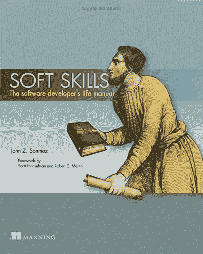
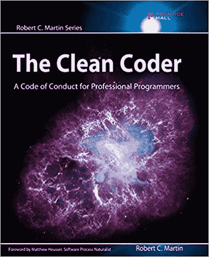
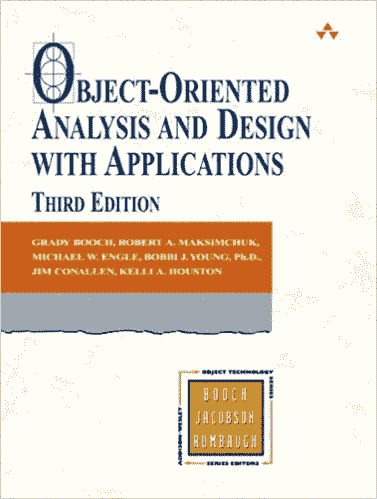
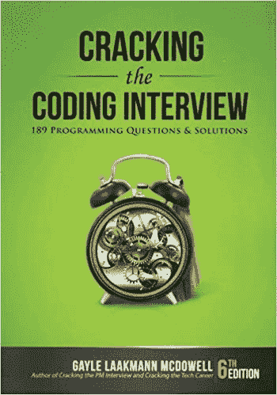

# 作为一名软件开发人员，你需要具备的技术技能

> 原文：<https://simpleprogrammer.com/technical-skills-software-developer/>

在本帖中，我们将讨论成为软件开发人员或软件工程师所需的技术技能。

[*   学什么编程语言](#what-language-to-learn)

T2】

[*   如何构建代码](#how-to-structure-code)

T2】

[*   面向对象的设计](#object-oriented-design)

T2】

[*   算法和数据结构](#algorithms-and-data-structures)

T2】

[*   掌握开发平台](#mastering-a-platform)

T2】

[*   框架或堆栈](#framework-or-stack)

T2】

[*   数据库知识](#database-knowledge)

T2】

[*   源代码控制](#source-control)

T2】

[*   构建和部署](#build-and-deployment)

T2】

[*   测试](#testing)

T2】

[*   排除故障](#debugging)

T2】

[*   方法学](#methodologies)

T2】

[*   感到不知所措](#feeling-overwhelmed)

我非常支持帮助软件开发人员开发除技术技能之外的“软技能”——事实上， **[我写了一本关于它的完整的书，](https://simpleprogrammer.com/softskills)**——但不可否认:**技术技能很重要**。

  

我的意思是，如果你不能真正地写代码和开发软件，你学到的所有软技能都不会对你有太大的好处。也许你会成为一名优秀的经理或教练，但不是一名软件开发人员。

但是如果你正在阅读这本书的这一部分，我假设你有兴趣成为一名软件开发人员——或者一名更好的软件开发人员——那么让我们来谈谈**你将需要了解的技术技能**。

## 支付账单的技能

现在，这是一个容易让许多软件开发新手不知所措的话题，因为这让人感觉有太多的东西需要了解，甚至连 T2 都不知道从哪里开始了解 T3。

我将试着在这里把它分解成最基本和最有益的技术技能，这些技能将在你成为软件开发人员的**追求中给你带来最大的好处**。

这一章并不意味着是一个软件开发人员可能需要的所有技术技能的详尽清单，但是我已经尽力列出了基本的技能，并在这里给你一个概述。

不要害怕。在这本书的“你需要了解的软件开发知识”一节中，**我将用一章来讲述这些技能中的几乎每一个**，并且我们将进行更深入的探讨。

所以，不多说了，这里有一个我认为最重要的技能的简要概述。

## 学什么编程语言

[https://www.youtube.com/embed/4mMUJjLM5y8](https://www.youtube.com/embed/4mMUJjLM5y8)

I think it’s best we start with this one, don’t you?

不懂得编程语言就不能真正成为一名程序员——你知道我的意思吗，Vern？(如果你没有那份推荐信，请参见[欧内斯特·p·沃雷尔](https://en.wikipedia.org/wiki/Ernest_P._Worrell)。享受吧。)

我们将在巧妙命名为“学习什么编程语言”的章节中讨论选择学习哪种编程语言，所以**现在还不要强调这一点**。

不过，我会很快地说，选择学习哪种编程语言并不像你想象的那么重要。

相反，让我们谈谈为什么我建议只从一种编程语言开始，而不是试图学习世界上所有的东西。

许多初学编程的人试图通过同时学习几种编程语言，或者在他们开始第一份软件开发工作之前学习几种语言，以此来规避风险。

虽然我认为你最终应该学习一门以上的编程语言，但我建议不要提前学习，因为这只会导致混乱，而且会分散你在其他需要学习的技能上的精力。

相反，我建议你**深入并专注于学习一门编程语言的来龙去脉**，这样你才能对自己用那种语言编写代码的能力充满信心。

还记得我们说过，在决定你要成为什么样的软件开发人员时，要尽可能具体。

这就是我们的想法。

看看我写的这篇关于 2018 年需要学习的十大编程语言的帖子。如果你想确保学到相关的东西，就选其中一个。

## 如何构建代码

在学习了一门编程语言之后——或者最好是在学习的同时——我坚信你需要知道的下一件事是如何正确地组织你的代码。

我已经给了你一个**极好的资源**来帮助你学习这个极其有价值的技能: [*史蒂文·麦康奈尔*](http://www.amazon.com/exec/obidos/ASIN/0735619670/makithecompsi-20)的代码全集。

我所说的构建代码是什么意思？

我的意思是写**好的、清晰的、可理解的代码，不需要大量的注释，因为代码本身是可交流的**。

许多软件开发人员在他们的整个职业生涯中都没有学习这种技能，这很不幸，因为这是我和许多其他人判断软件开发人员技能和能力的主要方式。

好的代码结构显示了对技术的奉献，而不仅仅是完成工作。

构建你的代码确实是软件开发的艺术部分，但它也很重要，因为你和你的同事必须处理你的代码，他们会花更多的时间维护现有的代码，而不是编写新的代码。

我不打算在本书中深入探讨如何正确构建你的代码，因为——就像我说的——我已经为你提供了一个很好的资源，但是**你应该努力从一开始就学习如何编写好的、干净的代码**,而不是事后学习这个技能。

我几乎可以保证，即使你是一个初学者，如果你能写出好的、干净的、简洁的、易懂的代码来表达结构本身的含义，任何看到你的代码的面试官都会认为你是一个有经验的专业人士。

在某种程度上，你会成为，或者至少正在成为，因为你会把这个职业当成一种职业，而不仅仅是一份工作:一个真正工匠的标志。

如果你想知道更多关于你的代码的有效结构的信息，我推荐这本书:[《干净的编码者》。](http://amzn.to/2yuyFLr)我认为这是每个软件开发人员都应该阅读的旗舰书籍。

  

## 面向对象设计

这一点是有争议的，特别是如果你正在学习一种不是面向对象的编程语言，但是软件开发界有足够多的人从面向对象的角度来考虑，所以你需要确保你理解它。

面向对象的设计是一种设计复杂程序的方法，它将程序分解成单独的类或对象(类的实例)，这些类或对象封装了功能并具有特定的角色和职责。

  

在软件开发中，**我们总是试图管理复杂性**。

从对象的角度思考有助于我们做到这一点，因为它允许我们从一堆相互作用的组件中定义和设计一个复杂的系统，而不是试图将整个复杂性作为一个整体来处理。

今天有大量的函数式编程语言，但是**你会在软件开发中发现的最流行的语言和模式仍然受到面向对象设计和分析的严重影响**。

你应该很好地理解什么是类，继承的不同类型是什么——以及何时使用它们——并且理解像[多态](https://simpleprogrammer.com/2013/01/13/so-you-think-you-can-polymorph/)和封装这样的术语。

## 算法和数据结构

如果你通过传统的学院或大学课程获得计算机科学学位，这将是你将要或将要学习的很大一部分内容。

算法是解决各种计算机科学/编程问题的常用方法。

例如，有几种算法通常用于以编程方式对事物列表进行排序。这些排序算法中的每一种都有一组不同的属性，包括速度、内存大小要求以及它所处理的理想数据类型。

在计算机科学领域有许多这样的算法，**理解如何编写这些算法**的变体来解决你在解决实际编程问题时可能遇到的棘手问题也是很重要的。

通常，擅长算法可以让一个开发人员在一个小时内解决另一个开发人员可能需要几天才能解决的问题。

除非你熟悉并擅长算法，**否则你甚至不会知道已经存在一个优雅的解决方案**。因此，仅仅因为这个原因，我认为这是一项需要掌握的有价值的技能。

**数据结构属于类似的类别**，与算法一起工作。

所有软件开发人员都应该熟悉几种数据结构，包括:

*   数组或向量
*   合框架
*   大量
*   行列
*   树
*   混杂
*   设置

通过很好地掌握数据结构和算法，你可以轻松优雅地解决许多困难的编程问题。

刚开始编程的时候，数据结构和算法真的很差，因为大部分都是自学的。

直到[我开始在一个名为 TopCoder](https://simpleprogrammer.com/2010/04/02/so-you-want-to-become-a-better-programmer-topcoder/) 的网站上竞争，我才意识到它们的真正价值，在这个网站上，了解数据结构和操作数据结构的算法给了你真正的竞争优势。

很快，当我遇到以前不知道如何解决的问题时，这些技能在真实的编程世界中变得非常有用，现在这些问题变得非常容易，也非常有趣。

事实上，**我认为这是软件开发中最有趣的领域之一。解决一个难题，并利用数据结构和算法来开发一个干净、优雅、性能良好的解决方案，真的很有意义。**

最好的资源，至少在我写这篇文章的时候，是迄今为止盖尔·拉克曼·麦克道尔的优秀著作《破解编码采访》[*。*](http://www.amazon.com/exec/obidos/ASIN/0984782850/makithecompsi-20)

  

在这本书里，她讲述了你需要知道的关于算法和数据结构的一切。

学习这些东西是一个挑战，但非常值得。这是能让你远远超越同龄人的技能之一。大多数软件开发人员在这方面的装备差得可怜。

如果你想通过微软或谷歌这样的公司的面试，你肯定需要掌握这些技能。

## 掌握开发平台

您应该对至少一个开发平台以及相关的技术或框架有所了解和掌握。

我说的平台是什么意思？

嗯，**一般是指操作系统(OS)** ，但它也可以应用于其他行为类似于操作系统的抽象。

例如，你可能是专注于 Mac 或 Windows 操作系统的 Mac 开发人员或 Windows 开发人员，但你也可能是专注于特定 web 平台的 web 开发人员。

我不想把这个问题扯进关于平台到底是什么的讨论中——不同的人会有不同的看法——但是为了这个讨论的目的，**我将把平台定义为你开发的特定环境，它有自己的生态系统和特殊性**。

再说一次，这是另一件我认为你选择什么并不重要的事情，重要的是你选择了什么。

公司通常会雇佣开发人员来开发特定的平台或技术。

如果你具备特定平台的专业知识，你会更容易找到一份 iOS 开发人员的工作。

这意味着熟悉平台本身，以及程序员在为该平台开发时通常使用的开发工具、惯用模式和通用框架。

你可能认为编程语言的选择决定了平台，但事实上很少是这样的。

今天考 C#。你可以是一个 C#开发者，为 Windows、Mac、iOS、Android、Linux 甚至嵌入式系统编写代码。

所以不要只挑一种语言；还要选择一个平台。

## 框架或堆栈

除了学习特定的编程语言和平台，我还强烈建议学习一个框架，或者更好的是，一个完整的开发堆栈。

什么是框架？

什么是堆栈？

**框架只是一组库，用于在特定平台或多个平台上开发代码**。这通常会使该平台上的常见编程任务变得更加容易。

回到 C#的例子。大多数 C#开发人员使用。NET 框架来编写 C#应用程序。的。NET Framework 由许多库和类组成，这些库和类允许 C#开发人员在更高的抽象层次上工作，因为他不必在每次想做什么事情时都从头开始。

例如，的一部分。NET Framework 包含操作图像的代码。从头开始编写这段代码会非常困难，所以这个框架对于编写需要以某种方式操作图像的代码的 C#开发人员来说是一个巨大的好处。

堆栈有点不同。堆栈是一组技术，通常包括一个框架，通常一起使用来创建一个完整的应用程序。

例如，有一种常见的堆栈称为均值堆栈。它代表 MongoDB、Express.js、AngularJS 和 Node.js。

MongoDB 是一种数据库技术。

Express.js 是一个用于创建 web 应用程序的 Node.js 框架。

AngularJS 是一个前端 JavaScript 框架，用于为 web 应用程序创建用户界面。

最后，Node.js 是用 JavaScript 开发基于 web 的应用程序的运行时环境。

理解所有这些并不重要——除非你将成为一名优秀的开发人员——但重要的是要理解，如果你了解所有这些技术和框架，你将能够开发一个完整的 web 应用程序。

**堆栈使创建应用程序变得更加容易**因为它们提供了许多开发人员用来开发应用程序的通用范例，所以知识可以很容易地被共享，并且您可以确信一组特定的技术被证明可以协同工作。

学习堆栈是非常有价值的，因为这意味着您拥有开发完整应用程序所需的所有技能。许多拥有使用特定堆栈开发的应用程序的公司会寻找熟悉该堆栈并能立即投入运行的软件开发人员。

## 数据库基础知识

尽管数据库的前景在过去几年中发生了很大的变化，但我并不认为数据库会很快消失，所以我认为您可能应该对它们略知一二，不是吗？

在写这本书的时候，**有两种主要的数据库技术**:关系数据库和文档数据库。

我认为今天的开发人员至少应该熟悉关系数据库，可能还应该对文档数据库有所了解。

在软件开发中，数据库通常用于存储应用程序的数据。

当然，有些团队会有专门的数据库开发人员或数据库管理员(DBA ),但这并不能成为您不了解数据库基本知识的借口。

至少，你应该知道:

*   数据库如何工作
*   如何执行基本查询来获取数据
*   如何插入、更新和删除数据
*   如何将数据集连接在一起

此外，您可能想知道如何使用您选择的平台和/或框架从您的代码中以编程方式**检索和存储数据。**

大多数开发人员都应该能够编写与数据库交互的代码。

## 源代码控制

源代码控制是任何软件开发项目不可或缺的一部分。

过去，在我们使用源代码控制之前，我们会有一个网络共享，上面有一个项目的所有文件，或者我们会来回传递装有不同版本软件的拇指驱动器。

我很惭愧地承认，我不止一次参与了这些恶作剧。

但是，我还年轻。我太傻了。你不必如此。

今天，几乎所有的专业开发人员都应该知道如何使用源代码控制来签入代码，签出代码，并有希望合并来自多个来源的变更。

源代码管理在最基本的层面上允许您保留对软件项目中不同文件所做更改的历史记录。

它还允许多个开发人员同时处理相同的代码，并将这些变更合并在一起。

这里我们就不赘述了，但是**你应该知道如何非常好地使用至少一个源码控制系统**，你应该熟悉大部分基本的源码控制概念。

在当今的软件开发世界中，几乎所有的专业软件开发团队都会使用某种源代码控制。

## 构建和部署

今天，大多数软件开发项目都有某种自动化的构建和部署系统。

有几种不同的软件应用程序可以帮助团队自动化这两项任务，这些任务过去是手动的，对于一些团队来说，现在仍然是。

你会问，什么是构建和部署？

好问题。

嗯，你知道如何编写代码并将其签入源代码控制系统吗？

在您将代码签入之后，用某种方法来确保代码实际工作可能是个好主意。

这就是构建系统的用武之地。

至少，构建系统会编译所有代码，并确保没有编译错误。

一个复杂的构建系统也可能**运行单元测试或用户测试，运行代码质量检查，并提供一些关于代码库当前状态的报告**。

部署系统将负责将代码部署到生产机器或者某种测试环境中。

你不必成为这些技术的绝对专家，但是**至少了解这些系统如何工作的基本知识**以及构建和部署代码的过程是非常重要的。

通常，创建和维护构建和部署系统的实际职责属于一个快速发展的领域，称为 devo PS(developer operations 的缩写)。

但是，这并不意味着你可以不理解这个过程是如何工作的。

## 测试

以前是开发人员不需要太懂测试。

过去，我们会写一堆代码，然后“扔过墙去”交给一群测试人员，他们会发现我们代码中的各种错误，我们会修复这些错误，就这样。

不再

随着如此多的软件项目采用所谓的敏捷过程，(当我们谈到方法时，我们将更多地讨论这一点)，软件开发人员和测试人员不得不更加紧密地合作。

质量真的成为了整个团队的责任——我认为一直都是这样。

也就是说，你需要了解一些关于测试的知识。

你至少应该熟悉一些基本术语，比如:

*   白盒测试
*   黑盒测试
*   单元测试(不是真正的测试)
*   边界条件
*   [测试自动化](https://simpleprogrammer.com/getting-up-to-bat-series/)
*   验收测试

一个好的开发人员——我假设你至少想成为一个好的开发人员——在把代码交给其他人之前测试他们自己的代码。

如果你真的想被认为是专业人士，而不仅仅是一个黑客，这是没有商量余地的。

## 排除故障

啊，许多软件开发新手的梦想在调试器这块石头上粉碎了。

每个人都想写代码，我说的对吗？

但是难道没有人想调试他们的代码吗？听到了吗？

你感觉到我了吗？

真心话时间。

作为一名软件开发人员，你可能要花 90%的时间去弄清楚[为什么你的代码不能工作](https://simpleprogrammer.com/2011/06/17/the-debugger-mindset/) 。

我知道这并不光彩。我知道你整天只想写新代码，但世界并不是那样运转的。

如果你应用测试驱动开发之类的方法，你可能会在调试器上花费更少的时间，但是不管怎样，不管你做什么，不管你如何尝试和绕过它，**你将不得不学习如何调试你的代码**或者其他人的代码。

因此，与其对你知道必须要做的事情采取随意的方法，你应该咬紧牙关，真正学会如何有效地做这件事。

在关于调试的一章中，我会更多地讨论这个问题，但是现在，你要知道，你必须知道如何去做。

## 方法学

被你需要知道的一长串事情吓倒了吗？

如果没有，这里还有一个——但我保证这是最后一个。

虽然一些软件开发团队只是开始写代码，并在完成后把事情做好，但是大多数团队都有某种方法，他们至少假装遵循这些方法。

*(顺便说一句，这里边注:[不要期望任何团队真正遵循他们声称使用的软件开发方法论](https://simpleprogrammer.com/2010/04/07/dont-go-chasing-waterfalls-mini-waterfall-vs-agile/)。我并不想在这里愤世嫉俗或指指点点。我只是一个现实主义者，我碰巧知道有很多人说他们在做像 Scrum 这样的软件开发方法论，只是因为他们有一个每个人每天都站起来的会议。)*

出于这个原因，您至少应该熟悉最常见的软件开发方法背后的一些基本思想，这一点非常重要。

今天，我要说的是**瀑布开发**和**敏捷开发**。

大多数团队会声称他们在做敏捷。敏捷本身是一个相当松散的概念，但是我敢说，如果你想成为一个敏捷团队中的一员，你应该了解一些实践和习惯。

我们将在关于软件开发方法的章节中更深入地讨论这一点。

## 感到不知所措

我知道这是相当多的东西，我几乎没有触及这些主题的表面。

现在你可能会感到有点不知所措，好像你不明白这些技能是什么。

没关系。你还不应该——除非你已经是一名实践软件开发人员，在这种情况下，你真可耻！(开个玩笑。我爱你，但是你真的最好振作起来。)

无论如何，我将在本书的“关于软件开发你需要知道什么”一节中更深入地讨论这些主题

所以，就像他们说的那样冷静。

接下来，我将告诉你如何学习一般的技术技能，所以当你读到这些技术技能的实际章节时，你已经准备好了。

与此同时，你可以查看我的深度指南:[快速学习的 10 个步骤](https://simpleprogrammer.com/store/products/learn-anything-quickly/)

* * *

