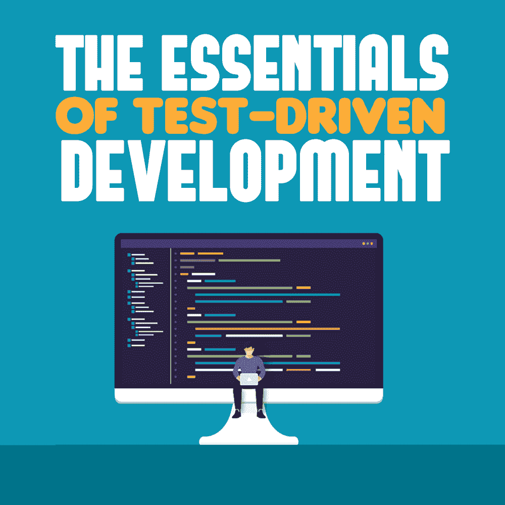

# 测试驱动开发的要点

> 原文：<https://simpleprogrammer.com/test-driven-development/>

If you need software and you need it fast, test-driven development (TDD) may be the solution. With a focus on getting software from the computer to the market quickly, TDD is one of the most effective methods that top [software development](https://clutch.co/developers) and software testing companies are using today.

## 什么是测试驱动开发？

敏捷性和速度是增强测试驱动开发运动的两个概念。但是什么是 TDD，这个过程是如何工作的呢？

测试驱动开发是一个软件开发过程，它关注于在开发人员编写实际代码之前[编写软件测试的测试](https://simpleprogrammer.com/tdd-unit-testing/)。目的是让开发人员专注于代码的目的，并确保其功能性。

## 它是这样工作的:

1.  每个测试驱动的开发周期都是从写一个测试开始的，看看软件是否能工作。该测试基于软件的功能、要求和规范。
2.  接下来，开发人员运行测试以确保它的适当性和有效性。在这个阶段，测试应该会失败，这意味着它可以工作，并且不会显示假阳性结果。
3.  一旦建立了充分的测试，开发人员就可以继续编写代码了。在这个阶段，代码可能不完美，但必须通过测试才能前进。这就是为什么这个测试阶段是至关重要的。
4.  一旦一段代码通过了测试，重构就来了。这是代码清理阶段，在这个阶段，重复的代码被删除，所有的代码元素都被正确命名(对象、类、模块、变量、方法等等)。)，并添加任何所需的新功能。
5.  在这个过程完成后，开发人员可以重新开始这个循环，进行编码改进、添加新特性或修复任何编码错误。

简而言之，测试驱动开发关注于代码是否完成了它应该做的工作。如果有效，进入下一阶段，如果无效，重写。概念就是这么简单。

## TDD 是怎么发明的？

现代 TDD 的原型可以追溯到 20 世纪 60 年代。这项技术的“重新发现”归功于一位名叫肯特·贝克的美国软件工程师。Beck 也是敏捷软件开发的创始人之一，也是敏捷宣言的签署者。

早在 2002 年，Beck 在他的书《测试驱动开发:举例》中向世界介绍了 TDD 的概念。

尽管总体上不是一个新的想法，Beck 声称 TDD 是“干净的工作代码”，专注于模型的简单性和消除传统软件开发方法带来的对代码不工作的恐惧。

## TDD 和传统测试的区别

我们来对比一下。

| **传统测试** | 测试驱动开发 |
| 一种最后测试的方法，其中开发人员创建代码，但将测试留到开发过程结束。 | 一种测试优先的方法，其中开发人员或测试自动化工程师首先创建测试，然后开发人员编码以满足测试的需求。 |
| 关注代码正确性，但可能无法检测出所有的编码缺陷。 | 测试然后重构，直到代码通过测试，继续直到代码满足功能，并减少系统中的错误数量。 |
| 线性过程。
(设计-编码-测试) | 循环过程。
(测试-代码-重构) |

## 测试驱动开发的好处

测试驱动开发的支持者宣传其快速开发代码的速度、灵活性和功能性。但这些并不是唯一的优势。该开发系统还:

*   保持代码简单、有用、切中要点，使所有相关人员的过程更加容易。
*   由于严格的测试，有助于查明 bug 和其他代码缺陷，因此开发人员确切地知道问题发生在哪里。这减少(但不否定)了最终测试时间。
*   允许开发人员看到运行中的代码，采用用户的观点并与最终用户产生共鸣。因此，代码更好地反映了用户的需求。
*   将项目的目标从抽象的想法固化为精确的目的，鼓励开发人员专注于他们真正需要做的事情。

## 测试驱动开发的缺点

However, there are some drawbacks to using a test-driven development approach. Let’s take a look:

*   尽管有人声称 TDD 比传统的编码过程更快，但最初这个过程可能会很慢。但是，随着时间的推移，[生产率显著提高](http://www.ijsce.org/wp-content/uploads/papers/v3i1/A1351033113.pdf)。
*   开发人员可能会过度关注一两个编码问题，而看不到更大的图景。这在试图修复 bug 时尤其重要。
*   开发足够的初始测试存在一些问题，特别是对于创新的软件，因为测试开发人员应该知道他们想要从代码中得到什么。
*   这种方法不允许在最初的设计中有太多的改变，或者如果允许，这增加了 TDD 过程发生的时间。

## 你应该在你的软件开发中使用测试驱动的方法吗？

如同所有的商业决策一样，选择采用测试驱动的开发方法是一个公司特定的决策。如果你正在考虑使用测试驱动的方法，你应该首先确定 TDD 是适合你的业务的。

首先，这将取决于你的团队的需求和经验。由于 TDD 是一种快节奏的敏捷方法，您需要确保他们准备好迎接挑战。或者，你可以求助于[质量保证咨询](https://www.a1qa.com/services/consulting/)来帮助你采用这种方法。

也就是说，测试驱动的开发是一种很好的方式，可以让你的产品尽快从代码行变成市场现成的产品。