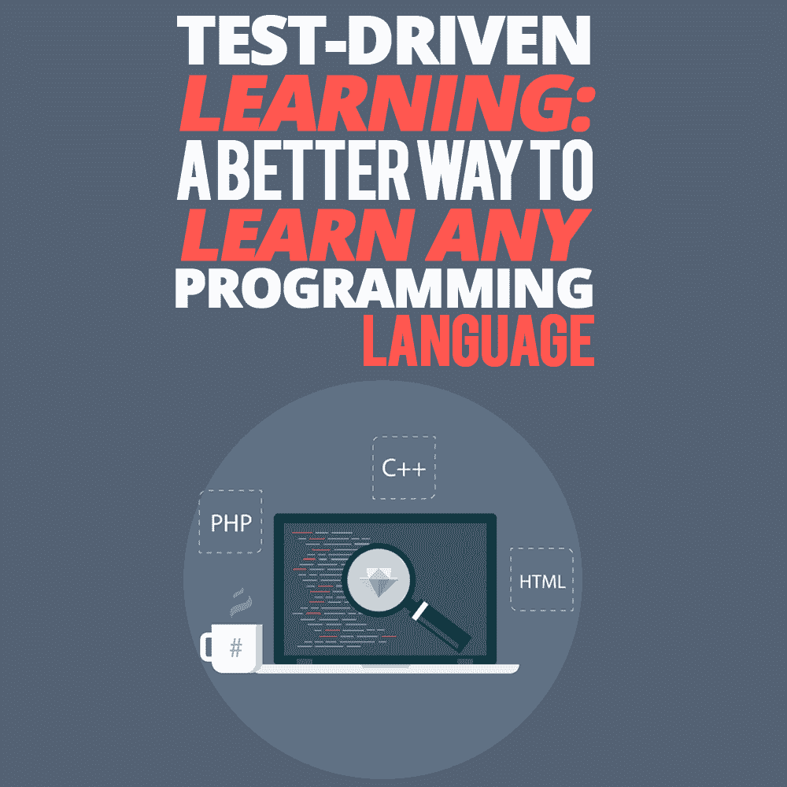

# 测试驱动学习:学习任何编程语言的更好方法

> 原文：<https://simpleprogrammer.com/test-driven-learning/>

Learning from your mistakes isn’t a new concept. Scottish author [Samuel Smiles](https://en.wikipedia.org/wiki/Samuel_Smiles) wrote in 1862 “We learn wisdom from failure much more than from success.”

这种观点最近在软件开发中流行起来，由团队应用 [DevOps](https://en.wikipedia.org/wiki/DevOps) 和[敏捷](https://en.wikipedia.org/wiki/Agile_software_development)方法迭代地产生小的改进。如果一个特性不能像预期的那样工作，它可以被废弃；这是一个被称为“快速失败”的概念

“快速失败，快速学习”是 Jez Humble 的书 *[持续交付的主要前提:通过构建、测试和部署自动化](https://www.amazon.co.uk/Continuous-Delivery-Deployment-Automation-Addison-Wesley/dp/0321601912)的可靠软件发布。*在本书的上下文中，Jez 指的是通过尽可能频繁地发布来构建可靠的生产软件。任何故障都应该很小，影响很小，能够回滚到上一个工作版本，并了解到底哪里出错了。

我们可以将同样的概念应用于学习。尽可能多地失败，尽可能多地从失败中吸取教训。

## 通过实践学习编码

学校教育我们首先学习事实，然后，只有当我们知道自己在做什么时，才能在实践中运用技能。我们去学校、学院或大学，然后带着我们获得的所有知识去工作。

这个想法已经延伸到视频学习网站，如 Pluralsight 或 Udemy，它们很棒，但有点无聊。我在实践中学习得最好，只有当我为一个主题奋斗时，我才会对这个主题的书或视频感兴趣。

在 16 世纪，在学校存在之前，人们通过做来学习。一个孩子会成为一个学徒，从一个大师那里学习，直到他们能够独立完成工作。学徒会反复练习，大部分输出都被扔掉。但是比产出更重要的是他们从错误中学到了什么。当他们成为大师时，他们有多年的错误，他们现在知道如何避免和各种情况下的技术。

我们将使用相同的重复练习技术，通过为不同的问题创建测试并以多种方式解决它们来学习编写新语言。只有当我们不知道如何编写测试或找出解决方案时，我们才需要查看书本或课程材料——先做，边做边学。

### 将测试驱动开发应用到学习中

测试驱动开发(TDD)不是我的想法；它起源于 20 世纪 90 年代一系列叫做[极限编程](https://en.wikipedia.org/wiki/Extreme_programming)的技术，用来帮助开发团队提高软件质量。测试驱动开发的核心思想是:

*   为你**计划**编写的代码创建最小的**失败**测试。
*   运行测试并且**失败。**
*   编写代码，直到测试通过。
*   一点一点地重构代码，并继续运行测试，直到代码可维护和可读。

我们使用 TDD 的主要好处是重构步骤。一旦用定义好的输入和输出创建了测试，解决方案可以有多种形式。当学习理解内置语言特性是如何工作的，以及处理同一解决方案的不同方式是如何导致相同的输出时，这个重构步骤非常有用。另一个好处是动力；看着测试从红色(失败)到绿色(通过)让人上瘾！).这就像一种游戏。

通过 TDD 学习的想法也不是新的。在学习 JavaScript 的时候，我通过 [freeCodeCamp](https://www.freecodecamp.org/) 接触到了这种方法，从第一课开始，你需要通过失败的测试来完成一个级别。我最近也开始学习 Ruby，并通过 [Edgecase Ruby Koans](http://www.rubykoans.com/) 网站被介绍给 Koans。

freeCodeCamp 和 Ruby Koans 背后的想法是提供一长串失败测试的列表供您修复。如果您刚刚开始，这种逐个修复测试的方法是理想的。你不需要自己编写测试，这有时会破坏学习的乐趣。

## 通过测试学习可以加深理解

在我职业生涯的早期，我通过搜索堆栈溢出，查看代码库中已经编写的代码，并随机尝试代码片段来看看它们是否可行。这很有趣，但有一些主要的缺点:我写的一些代码有意想不到的副作用。修复它需要更多的搜索和更多的黑客攻击。我的快捷方式实际上给我带来了更多的工作，每件事都花了更长的时间，让我讨厌看到一个测试人员带着另一个 bug 走向我的办公桌。

遭受损失的不仅仅是我的项目。在申请新工作时，我能够回答我在网上找到的表面问题，但当面试官进一步探索时，我没有足够深入的知识来回答任何进一步的问题。如果我一直在练习考试驱动学习，这些问题本来是可以避免的。

通过测试来学习的主要好处是更深入地理解您正在编写的代码，如何与库函数交互，以及在不同的场景中可以预期什么样的输出。

重构是过程中有趣的、试验性的部分；同样的问题可以用多种不同的方法解决。实验可以让你的大脑思考一个想法，并让你更好地理解这种语言的局限性和酷的特性，以及在哪里使用它们。

我已经练习 TDD 好几年了，但是当我最近需要学习 Ruby 时，我想我应该通过测试来尝试学习。

我的过程是:

*   阅读最基本的概念。
*   为这个概念写一个测试。
*   通过用不同的解决方案多次重构来测试概念的限制。

每种解决方案都有优点和缺点。写下每个解决方案会给你的工具箱增加一个新工具，所以当你遇到需要算法的情况时，你会有一个解决方案的集合，你现在对这些解决方案有了深刻的理解，因为你已经在概念上挣扎过了。

## 在你学会了基础知识之后，通过测试来学习会对你有所帮助

I’ve found that once you have the basics, there are other benefits of learning this way. I am much more likely to use test-driven development when writing production code; if I get in the habit while learning, I just continue on when applying it in practice. I also have a sandbox for working out difficult problems. If I have an issue with some code buried deep in a code base, isolating the problem usually speeds up the diagnosis, and if not, it’s much easier to paste that isolated code into Stack Overflow!

## 通过测试学习 Ruby 和 RSpec

大多数编程语言都有项目列表，通常称为“数组”当我学习一门新语言时，这通常是我开始的地方，因为我很可能会经常使用列表中的项目。我将创建的用于演示测试驱动学习的方法将从一个数组中返回前两项。我将首先创建调用该方法的测试，然后创建满足该测试的方法。在下面的例子中，我将使用 Ruby 和 RSpec。

### 编写第一个测试

让第一次测试变得非常简单；你从这个简短的测试中学到了很多，所以没有必要把事情复杂化。

如果您想尝试这种方法，您需要安装:

*   https://rspec.info/
*   鲁比:[https://www.ruby-lang.org/en/](https://www.ruby-lang.org/en/)

这些原则可以应用于任何有测试框架的技术，所以不需要编码。

如果一切顺利，你应该已经取得了你的第一次失败！

> 加载时发生错误**。/spec/examples/array.rb.
> 失败/错误:**要求**' examples/shorten _ array . Rb '
> 
> load Error:
> 无法加载此类文件—examples/shorten _ array . Rb
> *#。/spec/examples/array.rb:1:在` require'*
> *#中。/spec/examples/array.rb:1:在`< top(必需)> '*
> 中未找到示例。
> 
> 在** 0.00025 秒内完成**(加载文件用了 0.14376 秒)
> 0 个示例，0 个失败，1 个错误发生在示例之外**

我们还没有编写满足测试的方法，所以这里的失败是意料之中的，并向我们证明我们已经正确地建立了测试框架。这里的失败是过程的一个重要部分；当你将来编码时，你会看到同样的错误出现，如果你记得你是如何修复它的，这将加速你的开发。

通过编写这个测试，我们还了解到:

*   如何引用不同文件中的方法。
*   如何调用一个方法？
*   如何写断言(expect …)。
*   如何创建数组？

所有这些都来自于编写测试！

### 试验合格

编写你能想到的最简单的代码来满足测试。这就是培训材料派上用场的地方，或者更好的是，使用语言 API。Ruby 的 API 文档很容易阅读，但是一开始可能有点吓人。

这应该会导致通过:

> 。
> 
> 在 0.00448 秒内完成**(文件加载耗时 0.11038 秒)
> 1 例，0 次失败**

The passed test lets us know that we satisfied the requirements set out in the test. Inthe process we learned:

*   如何定义一个模块？
*   如何在那个模块上定义一个方法。
*   如何将参数传递给方法。
*   如何通过索引引用数组中的值？
*   如何从方法返回值？

## 尝试测试驱动学习

这种学习方式很有趣！我喜欢编码，如果我能在学习的时候编码，那会让我更开心。

通过测试学习包括许多失败。失败对学习来说很重要，你可能无法通过阅读一本书或单独参加一门课程来获得这种体验。失败并从中吸取教训要比重要的时候失败好得多。

测试驱动学习是一个很好的方式来更深入地理解你正在学习的语言。你会学习，因为你需要通过下一个测试，而不是学习干巴巴的事实，并试图在需要时应用它们。

这种方法可能不适合所有人，但不妨一试。不管你喜不喜欢，你都有可能学到新的东西。