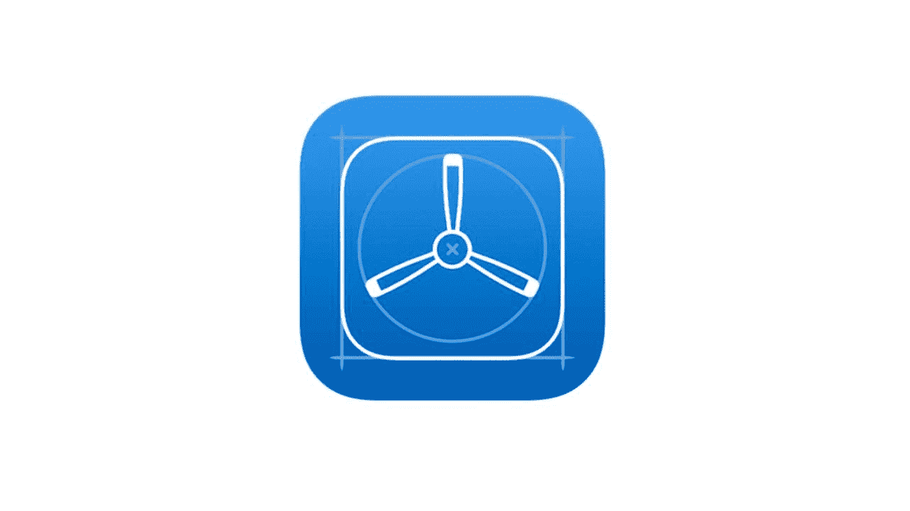

# 使用 TestFlight 测试您的应用

> 原文：<https://simpleprogrammer.com/testing-app-testflight/>

您可以在项目的不同阶段添加许多类型的测试。您的最后一道防线是在项目的最后阶段进行测试——在这一阶段，您可以发现那些最后一刻的缺陷，这些缺陷可能会损害您的产品的使用，损害其对用户的价值，并玷污您的公司作为高质量产品制造商的声誉。

在这些最后阶段，有各种工具可以帮助您。测试 iOS 应用最知名的工具之一是 [TestFlight](https://developer.apple.com/testflight/) 。

如果你从未使用过 TestFlight，这篇文章将介绍这个工具，并描述你如何在你的项目中最好地使用它，以确保很少或没有缺陷影响你的最终产品。

## 什么是试飞？

TestFlight 是一个在线工具，允许你“无线”安装和测试手机应用程序从历史上看，应用程序开发人员在实际设备上测试他们的项目，这些设备必须使用电线连接到开发机器才能获得新版本。无线允许开发人员将他们的最新构建分发给测试人员，而不需要物理连接到电话。因此，新的构建可以有效地发送给世界上任何地方的测试人员。

## 谁应该使用它？

TestFlight 非常适合没有大型内部测试团队的小型企业。由于它是免费的，它允许更多的企业而不仅仅是创收公司使用它。

但是对于拥有远程测试人员的企业公司来说，这也是一件好事。对多达 10，000 名外部用户的访问和轻松分发以及获得他们反馈的能力对各种规模的公司都非常有用。

## TestFlight 是什么时候发布的？

2010 年 12 月 23 日，TestFlight 由本杰明·萨特菲尔德(Benjamin Satterfield)和特里斯坦·科斯明卡(Trystan Kosmynka)创立。在最初发布的时候，TestFlight 是一个单一的平台，旨在测试 Android 和 iOS 设备的移动应用程序。

2012 年，TestFlight 被 [Burstly](https://www.crunchbase.com/organization/burstly) 收购，该公司从风险投资公司筹集了大量资金，以开发进一步的功能并推出 TestFlight Live(一种现已停止使用的服务，为用户提供实时分析和参与度指标)。

2014 年 2 月，[苹果突发收购](https://techcrunch.com/2014/02/21/rumor-testflight-owner-burstly-is-being-acquired-by-apple/)。到那年 3 月，他们终止了对 Android 设备的支持。

## 自从被收购后，TestFlight 发生了怎样的变化？

今天，TestFlight 是你用来测试你的 iOS 应用程序的众多选项之一。虽然有替代系统，但其中一些仍然利用 TestFlight 来做他们的应用程序构建分发，特别是因为外部测试人员的限制增加到了 10，000 个用户。有了这样的用户数量，你一定会收到足够的反馈，并进行足够的测试，以确保你的应用程序达到高质量的水平。

目前，你只能将 TestFlight 用于为苹果设备开发的应用程序，因为它只对 iOS 开发者计划的开发者开放。

一旦注册了这项服务，你就可以将你的应用分发给内部或外部的测试人员，他们可以为你提供关于应用的反馈。除了这项服务，TestFlight 软件开发工具包还允许开发人员从测试人员那里接收远程日志和[崩溃报告。](http://www.amazon.com/exec/obidos/ASIN/1491912510/makithecompsi-20)当用户遇到问题时，能够从他们那里收集数据是非常宝贵的，因为有些缺陷很难重现。这些崩溃报告中的数据可以为您提供信息，帮助您跟踪问题并在问题影响到其他人之前解决它。

## 你应该在哪个阶段使用试飞？

尽管 TestFlight 在开发的早期阶段对测试您的初始构建非常有用，但是您需要上传一个发布构建来使用 TestFlight。使用发布版本来执行初始测试并不常见，因为它们包含较少的调试信息。如果发生崩溃，您将没有足够的详细信息来逐句通过代码，找出发生了什么，并尝试修复它。

当开发人员认为主要的 bug 已经被捕获，并且可以作为测试候选版本时，就创建了发布版本。这是将提供给客户的最终版本的近似表示。通常，构建是稳定的，很少甚至没有崩溃。在这个阶段遇到的任何问题通常只需要很小的调整，所以发布版本更适合 beta 候选版本。

你也可以在发布后使用 TestFlight 来获得关于你的应用性能和用户反馈的实时信息。一旦应用上线，获得评分和评论是一项挑战，因此给用户一种轻松提交反馈的方式可能有助于解决这个问题。

## 试飞的好处和坏处是什么？

虽然产品发展背后的历史让你对它的特性有所了解，但是有很多原因可以解释你为什么会选择 TestFlight 作为你的测试阶段。

### 利益

**用户范围广**

能够将您的应用以无线方式分发给多达 10，000 名外部用户，让您有机会从大量用户那里获得对您应用的反馈，这是您以前无法接触到的。

在游戏公司中，拥有一个最大数量的测试组是最常见的，因为他们让潜在用户提前注册，以测试游戏迭代的最新版本。

对于正常的 app 来说，这个测试人员数量是非常大的。我通常期望最多有几百个测试者。因为记住，你的测试人员越多，你需要分析的测试结果就越多，你需要检查的反馈也就越多。

不管 TestFlight 提供的最大限制是多少，保持测试人员的数量是明智的。

**同时测试多个应用**

内部或外部用户可以同时测试多达 100 个应用。您还可以同时上传不同的 iOS 应用程序版本，包括 watchOS 应用程序、tvOS 应用程序和 iMessage 应用程序。

**内部用户**

在 iTunes Connect 中，分配到您团队的多达 25 名成员也可以在多达 30 台设备上测试您的应用程序。

不像外部测试人员只能访问他们被分配的链接指向的构建，内部测试人员可以访问你的应用程序的所有构建。如果你的应用程序有多个版本——例如，免费和付费版本——测试人员可以访问这些不同版本的每个版本，这样你就可以让一个人测试多个应用程序。

**快速配送**

该工具允许您立即通过无线方式将您的应用程序快速分发给一组特定的测试人员。你可以选择构建不同的版本，用你的测试人员对你的应用进行 A/B 测试。能够一次将一个特定的构建发送给许多用户将帮助您更快地获得更多的结果。

**容易接近**

TestFlight 集成在 Apple Developer Dashboard 中，您需要使用它来在 App Store 中分发您的应用程序。你只需要切换标签来获得访问权；不需要单独登录。

### 缺点

**仅 iOS**

如果你正在开发一个跨平台的工具，这将允许你只在你的 iOS 版本上测试和接收反馈。如果你想测试 Android 版本，你必须做额外的工作。

**需要通过试飞进行额外审查**

使用 TestFlight 的应用程序将需要测试版应用程序审查，并且在测试开始之前必须符合完整的[应用程序商店审查指南](https://developer.apple.com/app-store/review/guidelines/)。

这是因为你的应用程序实际上是面向特定的公众群体的，所以苹果团队希望确保发布的版本与 App Store 中的当前版本具有相同的质量。

就像正常的应用程序提交流程一样，如果你的应用程序在版本之间有重大变化，你需要重新提交它进行审查。这将在你的应用程序发布前的最后阶段增加额外的时间。

在你完成测试后，你需要[提交你的应用程序，通过通常的 iTunes Connect 屏幕](https://simpleprogrammer.com/2017/06/09/app-store-style-part-1/)进行审查。

【beta 测试的有限时间

在向测试人员发出邀请后的 90 天内，可以从 TestFlight 访问提交的构建。这款应用将在这 90 天后停止编写，所以你必须要么更新你的测试版提交，要么在这 90 天内完成所有测试。这个限制不会影响您的内部测试人员，只会影响项目外部的测试人员。

**限于特定版本**

只有使用正确的预配概要文件和分发证书签名的[发布版本才被允许上传进行 beta 审查。因此，构建需要适当地签名，以便它被构建和接受。](https://simpleprogrammer.com/2017/08/09/releasing-apps-style-part-3/)

**仅适用于运行 iOS 8 及以上版本的设备**

每年都会发布新的 iOS 版本，但不是每个人都升级，也不是每个人都能升级，因为苹果选择在大约三年内放弃对“旧”版本 iOS 硬件的支持。这确实稍微限制了你的受众，因为你不知道他们在使用什么设备，也不知道他们的设备是否支持 iOS 8。

**没有用于[持续集成/持续部署](https://simpleprogrammer.com/2017/10/09/ci-cd-appreneur/)的应用编程接口**

Unless you're using tools like Fastlane, the upload process into iTunes Connect has to be carried out manually. So this will slightly slow your progress during testing.Perhaps Apple will create an auto-upload feature within future versions of Xcode but for now, you'll either have you learn to use another tool or spend the time doing this manually.

## 试飞适合你吗？

测试你的应用是开发过程中的基本步骤。没有测试，你就盲目地将你的创作抛到了九霄云外，甚至不能保证它能为你的潜在客户工作。TestFlight 是一个强大的 iOS 测试工具，它将帮助你有效地管理你的 beta 测试阶段，并将其提供给潜在的成千上万的用户。

我完全能够理解将你的想法发展成有形的东西的兴奋，但你必须记住，我们的目标是创建一个伟大的应用程序，而不是简单地将任何与你的想法相似的东西分发到应用程序商店。

为了做好这一点，您需要记住将全面的测试(即使您是一个团队)集成到您的开发中对于构建健壮的产品和成功的项目是必不可少的。在你的产品向所有人开放之前，通过测试飞行从测试人员那里获得反馈可以揭示一些关键的见解。

这项测试可能会改变一些大的功能，并可能让你的应用程序变得与众不同。因此，虽然使用 TestFlight 有几个缺点，但我认为它的好处最终会超过坏处，因此值得考虑将 TestFlight 作为测试你下一个应用程序的资源。

*免责声明:本文中表达的所有观点和意见均为作者基于个人经验的观点和意见，并未得到文中提及的公司或产品的认可、赞助或其他补偿。*