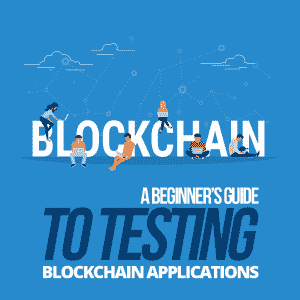

# 测试区块链应用的初学者指南

> 原文:[https://simple programmer . com/testing-区块链-应用/](https://simpleprogrammer.com/testing-blockchain-applications/)

During the last few months of 2017, bitcoin and other cryptocurrencies were being talked about by some media sources on a daily basis. These currencies, which had been around for years, were suddenly experiencing major growth. For example, the price of [bitcoin has grown from just under $750 in January 2017 to $5,856.10](https://www.cnbc.com/2017/10/13/these-charts-show-how-quickly-bitcoin-is-growing.html) in mid-October 2017.

这种巨大的增长使它成为一个主要的话题。因此，随着这些新货币越来越多地进入公共领域，加密货币背后的技术也开始受到关注。这项技术就是区块链。

区块链应用正在被世界上一些最大的行业采用，区块链编码作为一种职业越来越受欢迎。由于区块链应用程序的性质，它进一步证明了测试和测试人员的重要性，并且该领域在未来将会受到更高的重视和追捧。因此，作为测试人员，想知道这项新技术将如何影响您的日常工作、新机会和当前的技能组合是正确的。

你需要学习什么新工具来测试区块链应用程序，需要什么技能来测试它们？

在这里，我将概述什么是区块链技术，以及我们作为测试人员如何为测试区块链应用程序做准备。

## 什么是区块链？

区块链是一种同时存在于多个位置的数据结构。您只能添加到区块链。不允许删除或更新。区块链中保存的数据是分散的，这意味着网络中的每台机器上都有一份现有区块链的副本。

对区块链的添加可以在该网络中的每台计算机上看到，并且交易被加密地链接到先前的交易。因此，进行欺诈交易是非常困难的。为了做到这一点，有些人必须重写他们的历史到时间的开始，这是极其耗费资源的。

为了更新区块链中的每台机器，这些机器必须同步以具有共同的历史。尽管由于这种同步操作，所有机器最终将具有相同的数据，但是只有最近的事务被更频繁地同步。

对于要添加的新交易，决定取决于区块链中的大多数参与者。交易的身份验证通过后，新数据块将被添加到区块链中。

## 它是用来做什么的？

目前，由于其高度安全的结构，区块链主要被金融和汽车行业使用。正如我前面提到的，它也是支撑比特币和以太坊等加密货币的技术。

并非所有的区块链技术都是开源的。可以有像银行系统中使用的私人区块链。

## 

在基于区块链构建的应用上，可以进行哪些类型的测试和技术？

在开发软件项目的不同阶段，可以执行许多不同类型的测试。下面是一些类型的测试，可以用来确保区块链应用程序的高水平的测试覆盖率和质量。

### 单元测试

单元测试帮助开发人员确保他们的代码在最低级别和最小部分的功能上正确执行。这应该始终是第一道防线，以确保应用程序在开发早期就捕捉到大多数错误。

### 集成测试

集成测试帮助开发人员和测试工程师确保他们的代码在不同组件之间的通信，并且可能在像数据库这样的内部和外部系统之间。

### 用户界面

[用户界面(UI)测试](https://simpleprogrammer.com/automated-ui-testing-framework-a-real-example/)从最终用户的角度揭示应用程序是如何工作的。重要的是要确保你进行用户界面测试，以确保他们的体验是积极的，或者当应用程序表现不佳时，他们至少能从应用程序得到正确的反馈。

### 应用程序界面

应用程序编程接口(API)测试让您确信您已经验证了您的应用程序从外部 API 接收的响应，并确保您的 API 请求的格式是正确的，并且得到了正确的处理。

对于区块链应用程序，还有一种类似于 API 的技术，允许您对 API 采用相同的测试实践。这些被称为智能合约。

## 什么是智能合约？

智能合约是区块链中验证技术的重要组成部分。智能合约是一组"[可编程结构形式的规则，能够在满足预定义条件时自动执行自身](https://www.google.co.uk/amp/s/www.capgemini.com/2017/01/testing-of-smart-contracts-in-the-blockchain-world/amp/)。例如，一个前提条件可以是，试图附加到特定分类帐的事务将经历额外的验证，或者经历一组更健壮的不同验证。

虽然智能合约非常类似于 API，它具有公共函数，可以被在区块链网络上注册的任何人调用，但是它不能调用外部 web APIs。

那么，为什么我认为在测试区块链应用程序而不是其他类型的系统时，测试人员极其重要呢？原因很简单，一旦合同部署到区块链，就不能更改。所以你必须非常有信心，所进行的测试是高质量的，并且应该涵盖的所有内容都已经涵盖了。

如果在生产中发现缺陷，那么必须创建和部署新版本的契约。现有联系人的新版本不能简单地将现有数据调入；您必须用新合同手动初始化以前的数据。

更新合同和回滚更新也不是可行的选择；这增加了开发的复杂性，并且意味着在应用程序进入生产环境之前，在应用程序上实现和运行单元和集成测试的重要性可以为您节省大量的时间和金钱来纠正缺陷。

## 区块链应用需要测试人员具备哪些技能？

尽管区块链应用程序在软件开发中相对较新，但我不认为测试人员需要采用新的技能来测试这种类型的技术。

Some of the skills I’ve highlighted below are natural skills of good testers or simply skills that you learn early on in your testing career, which grows with your experience in the field.

### 批判性思维

批判性地分析、思考和解决问题的能力对于测试人员来说是一项永恒的技能，在测试区块链应用程序时会更加受欢迎。

测试人员思考的问题有:如果 x，y，z 没有完成，事务还会执行吗？如果网络中有大量事务等待确认，会发生什么？在这些情况下，给用户什么样的反馈？这应该是给用户的反馈吗？或者这种反馈是否暴露了任何安全风险？

如果开始一个新项目，另一件要考虑的事情是质疑区块链是否是最适合你的技术。它是新的闪亮玩具，所以每个人都想采用它，但它可能不适合你想要实现的目标。

需要记住的是合规性问题；例如，您不应该存储健康或犯罪记录，因为不允许删除。所以，当未成年人的犯罪记录可以被清除时，你将无法用这项技术做到这一点。

### 测试设计技术

在 [ISTQB-BCS 基础软件测试](http://amzn.to/2FpcGuK)课程中，将向您介绍测试设计技术。了解测试设计技术的基础，比如边界值分析和等价划分，将确保您不断地思考和检查应用程序的输入和输出。

要考虑的事情可能是:当您输入的值在可接受值的边界内、边界上和边界外时，应用程序将如何操作？交易会完成吗？如果不是，将返回什么类型的错误？对于返回的类型，此错误代码是否正确？它应该返回任何东西吗？

### 自动化

[强大的自动化技能](https://simpleprogrammer.com/manual-testing-to-test-automation/)在所有语言中，无论是对低级单元、中级集成，还是 API 或高级 UI 测试，都是可以转移到测试区块链应用的好技能。需要有自动化测试的坚实基础，以确保在开发的早期发现大多数问题。

### 手动 UI 测试

如果自动化测试有了坚实的基础，测试人员就可以专注于异常问题，这些异常问题可以通过手动执行的探索性测试更容易地发现。

能够独立工作，调查应用程序的不同领域，试图找到薄弱的领域，并能够成功地重现这些总是伟大的测试人员需要的技能。尽管全世界都在期待自动化来执行大量重复而艰巨的任务，但是[手动测试技能](https://m.youtube.com/watch?v=7VFShEGkNzk)仍然需要磨练和提高。

### 快速学习新工具

随着新技术的出现，测试该技术的工具列表也将增长。你需要学会如何快速使用这些新工具，并判断哪一个最适合你要完成的任务。

## 面向未来的自己，为区块链做准备

希望到现在为止，你已经对区块链技术有了更好的理解，不再认为它像你最初想的那样可怕。

我确信如果你是一名测试人员，你已经具备了我上面概述的技能的基础。我的建议是，深入你感兴趣的领域，尽可能在你最薄弱的领域进行改进，这样你就有最好的机会在测试区块链应用程序时提高自己的技能。