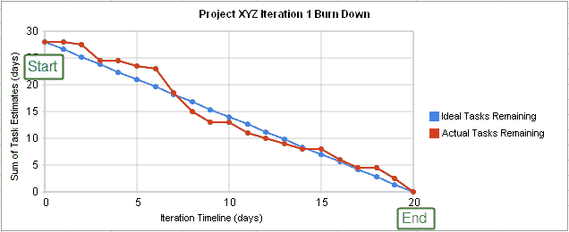
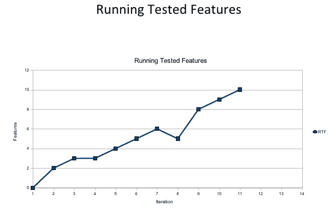
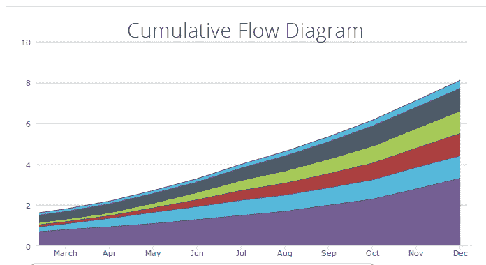
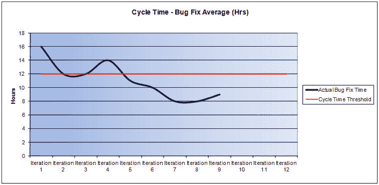
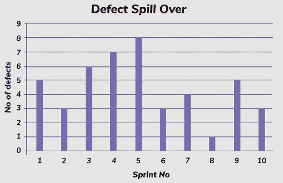
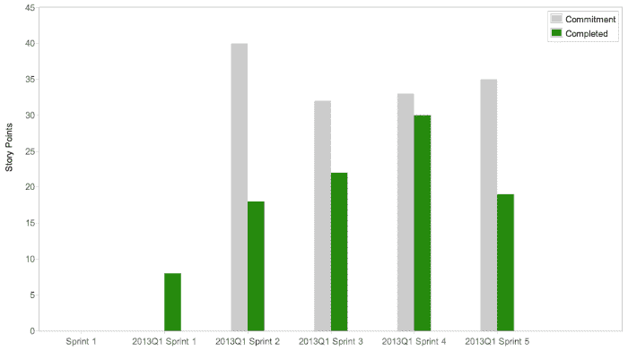

# 如何在敏捷环境中使用测试指标

> 原文:[https://simple programmer . com/testing-metrics-agile-environment/](https://simpleprogrammer.com/testing-metrics-agile-environment/)

敏捷项目管理方法背后的思想是鼓励集成团队之间的协作、透明和对反馈的响应。敏捷软件开发意味着经常使用敏捷宣言中概述的一套原则来开发高质量的工作软件。

敏捷方法强调快节奏的软件开发，这意味着软件测试也必须快速执行，同时保持足够彻底以确保高质量。

对于[敏捷团队](http://www.amazon.com/exec/obidos/ASIN/0321534468/makithecompsi-20)来说，找到一种方法来评估和改进他们的测试工作是至关重要的。测试度量对于提供敏捷团队中任何软件测试工作的有效性的基本度量是有用的。

这篇文章通过将敏捷开发中的测试与旧的软件开发瀑布框架中的传统测试进行比较，概括了敏捷开发中的测试到底是什么。您还将了解敏捷测试计划，并了解一些有用的敏捷测试指标。

我们关注与敏捷团队测试相关的六个关键指标。请参见 SeaLights 的[敏捷测试指标学习部分](https://www.sealights.io/test-metrics/agile-testing-metrics/)以获得更广泛的推荐指标列表。

读完这篇文章后，您将更好地理解如何度量您的软件开发团队的测试工作，并对它们进行改进，从而导致更高质量的软件和更高效的开发。换句话说，您将更好地实现敏捷开发的目标。

## 什么是敏捷测试和敏捷测试计划？

在敏捷框架流行之前， [QA 是由独立测试团队执行的独立活动](https://dzone.com/articles/waterfall-vs-agile-qa-management)。今天，敏捷测试意味着在敏捷开发团队中测试软件的缺陷。

使用敏捷测试，开发人员在工作时参与改进测试本身，并且在自动化和快速反馈的帮助下，敏捷团队可以交付更高质量的软件，并更快地交付给生产。

测试计划是正式概述软件测试范围和活动的重要文档。敏捷测试计划不同于旧的瀑布方法中使用的传统测试计划。

[瀑布](https://simpleprogrammer.com/2010/04/21/presentation-on-waterfall-vs-agile/)是一种非迭代的、顺序的软件开发方法，其中开发被分成预定义的阶段。瀑布中的测试计划是静态的，因为详细的需求是在软件设计阶段之前定义的。这样的计划在项目的生命周期中不需要太多的修改。

与瀑布方法相比，敏捷方法需要一个动态的测试计划，该计划能够适应不断变化的需求。测试策略是至关重要的，因为它帮助团队:

*   理解在 sprint 的哪个点上他们需要测试特性；
*   主动创建测试数据，以测试仍在开发中的组件之间的依赖关系；和
*   知道谁负责单元测试，何时开始自动化测试，以及使用哪些工具进行测试。

因此，动态测试计划可以通过确保软件测试的充分准备和由于测试策略和过程的透明性而提高的效率来提高敏捷团队的生产力。这种类型的测试计划帮助敏捷团队提前计划，同时允许团队适应不断变化的需求。

## 敏捷测试指标

在创建测试计划并开始软件测试之后，通过查看相关度量形式的数据来评估软件测试的有效性是很重要的。下面的度量是可以帮助敏捷团队更好地实现目标的度量类型的例子。

### 燃尽图

燃尽图非常有用，因为它是一个简单的指标。燃尽图描绘了杰出的工作与时间的关系。时间单位可以是天、迭代或冲刺。你可以从故事点、特征和功能来衡量杰出的作品。

理想线是从迭代或项目的开始绘制的，它以直线连接到项目的终点。您可以使用 Microsoft Excel 或任何一种项目管理工具(如 Team Foundation Server)来创建燃尽图。

[来源](https://en.wikipedia.org/wiki/Burn_down_chart)

实际行应该尽可能地跟踪估计值。燃尽图中实际与理想之间的差异可以快速衡量团队的生产力。假设团队根据理想线准确地估计了其生产力，当剩余的实际工作远远超过估计的任务时，燃尽图提供了一个简单的视觉帮助来快速解决任何问题。

在敏捷中，当开发和测试都完成时，任务就被认为完成了。用来定义完成的一个常用术语是“Done is Done”，意思是出现在燃尽图上的已完成任务已经过测试，并且没有其他相关活动。

### 运行测试功能

运行已测试功能(RTF)是一个敏捷指标，它衡量软件测试验证的客户定义的软件功能的数量。这个度量是有帮助的，因为它本质上通过以下方式使团队更加敏捷:

*   关注功能而非设计或基础设施，以及
*   验证每个功能是否正常工作，在每次迭代中生成现成的软件。

[来源](https://image.slidesharecdn.com/agile-metrics-v6-100210042200-phpapp01/95/agile-metrics-v6-24-728.jpg?cb=1265775801)

通过测量给定项目的 RTF 增长，团队可以很容易地分析软件编码或用于验证功能特性的测试是否存在问题。基于运行测试特性的计数，数据被可视化地表示为一个线形图，提供了运行测试特性的数量是否随着每次迭代而增长的简单验证(如预期的)。

### 累积流量

累积流程图描绘了整个项目的工作流程，包括团队仍需完成的任务和已经完成的任务。由于测试是团队工作流程的一部分，它通常包含在累积流程图中。

[来源](https://kanbantool.com/kanban-library/analytics-and-metrics/explaining-cumulative-flow-diagrams)

通过绘制整个项目工作流程，敏捷团队获得了对最终成为瓶颈的区域的有价值的度量，在进行中的非生产性工作显示为在项目过程中变宽的垂直带。例如，在上图中，由红色区域表示的进行中的工作在项目过程中变宽，表示项目中的瓶颈。可以使用该指标来识别和解决这些问题。您可以在 Excel 中创建 CFD。

### 缺陷周期时间

敏捷团队应该努力尽快修复 bug。事实上，协作敏捷方法的主要目标之一是更快地修复错误，以便软件更快地发布。这种快速修复只有在编写了好的测试，并且测试人员与开发人员就缺陷进行了有效的沟通时才会出现。周期时间衡量从工作开始到完成一项任务所需的总时间。因此，缺陷周期时间是一个有用的敏捷度量，因为它传达了敏捷团队在修复缺陷时作为一个单元工作得有多好。

[来源](http://leadinganswers.typepad.com/.a/6a00d834527c1469e2017c35ef1053970b-pi)

缺陷周期时间可以使用 Office 应用程序绘制成图表，在 y 轴上显示修复缺陷所花费的时间，在 x 轴上显示迭代(或其他间隔)。最终目标是通过良好设计的测试、来自测试团队的快速和全面的反馈以及开发人员的及时修复来缩短缺陷周期。上图中的迭代 6、7 和 8 相对于阈值具有较短的缺陷周期时间。

### 缺陷溢出

敏捷团队的目标是在每次迭代中生产出可工作的软件。缺陷溢出通过简单地计算每个 sprint 或迭代开始时剩余的缺陷来度量在给定的迭代或 sprint 期间没有得到修复的缺陷。

当团队忽略这些缺陷时，这些缺陷会随着时间的推移而积累，导致技术债务，从而降低生产率。测量这个度量标准可以让敏捷团队了解他们处理出现的问题的效率。一个简单的条形图提供了显示每个 sprint 或迭代剩余缺陷的视觉帮助。理想情况下，即使有缺陷，也应该是很少的。

[来源](https://www.sealights.io/wp-content/uploads/2017/09/12.-Defect-Spill-Over.jpg)

### 速度

在单个团队的上下文中，速度是一个有用的度量。这个度量标准简单地比较了在一个给定长度的 sprint 中完成的工作单元和交付这个 sprint 所需的估计工作单元。

[来源](http://www.velocitycounts.com/wp-content/uploads/2013/04/Screen-Shot-2013-04-18-at-6.28.25-AM.png)

速度是衡量一个敏捷团队随着时间成熟程度的好方法。理想情况下，速度应该随着每次冲刺而提高，然后在团队达到最佳生产率时达到峰值。你可以在项目管理软件中查看速度图，比如 Atlassian。

## 常见的敏捷测试问题

即使有许多不同的度量标准，测试本身对敏捷团队来说也是一个问题。在发布软件之前对其进行彻底的测试显然是必要的，但是测试往往会减慢软件上市的时间。因此，主要的敏捷测试问题围绕着实现提高效率和生产力的解决方案。一些主要的敏捷测试挑战是:

*   缺乏测试覆盖率。快速发布软件的压力会导致团队为用户故事编写的测试太少。了解所有的代码变更以编写足够的测试来覆盖给定用户故事中的代码是很重要的。
*   **断码。团队交付构建越频繁，破坏现有代码的机会就越大。手动测试运行的日常回归测试是不切实际的。此外，随着微服务的使用变得越来越普遍，每个微服务都在自己的生产管道中运行，验证所有移动部件都在运行并正确集成至关重要。**
*   **发现缺陷太晚。开发周期后期发现的缺陷比早期发现的缺陷修复起来花费更多。不管项目的框架如何，这条规则都适用。挑战在于找出在敏捷框架中尽早识别缺陷的最佳方式。有必要向左转，这意味着在开发周期中尽可能早地进行软件测试。**
*   **性能瓶颈。**敏捷团队需要了解如何最好地监控软件性能，以便额外的功能不会导致系统显著变慢。

还有许多与跟踪某些测试指标相关的问题。这样的度量标准会产生问题，因为它们要么会引起混乱，违背敏捷原则，要么提供很少的价值。例如:

*   **跟踪单个指标**。这违背了敏捷的精神，因为它鼓励了同一个团队成员之间的过度竞争。例如，通过计算编写的测试数量来测量生产率。过多的竞争会损害团队合作，并产生质量测试问题。
*   **追踪无意义的指标。**无意义的度量是那些不能告诉你任何关于测试生产力的东西。例如，比较两个敏捷 Scrum 团队各自的速度是一个很差的度量，因为速度对于每个团队都是唯一的，因为它依赖于每个团队唯一的估计。比较团队之间的速度会鼓励团队篡改他们的估计，导致对冲刺的糟糕计划。

克服使用有问题的测试度量或者错误地使用测试度量的可能性的唯一方法是在团队成员和项目经理中促进对敏捷团队中什么是有用的测试度量的认识。

## 敏捷测试:如何左移右移

## 

T2】

向左移动意味着在开发阶段而不是之后测试软件。在开发阶段进行的测试是预防性的，而不是诊断性的；通过在构建前进之前主动处理问题，可以减少以后试图发现这些问题所浪费的时间。

左移可以解决敏捷中的一些主要挑战，包括尽早捕捉缺陷和提高代码覆盖率。

开始左移测试的一些方法是:

*   使用测试自动化来改进连续交付，并最小化与破损代码相关的问题——例如，通过使用自动化回归工具；
*   鼓励开发人员在编码时考虑到可测试性，这提高了测试框架的可靠性，并加快了测试周期；
*   在软件开发生命周期的所有阶段定义质量控制。这种控制导致在相关阶段而不是以后采取纠正措施，最终改善项目的健康状况。

重要的是要记住，在左移测试方法中，指标仍然非常重要。您仍然需要评估测试来改进它们，测试度量提供了对未来软件测试做出明智决策所需的证据。总是从测试工作开始的那一刻开始收集数据。

## 用测试计划克服敏捷挑战

敏捷团队需要一种反映敏捷所鼓励的跨功能环境的测试方法。

在任何测试开始之前，概述测试计划是很重要的。敏捷测试计划是动态的，包含了随着时间的推移而出现和变化的需求。

敏捷环境中的测试指标非常重要，但是理解和使用合适的指标非常重要。[敏捷经理](https://simpleprogrammer.com/2017/10/27/dailies-spread-knowledge-work/)应该被劝阻不要跟踪面向个人的指标。

“左移”概念旨在克服与敏捷团队中的测试相关的挑战。