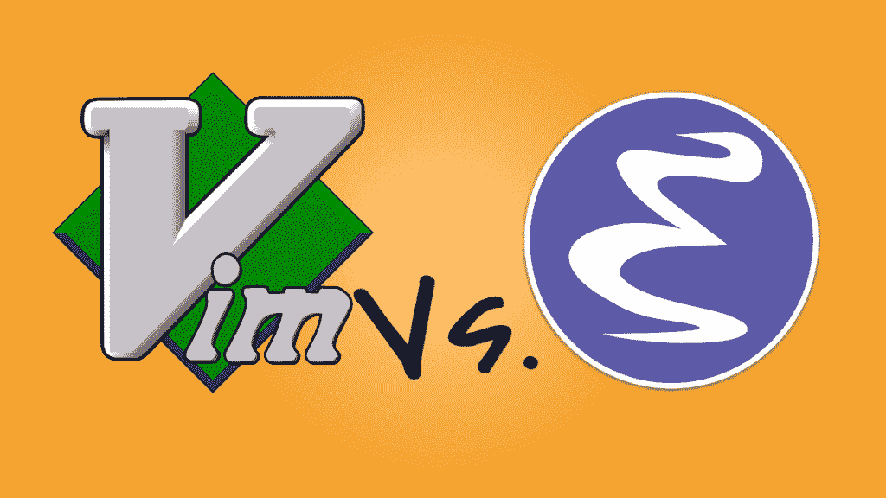
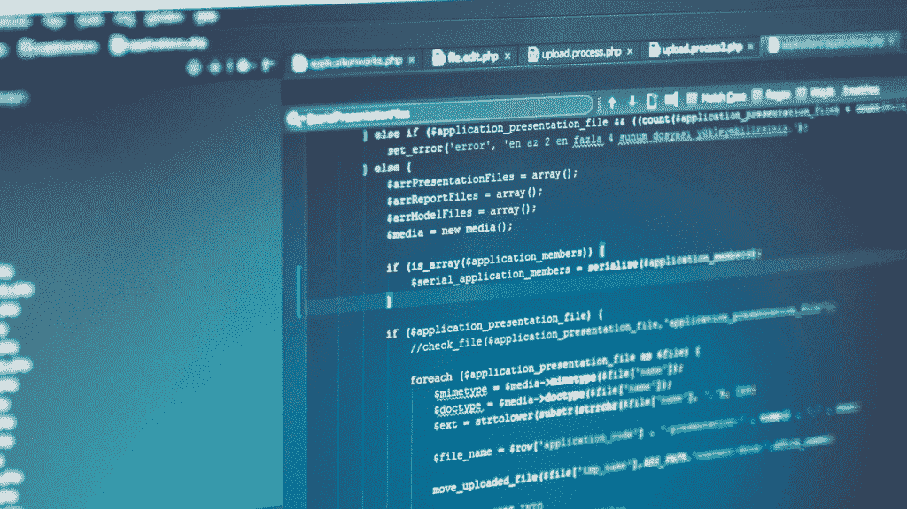

# 文本编辑器战争中的史诗般的比较故事

> 原文：<https://simpleprogrammer.com/text-editor-wars/>

编程社区里都是知识分子，几十年不为傻事打架，对吧？

**错了！**

程序员会为我能想到的最愚蠢的事情争吵。我们在谈论“我的口袋妖怪比你的好”这种狗屎。

为了理解文本编辑器战争，我们必须穿越时空回到过去，回到一个计算机只有大楼那么大，网络安全没有被考虑到的地方，而且…啊，你明白了。

很久以前有两个主要的文本编辑:

*   vi(及其子女，其中最著名的是 [Vim](http://www.amazon.com/exec/obidos/ASIN/059652983X/makithecompsi-20) )
*   编辑器

传说谈论兆字节长的火焰战争。你能想象吗？老实说，我不能(这是我的时代之前，但仍然)。

关键是，这不是一个新趋势。自从计算机出现以来，人们一直在为他们的文本编辑器而斗争。 

关于这场臭名昭著的战争的历史概况，请看一下这篇维基百科文章。发生的事情(用外行的话来说)，是一些人开始在电子邮件上争论哪个文本编辑器更好。自然地，更多的人加入进来，因为我们这些 IT 书呆子实在没有更好的事情可做，不久之后，电子邮件线程就有几百封长了。在那之后，同样的争论开始在论坛上出现，几乎每个线程都有数百条评论为 vi 或 Emacs 辩护。当论坛开始消亡，个人博客变得更受欢迎时，写一篇长文为你选择的编辑辩护并谈论竞争对手的垃圾是一种时尚。

现在已经没有那么多互联网火焰战了(关于文字编辑，就是这样)。然而，如果你在 Youtube 或谷歌上搜索，你会发现很多视频，在这些视频中，人们会在整个会议上为他们的编辑辩护。也有一些编辑的会面小组。

不要误解我——对于软件开发人员来说，文本编辑器非常重要，因为你一天中有很大一部分时间都在使用它。拥有一个适合你工作风格的文本编辑器会让你更有效率——尽管成年男女为这样的事情争吵有点傻，你不觉得吗？接下来会发生什么，人们为了运动队而争吵？哦，等等…

所以，今天让我们通过找到最伟大的编辑来结束这场战争。

在我们继续之前，我想发表一些声明:

*   我是 Vim 用户(就像素食主义者一样，我*有*要说)。
*   在这篇文章中，我将把集成开发环境(IDE)视为文本编辑器(因为 IDE 基本上是一个文本编辑器，具有一些更高级的特性，比如生成样板项目代码)。

此外，我们需要在文本编辑器方面保持一致(一般来说)，所以让我们看看它们的一些基本参数以及它们是如何工作的。

## 我们应该从文本编辑器中期待什么？

对文本编辑器最起码的期望是什么？

每个现代编辑都有这些特征，尽管它们应该是绝对最少的。如果你设法找到一个没有这些特性的编辑器(这很难，但是仍然)，这是一个巨大的危险信号，很可能你不应该使用这个编辑器。默认情况下具有上述特性的优秀文本编辑器的例子有 Vim、Emacs、Atom 和 Sublime Text。

我还建议文本编辑器应该有一些我最喜欢的、更高级的特性:

*   **项目树**，它基本上显示了您的项目根目录下的目录和文件。
*   **自动完成**。关于 autocomplete 到底好不好，有很多争论。专业的人说这样可以节省时间，避免错误，而反对的人说你应该知道你工作的代码库。两种观点都是正确的，但是我仍然会在一周的任何一天少犯错误。
*   ctags 是一个为你的源代码生成索引文件的工具。换句话说，它创建了一个包含项目代码元信息的文件。例如，它寻找定义函数的地方，或者调用函数的地方(ctags 不为调用函数的地方建立索引，尽管有些替代方法可以)，定义和使用全局变量的地方，等等。Ctags 允许您以闪电般的速度浏览代码，并且可以减轻必须记住所有代码细节的负担。大多数优秀的编辑器(例如 Vim、Emacs、Atom 和 Sublime Text)都内置了对 ctags 的支持。
*   文件图本质上给了你一个滚动条，它是你的文件的缩小版。它看起来很可爱，让你对大文件有一个简单的了解。我不喜欢它，但我能明白它为什么吸引许多人。

最后，让我们来看看 [IDE](https://simpleprogrammer.com/2010/08/03/why-the-ide-has-failed-us/) 的一些特性。它们并不仅限于 ide，但是大多数 ide 都默认启用它们，如果你想在大多数文本编辑器中使用它们，你需要安装插件。一般来说，这被认为是 ide 优于文本编辑器的一个优势。

IDE 功能包括:

*   **在仿真控制台内运行代码**。这非常有用，如果你只有一台显示器，通常会更快。
*   **边走边编译代码**。这是自动完成的，并在文本编辑器中显示您的编译错误。我真的不喜欢这个功能，因为它可能会变得非常烦人，尤其是当你在打字时出现编译错误的时候。
*   **包含尽可能去除样板文件的项目模板**。

## 我应该如何选择我的编辑？

如果很多现代文本编辑器都有相似(或相同)的特性，我选择哪一个有关系吗？

当然了，但是你可以和几乎任何一个编辑一起工作。问题是，哪个编辑器最适合你？重要的是细微的差异。例如，大多数文本编辑器都有自动完成功能，但是由于它的实现方式不同，所以速度和智能也不同。你更喜欢什么**很重要:在自动完成的情况下，你是喜欢多等一会儿但得到更好的建议，还是以更少的结果为代价得到闪电般的响应。**

经验法则是[“学好一个编辑”](http://www.amazon.com/exec/obidos/ASIN/1680501275/makithecompsi-20)，这个说的很有道理。如果你使用几个编辑器，你将什么都不会，因为你一天的大部分时间都花在文本编辑器上，所以学习如何使用其中一个是最好的。换句话说，如果你没有很好地控制你的编辑器，你就是在浪费你的时间。

让我们假设你正在寻找一个新的文本编辑器。这些是你应该采取的步骤:

1.  想想你想要什么特性，比如你想要你的插件，如果一个
    ny 安装了(每个编辑都有他或她自己怪异的方式；有的甚至有好几个)。
2.  安装你正在考虑的所有编辑器，用它们写点东西，不用安装任何插件。这个想法是让编辑有一个总体感觉。
3.  安装你想要的插件，测试每一个编辑器。你想花几个小时在每一个里打字。如果你花的时间太少，你就不能很好地理解编辑器是如何为你工作的。
4.  比较决定。我通常有一个谷歌电子表格，其中包含我的结果。除了功能特性(例如，自动完成、相对行号等。)，我通常会跟踪加载时间以及编辑器如何处理大文件(例如 100mb 的文本)。一旦我有了易于处理的格式的信息，我就把考虑的编辑人员减少一半。然后我重复步骤 3 和 4，直到只剩下一个编辑器。

## 这场战争我为哪个文字编辑而战？

不要误解我——作为一个 Vim 用户，我真的认为它比 Emacs 好得多。

事实上，每个使用 Emacs 的人都可以帮我们一个忙，只要他们停止使用 Emacs，跑到最近的沙漠里，没有水！

撇开所有煽风点火的战争不谈，我为什么选择维姆？

由于它有几种模式(命令/编辑)，所有的命令都很短，不是一个就是两个键。因此，链接命令是自然而不费力的。我在设置中使用 ctags 和窗口分割来快速导航和更改代码。

我非常不喜欢使用文本编辑器来构建、编译和测试软件。我更喜欢保持事物的分离和模块化。如果我在使用一个工具，我必须理解它；我不希望有人在幕后为我做事。

我不使用任何插件，因为 Vim 不缺少插件能提供给我的任何东西。(不要误会；有大量令人惊叹的插件可以做几乎任何事情，但它们通常不适合我的工作流程。)

相比之下，Emacs 需要相当长的组合，它真正通过其插件大放异彩。

Emacs 是一个发电站，但对我来说 **Vim 更快，更舒适，并且不需要插件来发挥它的最佳性能**。

我想对 Github 的 [Atom](https://atom.io/) 编辑器大呼一声，它非常好地服务了我。它的插件管理是惊人的(一切都是一到两次点击)，自动完成工作漂亮，开发编辑器的社区是友好的，总是愿意改变。对我来说，最大的障碍是加载时间太长——启动时要 40-50 秒。如果你喜欢图形用户界面(GUI)编辑器，我强烈推荐你尝试一下。

## 文本编辑器之战值得吗？

T2】

我是说，**说真的**？

在会议上与 Vim 用户和小组会面，解释如何从 Emacs 听音乐？真的吗？来吧伙计们。这是我们应该投入时间的事情吗？

尽管我很喜欢我的 Vim 编辑器，但是有太多的东西需要发现、构建和尝试——我们真的要在这种争论中占用宝贵的时间吗？我并不是说不应该讨论文本编辑器，但是我们可以花时间做更好的事情，我希望更多的人会采纳这种观点。

例如，在我的家乡，有一家公司是某个文本编辑器的已知用户。我的一个朋友去面试，他们问他用什么编辑器。当他选择的编辑器不是他们所用的时，显然他们做了一些不恰当的评论。

这就是我们所处的水平:**你的文本编辑器可以是一个工作面试中的问题。**

为什么有这么多狂热分子？我不知道。

**你的文本编辑器只是一个工具**。

运用好它会为你节省一些时间，但这对你的最终结果并不重要。现有的编辑器中没有一个能给我知识来构建一个更好的 Linux 内核。

从现在开始，让我们试着不要被愚蠢的事情冲昏头脑或把简单的工具放在基座上，而是专注于重要的事情:抓住所有的口袋妖怪变得更好！

你选择的文本编辑器可能不会对你的职业生涯产生太大影响，但有一件事会有影响:推销你自己。我就此开设了一门课程，帮助开发人员获得他们职业生涯应得的进步。[点击这里查看。](https://simpleprogrammer.com/store/products/how-to-market-yourself/)T3】