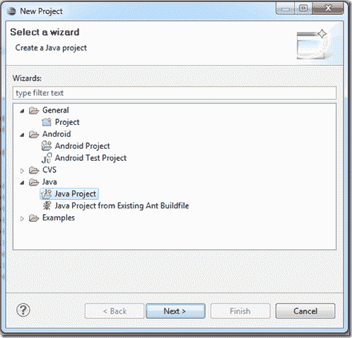

# Android 中单元测试的最佳方式:第 2 部分

> 原文:[https://simple programmer . com/the-best-way-to-unit-test-in-Android-part-2/](https://simpleprogrammer.com/the-best-way-to-unit-test-in-android-part-2/)

在我的上一篇文章中，我介绍了 Android 中单元测试的两种选择。

*   使用真实 android 框架在真实设备或仿真器上进行单元测试
*   使用 JVM 在我们的 PC 上进行单元测试

每种选择都有利弊，但对我来说，归根结底是在真正的 JVM 中运行所允许的速度和灵活性。我实际上试图使用 Google 提供的脚手架创建一个 Android 单元测试项目，但结果证明它非常受限制，尤其是因为我不能使用 JMock。

还有一点值得一提的是，它能够非常快速地执行单元测试。如果您必须等待模拟器出现，或者尝试在真实设备上运行它们，那么运行单元测试的可能性就更小了。

## 怎么做

这种方法的基本思想相当简单。

我们将尝试从我们的应用程序中抽象出任何 Android 特定的调用，然后在应用程序中对普通的 Java 逻辑进行单元测试，就像我们对任何其他 Java 项目一样。

#### 步骤 1:创建一个 JUnit 项目

创建一个新的 JUnit 项目，就像对任何 Java 应用程序进行单元测试一样。

确保你选择了 **Java 项目**而不是 **Android 测试项目。** 

从这里，您可以将 JUnit 引用添加到您的构建路径中。*我也推荐添加* [*本能*](http://code.google.com/p/instinct/) *做 BDD 风格测试。Instinct 在内部使用 JMock 以声明的方式为您创建模拟。*

这个项目唯一需要做的事情是将 android.jar 添加到构建路径中。android.jar 可以在平台目录下的 Android SDK 目录中找到，该目录对应于您的应用程序所针对的 API 版本。

比如在我的机器上，我针对的是 Android 1.6，所以我的 android.jar 在:C:\ Android \ Android-SDK-windows \ platforms \ Android-4。

现在请记住，您将 android.jar 包含在项目中只是为了让您的类能够理解 android 框架中存在哪些类型。如果你试图在 android.jar 中调用一个类的构造函数，你会得到一个异常。

#### 第二步:从活动中找出所有你能找到的代码。

我们需要做的下一件事是清理我们的 Activity 类，以确保它包含尽可能少的逻辑。

因为我们实际上不能实例化 Android 框架中存在的任何类型，所以我们不能在测试项目中创建活动的实例。所以我们不能对我们的活动进行单元测试。如果我们关心测试的大多数逻辑存在于系统的其他层中，这不是问题。

您可以随意设计下层。我仍然不太确定这里的最佳方法，但我所做的是将表示层直接放在活动下面。我在活动的正下方有一个 Presenter 类，它告诉我的活动要做什么。该活动将任何有趣的事件或信息传递给演示者。

您应该让活动负责在它自己的视图对象上设置文本，但是为您的较低层创建方法来告诉活动将对象设置为什么文本，等等。Activity 将作为你的应用程序的一大部分 Android 框架的适配器。

因为应用程序的入口点将是活动，所以您需要从活动中连接其余的层。这有点奇怪，但是很管用。在我的应用程序中，我创建了一个新的 Presenter，并在构造函数上将这个传递给它。

当你完成后，你的活动应该看起来很薄。它应该将其所有事件处理程序逻辑向下委托给较低层，并作为操纵视图的通道。

#### 步骤 3:包装剩余的 Android 对象调用。

你会发现一些剩余的 Android API 需要从比 Activity 更低的地方调用。这并不像看起来那样是个大问题。

在我的应用程序中，我需要对 android.os.SystemClock 进行一些调用，我需要使这些调用低于活动，因为它是我的应用程序的逻辑核心的一部分。

我创建了一个简单的 SystemClockWrapper 类，它包装系统时钟并将任何调用委托给真正的 system clock 类。然后我从那个类中提取了一个名为 ISystemClock 的接口(嘿，我喜欢接口的 C#约定。)

最后，在我的应用程序逻辑中，我允许通过使用它的类的构造函数传递或“注入”ISystemClock 引用。

在我的单元测试中，我只是传入了一个 ISystemClock 接口的模拟版本。

这里的一个提示是使用 IDE 中的重构工具来提取接口。这可以节省您为您正在包装的大块功能手动创建接口的时间。

## 把所有的放在一起

现在，您应该能够针对大多数应用程序逻辑创建单元测试，并像运行任何其他单元测试项目一样运行它们。

您唯一不能做的事情是对活动类中的逻辑进行单元测试。如果您已经将它们制作成视图，这应该不是什么大问题，因为它们应该只包含视图逻辑。

如果你真的想为这个活动编写一些测试，你可以创建另一个实际的 Android 测试项目，并使用 Google 的框架来编写单元测试。